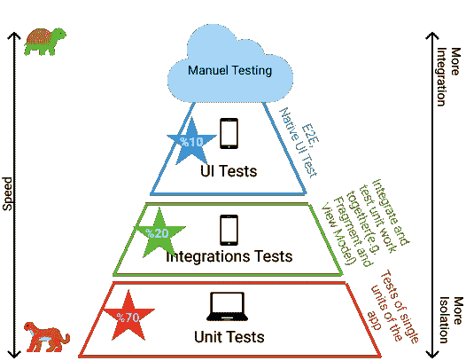
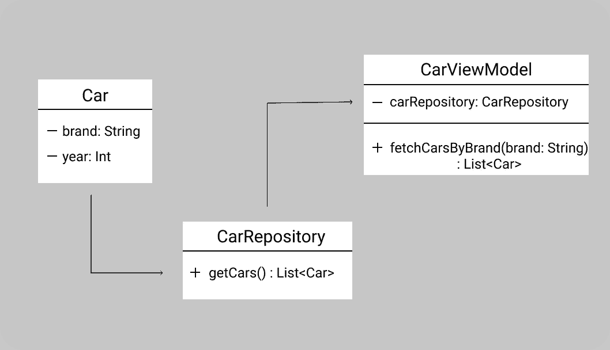
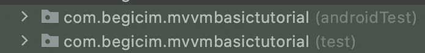
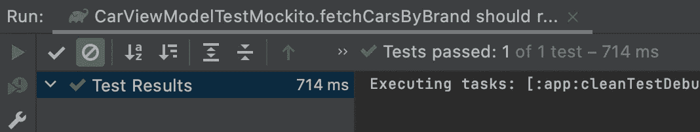
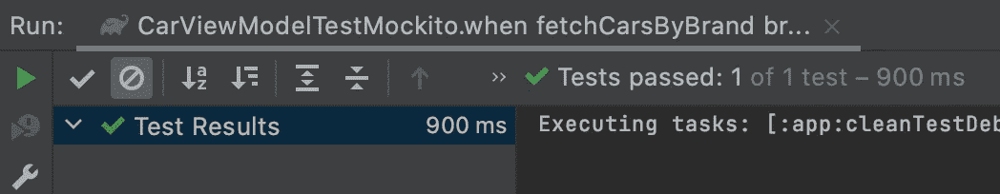
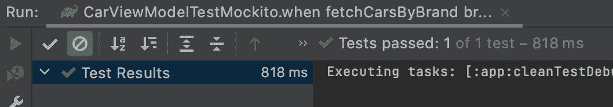
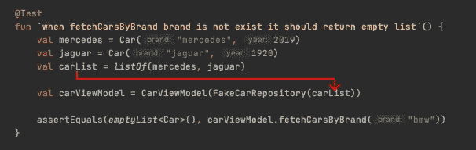

# 理解如何在 Android 上编写单元测试从来没有这么简单过——第 1 部分

> 原文：<https://blog.kotlin-academy.com/it-has-never-been-easier-to-understand-how-to-write-unit-tests-on-android-part-1-5ed1e5d8112b?source=collection_archive---------0----------------------->

Photo on [Unsplash](https://unsplash.com/?utm_source=medium&utm_medium=referral)

大家好，短暂休息后！🖐🏻在这篇文章里，我会试着解释一下 ***什么是单元测试，为什么要写，怎么写。***

在谈到细节之前，我想强调一下 ***为什么我决定写这篇文章*** 和 ***与别人有什么不同？嗯，我读了几篇关于在 Android 上进行测试的文章，它们都很好地解释了这一点，但我想以最简单的方式向所有级别的开发人员分享我的测试方法。 ***测试方法*** 是什么意思？意思是， ***我们写测试的时候应该怎么想？*** ***我们怎样才能写出可测试的代码呢？*(第二篇文章的题目)*****

## 在 Android 上测试

通过运行测试来验证你的应用的正确性、功能行为和可用性，测试你的应用是应用开发过程中至关重要的一部分。测试还提供了关于失败的快速反馈和你的功能文档。

> **为什么要写测试？**

*   获得关于错误的快速反馈
*   稳定的发展速度
*   以更安全的方式重构代码
*   在应用程序开发过程的早期检测错误

> **常见的考试类型有哪些？**

Testing Pyramid

Android 有 3 种不同类型的测试，分别是:

*   **单元测试:**单元测试是**你的 app 测试策略**中的基础测试。…单元测试通常以可重复的方式测试最小可能代码单元(可以是方法、类或组件)的功能。当您需要验证应用程序中特定代码的逻辑时，您应该添加单元测试。最常见的测试框架是 **JUnit** ，你可以使用 **Mockito** ，它允许创建假的/模仿的对象来验证交互。
*   **集成测试:**也称为[中间测试](https://developer.android.com/training/testing/fundamentals?authuser=3#medium-tests)，用于验证模块内堆栈级别之间的交互或相关模块之间的交互。
*   **UI 测试:**它有助于验证你的应用程序的用户旅程。您可以使用 **Espresso** 库，它允许您以线程安全的方式在应用程序中以编程方式定位 UI 元素并与之交互。

## 让我们一步一步地测试一个示例案例

我们的示例案例是一个按品牌名称列出汽车的应用程序。假设我们有 CarViewModel、CarRepository 和 Car 类。

Car’s UML

让我们创建我们的**汽车**模型类，它具有品牌和年份属性。

然后我们可以创建**仓库**，从 rest api 或本地存储中获取汽车信息，但为了简单起见，让我们返回一个虚拟汽车列表。

最后，我们可以创建 **CarViewModel** 类，它使用 CarRepository 按品牌名称过滤汽车。

在开始编写测试之前，我想给出一些小提示；

*   **androidTest** 用于 UI 测试
*   **测试**为单元测试

*   我们需要在每个函数前添加 **@Test** 注释
*   我们不应该在同一个测试函数中测试一个以上的逻辑事物

让我们回到汽车示例，如您所见，该示例非常简单，只有一个业务逻辑 **fetchCarsByBrand** 。现在是测试功能的时候了。嗯，怎么做？..首先我们应该想想 ***这个函数在做什么？*** 和 ***有哪些边缘案例？*** 先就是先。

## 该功能在做什么？🧐

**fetchCarsByBrand** 函数从**仓库**中获取汽车，并根据品牌名称进行过滤。我将一步一步向你展示如何测试它。

在开始之前，我们应该想一想我们需要开始测试什么？

在我们的示例中，CarViewModel 依赖于提供汽车列表的 CarRepository，因此为了测试 **CarViewModel** ，我们需要将 CarRepository 对象传递给 CarViewModel。我们可以创建一个库，一个 ***模拟对象*** 或者一个 ***假对象*** ，在我们的测试用例中使用 **getCars** 函数。

让我们开始使用模拟对象创建仓库吧！

> ★唱模拟对象

**对于第一个测试，我们可以检查当我们调用 **fetchCarsByBrand** 函数时，我们是否调用了 CarRepository 的 **getCars** 函数。但是我们如何检查一个函数是否被调用呢？幸运的是 [Mockito](https://site.mockito.org/) 库有 **verify** 函数，它检查 mock 类的特定函数是否被调用。**

**所以我们需要创建一个模拟的 **CarRepository** 类，并将其传递给 CarViewModel 来验证 **getCars** 是否被调用。**

**是时候检查 ViewModel 是否调用了 **getCar wa *？*****

## ****还有哪些情况？**🔦**

1.  **我们期望，当我们给一个品牌，它应该只返回汽车的品牌名称等于给定的品牌名称。来测试一下吧！**

**我的测试方法，首先我在问这个问题: ***我在测试什么？*** —我在测试如果我们把宝马作为一个品牌，我们会得到一个宝马汽车列表(没有任何其他汽车品牌。)**

**在这种情况下，我将使用 **assertEquals()** ，这是一个超级简单的方法，需要两个参数；第一个参数是**预期的**参数，第二个参数是**实际的**参数，如果它们匹配，则测试通过，否则测试失败。**

**首先，我们模仿 **CarRepository** 并创建**carList**这是一个包含 4 个不同汽车品牌的列表。然后，当调用 **getCars** 函数***` when `( mock carrepository . get cars())时，我们指示模拟对象返回 **carList** 。然后返回(carList)。*** 现在我们可以测试 **fetchCarsByBrand** 是否按照给定的品牌名称正确过滤汽车。******

让我们进行测试！

你有它！你的测试通过了🎉

2.我们已经测试了第一个边缘案例，让我们想想我们还能测试什么？—我们可以测试如果给一个不存在的品牌，我们应该得到一个空车单，不是吗？

让我们模仿 **CarRepository** 并创建 **carList** ，它有两个汽车对象，奔驰和捷豹，然后指示 **CarRepository** 在调用 **getCars** 函数时返回 **carList** 。然后，我们可以验证，如果我们使用“BMW”参数调用 **fetchCarsByBrand** ，而该参数不是现有品牌，那么我们期望得到一个空的汽车列表。

让我们进行测试！

测试也通过了！🎉

3.在这个测试中，我想测试如果我们给一个空牌子会发生什么。我们应该得到一张空车清单，不是吗？我们来测试一下！

让我们再次创建一个模拟汽车列表，它有两个汽车对象，Mercedes 和 Jaguar，然后测试当我们在 **fetchCarsByBrand 给出一个空品牌时是否得到一个空列表。**

在这种情况下，我们验证列表大小，我们期望一个空列表，所以列表大小为 0。

让我们进行测试！

测试也通过了！🎉

> W **与使用假仓库**

另一种选择是使用假存储库而不是使用模拟对象来创建存储库对象。选择权在你，我只是想给他们两个看看！

在这一部分，我将展示如何创建 FakeRepository 以及如何在测试中使用它，但我不会编写相同的测试，因为大部分代码都是完全相同的。

嗯，我们需要创建一个**假货仓库**但是为什么呢？—因为，我们要和 **getCars()** 一起玩。因此，我们可以在其构造函数中创建一个**FakeCarRepository**get cars 列表，我们可以在 **getCars** 函数中使用它。

开始吧，创建它太容易了！

我们从 CarRepository 扩展了我们的 FakeRepository，并覆盖了 **getCars** 函数。太简单了，不是吗？

现在是在测试方法中使用 FakeRepository 的时候了！

我们创建了一个汽车列表，并将其作为参数传递给 FakeRepository 类。并测试了我们的 **fetchCarsByBrand** 函数。

感谢您的阅读，希望您会觉得有用😌请随时通过 [Github](https://github.com/BegumYazici) 和 [LinkedIn](https://www.linkedin.com/in/begumyazici/) 联系我。

## 参考🔍

[https://developer.android.com](https://developer.android.com/training/testing/unit-testing/local-unit-tests)

https://www.youtube.com/watchv=EkfVL5vCDmo&ab _ channel = philiplackner