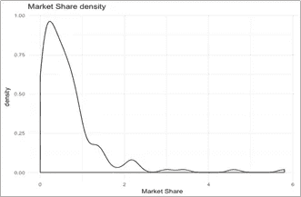

# 项目忠诚度测量

> 原文：<https://medium.com/walmartglobaltech/item-loyalty-measurement-a7d7a6f467a2?source=collection_archive---------1----------------------->

[Image Source](http://money.cnn.com/2011/04/11/news/companies/walmart_prices_products_changes/index.htm)

**什么是物品忠诚度:**

在营销文献中，关于忠诚的定义有一个长期的争论。众所周知，商品忠诚度是衡量一个家庭/顾客对某个特定品牌/商品相对于其替代品的偏好程度，但目前还没有一个固定的关于商品忠诚度的结论性工作定义，这也是该领域如此吸引人的原因。

总体而言，忠诚度被广泛量化 *(M. MELLENS，1996)* 为以下两个结构部分

Figure 1: Components of Loyalty

> **态度忠诚:**顾客的感受——消费者对品牌/商品的情感依恋的反映(通常通过调查数据来衡量)
> 
> **行为忠诚:**客户的行为——通常是基于对品牌/商品的内在感觉的重复(购买)行为。

Figure 2: Shelf decision based on item loyalty

传统上，基于家庭的忠诚度被视为带来某些业务优势的一个组成部分，例如降低促销成本、获得新客户以及为固定客户寻找交叉/向上销售机会。

在产品组合规划中，产品忠诚度会影响重要的货架放置决策，即产品删除、扩展、替换等。例如，当为货架上的新产品腾出空间时，我们不想放弃低销量但高忠诚度的产品。

作为班加罗尔沃尔玛实验室分类分析团队的一员，我们使用交易/扫描(POS)数据来探索衡量商品忠诚度的各种技术。这些忠诚度得分可以通过在线基于网络的交易数据与针对所述项目进行的调查相结合来进一步提高。

为此，我们建议使用 Jacoby 和 Kyner (Kyner，品牌忠诚度与重复购买行为，1973)提出的定义，该定义包括一组六个必要且共同充分的条件。当采用任何忠诚度测量方法时，我们都遵守这些条件。

Figure 3: Cogs of Loyalty measurement

**物品忠诚度计算方法:**

分析从收集相应类别帖子的 POS 数据开始，我们使用了一些数据清理过滤器，例如商店的最低必需每日交易量、家庭的最低购买频率。忠诚度算法随后在该最终数据集上生效，输出是汇总的项目忠诚度得分，如*图 4* 所示。

Figure 4: Loyalty calculation process

高忠诚度客户对任何组织来说都是可靠的资产，因此我们可能会选择根据各个忠诚度箱中的客户群计数来绑定忠诚度得分。*图 5* 可见，*忠诚度> 90%* 群体可能被授予最高的体重年龄，以汇总到最终项目得分，因为这是沃尔玛希望进一步接触的家庭的集中点。

Figure 5: Household distribution across loyalty scores

这篇文章描述了不同的忠诚度计算方法及其优缺点。

**方法一:顺序忠诚度**

该技术监控家庭的连续购买，以估计再次购买某一物品的概率，从而反映家庭对该物品的忠诚度。然后，将所有家庭的这些概率进行汇总，得出一个综合的项目忠诚度得分。

Figure 6: Purchase occurrences for a Household

考虑上面的购买模式，其中一个家庭可能在第一次、第三次和第四次购买产品 Tide，这意味着 Tide 有 50%的再次购买概率。

虽然非常方便，但很多时候它并不能提供对数据的深入了解，例如，在家庭购买模式中:{ A-B-A-B-A-B }根据上述方法，A 和 B 的忠诚度得分都为 0，这显然会产生误导。理想情况下，忠诚度得分的准确性很大程度上取决于在 POS 数据中捕捉各个家庭的讨论购买路径的程度

**方法二:忠诚家庭概率(L —概率)**

假设一个家庭已经购买了某件商品，那么除了该家庭喜欢的一件商品，他们再也不会购买其他任何商品的概率是多少，也就是说，它衡量了对某件商品的 100%承诺。

这种方法非常简单，也很容易计算，尽管它缺乏捕捉交易数据中隐藏模式的严密性。然而，这可以作为一种快速的试验方法，用来确定相关项目的相对忠诚度。这在回购率较低的类别(如汽车或电子产品类别)中很有用，但在杂货店等情况下可能会产生误导。

**方法三:需求份额**

这种方法着眼于家庭分配给物品的选择比例，通常称为家庭对物品的需求份额。

例如:*一个家庭在分析的时间段内 10 次进入酸奶类别，并在其中的 8 次购买了“XX 希腊酸奶”,那么该家庭对“XX 希腊酸奶”商品的忠诚度为 80%*

可以想象，这种方法是衡量一个项目忠诚度的最简单的方法，执行迅速，规模大，决策者容易理解。它收集了许多以前对忠诚度变量所做的工作，是 *Guadagni 和 Little* 忠诚度变量的一个独特案例。在这里，忠诚度在产品之间进行划分，表明随着时间的推移，家庭购买的产品之间的忠诚度份额(需求份额)。

这种方法中的忠诚度总是在可替代项目组级别计算，因为这将强烈反映家庭在类似行为项目中的忠诚度。从本质上讲，我们不愿意考虑同一可替代群体中的原味酸奶和调味酸奶的忠诚度，因为购买意图可能不同。

这种方法的另一个变体采取了一种稍微改变的形式，在计算这一比例时，它考虑了在一个可替代组中可用的不同项目选择的数量。这种方法可以扩展到考虑所有可用的 POS 数据，包括没有家庭信息的数据

**方法四:GL 概率(GL —概率)**

我们使用 *Guadagni 和 Little (1983)* 介绍的这些方法，并修改它以迎合我们的需要，这比以前的方法和尝试更严格，计算量更大，可以说是在字里行间进行解读。在这里，我们将忠诚度变量定义为一个家庭过去购买的指数加权总和，它将捕捉家庭对特定产品相对于其他产品的偏好。

我们通过汇总家庭级别的**平均值(GL1)** 或**中值(GL2)** 来汇总项目级别的忠诚度值，以获得最终的基于 GL 的忠诚度得分。

**方法五:购买行为的信息熵**

熵被定义为由概率随机数据源产生的平均信息量。我们使用这个概念来验证我们的数据，以便看到一个家庭在物品之间的转换趋势。

理想情况下，如果一个家庭对一个特定的项目更忠诚，项目转换行为将非常低，从而导致较低的熵和较高的项目忠诚度。在这里，我们认为购买过物品 A 至少一次的家庭的熵是家庭偏好物品 A 的基础。

**数据和结果:**

我们在一年的时间内将上述方法应用于某一地区某一食品类别的扫描数据(POS)。对于基于 GL 的方法，选择了随机的商店样本，以减少处理时间，并仍然使其成为全国家庭购买行为的代表性样本。

下面定义的是该类别中各种商品的市场份额分布的直观表示。

正如我们所见，这是一个标准的正偏态分布，这是意料之中的，因为大多数品牌的市场份额较低，极少数产品的份额相对较大。

然而，由于较高的市场份额只有 6%左右，没有一个项目真正主导市场

Figure 7: Market share and density

L-概率法适用于在一段时间内购买一次以上的家庭，而 GL-概率法适用于购买 10 次以上的家庭(由于时间复杂性问题)。

两种方法——GL 方法中的均值(GL1)和中值(GL2)测量——在不同的环境中都是可行的，但是，我们更倾向于中值测量，因为原始忠诚度变量是正偏的，包括一个或两个异常值。同样，如果我们观察两个 GL 概率的分布

Figure 8: GL1 (Mean) distribution

我们在 GL2 中看到预期的正偏态分布。而 GL1 具有由中心极限定理控制的更对称的曲线，这可能有助于我们在未来进行任何统计分析，例如建立置信区间或测试假设。

Figure 9: GL2 (Median) distribution

虽然不同的方法产生不同的结果，但验证是一个实际的挑战，因为这是一个无人监督的问题。

评估有效性的一种方法是基于业务反馈。由于分析计算必须与类别商家或买家等决策者携手合作，他们的信心和可解释性对重大影响非常重要，他们的反馈可以指导特定市场或类别的正确方法。或者，整体方法将根据个体忠诚度计算方法汇总排名，以减轻任何单一模型产生的偏差。

我们从结果中观察到，所有这些忠诚度指标都与市场份额显著相关，这是意料之中的，因为它们仅基于购买模式。因此，市场人口统计基本上存储在价值中。

其中，顺序忠诚度与市场份额关联最大，L- probability 与前者相当一致，这可能是因为两者都是基于购买频率的一些指标变量的组合。然而，L-probability 可能是对顺序概率的改进，因为它比顺序购买更普遍。

对于 GL1 和 GL2，他们与连续忠诚度和市场份额的关联都是中等的——在某种程度上，他们试图概括连续忠诚度，因为如果一个人经常重复购买，他们的 GL1，GL2 得分会很高，但即使重复购买很少，但一个人通常会坚持一个或两个品牌，这将反映在这些价值而不是连续概率中。

此外，让我们看看这些衡量市场份额的散点图，这样我们可以获得一些新的见解。这些图突出了销售额低但可能具有更高忠诚度价值的商品。红点是指市场份额不到 2 %，忠诚度超过 80%的商品。这些项目的几个例子是:蔓越莓汁，松露，橙汁奶昔。

GL2 度量似乎能够更好地对这些信息进行分类。这再次支持了我们对基于中值的测量的偏好。

Figure 10: Market share vs. Loyalty

**结论:**

下表总结了各种忠诚度衡量方法的结果:

Table 1: Loyalty methods comparison

对各种忠诚度方法的研究有助于收集证据，即有更多的信息与忠诚度得分相关，可以通过多种方法确定。尽管如此，序贯忠诚度和 L-概率很容易计算和解释，因此可以用于实验总结或快速检查。

您可以参考以下已发表的论文，了解更多关于忠诚度衡量的详细信息:

*Fred m . Fei nberg 和 Gary J. Russell 对广义逻辑模型的一致忠诚度测量*

*由 Peter m . Guadagni&John d . c . Little*根据扫描仪数据校准的品牌选择 logit 模型

*Natsuki Sanoa、Syusuke Tamurab、Katsutoshi Yadac、Tomomichi Suzukia* 对乳制品价格弹性和品牌忠诚度的评估

*用于分析消费者选择行为的半参数多项式 Logit 模型，作者:克奈布、鲍姆加特纳、斯坦纳*

作者:

> [关明生·费尔南德斯](mailto:Savio.Fernandes@walmart.com)，沃尔玛实验室高级统计分析师
> 
> [Diptarka Saha](mailto:Diptarka.Saha@walmart.com) ，统计分析师——班加罗尔沃尔玛实验室
> 
> [Ashish Gupta](mailto:Ashish.Gupta@walmart.com) ，班加罗尔沃尔玛实验室高级经理