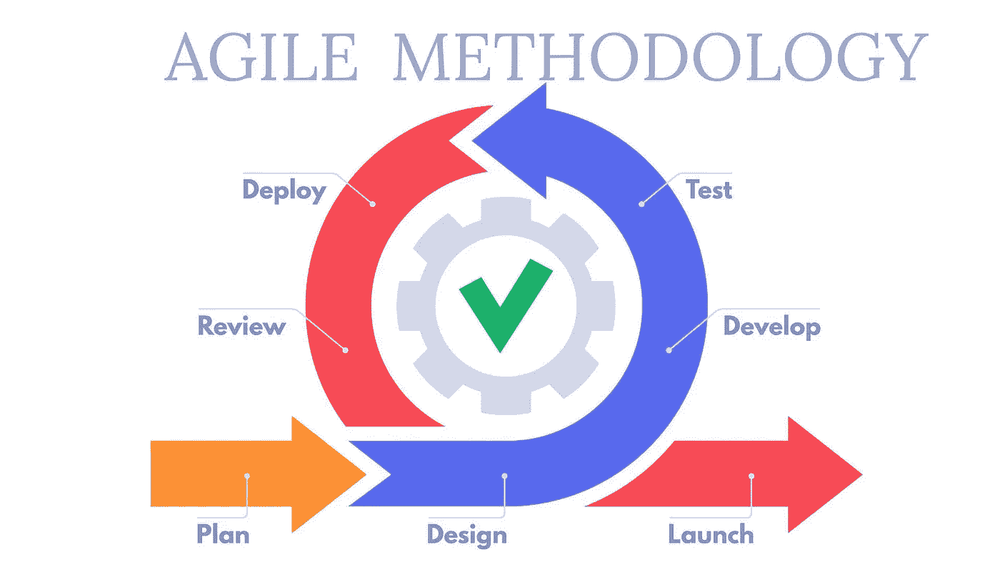
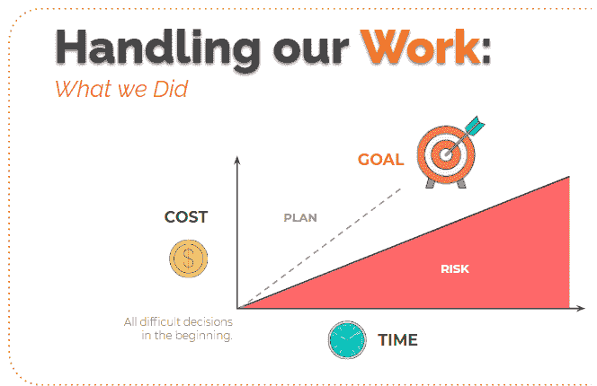
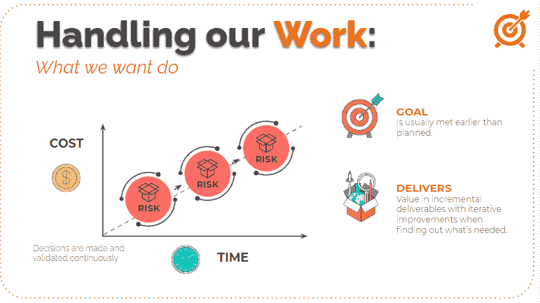

# 迭代和增量测试—第一卷

> 原文：<https://medium.com/globant/iterative-and-incremental-testing-vol-i-cee7e84de21d?source=collection_archive---------1----------------------->

# 深入敏捷测试

*第一场会议:方法学*

## **简介**

大家好，我在 2009 年开始了我的职业生涯。

我工作的第一个客户是最大的游戏发行公司之一(是的，你是对的)，即使是技术面试，我也很焦虑和兴奋，这和其他人完全不同。我曾经是(并且继续是)一个游戏玩家，所以我对此非常紧张，我必须搞定它，因为，对我来说，这是唯一的一次机会。

剧透一下，我通过了面试，然后在那家游戏发行商公司工作了 5 年左右，一直是游戏测试员，或者质量控制等。

之后，我在电子学习、出版、营销部门工作，五年前开始在金融/银行领域工作。

始终关注测试和敏捷领域，领导技能、教学、辅导等等，你可以在我的 LinkedIn 上找到，因为这不是一篇关于我的文章。

在我工作的 12 年里，很多事情都发生了变化，公司、文化、团队，但我在不同的项目中注意到一个共同点，那就是我们一直在与敏捷合作，或者试图变得比我们现在更加敏捷。

我知道这在现在是很平常的事情，但在 5 年或更久以前，这是完全不同的事情。

当拥有敏捷思维时，软件生命周期是不同的(在未来的书中，我们将讨论思维与工具或实践之间的区别)。

为什么？因为它包括持续的改进——关于产品、服务、过程、流程，所有的一切),同时有一个重复的过程(例如，在 Scrum 上称为迭代),在每个过程的末尾添加一些东西，称为工作软件。然后你添加更多的函数，一次值一个重复。不过不用担心，下面我会更好的解释。

这就是为什么这被称为迭代和增量测试。

我的目标是谈论这种工作方式，组织任务，重点和时间，以及它如何影响测试工作的方式以及其他角色。

我们将概述使用敏捷时的开发周期，以及影响软件开发工作方式的一些变化。

此外，在未来的几卷中，我将介绍测试人员的角色是如何受到 XP、Scrum、看板的影响的，然后介绍敏捷环境中测试角色的一些关键方面，测试人员需要或应该具备哪些技能，以及哪些技术或工具可以帮助您节省大量时间并避免挫折。

所以，让我们开始吧，因为我们还有很长的路要走。

## **敏捷宣言及其对软件开发项目的影响**

在开始深入探讨测试人员的角色如何受到敏捷 SDLC(软件开发生命周期)的影响之前，让我们先来谈谈敏捷宣言的历史和价值。

*你可以在*[*【https://agilemanifesto.org/】*](https://agilemanifesto.org/)上找到所有这些信息

2001 年，在评估了公司和团队如何开发软件，以及如何改进这种方式之后，17 名软件从业者撰写并签署了所谓的敏捷宣言。

这是一个包含 4 个价值观和 12 个原则的协议，是敏捷的基础。

我不打算在这里详细介绍它们，但是我想总结一下它背后的目标，那就是对已经存在的不同方法和框架有所了解。它可以改变它的实现方式，但是它们有共同的核心、价值观和原则。

他们希望增加团队中的人际互动，适应和发展新的想法，关注什么是重要的，交付给客户的价值，以及客户想要什么和需要什么。

因此，不同角色、不同领域的团队需要相互协作，分享他们的知识并增加所提供的价值，与客户协作并创造共享的价值。

这是第一要务，让客户满意，不断展示价值。然后拥抱变化，因为很有可能客户认为他想要的和他收到产品时期望的会有所不同，或者需求会不时地被调整，产品需要适应这种变化。这并不意味着我们会像孩子一样做客户想要的，相反，这意味着我们要参与到产品和业务中，同时检查和分析影响，并与用户达成一致，以便对预期有一个透明和清晰的了解。

因此，我们需要照顾我们的客户，向他们展示有价值的东西，我们可以改变事情并从 it 部门获得反馈，当然，每次我们添加一些东西时，一切都需要继续工作(至少如预期的那样)。

为此，业务、方法和开发领域需要非常紧密地合作，他们需要有一个清晰的沟通途径，以将客户的想法转化为将要构建的内容，以及我们将如何做。

每个人都需要明白他们在哪里，需要做什么。

为此，你可以有会议、工具、董事会，任何你想要的东西，只要你明白进展将会如何。

这是一份关于敏捷宣言带来了什么，以及如果你想把它与传统的软件工作方式相比较的话，桌子是如何翻转的高度简历。如果你想要更多的信息，你可以进入敏捷宣言网站，或者寻找敏捷联盟。

## **从筒仓到多学科团队**

开发人员在一边，测试人员在另一边，业务人员在另一层，设计师在另一栋楼，等等，他们之间很少或者没有交流。

敏捷带来的变化是，拥有不同技能的团队，以协作的方式工作，参与开发最好产品的所有领域。

这样，测试团队就不必等到产品达到某个阶段才开始测试，然后就再也见不到产品了。

敏捷团队的测试成员参与制定战略和计划，以提高所有方面的质量(是的，我们的关系、沟通、代码、产品、流程等都有质量。而且一切都可以改进)与团队一起和在团队内部。

我们可以看到更多的合作、团队协作、更好的交流和协作，成员之间分享知识，而不是一个人知道所有的事情。

这发生在有新的实践时，团队在一起工作时创造的，相互理解，业务，产品，方法以及何时/如何要求或提供东西。

与此同时，每个人都要对产品和整个过程中的质量负责。

因此，开发人员和测试人员不需要成为敌人，他们需要相互支持，紧密合作，在所有的测试级别中尽可能地提高产品的质量。

例如，他们应该一起工作来创建有效的测试套件，为此，交流需要非常流畅，理解期望什么，如何期望，以及何时期望。

没有必要举行正式会议来同步，他们应该并肩工作，讨论工作进展如何。

这些是团队可以做的一些事情，以确保并实现一次又一次开发的产品的质量。

## 越早越好

我常说的一句话是“*反馈是我的燃料*”。

为什么？因为我需要别人的反馈来了解我需要改变什么，做什么，停下来成为一个更好的职业球员，一个更好的队友，一个更好的领导者，一个更好的人。

这也适用于敏捷开发团队，并且是至关重要的(对我来说也是如此)。

这是确保团队正在做的事情处于正确方向的方法，并且有尽可能多的时间来获得频繁的反馈，并且尽可能在早期阶段。

因为如果我们等待，情况会更糟。一项变革的成本会随着时间的推移而增加。

成本，不仅仅是金钱，所需的时间，涉及的人员，资源和影响，都会增加，如果我们等待反馈，应用更改，可以尽早解决。

这就是敏捷带来的东西，有频繁的迭代时刻来验证你必须做的工作。

你肯定会有风险和变化，但至少是几个星期，而不是几个月或几年的工作。因为活动和需求已经被分解成小的活动，所以风险也被分解，并且更易于管理

此外，你知道你会有风险，所以你为他们做好了准备，你会在短时间内提供透明度并提出改变。

团队开发的每一个增量，都经过验证，收到反馈，当添加到最终产品中时，价值就是最大可能。

有了反馈，就有了修改、变更和调整，以增加业务价值和客户的期望。

What is common on traditional ways to work

What is preferred on Agile environment projects

这些图表完美地展示了敏捷如何改变风险管理。

我们总是会有风险，所以至少，风险小一点总比让整个行动崩溃要好

随着频繁的反馈和不断交付的增量，我们在不断地改进、检查、调整，不仅是产品，还有我们在团队中的合作方式。

这也意味着我们将改进我们如何测试、创建场景，以及一次一个迭代地开发策略。

感谢您的时间，下次再来讨论极限编程(XP)、Scrum、看板以及如何影响测试方式。

*汤姆*