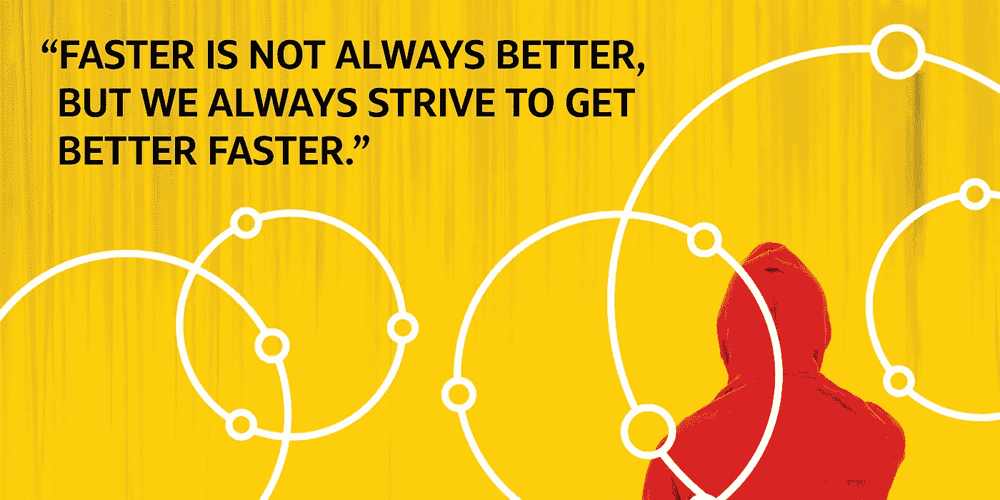

# 迭代交付和基于合同的实现

> 原文：<https://medium.com/capital-one-tech/iterative-delivery-and-contract-based-implementation-for-apis-behind-capital-ones-mobile-experiences-6abfb6ad49e1?source=collection_archive---------6----------------------->

## 构建支持个人移动体验的 API

任何类型的敏捷环境转换的最大挑战之一是传达出“迭代价值”和“速度”之间的区别从术语上看，通常有一个假设，敏捷=更快。这在一定程度上是正确的，但是我们所说的“更快”实际上是指“更快地获得价值”这与*“更快地实现全部价值”不同*

## 契约和弹性第一的思想

作为一个既有很多依赖，又有很多意图的团队，我们一直试图平衡交付驱动 Capital One 移动体验的 API 的迭代价值和最终价值。我们长期以来一直奉行“契约和弹性第一”的服务理念。这是什么意思？

***契约优先*** 基本上暗示了我们首先定义和部署的是 API 的契约。我们认为这是一份严格意义上的合同。我们没有对 REST 的含义做任何假设，而是确保我们的 UI 工程师清楚他们期望返回什么，以及我们期望发送什么。通过首先设置这个阶段，我们能够快速调整实现，并将工作合同作为第一阶段部署部署到生产中。这发生得非常快，通常我们可以在团队合作的前 48 小时内实现。

***“弹性第一”*** 就是在我们的设计和代码中建立弹性的实践和信任。这不仅仅是优雅的故障和强大的错误处理，而是利用“断路”、故障转移等模式，并了解我们的依赖性对客户产品体验的影响。我们不仅要保护我们的系统，还要保护我们的客户和基础设施。

**可靠性**是确保我们的系统在面对依赖性时具有弹性**的实践。这超出了主动/主动或多区域部署的范畴。这就是我们如何从根本上构建用户体验，我们的 API 如何响应，以及我们如何防止单个下游依赖性故障向上游传播到用户。**

# 为什么要以这种方式部署？

经常出现的问题是，为什么要在人们准备使用它之前部署它？在我们的交付中迭代有什么意义？它们引发了人们对稳定和安全风险的担忧。我的回答是——“嗯，我讨厌坐着写代码。”

在生产环境中完成部署和验证具有内在价值。我们通过自动化管道和测试，将环境风险降至最低。通过利用我们的[优势](/capital-one-developers/mobile-orchestration-innovation-on-the-edge-9835e4cbd69e)设计模式，我们限制了安全风险。我们还能够很早就验证我们服务的部署和基线。这给了我们一个更高程度的信心，关于我们随后在其上所做的每一个迭代变化的影响。通过减少变更的潜在影响，您正在减少基础设施的风险，并使这种迭代成为可能。

传统的瀑布式方法和不利于变革的文化希望等到一切都完成并签字认可后，以减少我们尝试改变生产环境的次数。在这种思维模式下，更少的更改意味着更少的风险和更少的停机可能性。等到一切都准备好了，也意味着所有的商业价值都在那里，随时可以使用。这种方法的问题是，您最终会推动非常大范围的变更，这给生产环境带来了很大的风险。如果他们失败了，为了进行分类，有太多的部分需要挖掘，您需要回滚整个事情。这意味着零商业价值的进入，以及对变革厌恶文化的强化。

现在你有一个自我实现的预言，鼓励更少的发布，因为每个发布对公司来说都是一个很大的风险。这反过来又会对你的工程师产生不信任感。

# 改变心态

作为工程师，我们需要改变这种心态。部署代码的行为不应被视为有风险。部署的行为就像平常一样，应该像每天将代码提交到源代码控制中一样自然。

> *我们应该鼓励工程师尽早部署并经常部署。*

这并不意味着抛出代码。这意味着使用强大的自动化过程来快速迭代特性和功能。这还意味着建立对您的工程师和他们的管道的信任，并理解他们的主人翁意识与管理基础设施的人一样强烈。通过将这种主人翁意识带回家，你就能够在你所构建的一切中创造一种强大的弹性文化。

作为 API 构建者，我们希望尽可能快地将优秀的特性提供给客户。作为“契约优先”的实践者，我们希望将一个定义好的模型快速交到我们的 UI 开发人员手中，允许他们完成用户体验设计，而不必等待所有的逻辑都完成。作为“弹性第一”的实践者，我们坚信我们所构建的将会自我修复、可用并满足客户的期望。

记住: ***更快并不总是更好，但我们总是努力更快地变得更好。***

# 有关系的

*   [在边缘设计微体验](/capital-one-tech/designing-microexperiences-on-the-edge-for-mobile-eb4e6c3a3f2e)
*   [移动编排——边缘创新](/capital-one-tech/mobile-orchestration-innovation-on-the-edge-9835e4cbd69e)
*   [Capital One 的移动边缘工程团队利用的 4 种弹性模式](/capital-one-tech/resiliency-patterns-at-the-edge-capital-one-a5b4d41d477e)
*   [Capital One 基于插件的架构和扩展 iOS 开发](/capital-one-tech/plugin-based-architecture-and-scaling-ios-development-at-capital-one-fb67561c7df6)

*披露声明:这些观点是作者的观点。除非本帖中另有说明，否则 Capital One 不属于所提及的任何公司，也不被其认可。使用或展示的所有商标和其他知识产权都是其各自所有者的所有权。本文为 Capital One 2018。*