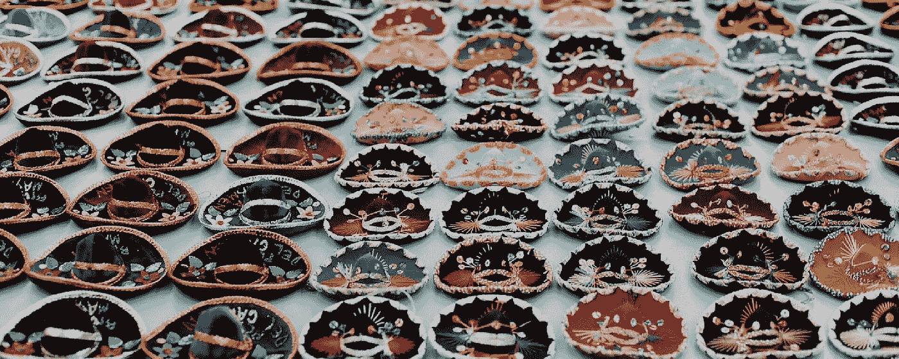

# 这是一种爱恨交加的关系

> 原文：<https://medium.com/globant/its-a-love-hate-relationship-6e31770f476e?source=collection_archive---------0----------------------->

‘We do wear many hats’

## **成为从业者、项目经理、客户合作伙伴和……**

“我们确实戴了很多帽子，”

当我告诉一位同事我正在写这个话题时，他给了我这样的回答。

你看，大约三年前，WAE(现在的 Globant)决定不雇佣项目经理和客户合作伙伴，而是让项目期间的从业者来负责这些任务。

现在应该说我们偶尔会雇佣项目经理作为自由职业者，但是这往往是在我们从事一个长期的、复杂的交付项目的时候。

我们通常承担的项目不需要专门的全职项目经理的技能，因此这些责任就落在了我们这些交付项目的顾问身上。

反正对我来说，这是一种又爱又恨的关系。

## **那是新的**

我的第一次经历是在大约两年前，有趣的是，当时我在做一个交付项目，但时间不长，也不复杂。

负责大型迁移和重新设计项目的项目经理需要状态报告。详细说明我和我的同事每周都在做什么，花了多少预算。

这是新东西，在大学里没学过。

但在我知道之前，有人向我展示了如何创建烧伤报告，如何保持更新，以及如何从中获得我需要的东西。

在 Globant 工作期间，我不得不在许多场合承担这项任务，这给了我负责按预算和时间交付项目的经验。管理参与项目的人员、他们所花费的时间，并向前看，以确保项目不会超支。对从业者来说，这是一种有价值的技能和对流程的理解，可以增加他们的技能。

## **中国悄悄话**

在项目过程中，如果客户有问题，我会第一个打电话给他们。

他们会找我们这些从业者，而不是客户经理。这很好，因为信息不会从缝隙中漏出来。

我从来没有发现自己处于一个信息从别人那里传递到我身上的位置。我得到了第一手资料，并能够立即采取行动，完全清楚客户的期望和我的期望。

## **自主**

我可以随时和客户直接谈论我想要的任何事情。

我有挑战、讨论和质疑的自由，只要我认为合适。我不需要通过任何人。

在过去与传统创意机构合作时，我惊讶地发现“创意人员”无法直接向客户提问并向他们提出挑战。他们会与客户经理谈论他们的担忧，然后客户经理会判断他们是否会将这些担忧传达给客户。不是最合作的。

我很困惑，如果一个人对自己正在解决的问题有疑问，或者有没有答案的问题，他怎么能自信地做好自己的工作。

能够畅所欲言，在我们想要的时候问我们想要什么，会带来一系列好处。从一开始，我们就对简报有清晰的认识，我们知道我们正在解决正确的问题，因为我们正在质疑和挑战以确保这样做。

让我们找出要解决的正确的事情，这样我们就能正确地解决问题。

在 Globant，我从未发现自己在项目结束时没有完全满足客户的期望。在第一部分中，我把这归因于从业者总是质疑，总是挑战，确保我们始终解决正确的问题，这将使企业和客户都受益。如果我们被困在负责与客户沟通的客户经理或客户合作伙伴身后，我们可能就没有这种奢侈了。

被赋予这种自主和自由让我们能够快速行动，快速有效地做出决定。

## **关系**

正如你现在所知道的，在项目期间，我和我的从业者同事站在第一线，与我们的客户并肩作战。我说客户，他们成为我们团队的一部分，这个团队。我们都在为同样的理想结果而努力。

像我们与客户一样密切和频繁地工作，这给了我们与他们建立和发展关系的机会。我们不会跟在别人后面做。

有机会与客户和其他合作伙伴建立、维护和发展关系会带来诸多好处。

**从业者受益**

*   我正在发展一系列技能，如果我没有被赋予这个责任，我可能就没有机会了
*   我获得了与客户建立新关系和探索商业机会的第一手经验
*   我不断地认识新的人，建立关系。聪明、有抱负、有经验的人在世界上一些最大的组织中工作，我正在扩大我的人际网络

**项目效益**

*   欢迎客户加入我们的团队，与他们一起工作，让客户对工作有一种共同拥有的感觉。它们是最终产出和成果的重要组成部分
*   由于在此过程中的坦诚交流，我们与客户建立了更多的人际关系。没有“客户和供应商”的感觉。诚实的交流总是给每个人带来更好的结果

**商业利益**

*   我们的客户喜欢和他们一起工作的从业者在一起。他们寻求在更多的项目中与这些从业者合作。人们买人

虽然不全是爱。

## **如果我不小心，它可能会碍事**

承担这些额外的责任自然会增加工作量。

我忙得不可开交，需要在明天用户测试之前完成一个原型，我的老板问我们还剩多少预算，他们需要尽快知道。

在做“专业工作”和负责“非专业工作”的同时，我需要确保正确管理自己的一天，花时间更新预算和计划文件。这样，上述情况就避免了变成一个耗时的问题。

## **物流**

负责项目的后勤工作并不是最有趣的。

这些任务可能是乏味的，耗时的，在完成它们的那一刻，我总是希望有其他人来负责。就背景而言，我发现自己在完成一些任务，比如预订旅行、预订设施、安排和购买技术、安排人员以及建立房间和实验室。

然而，不得不完成这类任务和更多的任务总是确保团队和我需要的东西适合手头的工作。

这一点类似于我之前说的中国悄悄话，但方向相反。我从来没有发现自己处于一个将信息传递给别人来为我做事的位置，我只是这样做。

不得不做这些后勤工作打断了我解释我需要什么的对话。它在试图澄清一些事情的时候去掉了来回。

它使项目和我更精简，更快速，更有效。不可否认，这样做需要时间，但从长远来看，我认为这样可以节省时间。

## **保持联系**

客户沟通，众所周知，这对任何项目的成功都至关重要。

但在一个项目中，我关注细节。我正在综合客户洞察力、解决问题的能力以及规划追求的方向。很忙，有很多活动。

但是考虑到我们团队的设置，除了在项目中工作的从业者之外，没有人会告诉客户发生了什么。

因此，合理规划我的时间和日期，以便与客户沟通、更新和问答是至关重要的。

幸运的是，我们的工作方式是我通常坐在我们的客户中间，但即使这样，清晰一致的沟通也是最重要的，这取决于我。

不得不这样做，我看到我在这方面的软技能在发展。最明显的是说服和销售技巧，如果有其他人专门负责客户交易和辩护，我就不会发展这两种技巧。

## **轮到你了**

如果你发现自己处于类似的境地，我会给你一些建议:

*   留出时间来更新财务和项目管理文档
*   在你和其他项目团队成员之间分配“非从业者”的任务，如果全靠你，你会错过一些事情
*   了解你的客户喜欢的沟通方式，并随时更新
*   花时间使用你的烧伤报告，通过它运行不同的场景
*   在项目中向前看，弄清楚现在需要做什么后勤工作，以确保当他们到来时你准备充分

写这篇文章让我有时间停下来，反思我作为一名从业者所做的额外工作。显然这种关系是爱多于恨。

我已经能够接触到工具和过程，否则我不会意识到，更不用说如何正确地做了。

这让我的工作更加充实，能够在整个项目中拥有、代表和捍卫我的工作。

我觉得这让我作为一名从业者更有价值。我不仅有从业技能和经验。而且有项目规划、交付和商业方面的经验。

如果你有机会承担这些额外的任务，你应该去做。这将拓展你的技能，让你更好地欣赏项目中的所有活动部分。其中一些会让你大吃一惊。

我很想听听你作为从业者承担额外责任的经历，那种你在设计学校时并不期望承担的责任。