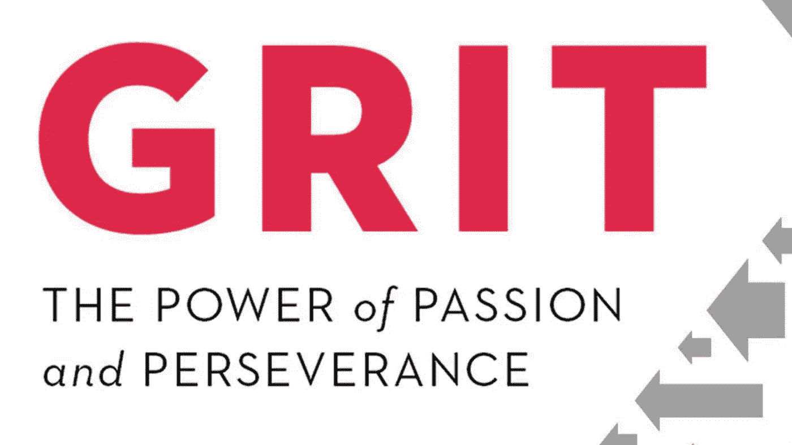
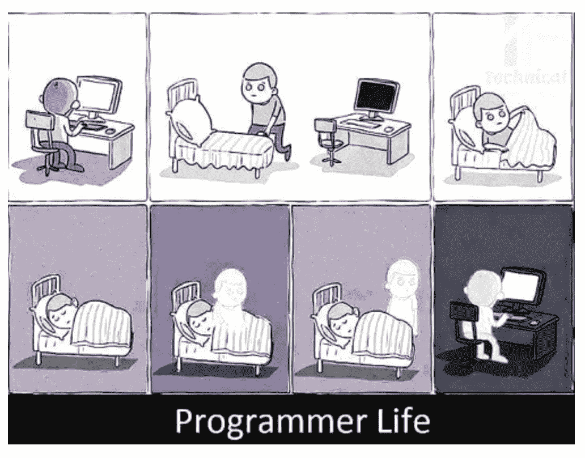

# 这是一场马拉松

> 原文：<https://medium.easyread.co/its-a-marathon-704202fd5a64?source=collection_archive---------6----------------------->

Image taken from Google Images

> **毅力**是对长期而有意义的目标的激情和毅力。是一种坚持做自己觉得有激情的事情，面对障碍坚持下去的能力。这种激情与强烈的情感或迷恋无关。——安吉拉·杜克沃斯

你好*easy readers* Berikut tuli San 11 月[easy reader](https://medium.com/easyread)杨沙阳。

# 软件测试

## [结合 API 和 WEB 测试执行端到端测试](https://medium.com/easyread/execute-end-to-end-testing-by-combining-api-and-web-tests-d0660b67fac8)

由 [Wira Putrawan Pakpahan](https://medium.com/u/eff966b56fe1?source=post_page-----704202fd5a64--------------------------------)

有超过 [150 种测试类型](https://www.guru99.com/types-of-software-testing.html)并且还在增加。此时，我们将只根据本文的标题来讨论 API 和 WEB 测试。

[***阅读更多……***](https://medium.com/easyread/execute-end-to-end-testing-by-combining-api-and-web-tests-d0660b67fac8)

# 机器人

## [行为测试:如何测试你的安卓应用](https://medium.com/easyread/behavior-test-how-to-test-your-android-apps-2e4aecdd3cea)

作者[艾米纳蒂·西安图里](https://medium.com/u/c621a1e3a342?source=post_page-----704202fd5a64--------------------------------)

比如，我很早就开始使用 Android 了。Android *开发者*将通过单元测试来解决问题。他们可能会用几个小孔和几个小孔来控制水的流量。

*不*，由于采用了 biasanya 等格式单元测试，我们可以采用*行为测试*的方法来测试应用程序的性能。

[***阅读更多……***](https://medium.com/easyread/behavior-test-how-to-test-your-android-apps-2e4aecdd3cea)

# 用户界面/UX 设计

## [重新设计发货人主页](https://medium.com/easyread/redesign-shipper-homepage-4f0ad938d8d6)

塞缪尔·克里斯蒂安·西拉希

Bagaimana saya melakukan Redesign Shipper Homepage? Tahapan pertama yang saya lakukan ketika melakukan *redesign shipper homepage* adalah melakukan *research. Research* yang saya lakukan disini adalah melakukan *breakdown* pada komponen-komponen informasi yang ada pada halaman *home* [Shipper](https://shipper.id/) , kemudian mencari hal-hal yang saya rasa kurang tepat penggunaannya dan dapat diperbaiki.

[***Read more…***](https://medium.com/easyread/redesign-shipper-homepage-4f0ad938d8d6)

# NodeJS Series

Bulan ini Easyread memiliki [*series*](https://medium.com/tag/nodejs-series-musliadi/archive) yang dapat kamu ikuti loh. *Series* ini ditulis oleh [Musliadi](https://medium.com/u/9d4dc1cf1342?source=post_page-----704202fd5a64--------------------------------) . Jangan lewatkan setiap artikel yang akan dirilis yah, bila perlu kamu yang bertanya kapan artikel terbaru akan kembali terbit :)

## [NodeJS Series — Belajar ExpressJS Dari Awal yok!](https://medium.com/easyread/nodejs-series-belajar-expressjs-dari-awal-yok-400d9a88e73a)

Terinspirasi dari tulisan Bang [Simanjuntak](https://medium.com/easyread/laravel-series-belajar-laravel-dari-awal-yok-c21dc47863da) di [*Easyread*](https://medium.com/easyread) , saya juga jadi kepikiran ingin membuat satu *series* tentang NodeJS Framework dengan ExpressJS.

[*Read more…*](https://medium.com/easyread/nodejs-series-belajar-expressjs-dari-awal-yok-400d9a88e73a)

## [NodeJS Series — Pengenalan & Persiapan Proyek dengan ExpressJS](https://medium.com/easyread/persiapan-untuk-pengerjaan-proyek-dengan-expressjs-7d2c30196dc0)

NodeJS merupakan teknologi untuk membangun aplikasi dari sisi server *(server-side)* . Beberapa tahun yang lalu teknologi javascript pada aplikasi web hanya digunakan pada sisi client *(client-side)* . Melihat permasalahan tersebut seorang programmer bernama ***Ryan Dahl*** menciptakan NodeJS dan memperkenalkannya pada tahun 2009\. Ryan Dahl mengembangkan NodeJS diatas Engine V8 dari Google.

[***Read more…***](https://medium.com/easyread/persiapan-untuk-pengerjaan-proyek-dengan-expressjs-7d2c30196dc0)

Image taken from Google Images

# Build Progressive Web App Series

Selain NodeJs, Easyread juga memiliki [*series*](https://medium.com/easyread/laravel-series/home) mengenai memulai membangun sebuah aplikasi dengan menggunakan PWA loh! Series ini tentu saja dapat kamu ikuti pula. *Series* ini ditulis oleh [Jansutris Apriten Purba](https://medium.com/u/1cacdaf156e9?source=post_page-----704202fd5a64--------------------------------) . Jangan lewatkan setiap artikel yang akan dirilis yah!

## [Build Progressive Web App — Chapter 0](https://medium.com/easyread/build-progressive-web-apps-6248a7152730)

Introduction and Case Study of PWA

[***Read more…***](https://medium.com/easyread/build-progressive-web-apps-6248a7152730)

## [Build Progressive Web App — Chapter 1](https://medium.com/easyread/build-progressive-web-apps-chapter-1-d3d2b449ab42)

Strengths and Weaknesses of PWA

[***Read more…***](https://medium.com/easyread/build-progressive-web-apps-chapter-1-d3d2b449ab42)

# Tulisan Terbaru dari Laravel Series

Kali ini apa aja sih lanjutan dari tulisan terbaru tentang [Laravel Series by Eko](https://medium.com/easyread/laravel-series/home) ?

## [Persiapan untuk Pengerjaan Proyek dengan Laravel](https://medium.com/easyread/persiapan-untuk-pengerjaan-proyek-dengan-laravel-2f9a99146313)

by [Eko Simanjuntak](https://medium.com/u/efc3b4ea41af?source=post_page-----704202fd5a64--------------------------------)

Untuk memulai pembuatan aplikasi berbasis website dengan Laravel Framework, kita perlu meng- *install* beberapa *tools* untuk membantu pengerjaan kita.

[***Read more…***](https://medium.com/easyread/persiapan-untuk-pengerjaan-proyek-dengan-laravel-2f9a99146313)

## [Pengenalan Laravel Framework](https://medium.com/easyread/pengenalan-laravel-framework-1c829b8164af)

by [Eko Simanjuntak](https://medium.com/u/efc3b4ea41af?source=post_page-----704202fd5a64--------------------------------)

Laravel Framework adalah salah satu dari *framework* berbasis bahasa pemrograman PHP yang sangat populer sekarang ini. Pada dasarnya, Laravel digunakan untuk pengembangan aplikasi berbasis web. Laravel juga bisa digunakan untuk pengembangan REST API *service* . Tapi, kali ini saya akan membahas penggunaan Laravel untuk pengembangan website.

[***Read more…***](https://medium.com/easyread/pengenalan-laravel-framework-1c829b8164af)

## [Instalasi Laravel Framework](https://medium.com/easyread/instalasi-laravel-framework-41eeec1551ef)

by [Eko Simanjuntak](https://medium.com/u/efc3b4ea41af?source=post_page-----704202fd5a64--------------------------------)

Untuk meng- *install* Laravel Framework, terdapat beberapa cara yang dapat kita gunakan, yaitu dengan **Laravel Installer** dan **Composer Create-Project.**

[***Read more***](https://medium.com/easyread/instalasi-laravel-framework-41eeec1551ef)

## [Struktur Folder Laravel Framework](https://medium.com/easyread/struktur-folder-laravel-framework-299f0225cd55)

by [Eko Simanjuntak](https://medium.com/u/efc3b4ea41af?source=post_page-----704202fd5a64--------------------------------)

Setelah selesai instalasi, hal yang paling perlu kita pahami adalah struktur folder dari Laravel sendiri. Hal ini supaya kita tahu bagian-bagian folder dan *file* mana yang perlu penekanan selama pengembangan. Saya tidak akan menjelaskan secara keseluruhan, hanya yang menurut saya penting saja untuk pembuatan fitur minimal, seperti Create-Read-Update-Delete (CRUD).

[***Read more…***](https://medium.com/easyread/struktur-folder-laravel-framework-299f0225cd55)

Kita dapat menggambarkan perjalanan hidup kita lebih seperti sebuah maraton dibandingkan dengan lari cepat/sprint. Berkutat mengikuti pendidikan sedari kecil, terjun di dalam dunia pekerjaan dan fokus membangun karir, termasuk hubungan yang terjadi antara kita dengan orang di sekitar kita. Artinya ketika kita melakukan berbagai hal yang disebutkan di atas, kita membutuhkan waktu bukan sehari, dua hari atau seminggu dan berbulan-bulan, tapi bisa bertahun-tahun lamanya.

Dari segi persiapan pun, orang yang lari maraton akan memiliki persiapan yang sangat berbeda dengan orang yang lari cepat. Demikian juga dengan cara mereka berlari untuk mencapai garis akhir. Kecuali dikarenakan cedera, biasanya seorang atlet pelari jarak pendek cenderung tidak pernah berpikir untuk menyerah di tengah jalan atau merasa bosan. Bahkan mereka tidak sempat merasa capek di tengah jalan. Mereka baru merasa capek setelah mereka selesai berlari. Berbeda halnya dengan seorang atlet maraton dimana ia akan sering sekali berhadapan dengan rasa bosan, ingin menyerah, capek di tengah jalan, dan mereka berpikir, “Berapa lama lagi ujungnya? Di mana selesainya? Bagaimana kalau saya berhenti saja?”

Sama seperti hal-hal yang kita lakukan diatas, kalau kita mempunyai sudut pandang yang keliru tentang hal tersebut, maka kita akan keliru pula dalam mempersiapkan diri serta melakukan setiap hal tersebut. Makanya tidak heran banyak orang yang akan menyerah di tengah jalan, merasa capek, bosan, bahkan depresi ketika menjalani hal-hal diatas. Mereka memilih untuk berhenti melakukan pendidikan mereka, memilih untuk meninggalkan karir dan bisnis yang mereka kerjakan, dan bahkan memutuskan untuk tidak lagi melanjutkan semua mimpi yang mereka miliki sedari dulu.

Kita membutuhkan sebuah kekuatan dari semangat dan kegigihan dan ketekunan untuk mencapai target jangka panjang yang kita miliki. Dengan kekuatan tersebut, kita dapat menyelesaikan setiap hal yang telah kita mulai dengan *finish* sesuai dengan harapan kita.

Mulailah dengan memiliki cara pandang yang benar terhadap apa yang ingin kita kejar, persiapkanlah diri kita bahkan untuk kemungkinan terburuk sekalipun, jangan pernah berhenti ketika sudah memulai mengejar mimpimu. Ingat, ini maraton! Jadi, tetap tekun, gigih dan jangan menyerah.

Jika salah satu dari mimpimu diwujudkan dengan menulis, yuk belajar menulis sedari sekarang dengan hal kecil apapun. Kalau kamu bingung menemukan tempat menulis, mungkin kamu boleh mencoba bergabung di Easyread untuk menjadi salah satu penulis di bidang kamu.

Yuk, bagikan tulisan kamu di [Easyread](https://medium.com/easyread) . Semua dimulai dari langkah kecil loh! Easyread is calling for [submission](https://medium.com/easyread/about-easyread-74b20960e180) . 😄