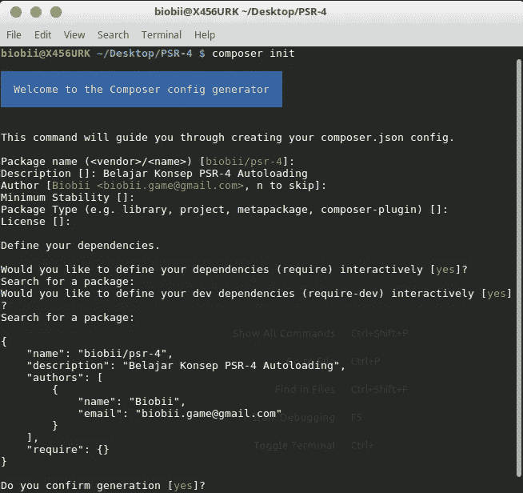
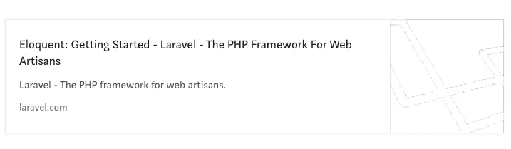
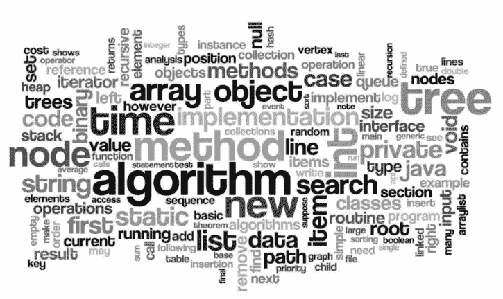

# It’s about “Create” or “Make” Something

> 原文：<https://medium.easyread.co/its-about-create-or-make-something-8a6da77c393e?source=collection_archive---------1----------------------->

Hello *Easyreaders*

Berikut top artikel [Easyread](https://medium.com/easyread) pada bulan Februari ini.

## Software Development

[**Aplikasi Distributor Gas [SPA] (Laravel + Vue js)**](https://medium.com/easyread/aplikasi-distributor-gas-spa-laravel-vue-js-944a0169c653) by [Haidar Afif Maulana](https://medium.com/u/631846fabf4?source=post_page-----8a6da77c393e--------------------------------)

Hai! udah lama gak sharing code. kali ini saya baru ngerjain projek kecil untuk aplikasi distributor gas.

[***Read more…***](https://medium.com/easyread/aplikasi-distributor-gas-spa-laravel-vue-js-944a0169c653)

[**Memahami Konsep PSR-4 Autoloading pada PHP**](https://medium.com/easyread/memahami-konsep-psr-4-autoloading-pada-php-ba6cdefe068b) by [Biobii](https://medium.com/u/37ae403df215?source=post_page-----8a6da77c393e--------------------------------)

Saat mempelajari bahasa pemrograman PHP, saya biasa menggunakan *require* dan *include* untuk memanggil file-file yang lain.

[***Read more…***](https://medium.com/easyread/memahami-konsep-psr-4-autoloading-pada-php-ba6cdefe068b)

## Android

[**Android MVP Series : Membangun Aplikasi Android dengan Arsitektur MVP**](https://medium.com/easyread/android-mvp-series-membangun-aplikasi-android-dengan-arsitektur-mvp-fbf1f77ecaec) by [Eminarti Sianturi](https://medium.com/u/c621a1e3a342?source=post_page-----8a6da77c393e--------------------------------)

[**Android MVP Series : Implementasi Unit Test pada Android MVP** by](https://medium.com/easyread/android-mvp-series-implementasi-unit-test-pada-android-mvp-f1971c44cf1c) [Eminarti Sianturi](https://medium.com/u/c621a1e3a342?source=post_page-----8a6da77c393e--------------------------------)

[**Android MVP Series : Implementasi Butter Knife dan Dagger pada Aplikasi Android**](https://medium.com/easyread/android-mvp-series-implementasi-butter-knife-dan-dagger-pada-aplikasi-android-f46d4cb42285) by [Eminarti Sianturi](https://medium.com/u/c621a1e3a342?source=post_page-----8a6da77c393e--------------------------------)

[***Read more…***](https://medium.com/tag/mvp-series/latest)

## Frontend

[**Mencoba PWA dengan Vue JS dan GitHub API**](https://medium.com/easyread/mencoba-pwa-dengan-vue-js-dan-github-api-74b5d815c3bb) by [Eko Simanjuntak](https://medium.com/u/efc3b4ea41af?source=post_page-----8a6da77c393e--------------------------------)

Saat ini saya sedang mengerjakan tugas kuliah, kebetulan untuk tugas ini saya diminta memakai PWA. Awalnya saya ragu, tapi ya saya coba saja.

[***Read more…***](https://medium.com/easyread/mencoba-pwa-dengan-vue-js-dan-github-api-74b5d815c3bb)

## JavaScript

[**Rindu dengan Eloquent Laravel? Di Javascript Juga Ada!**](https://medium.com/easyread/orm-eloquent-javascript-dengan-sequelize-9fdd77bfb7ef) by [Haidar Afif Maulana](https://medium.com/u/631846fabf4?source=post_page-----8a6da77c393e--------------------------------)

Hai! Kamu pengguna laravel? Gimana perasaan kamu saat pindah dari native php terus pakai framework kayak laravel?

[***Read more…***](https://medium.com/easyread/orm-eloquent-javascript-dengan-sequelize-9fdd77bfb7ef)

## Programmer Life

[**50 poin penting dari 50 bulan perjalanan Karir Saya jadi Programmer.**](https://medium.com/easyread/50-poin-penting-dari-50-bulan-perjalanan-karir-saya-jadi-programmer-232cc495841d) by [Haidar Afif Maulana](https://medium.com/u/631846fabf4?source=post_page-----8a6da77c393e--------------------------------)

Ada yang bilang kata nya pengalaman merupakan guru yang terbaik. Tapi apa sebenarnya pengalaman itu?

[***Read more…***](https://medium.com/easyread/50-poin-penting-dari-50-bulan-perjalanan-karir-saya-jadi-programmer-232cc495841d)

[**竞技编程 sebagai Pondasi**](https://medium.com/easyread/competitive-programming-sebagai-pondasi-32f48de3a841)**by[Eko Simanjuntak](https://medium.com/u/efc3b4ea41af?source=post_page-----8a6da77c393e--------------------------------)**

**作为信息技术的一个重要组成部分，程序设计是一项必须掌握的技能。**

****

**[***阅读更多……***](https://medium.com/easyread/competitive-programming-sebagai-pondasi-32f48de3a841)**

## **潘端梅努利斯**

**[**潘端梅努里斯**](https://medium.com/easyread/panduan-menulis-yang-baik-layaknya-professional-di-medium-ad5aa22c6ddc)**

**有几个生活帮人将在媒体上发表演讲。**

****

**[***阅读更多……***](https://medium.com/easyread/panduan-menulis-yang-baik-layaknya-professional-di-medium-ad5aa22c6ddc)**

## **今天我学到了**

**今天我学习了一系列的补蓝**

****

**[**今天我了解到的系列:Android 内容占位符使用微光效果**](https://medium.com/easyread/today-i-learned-series-android-content-placeholder-using-shimmer-effect-f7fbd1d0af86) 作者[eminati Sianturi](https://medium.com/u/c621a1e3a342?source=post_page-----8a6da77c393e--------------------------------)**

**[**今天我学到的系列:Keunikan Kurung Kurawal pada Golang**](https://medium.com/easyread/today-i-learned-series-keunikan-kurung-kurawal-pada-golang-7cdb4f8881c0)**by[Iman Tumorang](https://medium.com/u/ef42567fbbae?source=post_page-----8a6da77c393e--------------------------------)****

****[**今天我学习了系列:在 Golang 中嵌入原生数据类型**](https://medium.com/easyread/today-i-learned-series-embedding-native-data-type-in-golang-2ac3703fe73d) 由 [Iman Tumorang](https://medium.com/u/ef42567fbbae?source=post_page-----8a6da77c393e--------------------------------)****

****[***了解更多《今日我学系列》***](https://medium.com/easyread/today-i-learned/home)****

****Semua dimulai dari kata “create” or “make” sesuatu. Bagikan ceritamu, dan biarkan dunia tahu apa yang kamu ciptakan. Ayo submit cerita kamu ke [Easyread](https://medium.com/easyread) sekarang juga, Easyread is calling for [submission](https://medium.com/easyread/about-easyread-74b20960e180) . 😄****