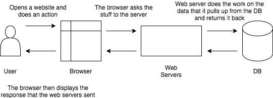
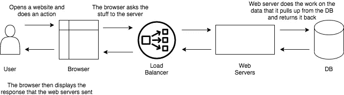
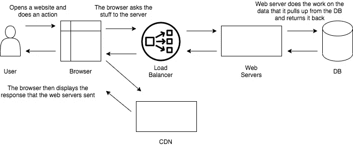

# 用 JAMstack 干扰

> 原文：<https://medium.com/globant/jamming-away-with-jamstack-4e702947a217?source=collection_archive---------1----------------------->

构建 web 应用程序的现代方式

现代 Web 开发—当今的发展方向！这需要你以不同的方式思考，发挥创新，最终——聪明地思考！为此，我们需要摆脱传统的网站建设方式，即使用网络服务器。以这种方式构建的站点不必要地降低了速度，为攻击提供了太多的机会，而且扩展起来通常非常昂贵。

等等！你没看错吧？没有 web 服务器的网站？听起来很奇怪？

不，不是的！这就是 JAMstack 的用武之地。

尽管如此，为什么你需要摆脱用服务器建立网站的传统方式呢？让我们看一看。

上面的场景看起来很简洁，对吗？为什么要改？坚持住。现在试着把它用在一个会有很多点击的网站上。除非我们提供一些帮助，否则服务器将会崩溃。输入—负载平衡器！它们充当反向代理，在多个 web 服务器之间分发网络或应用程序流量。

嗯。仍然做得很好。然后我们都想——也许有一些资产在 web 应用程序中是静态的，不需要从服务器绕过去。我们想把它们放在不同的位置，比如 CDN！

好吧！因此，现在我们有多个 web 服务器来处理流量，我们在它们前面放置了一个负载平衡器来分担负载。我们也开始抽象数据所在的位置。因此，现在数据库服务器与特定于它的数据共享负载。

> JAMstack 恰好是处理这种情况的多种解决方案之一。

JAMstack 项目巧妙地将前端页面和 UI 与后端应用程序和数据库分开。从后端服务器中解放出来后，前端就可以在全球范围内直接部署到 CDN 上。没错，一个 CDN！

> 现在，你一定在想，还有一个库/框架需要学习。

坚持住！JAMstack 不会改变您使用的技术——jam stack 站点可以用 Javascript、PHP、Ruby、Python、React、Vue 或几乎任何语言构建。它不是特定软件的集合，而是一组最佳实践。

JAMstack 是一种构建网站和网络应用的现代方式。

你可能会问，“J-A-M”里有什么？它代表:

**JavaScript** :请求/响应周期中的任何动态编程都由 JavaScript 处理，完全在客户端运行。

**API**:所有的服务器端功能或数据库动作都被抽象成可重用的 API，通过 HTTPS 用 JS 访问。无论是 SaaS、第三方服务还是定制服务。

**标记**:模板化标记应该在构建时预先构建，通常使用内容站点的站点生成器，或者 web 应用的构建工具。

好了，炒作够了——现在让我们看看真正的交易吧！

> JAMstack 是如何工作的？

***代码开发&部署***

传统的方式——开发者完成一个网站的开发，并将其发送到 web 服务器。

JAMstack 方式——开发者使用静态站点生成器来生成页面和资产。然后，她将构建好的文件发送到 CDN。因此，在部署之前，整个前端被预构建到高度优化的静态页面和资产中。

***来自客户端的网页请求***

传统方式—服务器通过浏览器、缓存层、服务器、后端代码之间的一系列交互，生成请求的 HTML。

JAMstack 方式 CDN 按需提供预建文件。

***更新***

传统方式—通常通过 FTP 将核心更新推送到生产服务器。必须维护或更新数据库。内容更新是通过传统的 CMS 推送的，比如 WordPress 或 Drupal。

JAMstack 方式——通过 Git 推送核心更新；网站完全通过像静态网站生成器这样的现代构建工具重新构建。内容更新通过 Git 或静态网站 CMS 推送。

> **jam stack 有什么好处？**

*   ***更安全。*** 服务器端和数据库被委派，这减少了故障和攻击的表面区域。
*   ***便宜缩放。*** 由于开发过程中复杂性降低，成本自动降低。
*   ***表演。*** 通过 CDN 提供静态内容，用户体验超快。
*   ***快乐开发者。工作流程中的维护+更新的灵活性减少了开发人员的沮丧和酗酒。:)***

它不是特定软件的集合，而是一组最佳实践，结合了:

## GIT 工作流

JAMstack 将部署与基于 Git 的工作流紧密联系在一起。Git 为 web 项目带来了版本控制的严格性和安全性，允许支持有众多参与者的大型项目。

## 现代构建工具

通过每次部署时运行一次构建，JAMstack 带来了对林挺代码、转换 javascript、编译 CSS 以及优化 HTML 和资产的完全支持。

## CDN 技术

JAMstack 首先由大型企业部署，它使 CDN 技术的使用民主化，从尽可能靠近用户的终端交付 web 内容。

> JAMstack 是银弹吗？

# 什么时候不应该考虑 JAMstack？

任何依赖于客户机和服务器之间紧密耦合的项目都不能用 JAMstack 来构建。这将包括:

*   使用服务器端 CMS 构建的网站，如 WordPress、Drupal、Joomla 或 Squarespace。
*   依赖于 Ruby、Node 或其他后端语言的单一服务器运行的 web 应用程序。
*   一个单页应用程序，在运行时使用同构呈现在服务器上构建视图。

# 结束语

如前所述，JAMstack 不是关于特定的技术。这是一种构建网站和应用的新方式，能够提供更好的性能、更高的安全性、更低的扩展成本和更好的开发人员体验。值得一想！

继续阅读，继续探索。你永远不知道哪个想法会改变你的生活！