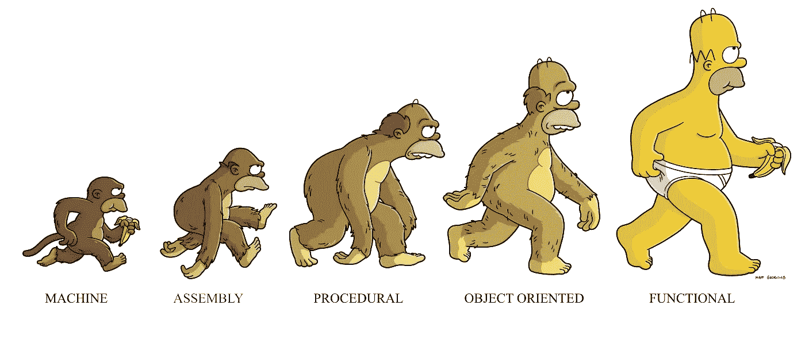

# Java 8 函数式编程，我是怎么做的？

> 原文：<https://medium.com/quick-code/java-8-functional-programming-how-i-do-f11239a0aa90?source=collection_archive---------0----------------------->

> 自从 Java 8 发布以来，我们可以对传统的普通 Java 对象(或简称“POJO”)有另一种看法，并以一种全新的方式使用它们。快乐阅读！

考虑下面这个模拟城市的简单类: