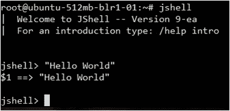

# Java 9 的特性和改进

> 原文：<https://medium.com/edureka/java-9-features-and-improvements-760a263daadc?source=collection_archive---------1----------------------->

Java 9 和 Java 9 特性的发布是 Java 生态系统的一个里程碑。跟上新的发布对于保持技术的更新是很重要的，理解引入的东西背后的需求将使你更接近你的 ***Java，J2EE & SOA 认证*** 。在项目 Jigsaw 下开发的模块化框架将成为 Java SE 版本的一部分，其中的主要特性是 JShell (REPL 工具)、重要的 API 更改和 JVM 级别的更改，以提高 JVM 的性能和可调试性。

在我们详细解释 Java 9 的特性之前，让我们看一下以前的 Java 版本，看看有什么缺点，Java 9 是如何帮助克服这些异常的

*   Java 标准版平台和 JDK 不适用于小型计算设备
*   JDK 没有全面的安全和维护
*   应用程序性能没有整体提高
*   对于 Java SE 和 EE 平台，Java 开发人员很难构建和维护代码库和更大的应用程序

在这篇博文中，我将按照以下方式对 Java 9 特性进行分类:

1.  在 Java 9 中处理 API 更新
2.  Java 9 中的 HTTP/2 客户端
3.  Java 9 中的 Java Shell 脚本(读取-评估-打印-循环)
4.  Java 9 中的多版本 JAR 文件特性
5.  Java 9 中更多的并发更新特性
6.  Java 9 中的拼图项目

# Java 9 有什么新特性？

我挑选了一些 Java 9 的新特性，我觉得这些特性值得了解。让我们看看这些特征是什么

# 在 Java 9 中处理 API 更新

Java 的流程 API 非常原始，只支持启动新流程、重定向流程输出和错误流。在此版本中，对流程 API 的更新实现了以下功能:

*   获取当前 JVM 进程和由 JVM 产生的任何其他进程的 PID
*   枚举系统中运行的进程，以获取 PID、名称和资源使用等信息
*   管理流程树
*   管理子流程

让我们来看一个示例代码，它打印了当前的 PID 和当前的进程信息:

```
public class NewFeatures{

      public static void main(String [] args) {

            ProcessHandle currentProcess = ProcessHandle.current();

            System.out.println("PID:"+ currentProcess.getPid());

            ProcessHandle.Info currentProcessInfo = currentProcess.info();

      System.out.println("Info:" + currentProcessInfo);
}
```

# Java 9 中的 HTTP/2 客户端

这个 Java 9 特性预计会在后续版本中发生变化，甚至可能会被完全删除。

早期的开发人员经常求助于使用第三方库，比如 Apache HTTP、Jersey 等等。除此之外，Java 的 HTTP API 早于 HTTP/1.1 规范，并且是同步的，难以维护。这些限制要求添加新的 API。新的 HTTP 客户端 API 提供了以下功能:

*   一个简单简洁的 API 来处理大多数 HTTP 请求
*   支持 HTTP/2 规范
*   更好的性能
*   更好的安全性
*   更多的增强功能

让我们看一个使用新 API 发出 HTTP GET 请求的示例代码。下面是 module-info.java 文件中定义的模块定义:

```
module newfeatures{
       requires jdk.incubator.httpclient;
   }
```

以下代码使用 HTTP 客户端 API，它是 jdk.incubator.httpclient 模块的一部分:

```
import jdk.incubator.http.*;
import java.net.URI;
public class Http2Feature{
     public static void main(String[] args) throws Exception{
       HttpClient client = HttpClient.newBuilder().build();
       HttpRequest request = HttpRequest
.newBuilder(new URI([http://httpbin.org/get](http://httpbin.org/get);))
.GET()
.version(HttpClient.Version.HTTP_1_1)
.build();
HttpResponse.String response = client.send(request,
HttpResponse.BodyHandler.asString());
System.out.println("Status code:" + response.statusCode());</pre>
<pre>System.out.println("Response Body:" + response.body());
                       }
          }
}
```

# Java 9 中的 Java Shell 脚本(读取-评估-打印-循环)

你一定见过一些语言，比如 Ruby、Scala、Groovy、Clojure 以及其他自带工具的语言，这些工具通常被称为**REPL**(**Read-Eval-Print-Loop**)。这个 REPL 工具在尝试语言特性时非常有用。比如在 Scala 中，我们可以写一个简单的 Hello World 程序为**Scala>println(" Hello World ")；**

JShell REPL 的一些优点如下:

*   有经验的开发人员可以在他们的主要代码库中采用它之前快速原型化和实验
*   Java 开发人员现在可以拥有一个 REPL 了

让我们运行 JShell 命令，如下图所示:



# Java 9 中的多版本 JAR 文件特性

到目前为止，JAR 文件可以包含只能在 Java 版本上运行的类。为了在新版本上利用 Java 平台的新特性，库开发人员必须发布他们的库的新版本。很快，将会有多个版本的库被开发人员维护，这可能是一场噩梦。为了克服这个限制，多版本 JAR 文件的这些 Java 9 特性允许开发人员为不同的 Java 版本构建具有不同版本的类文件的 JAR 文件。下面的例子更清楚地说明了这一点。

以下是当前 JAR 文件的图示:

```
jar root 

    - A.class

    - B.class 

    - C.class
```

以下是多版本 JAR 文件的外观:

```
jar root 

     - A.class 

     - B.class 

     - C.class 

     - META-INF  

      - versions 

             - 9  

                - A.class  

            - 10 

                - B.class
```

在上图中，JAR 文件支持两个 Java 版本(9 和 10)的类文件。

因此，当在 Java 9 上执行早期的 JAR 时，versions–9 文件夹下的 A.class 将被选择执行。

在不支持多版本 JAR 文件的平台上，永远不会使用 versions 目录下的类。因此，如果您在 Java 8 上运行多版本 JAR 文件，它与运行简单的 JAR 文件一样好。

# Java 9 中更多的并发更新特性

在这次更新中，引入了一个新类**，java.util.concurrent.Flow** ，它具有支持发布-订阅框架实现的嵌套接口。发布-订阅框架使开发人员能够构建能够异步使用实时数据流的组件，方法是设置生成数据的发布者和通过订阅来使用数据的订阅者，订阅负责管理发布者和订阅者。四个新界面如下:

*   Java . util . concurrent . flow . publisher
*   Java . util . concurrent . flow . subscriber
*   Java . util . concurrent . flow . subscription
*   Java . util . concurrent . flow . processor(同时充当发布者和订阅者)。

# Java 9 中的拼图项目

这个项目的主要目的是引入模块化的概念；**支持**在 Java 9 中创建模块，然后将其应用于**JDK**；即**模块化 JDK** 。

**模块化**的一些**好处**如下:

*   **强封装**:模块只能访问模块中可供使用的部分。因此，除非在模块信息文件中显式导出包，否则包中的公共类不是公共的。
*   清除依赖关系:模块必须通过 requires 子句声明它们将使用的其他模块。
*   组合模块来创建一个更小的运行时，可以很容易地扩展到更小的计算设备。
*   **可靠**:通过消除**运行时错误**，应用程序更加可靠。**示例:-** 您一定经历过应用程序在运行时由于缺少类而失败，导致 **ClassNotFoundException** 。

有各种**jep**，它们是本项目的一部分，如下所示:

*   **JEP 200–模块化 JDK** :它应用 Java 平台模块系统将 JDK 模块化成一组模块，这些模块可以在编译时、构建时或运行时进行组合。
*   JEP 201–模块化源代码:这将 JDK 源代码模块化成模块，并增强编译模块的构建工具。
*   **JEP 220–模块化运行时映像**:这重新构建了 JDK 和 JRE 运行时映像，以容纳模块并提高性能、安全性和可维护性。
*   **JEP 260–封装大多数内部 API**:这允许直接或通过反射访问大量内部 API。访问必然会改变的内部 API 是非常危险的。为了防止它的使用，它们被封装到模块中，只有那些被广泛使用的内部 API 才是可用的，直到一个合适的 API 在它的位置上。
*   **JEP 261–模块系统**:它通过改变 Java 编程语言、JVM 和其他标准 API 来实现模块系统 Java 规范
*   JEP 282: jlink，Java 链接器:这允许将模块及其依赖项打包成更小的运行时间。

所以，这就是关于 Java 9 和 Java 9 的新特性。到此，我们结束了这个博客。如果你想查看更多关于人工智能、DevOps、道德黑客等市场最热门技术的文章，那么你可以参考 [Edureka 的官方网站。](https://www.edureka.co/blog/?utm_source=medium&utm_medium=content-link&utm_campaign=why-java-programming-language)

请留意本系列中解释 Java 其他各方面的其他文章。

> *1。* [*面向对象编程*](/edureka/object-oriented-programming-b29cfd50eca0)
> 
> *2。*[*Java 中的继承*](/edureka/inheritance-in-java-f638d3ed559e)
> 
> *3。*[*Java 中的多态性*](/edureka/polymorphism-in-java-9559e3641b9b)
> 
> *4。*[*Java 中的抽象*](/edureka/java-abstraction-d2d790c09037)
> 
> *5。* [*Java 字符串*](/edureka/java-string-68e5d0ca331f)
> 
> *6。* [*Java 数组*](/edureka/java-array-tutorial-50299ef85e5)
> 
> *7。* [*Java 集合*](/edureka/java-collections-6d50b013aef8)
> 
> *8。* [*Java 线程*](/edureka/java-thread-bfb08e4eb691)
> 
> *9。*[*Java servlet 简介*](/edureka/java-servlets-62f583d69c7e)
> 
> *10。* [*Servlet 和 JSP 教程*](/edureka/servlet-and-jsp-tutorial-ef2e2ab9ee2a)
> 
> *11。*[*Java 中的异常处理*](/edureka/java-exception-handling-7bd07435508c)
> 
> *12。* [*高级 Java 教程*](/edureka/advanced-java-tutorial-f6ebac5175ec)
> 
> *13。* [*Java 面试题*](/edureka/java-interview-questions-1d59b9c53973)
> 
> *14。* [*Java 程序*](/edureka/java-programs-1e3220df2e76)
> 
> *15。*[*kot Lin vs Java*](/edureka/kotlin-vs-java-4f8653f38c04)
> 
> *16。* [*依赖注入使用 Spring Boot*](/edureka/what-is-dependency-injection-5006b53af782)
> 
> *17。* [*堪比 Java 中的*](/edureka/comparable-in-java-e9cfa7be7ff7)
> 
> *18。* [*十大 Java 框架*](/edureka/java-frameworks-5d52f3211f39)
> 
> *19。*T110*Java 反射 API*
> 
> *20。*[*Java 中的前 30 个模式*](/edureka/pattern-programs-in-java-f33186c711c8)
> 
> *21。* [*核心 Java 秘籍*](/edureka/java-cheat-sheet-3ad4d174012c)
> 
> 22。[*Java 中的套接字编程*](/edureka/socket-programming-in-java-f09b82facd0)
> 
> *23。* [*Java OOP 备忘单*](/edureka/java-oop-cheat-sheet-9c6ebb5e1175)
> 
> *24。*[*Java 中的注释*](/edureka/annotations-in-java-9847d531d2bb)
> 
> 25。[*Java 中的库管理系统项目*](/edureka/library-management-system-project-in-java-b003acba7f17)
> 
> *二十六。*[*Java 中的树*](/edureka/java-binary-tree-caede8dfada5)
> 
> *二十七。*[*Java 中的机器学习*](/edureka/machine-learning-in-java-db872998f368)
> 
> *28。* [*顶级数据结构&Java 中的算法*](/edureka/data-structures-algorithms-in-java-d27e915db1c5)
> 
> *29。* [*Java 开发者技能*](/edureka/java-developer-skills-83983e3d3b92)
> 
> 30。 [*前 55 名 Servlet 面试问题*](/edureka/servlet-interview-questions-266b8fbb4b2d)
> 
> *31。*[](/edureka/java-exception-handling-7bd07435508c)*[*顶级 Java 项目*](/edureka/java-projects-db51097281e3)*
> 
> **32。* [*Java 字符串备忘单*](/edureka/java-string-cheat-sheet-9a91a6b46540)*
> 
> **33。*[*Java 中的嵌套类*](/edureka/nested-classes-java-f1987805e7e3)*
> 
> **34。* [*Java 集合面试问答*](/edureka/java-collections-interview-questions-162c5d7ef078)*
> 
> **35。*[*Java 中如何处理死锁？*](/edureka/deadlock-in-java-5d1e4f0338d5)*
> 
> **36。* [*你需要知道的 50 个 Java 合集面试问题*](/edureka/java-collections-interview-questions-6d20f552773e)*
> 
> **37。*[*Java 中的字符串池是什么概念？*](/edureka/java-string-pool-5b5b3b327bdf)*
> 
> *38。[*C、C++和 Java 有什么区别？*](/edureka/difference-between-c-cpp-and-java-625c4e91fb95)*
> 
> *39。[*Java 中的回文——如何检查一个数字或字符串？*](/edureka/palindrome-in-java-5d116eb8755a)*
> 
> **四十。* [*你需要知道的顶级 MVC 面试问答*](/edureka/mvc-interview-questions-cd568f6d7c2e)*
> 
> **41。*[*Java 编程语言十大应用*](/edureka/applications-of-java-11e64f9588b0)*
> 
> *42。[*Java 中的死锁*](/edureka/deadlock-in-java-5d1e4f0338d5)*
> 
> *43。[*Java 中的平方和平方根*](/edureka/java-sqrt-method-59354a700571)*
> 
> *44。[*Java 中的类型转换*](/edureka/type-casting-in-java-ac4cd7e0bbe1)*
> 
> **45。*[*Java 中的运算符及其类型*](/edureka/operators-in-java-fd05a7445c0a)*
> 
> **46。*[*Java 中的析构函数*](/edureka/destructor-in-java-21cc46ed48fc)*
> 
> **47。*[*Java 中的二分搜索法*](/edureka/binary-search-in-java-cf40e927a8d3)*
> 
> **48。*[*Java 中的 MVC 架构*](/edureka/mvc-architecture-in-java-a85952ae2684)*
> 
> **49。* [*冬眠面试问答*](/edureka/hibernate-interview-questions-78b45ec5cce8)*

**原载于 2019 年 5 月 22 日*[*https://www.edureka.co*](https://www.edureka.co/blog/java-9-features/)*。**