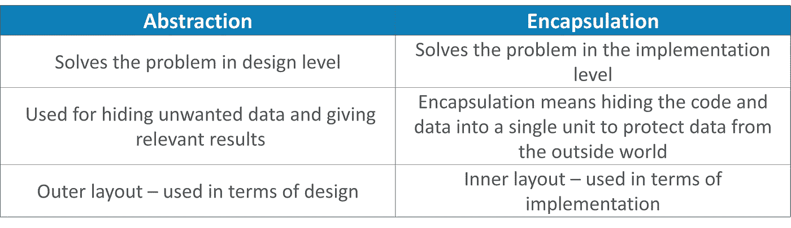

# 通过真实的例子掌握 Java 中的抽象

> 原文：<https://medium.com/edureka/java-abstraction-d2d790c09037?source=collection_archive---------0----------------------->


在上一篇文章中，您了解了 Java 中的[继承。](/edureka/inheritance-in-java-f638d3ed559e)现在在这篇博客中，我们将了解 OOPs 的一个更重要的支柱，即 Java 抽象，它的主要功能是隐藏内部实现细节。

我将在本文中讨论以下主题:

*   面向对象中的抽象
*   什么是 Java 抽象？
*   抽象类
*   连接
*   Java 中抽象的真实例子
*   抽象与封装

# 面向对象中的抽象

当我们谈论抽象时，软件语言就是抽象的一个例子。让我们举个例子，写一个声明如下-

*x = y+z；*

在上面的语句中，我们添加了存储在两个不同位置的两个变量，然后将结果存储在一个新的位置。那么，接下来会发生什么？你可能知道，有寄存器、指令集、程序计数器、存储单元等。，参与其中。当我们提到 Java 中的抽象时，我们指的是面向对象编程(OOP)中的抽象以及它是如何实现的。OOP 中抽象的概念始于类被构思的那一刻。抽象在软件和 OOP 中无处不在。

# 什么是 Java 抽象？

抽象不过是处理想法而不是事件的品质。它基本上处理的是隐藏内部细节，向用户展示本质的东西。


如果你看看上面的 gif，你可以看到当你接到一个电话，我们得到一个选项，要么接电话，要么拒绝它。但实际上，有很多代码在后台运行。所以在这里，你不知道调用是如何产生的内部处理，这就是抽象的美妙之处。您可以通过两种方式实现抽象:

a)抽象类

b)接口

让我们更详细地理解这些概念。

# 抽象类

抽象类包含“Abstract”关键字。但这到底意味着什么呢？如果你将类抽象，它就不能被实例化，也就是说，你不能创建一个抽象类的对象。此外，抽象类可以包含抽象和具体的方法。

***注意:*** *使用抽象类可以实现 0–100%的抽象。*

要使用抽象类，你必须从基类继承它。这里，你必须为抽象方法提供实现，否则它将成为一个抽象类。

让我们看看抽象类的语法:

```
Abstract class Sports {   // abstract class sports
Abstract void jump();    // abstract method
}
```

# 连接

Java 中的接口是抽象方法和静态常量的集合。正如您可能知道的，在接口中，每个方法都是公共的和抽象的，但是它不包含任何构造函数。除了抽象，接口还有助于实现 Java 中的多重继承。
***注意:*** *使用接口可以实现 100%的抽象。*

基本上，接口是一组具有空体的相关方法。让我们以一个形状的接口及其相关方法为例来理解接口。

```
public interface shape{
public void draw();
public double getArea();
}
```

这些方法需要出现在每个“形状”中，对吗？但是他们的工作会有所不同。

让我们假设你想画一个形状，比如圆形、正方形、长方形等等。你已经知道，每个形状都有自己的尺寸，如半径、高度和宽度。说我要画一个圆，计算它的面积。出于同样的考虑，我在上面的代码中创建了两个方法，即 draw()和 getArea()。现在，使用这些方法，我可以绘制任何形状，并通过实现其接口来计算面积。

现在，让我们看看如何实现这个接口的功能。
为了实现这个接口，你的类的名字会改变为任何形状，比如说“圆形”。因此，为了实现类接口，我将使用' implement '关键字:

```
public class Circle implements Shape{ 
private double radius; 
public Circle(double r){ 
this.radius = r; 
} 
void draw(){ 
System.out.println("Drawing Circle"); 
} 
public double getArea(){ 
return Math.PI*this.radius*this.radius; 
} 
public double getRadius(){
 return this.radius; 
} 
}
public class Test{ 
public static void main (String args[]){
Shape c = new Circle(8);
c.draw(); 
System.out.println("Area="+c.getArea());
}
}
```

在上面的例子中，我为不同的方法指定了功能，并计算了圆的面积。这里，在实现一个接口时，它允许一个类对它提供的行为变得更加正式。你也可以创建另一个类，比如“Rectangle”类，它可以继承具有不同功能的相同接口“shape”。

# java 中抽象的实时例子

假设我们把运动作为一个界面。这里，实现将由名为“羽毛球”和“足球”的类提供。在真实的场景中，最终用户不会意识到实现类。因此，实现类的对象可以由工厂方法提供。工厂方法可用于根据某种标准创建实现类的对象。让我们实现同样的方法，创建一个名为 Sport.java 的接口。

```
public Interface Sport{
void play();
}
//Now, we will create class named "Badminton"
public class Badminton implements Sport {
[@Override](http://twitter.com/Override)
public void play() {
System.out.println("Playing badminton");
}
}
//Next let's create our last class “Football”
public class Football implements Sport { 
[@Override](http://twitter.com/Override)
public void play() {
System.out.println("Playing football");
}
```

最后一步是创建一个名为“SportInterface”的主类。

```
public SportInterface{
public static void main(String args[]){
// your code here
}
}
```

当您执行上述程序时，输出将如下所示:

```
Playing badminton
-------------------
Playing football
```

我希望你们清楚这个接口，以及如何使用它实现抽象。现在，让我们通过比较抽象和封装来结束本文。

# 抽象与封装



我希望你理解了抽象和封装之间的区别。

至此，我们结束了 Java 文章中的抽象部分。请留意本系列中的其他文章和视频，它们将帮助您理解 Java 的各种概念。

如果你想查看更多关于人工智能、DevOps、道德黑客等市场最热门技术的文章，那么你可以参考 [Edureka 的官方网站。](https://www.edureka.co/blog/?utm_source=medium&utm_medium=content-link&utm_campaign=java-abstraction)

请留意本系列中的其他文章，它们将解释 Java 的各个方面。

> 1.[面向对象编程](/edureka/object-oriented-programming-b29cfd50eca0)
> 
> 2.[Java 中的继承](/edureka/inheritance-in-java-f638d3ed559e)
> 
> 3.[Java 中的多态性](/edureka/polymorphism-in-java-9559e3641b9b)
> 
> 4. [Java 教程](/edureka/java-tutorial-bbdd28a2acd7)
> 
> 5. [Java 字符串](/edureka/java-string-68e5d0ca331f)
> 
> 6. [Java 数组](/edureka/java-array-tutorial-50299ef85e5)
> 
> 7. [Java 集合](/edureka/java-collections-6d50b013aef8)
> 
> 8. [Java 线程](/edureka/java-thread-bfb08e4eb691)
> 
> 9.[Java servlet 简介](/edureka/java-servlets-62f583d69c7e)
> 
> 10. [Servlet 和 JSP 教程](/edureka/servlet-and-jsp-tutorial-ef2e2ab9ee2a)
> 
> 11.[Java 中的异常处理](/edureka/java-exception-handling-7bd07435508c)
> 
> 12.[高级 Java 教程](/edureka/advanced-java-tutorial-f6ebac5175ec)
> 
> 13. [Java 面试问题](/edureka/java-interview-questions-1d59b9c53973)
> 
> 14. [Java 程序](/edureka/java-programs-1e3220df2e76)
> 
> 15.[科特林 vs Java](/edureka/kotlin-vs-java-4f8653f38c04)
> 
> 16.[依赖注入使用 Spring Boot](/edureka/what-is-dependency-injection-5006b53af782)
> 
> 17.[Java 中可比的](/edureka/comparable-in-java-e9cfa7be7ff7)
> 
> 18.[十大 Java 框架](/edureka/java-frameworks-5d52f3211f39)
> 
> 19. [Java 反射 API](/edureka/java-reflection-api-d38f3f5513fc)
> 
> 20.[Java 中的 30 大模式](/edureka/pattern-programs-in-java-f33186c711c8)
> 
> 21.[核心 Java 备忘单](/edureka/java-cheat-sheet-3ad4d174012c)
> 
> 22.[Java 中的套接字编程](/edureka/socket-programming-in-java-f09b82facd0)
> 
> 23. [Java OOP 备忘单](/edureka/java-oop-cheat-sheet-9c6ebb5e1175)
> 
> 24.[Java 中的注释](/edureka/annotations-in-java-9847d531d2bb)
> 
> 25.[Java 中的图书管理系统项目](/edureka/library-management-system-project-in-java-b003acba7f17)
> 
> 26.[Java 中的树](/edureka/java-binary-tree-caede8dfada5)
> 
> 27.[Java 中的机器学习](/edureka/machine-learning-in-java-db872998f368)
> 
> 28.[顶级数据结构&Java 中的算法](/edureka/data-structures-algorithms-in-java-d27e915db1c5)
> 
> 29. [Java 开发者技能](/edureka/java-developer-skills-83983e3d3b92)
> 
> 30.[前 55 名 Servlet 面试问题](/edureka/servlet-interview-questions-266b8fbb4b2d)
> 
> 31. [](/edureka/java-exception-handling-7bd07435508c) [顶级 Java 项目](/edureka/java-projects-db51097281e3)
> 
> 32. [Java 字符串备忘单](/edureka/java-string-cheat-sheet-9a91a6b46540)
> 
> 33.[Java 中的嵌套类](/edureka/nested-classes-java-f1987805e7e3)
> 
> 34. [Java 集合面试问答](/edureka/java-collections-interview-questions-162c5d7ef078)
> 
> 35.[Java 中如何处理死锁？](/edureka/deadlock-in-java-5d1e4f0338d5)
> 
> 36.[你需要知道的 50 大 Java 集合面试问题](/edureka/java-collections-interview-questions-6d20f552773e)
> 
> 37.[Java 中的字符串池是什么概念？](/edureka/java-string-pool-5b5b3b327bdf)
> 
> 38.[C、C++和 Java 有什么区别？](/edureka/difference-between-c-cpp-and-java-625c4e91fb95)
> 
> 39.[Java 中的回文——如何检查一个数字或字符串？](/edureka/palindrome-in-java-5d116eb8755a)
> 
> 40.[你需要知道的顶级 MVC 面试问答](/edureka/mvc-interview-questions-cd568f6d7c2e)
> 
> 41.[Java 编程语言的十大应用](/edureka/applications-of-java-11e64f9588b0)
> 
> 42.[Java 中的死锁](/edureka/deadlock-in-java-5d1e4f0338d5)
> 
> 43.[Java 中的平方和平方根](/edureka/java-sqrt-method-59354a700571)
> 
> 44.[Java 中的类型转换](/edureka/type-casting-in-java-ac4cd7e0bbe1)
> 
> 45.[Java 中的运算符及其类型](/edureka/operators-in-java-fd05a7445c0a)
> 
> 46.[Java 中的析构函数](/edureka/destructor-in-java-21cc46ed48fc)
> 
> 47.[Java 中的二分搜索法](/edureka/binary-search-in-java-cf40e927a8d3)
> 
> 48.[Java 中的 MVC 架构](/edureka/mvc-architecture-in-java-a85952ae2684)
> 
> 49. [Hibernate 面试问答](/edureka/hibernate-interview-questions-78b45ec5cce8)

*原载于 2019 年 1 月 10 日*[*【www.edureka.co】*](https://www.edureka.co/blog/java-abstraction/)*。*