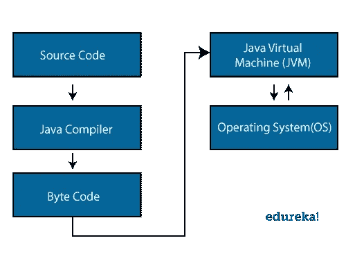
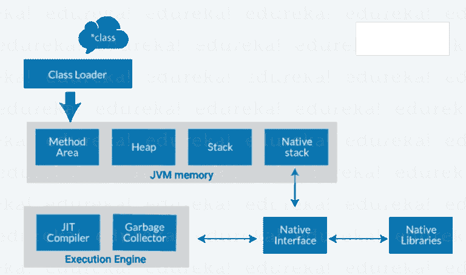
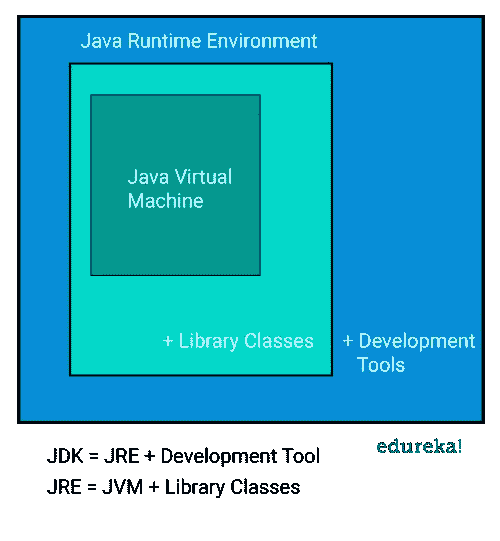
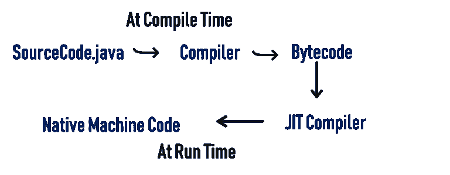
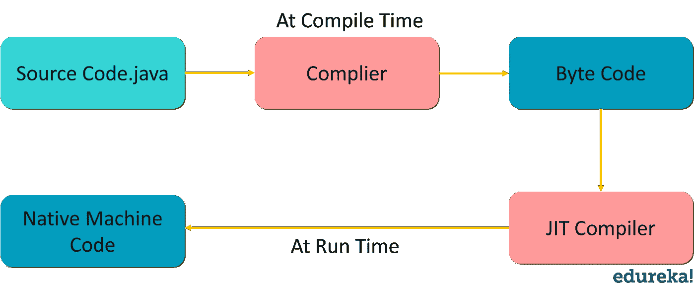

# Java 架构的组成部分是什么？

> 原文：<https://medium.com/edureka/java-architecture-44de6ec72835?source=collection_archive---------1----------------------->

Java 架构结合了编译和解释的过程。它解释了制定 Java 程序时所涉及的各种过程。在开始讨论这个话题之前，让我先给你介绍一下这篇文章的议程。

下面提到的指针将是我们讨论的主题:

*   什么是 Java 架构？
*   Java 的组件
*   Java 平台是如何独立的？
*   Java 中的 JIT

让我们从理解什么是 Java 架构开始。

# 什么是 Java 架构？

在这里，我将用简单的步骤向你解释 java 架构。

*   在 Java 中，有一个编译和解释的过程。
*   用 Java 编写的代码被转换成字节码，由 Java 编译器完成。
*   字节码然后被 JVM 转换成机器码。
*   机器代码由机器直接执行。

这个图展示了 Java 代码的内部工作，或者准确地说，是 Java 架构！

现在，让我们更深入地研究一下 java 架构，谈谈 Java 的各种组件。

# Java 架构的组件

Java 语言主要有三个组成部分: ***JVM、JRE、JDK*** 。

Java 虚拟机、Java 运行时环境和 Java 开发工具包。

让我逐一阐述它们中的每一个:

# Java 虚拟机:

听说过 WORA 吗？(一次编写，随处运行)。嗯，Java 应用程序被称为 WORA，因为它们能够在任何平台上运行代码。这样做只是因为 JVM。JVM 是一个 Java 平台组件，它提供了执行 Java 程序的环境。JVM 将字节码解释成机器码，机器码在运行 Java 程序的机器上执行。

因此，简而言之，JVM 执行以下功能:

*   加载代码
*   验证代码
*   执行代码
*   提供运行时环境

现在，让我向您展示 JVM 架构。开始了。

**解说:**

ClassLoader : Classloader 是 JVM 的一个子系统。它用于加载类文件。每当我们运行 java 程序时，类装入器首先装入它。

**类方法区**:JVM 中的数据区之一，将存储类数据。静态变量、静态块、静态方法、实例方法都存储在这个区域。

**堆**:JVM 启动时创建一个堆。当应用程序运行时，它的大小可能会增加或减少。

**栈** : JVM 栈被称为线程栈。它是 JVM 内存中为单个执行线程创建的数据区域。线程的 JVM 堆栈被该线程用来存储各种元素，即:用于调用方法和返回的局部变量、部分结果和数据。

**原生栈**:它包含了应用程序中使用的所有原生方法。

**执行引擎:**

*   JIT 编译器
*   垃圾收集工

**JIT 编译器:**实时(JIT)编译器是运行时环境的一部分。通过在运行时将字节码编译成机器码，它有助于提高 Java 应用程序的性能。默认情况下，JIT 编译器是启用的。当编译一个方法时，JVM 直接调用该方法的编译代码。JIT 编译器将该方法的字节码编译成机器码，编译成“实时”运行。

**垃圾收集器:**顾名思义，垃圾收集器就是收集不用的材料。在 JVM 中，这项工作是通过垃圾收集来完成的。它跟踪 JVM 堆空间中所有可用的对象，并删除不需要的对象。
垃圾收集器的工作分为两个简单的步骤，即标记和清扫:

*   标记——垃圾收集器在这里识别哪块内存正在使用，哪块没有使用
*   Sweep —它删除在“标记”阶段识别的对象。

# Java 运行时环境:

JRE 软件构建了一个可以执行 Java 程序的运行时环境。JRE 是磁盘上的系统，它获取 Java 代码，将其与所需的库结合起来，并启动 JVM 来执行它。JRE 包含 Java 程序运行所需的库和软件。JRE 是 JDK 的一部分(我们将在后面研究)，但是可以单独下载。

# Java 开发工具包:

Java 开发工具包(JDK)是一个用于开发 Java 应用程序和小应用程序的软件开发环境。它包含 JRE 和几个开发工具，一个解释器/加载器(java)，一个编译器(javac)，一个归档器(jar)，一个文档生成器(javadoc)以及另一个工具。

图表中显示的蓝色区域是 JDK。现在，让我为大家详细介绍一下开发工具。

**java** :它是所有 java 应用程序的启动器。
**javac**:Java 编程语言的编译器。
**javadoc** :是 API 文档生成器。
**jar** :创建并管理所有的 jar 文件。

继续介绍 Java 架构，让我们了解 Java 平台是如何独立的？

# Java 平台如何独立？

什么时候任何编程语言被称为平台无关的？嗯，当且仅当它可以在所有可用的操作系统上运行时，就其开发和编译而言。现在，仅仅因为字节码，Java 是独立于平台的。让我告诉你什么是字节码？简单来说，
字节码是机器可以理解的 JVM 代码。Java 中的字节码执行证明了它是一种平台无关的语言。
在这里，我将向您展示 java 字节码执行过程中涉及的步骤。

**sample.java→贾瓦茨*(样本。class) → JVM(sample.obj) →最终输出***

第一个源代码由 java 编译器使用，并被转换成。类文件。类文件代码是字节码形式的，JVM 使用该类文件转换成目标文件。之后，您可以在屏幕上看到最终的输出。

继续阅读 Java 架构文章，让我们理解 Java 中 JIT 的概念。

# Java 中的 JIT

准时制编译器通常称为 JIT，主要负责在运行时优化基于 java 的应用程序的性能。应用程序的性能依赖于编译器。这是一个简单的图表，向您展示了正在进行的内部流程。

JIT 编译器将方法的字节码编译成机器码，编译成“正好及时”运行。当编译一个方法时，JVM 直接调用该方法的编译代码。
让我们深入研究:
字节码必须根据所提供的指令集被解释或编译成正确的机器指令。此外，如果指令架构是基于字节码的，则可以直接执行这些指令。解释字节码会影响执行速度。
为了提高性能，JIT 编译器在运行时与 Java 虚拟机(JVM)进行交互，将合适的字节码序列编译成本机代码(如图)。当使用 JIT 编译器时，硬件能够执行本机代码，相比之下，让 JVM 重复解释相同的字节码序列会导致翻译过程的开销。

至此，我已经结束了这篇关于 Java 架构的文章。我希望上面讨论的主题能够增加您的 Java 知识。敬请关注更多文章！

如果你想查看更多关于人工智能、DevOps、道德黑客等市场最热门技术的文章，那么你可以参考 [Edureka 的官方网站。](https://www.edureka.co/blog/?utm_source=medium&utm_medium=content-link&utm_campaign=/java-architecture)

请留意本系列中解释 Java 其他各方面的其他文章。

> *1。* [*面向对象编程*](/edureka/object-oriented-programming-b29cfd50eca0)
> 
> *2。*[*Java 中的继承*](/edureka/inheritance-in-java-f638d3ed559e)
> 
> *3。*[*Java 中的多态性*](/edureka/polymorphism-in-java-9559e3641b9b)
> 
> *4。*[*Java 中的抽象*](/edureka/java-abstraction-d2d790c09037)
> 
> *5。* [*Java 字符串*](/edureka/java-string-68e5d0ca331f)
> 
> *6。* [*Java 数组*](/edureka/java-array-tutorial-50299ef85e5)
> 
> *7。* [*Java 集合*](/edureka/java-collections-6d50b013aef8)
> 
> *8。* [*Java 线程*](/edureka/java-thread-bfb08e4eb691)
> 
> *9。*[*Java servlet 简介*](/edureka/java-servlets-62f583d69c7e)
> 
> 10。 [*Servlet 和 JSP 教程*](/edureka/servlet-and-jsp-tutorial-ef2e2ab9ee2a)
> 
> *11。*[*Java 中的异常处理*](/edureka/java-exception-handling-7bd07435508c)
> 
> *12。* [*Java 教程*](/edureka/java-tutorial-bbdd28a2acd7)
> 
> *13。* [*Java 面试题*](/edureka/java-interview-questions-1d59b9c53973)
> 
> *14。* [*Java 程序*](/edureka/java-programs-1e3220df2e76)
> 
> 15。 [*科特林 vs Java*](/edureka/kotlin-vs-java-4f8653f38c04)
> 
> *16。* [*依赖注入使用 Spring Boot*](/edureka/what-is-dependency-injection-5006b53af782)
> 
> *17。* [*堪比 Java 中的*](/edureka/comparable-in-java-e9cfa7be7ff7)
> 
> *18。* [*十大 Java 框架*](/edureka/java-frameworks-5d52f3211f39)
> 
> *19。* [*Java 反射 API*](/edureka/java-reflection-api-d38f3f5513fc)
> 
> *20。*[*Java 中的 30 大模式*](/edureka/pattern-programs-in-java-f33186c711c8)
> 
> *21。* [*核心 Java 备忘单*](/edureka/java-cheat-sheet-3ad4d174012c)
> 
> *22。*[*Java 中的套接字编程*](/edureka/socket-programming-in-java-f09b82facd0)
> 
> *23。* [*Java OOP 备忘单*](/edureka/java-oop-cheat-sheet-9c6ebb5e1175)
> 
> *24。*[*Java 中的注释*](/edureka/annotations-in-java-9847d531d2bb)
> 
> *25。*[*Java 中的图书馆管理系统项目*](/edureka/library-management-system-project-in-java-b003acba7f17)
> 
> 26。[*Java 中的树*](/edureka/java-binary-tree-caede8dfada5)
> 
> *27。*[*Java 中的机器学习*](/edureka/machine-learning-in-java-db872998f368)
> 
> *28。* [*顶级数据结构&Java 中的算法*](/edureka/data-structures-algorithms-in-java-d27e915db1c5)
> 
> 29。 [*Java 开发者技能*](/edureka/java-developer-skills-83983e3d3b92)
> 
> 三十。 [*前 55 名 Servlet 面试问题*](/edureka/servlet-interview-questions-266b8fbb4b2d)
> 
> 31。*[*顶级 Java 项目*](/edureka/java-projects-db51097281e3)*
> 
> **32。* [*Java 字符串备忘单*](/edureka/java-string-cheat-sheet-9a91a6b46540)*
> 
> *33。[*Java 中的嵌套类*](/edureka/nested-classes-java-f1987805e7e3)*
> 
> **34。* [*Java 集合面试问答*](/edureka/java-collections-interview-questions-162c5d7ef078)*
> 
> **35。*[*Java 中如何处理死锁？*](/edureka/deadlock-in-java-5d1e4f0338d5)*
> 
> **36。* [*你需要知道的 50 个 Java 合集面试问题*](/edureka/java-collections-interview-questions-6d20f552773e)*
> 
> **37。*[*Java 中的字符串池是什么概念？*](/edureka/java-string-pool-5b5b3b327bdf)*
> 
> **38。*[*C、C++和 Java 有什么区别？*](/edureka/difference-between-c-cpp-and-java-625c4e91fb95)*
> 
> **39。*[*Java 中的回文——如何检查一个数字或字符串？*](/edureka/palindrome-in-java-5d116eb8755a)*
> 
> **40。* [*你需要知道的顶级 MVC 面试问答*](/edureka/mvc-interview-questions-cd568f6d7c2e)*
> 
> *41。[*Java 编程语言十大应用*](/edureka/applications-of-java-11e64f9588b0)*
> 
> *42。[*Java 中的死锁*](/edureka/deadlock-in-java-5d1e4f0338d5)*
> 
> **43。*[*Java 中的平方和平方根*](/edureka/java-sqrt-method-59354a700571)*
> 
> **44。*[*Java 中的类型转换*](/edureka/type-casting-in-java-ac4cd7e0bbe1)*
> 
> *45。[*Java 中的运算符及其类型*](/edureka/operators-in-java-fd05a7445c0a)*
> 
> *46。[*Java 中的析构函数*](/edureka/destructor-in-java-21cc46ed48fc)*
> 
> *47。[*Java 中的二分搜索法*](/edureka/binary-search-in-java-cf40e927a8d3)*
> 
> **48。*[*Java 中的 MVC 架构*](/edureka/mvc-architecture-in-java-a85952ae2684)*
> 
> **49。* [*冬眠面试问答*](/edureka/hibernate-interview-questions-78b45ec5cce8)*

**原载于 2019 年 7 月 25 日*[*https://www.edureka.co*](https://www.edureka.co/blog/java-architecture/)*。**