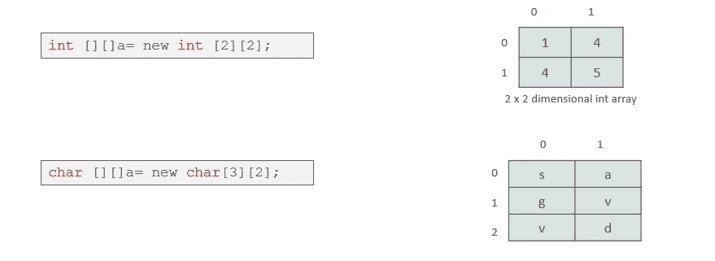

# Java 数组——Java 中一维和多维数组的完整指南

> 原文：<https://medium.com/edureka/java-array-tutorial-50299ef85e5?source=collection_archive---------1----------------------->


Java Array - Edureka

Java 是一种通用的、并发的、面向对象的、基于类的运行时环境(JRE)。通过这篇关于 Java 数组的博客，我将向你解释 Java 中数组的概念以及一维数组和多维数组是如何工作的。

在这篇 Java Array 博客中，我将讨论以下主题:

*   什么是 Java 数组？
*   访问 Java 数组中的特定元素
*   Java 中的多维数组
*   将 Java 数组传递给方法

在我们继续之前，让我们看看为什么我们需要 Java 数组:

*   数组是保存数据的重要结构。
*   Java 允许我们使用数组保存许多相同类型的对象。
*   它可以在循环的帮助下通过索引来访问元素。

现在，让我们从这篇关于 Java 数组的文章开始，理解数组到底是什么。

# 什么是 Java 数组？

Java 中的数组是作为对象在 Java 中实现的同构数据结构。数组存储一个或多个特定数据类型的值，并提供索引访问来存储这些值。数组中的特定元素通过其索引来访问。数组提供了一种对相关信息进行分组的便捷方式。


获取数组是一个两步过程。

*   首先，必须声明所需数组类型的变量
*   其次，您必须使用 **new** 分配保存数组的内存，并将其分配给数组变量

那么，让我们看看如何以不同的方式声明数组。

## Java 数组初始化的一般形式


**举例*:-****int month _ days[]；*

## Java 数组初始化的一般形式


**举例:-**


数组可以在声明时初始化。该数组将自动创建得足够大，以容纳您在数组初始值设定项中指定的元素数量。没有**没有**需要使用**新的**。现在，让我们看看如何实现这一点。

## Java 数组初始化的一般形式


下面的代码创建一个初始化的整数数组:

```
class MyArray{

public static voide main(String args[]){

int month_days[ ] = {31,28,31,30,31,30,31,30,31,30,31};

System.out.println("April has " + month+days[3] + "days.");

}

}
```

如果我解释一下如何访问 Java 数组中的元素，这才公平。

# 访问 Java 数组中的特定元素

在数组中，我们可以通过方括号中的索引来访问特定的元素。

**示例:-**


把所有的碎片放在一起，

```
public static void main(String args[]) {
   int month_days[];
    month_days = new int[12];
    month_days[0] = 31;
    month_days[1] = 28;
    month_days[2] = 31;
    month_days[3] = 30;
    month_days[4] = 31;
    month_days[5] = 30;
    month_days[6] = 31;
    month_days[8] = 30;
    month_days[9] = 31;
    month_days[10] = 30;
    month_days[11] = 31;
     System.out.println("April has " + month_days[3] + " days.");
     }
}
```

这就是关于数组和它的声明，以及如何使用一维数组。

如果我告诉你，数组中可以有数组。我知道这听起来有点复杂，但别担心，我知道如何让你变得简单。

# **Java 多维数组**

多维数组是 ***数组中的*** 数组。

## 声明多维数组

要声明它，我们必须使用另一组方括号来指定每个额外的索引。


从概念上讲，上面声明的数组将如图所示


现在让我们演示多维数组。

以下程序从左到右、从上到下对数组中的每个元素进行编号，然后显示这些值:

```
class Mul2D{
 public static void main(String args[]) {
       int mul2d[][]= new int[4][5];
        int i, j, k = 0;
     for(i=0; i&lt;4; i++)
       for(j=0; j&lt;5; j++) {
       Mul2D[i][j] = k;
       k++;
}
for(i=0; i&lt;4; i++) {
    for(j=0; j&lt;5; j++);
       System.out.print(mul2d[i][j] + " ");
       System.out.println();
       }
   }
}
```

该程序生成以下输出:

```
0 1 2 3 4 5 6 7 8 9 10 11 12 13 14 15 16 17 18 19
```

***这些是其他多维数组表示的其他数据类型。***



这都是关于多维数组的。现在，让我们看看，如何像其他数据类型一样将数组作为参数传递给方法。

## 将 Java 数组传递给方法

我们也可以将数组传递给方法，就像我们可以将原始类型值传递给方法一样。

**举例:-**

```
public class PMethods{
public static void display(int y[])
     {
             System.out.println(y[0]);
             System.out.println(y[1]);
             System.out.println(y[2]);

     }
public static void main(String args[])
     {
     int x[] = { 1, 2, 3 };
     display(x);
     }
}
```

这将是程序的输出

```
1

2

3
```

这就把我们带到了 Java Array 博客的结尾。我希望你喜欢这篇关于 Java Array 的文章。到此，我们结束了这个博客。如果你想查看更多关于人工智能、DevOps、道德黑客等市场最热门技术的文章，你可以参考 Edureka 的官方网站。

请留意本系列中的其他文章，它们将解释 Java 的各个方面。

> 1.[面向对象编程](/edureka/object-oriented-programming-b29cfd50eca0)
> 
> 2.[Java 中的继承](/edureka/inheritance-in-java-f638d3ed559e)
> 
> 3.[Java 中的多态性](/edureka/polymorphism-in-java-9559e3641b9b)
> 
> 4.[Java 中的抽象](/edureka/java-abstraction-d2d790c09037)
> 
> 5. [Java 字符串](/edureka/java-string-68e5d0ca331f)
> 
> 6. [Java 教程](/edureka/java-tutorial-bbdd28a2acd7)
> 
> 7. [Java 集合](/edureka/java-collections-6d50b013aef8)
> 
> 8. [Java 线程](/edureka/java-thread-bfb08e4eb691)
> 
> 9.[Java servlet 简介](/edureka/java-servlets-62f583d69c7e)
> 
> 10. [Servlet 和 JSP 教程](/edureka/servlet-and-jsp-tutorial-ef2e2ab9ee2a)
> 
> 11.[Java 中的异常处理](/edureka/java-exception-handling-7bd07435508c)
> 
> 12.[高级 Java 教程](/edureka/advanced-java-tutorial-f6ebac5175ec)
> 
> 13. [Java 面试问题](/edureka/java-interview-questions-1d59b9c53973)
> 
> 14. [Java 程序](/edureka/java-programs-1e3220df2e76)
> 
> 15.[科特林 vs Java](/edureka/kotlin-vs-java-4f8653f38c04)
> 
> 16.[依赖注入使用 Spring Boot](/edureka/what-is-dependency-injection-5006b53af782)
> 
> 17.[Java 中的可比](/edureka/comparable-in-java-e9cfa7be7ff7)
> 
> 18.[十大 Java 框架](/edureka/java-frameworks-5d52f3211f39)
> 
> 19. [Java 反射 API](/edureka/java-reflection-api-d38f3f5513fc)
> 
> 20.[Java 中的 30 大模式](/edureka/pattern-programs-in-java-f33186c711c8)
> 
> 21.[核心 Java 备忘单](/edureka/java-cheat-sheet-3ad4d174012c)
> 
> 22.[Java 中的套接字编程](/edureka/socket-programming-in-java-f09b82facd0)
> 
> 23. [Java OOP 备忘单](/edureka/java-oop-cheat-sheet-9c6ebb5e1175)
> 
> 24.[Java 中的注释](/edureka/annotations-in-java-9847d531d2bb)
> 
> 25.[Java 中的图书管理系统项目](/edureka/library-management-system-project-in-java-b003acba7f17)
> 
> 26.[Java 中的树](/edureka/java-binary-tree-caede8dfada5)
> 
> 27.[Java 中的机器学习](/edureka/machine-learning-in-java-db872998f368)
> 
> 28.[顶级数据结构&Java 中的算法](/edureka/data-structures-algorithms-in-java-d27e915db1c5)
> 
> 29. [Java 开发人员技能](/edureka/java-developer-skills-83983e3d3b92)
> 
> 30.[前 55 个 Servlet 面试问题](/edureka/servlet-interview-questions-266b8fbb4b2d)
> 
> 31. [](/edureka/java-exception-handling-7bd07435508c) [顶级 Java 项目](/edureka/java-projects-db51097281e3)
> 
> 32. [Java 字符串备忘单](/edureka/java-string-cheat-sheet-9a91a6b46540)
> 
> 33.[Java 中的嵌套类](/edureka/nested-classes-java-f1987805e7e3)
> 
> 34. [Java 集合面试问答](/edureka/java-collections-interview-questions-162c5d7ef078)
> 
> 35.[Java 中如何处理死锁？](/edureka/deadlock-in-java-5d1e4f0338d5)
> 
> 36.[你需要知道的 50 大 Java 集合面试问题](/edureka/java-collections-interview-questions-6d20f552773e)
> 
> 37.[Java 中的字符串池是什么概念？](/edureka/java-string-pool-5b5b3b327bdf)
> 
> 38.[C、C++和 Java 有什么区别？](/edureka/difference-between-c-cpp-and-java-625c4e91fb95)
> 
> 39.[Java 中的回文——如何检查一个数字或字符串？](/edureka/palindrome-in-java-5d116eb8755a)
> 
> 40.[你需要知道的顶级 MVC 面试问答](/edureka/mvc-interview-questions-cd568f6d7c2e)
> 
> 41.[Java 编程语言的十大应用](/edureka/applications-of-java-11e64f9588b0)
> 
> 42.[Java 中的死锁](/edureka/deadlock-in-java-5d1e4f0338d5)
> 
> 43.[Java 中的平方和平方根](/edureka/java-sqrt-method-59354a700571)
> 
> 44.[Java 中的类型转换](/edureka/type-casting-in-java-ac4cd7e0bbe1)
> 
> 45.[Java 中的运算符及其类型](/edureka/operators-in-java-fd05a7445c0a)
> 
> 46.[Java 中的析构函数](/edureka/destructor-in-java-21cc46ed48fc)
> 
> 47.[Java 中的二分搜索法](/edureka/binary-search-in-java-cf40e927a8d3)
> 
> 48.[Java 中的 MVC 架构](/edureka/mvc-architecture-in-java-a85952ae2684)
> 
> 49. [Hibernate 面试问答](/edureka/hibernate-interview-questions-78b45ec5cce8)

*原载于 2018 年 1 月 25 日 www.edureka.co**T21*[。](https://www.edureka.co/blog/java-array)