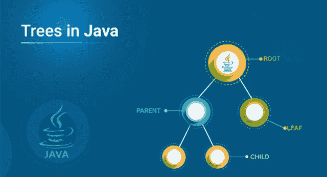

# Java 中的树——如何实现二叉树？

> 原文：<https://medium.com/edureka/java-binary-tree-caede8dfada5?source=collection_archive---------0----------------------->

Trees in Java — Edureka

如果我必须选择软件开发中最重要的一个主题，那就是数据结构。最常见也是最容易的一种是树——一种分层的数据结构。在本文中，让我们探索 Java 中的树。

*   什么是二叉树？
*   二叉树的类型
*   二叉树实现