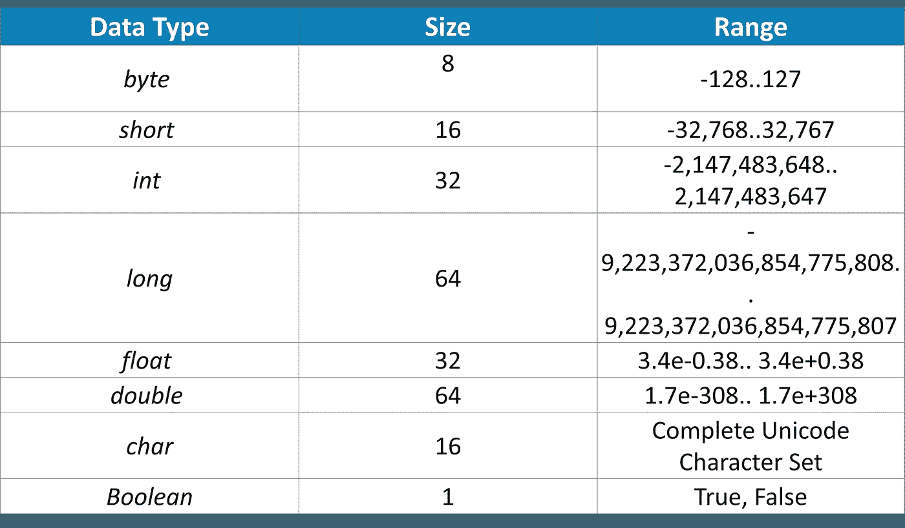

# 核心 Java 备忘单——Java 编程基础

> 原文：<https://medium.com/edureka/java-cheat-sheet-3ad4d174012c?source=collection_archive---------2----------------------->


Core Java Cheat Sheet — Edureka

你是一个有抱负的 ***Java 开发者*** 吗？好吧，如果你是，那么我打赌你可以利用这个 **Java 备忘单**。Java 以其预建的类和库而闻名，有时，跟踪它们变得有点棘手。所以，在这里我给你带来了核心 Java 备忘单。

这个备忘单将作为 Java 初学者的速成课程，帮助你掌握 Java 的各种基础知识。

# 核心 Java 备忘单


Java 是一种开源编程语言，多年来一直在改变着 IT 市场的面貌。程序员普遍倾向于使用它，因为用 Java 编写的代码可以在任何平台上安全地执行，而不管设备的操作系统或架构如何。唯一的要求是，系统上安装了 Java 运行时环境(JRE)。


# 原始数据类型

让我们从学习 Java 提供的基本**数据类型**开始:



# Java 运算符

Java 中主要有 8 种不同类型的**运算符**:


# Java 变量

**变量**在 Java 中是指保留内存区域的名称。出于计算或引用的目的，您需要变量来存储任何值。

Java 中有 3 种类型的变量:

1.  局部变量
2.  实例变量
3.  静态变量

```
{public | private} [static] type name [= expression | value];
```

# Java 方法

方法是组合在一起执行特定操作的一组代码。一种方法分两步完成:

1.  方法初始化
2.  方法调用

可以通过引用或通过值调用方法来调用方法。

```
{public | private} [static] {type | void} name(arg1, ..., argN ){statements}
```

# 数据变换

将值从一种数据类型更改为另一种数据类型的过程称为数据类型转换。数据类型转换有两种类型:

1.  *扩大:*将较小的数据类型转换为较大的数据类型，而不会丢失信息。
2.  *缩小:*较大的数据类型被转换为较小的数据类型，但会丢失一些信息。

```
// Widening (byte<short<int<long<float<double)
int i = 10; //int--> long
long l = i; //automatic type conversion
// Narrowing 
double d = 10.02;
long l = (long)d; //explicit type casting
// Numeric values to String
String str = String.valueOf(value);
// String to Numeric values
int i = Integer.parseInt(str);
double d = Double.parseDouble(str);
```

# 用户输入

Java 提供了三种从用户/控制台获取输入的方法:

1.  使用缓冲区 Reader 类
2.  使用扫描仪类
3.  使用控制台类

```
// Using BufferReader
BufferedReader reader = new BufferedReader(new InputStreamReader(System.in));
String name = reader.readLine();// Using Scanner
Scanner in = new Scanner(System.in);
String s = in.nextLine();
int a = in.nextInt();// Using Console
String name = System.console().readLine();
```

# 基本 Java 程序

Java 中的基本程序至少由以下部分组成:

1.  类别和对象
2.  方法
3.  变量

```
public class Demo{ 
  public static void main(String[] args) 
   { System.out.println("Hello from edureka!");}
}
```

# 编译 Java 程序

您需要用包含 main()方法的类名和。java 扩展。

```
className.java
```

使用 javac 命令调用编译器。

```
javac className
```

最后，使用下面的代码执行程序:

```
java className
```

# 控制流程

# 迭代语句

**迭代语句**在需要重复一组语句直到不满足终止条件时使用。

```
// for loop
for (condition) {expression}
// for each loop
for (int i: someArray) {}  
// while loop
while (condition) {expression} 
// do while loop
do {expression} while(condition)
```

# 决定性的陈述

**选择语句**在程序执行过程中需要在可选动作之间进行选择时使用。

```
//if statement
if (condition) {expression} 
//if-else statement
if (condition) {expression} else {expression} 
//switch statement
switch (var) 
{ case 1: expression; break; default: expression; break; }
```

## **生成斐波那契数列。**

```
for (i = 1; i <= n; ++i)
{System.out.print(t1 + " + ");
int sum = t1 + t2;
t1 = t2;
t2 = sum;}
```

## 检查给定的数是否是质数。

```
if (n < 2) { return false; } 
for (int i=2; i <= n/i; i++) 
{if (n%i == 0) return false;}
return true;
```

## **创造金字塔图案。**

```
k = 2*n - 2;
for(i=0; i<n; i++)
{ for(j=0; j<k; j++){System.out.print(" ");}
k = k - 1;
for(j=0; j<=i; j++ ){System.out.print("* ");}
System.out.println(); }
```

## **用递归函数求阶乘。**

```
int factorial(int n)
 { 
   if (n == 0)
       {return 1;}       
   else 
       {return(n * factorial(n-1));}       
 }
```

# Java 数组

## 一维(1 维)

**一维或一维数组**是一种线性数组，其中元素存储在连续的行中。

```
// Initializing
type[] varName= new type[size];

// Declaring
type[] varName= new type[]{values1, value2,...};
```

## 多维(二维)

**二维数组**是一个数组的数组，其中元素以行和列的形式存储。

```
// Initializing
datatype[][] varName  =  new dataType[row][col];

// Declaring
datatype[][] varName  =  {{value1, value2....},{value1, value2....}..};
```

## **用随机值创建数组。**

```
double[] arr = new double[n];
for (int i=0; i<n; i++)
{a[i] = Math.random();}
```

## **转置一个矩阵。**

```
for(i = 0; i < row; i++)
{ for(j = 0; j < column; j++)
  { System.out.print(array[i][j]+" "); }
  System.out.println(" ");
}
```

## **搜索数组中的最大值。**

```
double max = 0;
for(int i=0; i<arr.length(); i++)
 { if(a[i] > max) max = a[i]; }
```

## **两个矩阵相乘。**

```
for (i = 0; i < row1; i++)
{ for (j = 0; j < col2; j++)
  { for (k = 0; k < row2; k++)
    { sum = sum + first[i][k]*second[k][j]; } 
   multiply[i][j] = sum;
   sum = 0;
  }
}
```

## **反转一个数组。**

```
for(int i=0; i<(arr.length())/2; i++)
 { double temp = a[i];
   a[i] = a[n-1-i]; 
   a[n-1-i] = temp;
  }
```

# Java 字符串

## 创建字符串

Java 中的 **String** 是一个表示 char 值序列的对象。可以通过两种方式创建字符串:

1.  使用文字
2.  使用“new”关键字

```
String str1 = “Welcome”; // Using literal

String str2 = new String(”Edureka”); // Using new keyword
```

java.lang.String 类实现 Serializable、Comparable 和 CharSequence 接口。由于字符串对象本质上是不可变的，Java 提供了两个实用程序类:

1.  *StringBuffer:* 它是一个线程安全的、同步的可变类。
2.  *StringBuilder:* 它是一个可变类，不是线程安全的，但速度更快，用于单线程环境。

# 字符串方法

下面列出了一些最重要和最常用的字符串方法:

```
str1==str2 //compares address;
String newStr = str1.equals(str2); //compares the values
String newStr = str1.equalsIgnoreCase() //compares the values ignoring the case
newStr = str1.length() //calculates length
newStr = str1.charAt(i) //extract i'th character
newStr = str1.toUpperCase() //returns string in ALL CAPS
newStr = str1.toLowerCase() //returns string in ALL LOWERvCASE
newStr = str1.replace(oldVal, newVal) //search and replace
newStr = str1.trim() //trims surrounding whitespace
newStr = str1.contains("value"); //check for the values
newStr = str1.toCharArray(); // convert String to character type array
newStr = str1.IsEmpty(); //Check for empty String
newStr = str1.endsWith(); //Checks if string ends with the given suffix
```

## [下载初学者核心 Java 备忘单](http://bit.ly/2YT8Dz3)

如果你想查看更多关于人工智能、DevOps、道德黑客等市场最热门技术的文章，你可以参考 Edureka 的官方网站。

请留意本系列中的其他文章，它们将解释 Java 的各个方面。

> 1.[面向对象编程](/edureka/object-oriented-programming-b29cfd50eca0)
> 
> 2.[Java 中的继承](/edureka/inheritance-in-java-f638d3ed559e)
> 
> 3.[Java 中的多态性](/edureka/polymorphism-in-java-9559e3641b9b)
> 
> 4.[Java 中的抽象](/edureka/java-abstraction-d2d790c09037)
> 
> 5. [Java 字符串](/edureka/java-string-68e5d0ca331f)
> 
> 6. [Java 数组](/edureka/java-array-tutorial-50299ef85e5)
> 
> 7. [Java 合集](/edureka/java-collections-6d50b013aef8)
> 
> 8. [Java 线程](/edureka/java-thread-bfb08e4eb691)
> 
> 9.[Java servlet 简介](/edureka/java-servlets-62f583d69c7e)
> 
> 10. [Servlet 和 JSP 教程](/edureka/servlet-and-jsp-tutorial-ef2e2ab9ee2a)
> 
> 11.[Java 中的异常处理](/edureka/java-exception-handling-7bd07435508c)
> 
> 12.[高级 Java 教程](/edureka/advanced-java-tutorial-f6ebac5175ec)
> 
> 13. [Java 面试问题](/edureka/java-interview-questions-1d59b9c53973)
> 
> 14. [Java 程序](/edureka/java-programs-1e3220df2e76)
> 
> 15. [Kotlin vs Java](/edureka/kotlin-vs-java-4f8653f38c04)
> 
> 16.[依赖注入使用 Spring Boot](/edureka/what-is-dependency-injection-5006b53af782)
> 
> 17.[在 Java 中可比](/edureka/comparable-in-java-e9cfa7be7ff7)
> 
> 18.[十大 Java 框架](/edureka/java-frameworks-5d52f3211f39)
> 
> 19. [Java 反射 API](/edureka/java-reflection-api-d38f3f5513fc)
> 
> 20.[Java 中的 30 大模式](/edureka/pattern-programs-in-java-f33186c711c8)
> 
> 21. [Java 教程](/edureka/java-tutorial-bbdd28a2acd7)
> 
> 22.[Java 中的套接字编程](/edureka/socket-programming-in-java-f09b82facd0)
> 
> 23. [Java OOP 备忘单](/edureka/java-oop-cheat-sheet-9c6ebb5e1175)
> 
> 24.[Java 中的注释](/edureka/annotations-in-java-9847d531d2bb)
> 
> 25.[Java 中的图书管理系统项目](/edureka/library-management-system-project-in-java-b003acba7f17)
> 
> 26.[Java 中的树](/edureka/java-binary-tree-caede8dfada5)
> 
> 27.[Java 中的机器学习](/edureka/machine-learning-in-java-db872998f368)
> 
> 28.[Java 中的顶级数据结构&算法](/edureka/data-structures-algorithms-in-java-d27e915db1c5)
> 
> 29. [Java 开发者技能](/edureka/java-developer-skills-83983e3d3b92)
> 
> 30.[前 55 名 Servlet 面试问题](/edureka/servlet-interview-questions-266b8fbb4b2d)
> 
> 31. [](/edureka/java-exception-handling-7bd07435508c) [顶级 Java 项目](/edureka/java-projects-db51097281e3)
> 
> 32. [Java 字符串备忘单](/edureka/java-string-cheat-sheet-9a91a6b46540)
> 
> 33.[Java 中的嵌套类](/edureka/nested-classes-java-f1987805e7e3)
> 
> 34. [Java 集合面试问答](/edureka/java-collections-interview-questions-162c5d7ef078)
> 
> 35.[Java 中如何处理死锁？](/edureka/deadlock-in-java-5d1e4f0338d5)
> 
> 36.[你需要知道的 50 大 Java 集合面试问题](/edureka/java-collections-interview-questions-6d20f552773e)
> 
> 37.[Java 中的字符串池是什么概念？](/edureka/java-string-pool-5b5b3b327bdf)
> 
> 38.[C、C++和 Java 有什么区别？](/edureka/difference-between-c-cpp-and-java-625c4e91fb95)
> 
> 39.[Java 中的回文——如何检查一个数字或字符串？](/edureka/palindrome-in-java-5d116eb8755a)
> 
> 40.[你需要知道的顶级 MVC 面试问答](/edureka/mvc-interview-questions-cd568f6d7c2e)
> 
> 41.[Java 编程语言的十大应用](/edureka/applications-of-java-11e64f9588b0)
> 
> 42.[Java 中的死锁](/edureka/deadlock-in-java-5d1e4f0338d5)
> 
> 43.[Java 中的平方和平方根](/edureka/java-sqrt-method-59354a700571)
> 
> 44.Java 中的类型转换
> 
> 45.[Java 中的运算符及其类型](/edureka/operators-in-java-fd05a7445c0a)
> 
> 46.[Java 中的析构函数](/edureka/destructor-in-java-21cc46ed48fc)
> 
> 47.[爪哇的二分搜索法](/edureka/binary-search-in-java-cf40e927a8d3)
> 
> 48.[Java 中的 MVC 架构](/edureka/mvc-architecture-in-java-a85952ae2684)
> 
> 49. [Hibernate 面试问答](/edureka/hibernate-interview-questions-78b45ec5cce8)

*原载于*[*https://www.edureka.co*](https://www.edureka.co/blog/cheatsheets/java-cheat-sheet/)*。*