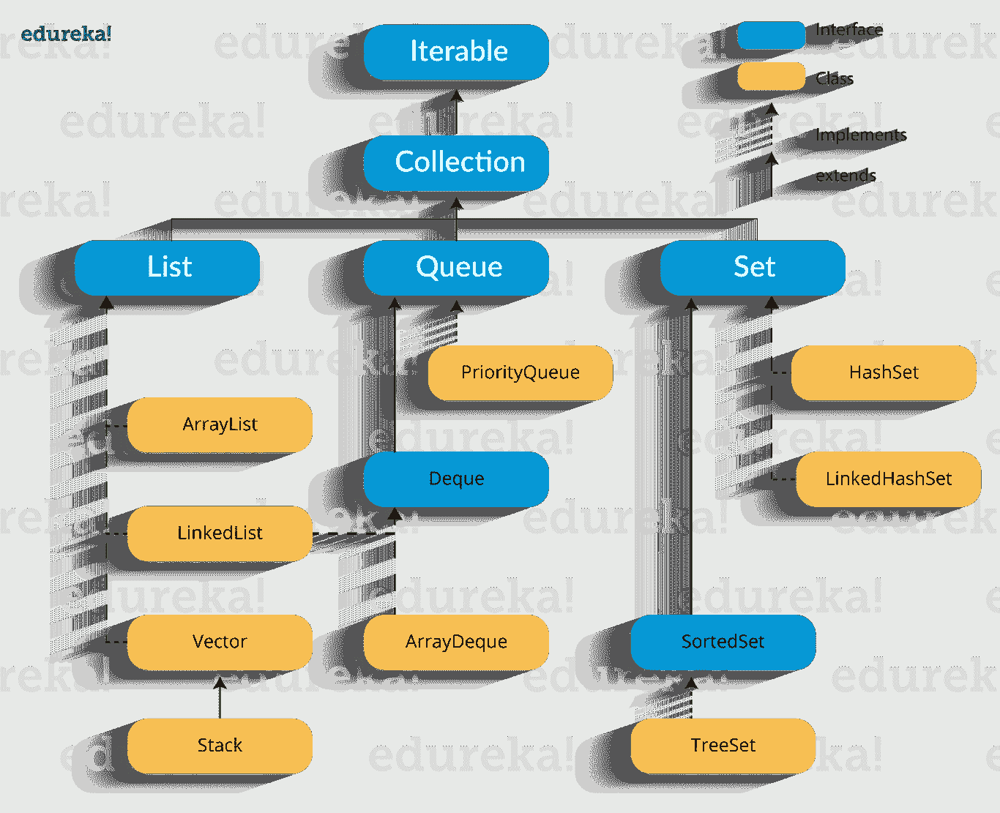
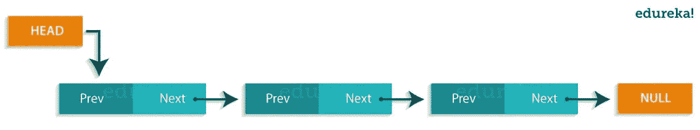
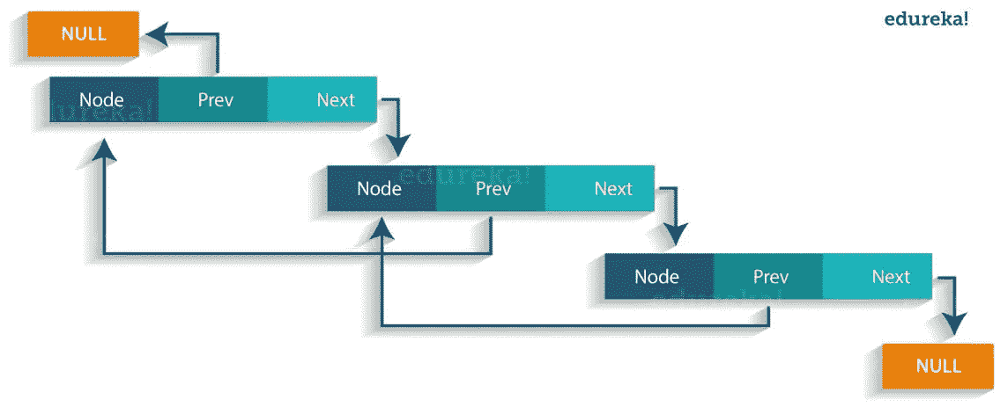

# Java 集合框架——Java 中的集合和例子

> 原文：<https://medium.com/edureka/java-collections-6d50b013aef8?source=collection_archive---------0----------------------->


Java Collections - Edureka

在我之前的文章中，你已经了解了 ***OOP 概念*** 和 ***Java 字符串*** 。现在，让我们转向稍微高级的概念，即 **Java 集合**。Java 集合指的是一个单一的对象单元。您可以对数据执行所有操作，如搜索、排序、插入、操作、删除等。通过 Java 集合。

现在，让我们继续这个博客，我们将按以下顺序理解它的每个方面:

1.  什么是 Java 集合框架？
2.  Java 集合框架层次结构
3.  连接
4.  目录
5.  长队
6.  设置

让我们从 Java collections 博客的第一个主题开始。

# **什么是 Java 集合框架？**

Java 集合框架提供了存储和操作一组对象的架构。Java 集合框架包括以下内容:

*   接口
*   班级
*   算法

让我们详细了解一下它们:

## **接口**:

接口指的是抽象数据类型。它们允许 Java 集合的操作独立于它们表示的细节。而且，它们在面向对象编程语言中形成了一个层次。

## **类:**

Java 中的类是集合接口的实现。它基本上指的是反复使用的数据结构。

## **算法:**

算法是指用于对实现集合接口的对象执行搜索和排序等操作的方法。算法本质上是多态的，因为同一个方法可以采用多种形式，或者可以说执行 Java 集合接口的不同实现。

Java 集合框架为开发人员提供了访问预先打包的数据结构以及操作数据的算法。接下来，让我们转到 Java 集合框架层次结构，看看这些接口和类位于何处。

# Java 集合框架层次结构

正如我们所了解的，Java 集合框架包括接口和类。现在，让我们看看 Java 集合框架的层次结构。



Java Collection Framework Hierarchy - Java Collections

在上图中，蓝色部分指的是不同的接口，黄色部分定义了类。现在，让我们详细了解这些组件。

# 连接

## **迭代器接口**:

迭代器是一个迭代元素的接口。它用于遍历列表并修改元素。 ***迭代器接口有下面*** 提到的三种方法:

1.  **public boolean has next()**—如果迭代器有更多元素，此方法返回 true。
2.  **public object next()** —返回元素并将光标指针移动到下一个元素。
3.  **public void remove()** —这个方法删除迭代器返回的最后一个元素。

有三个组件 ***扩展了集合接口*** ，即 L **ist、队列**和**集合。**让我们详细了解一下:

# 目录

列表是元素的有序集合，可能包含重复的元素。它是一个扩展集合接口的接口。 ***列表进一步分为以下*** :

1.  **数组列表**
2.  **链接列表**
3.  **矢量**

让我们来详细了解其中的每一项:

## **阵列列表:**

ArrayList 是 List 接口的实现，可以动态地在列表中添加或删除元素。此外，如果添加的元素超过初始大小，列表的大小会动态增加。


Array List - Java Collections

**语法**:

ArrayList object = new ArrayList()；

下面列出了数组列表中的一些方法:


Methods in ArrayList — Java Collections

让我们通过一个编程示例来理解数组列表:

```
import java.util.*;
 class ArrayListExample{
 public static void main(String args[]){

 ArrayList al=new ArrayList();  // creating array list
 al.add("Jack");                // adding elements    
 al.add("Tyler");
 Iterator itr=al.iterator();
 while(itr.hasNext()){
 System.out.println(itr.next());
 }
 }
 }
```

在上面的代码中，它将返回我们使用 add()方法添加的名称，即:

```
Jack 
Tyler
```

# **链表**:

链表是包含项目的链接序列。每个链接都包含到另一个链接的连接。

***语法* :** Linkedlist 对象= new linked list()；

***Java 链表类使用两种类型的链表来存储元素:***

*   *单链表*
*   *双向链表*

## **单链表**:

在单链表中，这个链表中的每个节点存储该节点的数据和一个指向链表中下一个节点的指针或引用。参考下图，更好地理解单链表。



Single Linked List - Java Collections

## **双向链表**:

在双向链表中，它有两个引用，一个指向下一个节点，另一个指向前一个节点。你可以参考下图来更好的理解双向链表。



Doubly Linked List - Java Collections

下面列出了链表中的一些方法:


Methods in Linked List — Java Collections

让我们用一个编程的例子来理解链表:

```
import java.util.*;
public class LinkedlistExample{
public static void main(String args[]){
LinkedList <String> al=new LinkedList <String>(); // creating linked list
al.add("Rachit");                               // adding elements
al.add("Rahul");
al.add("Rajat");
Iterator <String> itr = al.iterator();
while(itr.hasNext()){
System.out.println(itr.next());
 }
 }
 }
```

上述程序的输出将是:

```
Rachit 
Rahul 
Rajat
```

## **载体**:

向量类似于数组，向量对象的元素可以通过向量的索引来访问。Vector 实现了一个动态数组。此外，矢量不限于特定的大小，它可以根据需要自动缩小或增大。它类似于 ArrayList，但有两个不同之处:

*   矢量同步。
*   Vector 包含许多不属于集合框架的遗留方法。


Vectors - Java Collections

***语法*** *:*

Vector object = new Vector(大小，增量)；

下面是 Vector 类的一些方法:


Methods in Vector Class - Java Collections

现在，让我们转到 Java 集合接口的下一个子类型，即**队列。**

# 长队

Java 中的队列遵循一种 ***FIFO*** 的方法，即它以先入先出 的方式对元素进行排序。在队列中，首先删除第一个元素，最后删除最后一个元素。 ***每个基本方法都以两种形式存在:*** 一种在操作失败时抛出异常，另一种返回特殊值。


Queue - Java Collections

同样，优先级队列实现了队列接口。**优先级队列**的元素按照它们的自然顺序排序，或者由队列构建时提供的比较器排序。这个队列的头是指定顺序中最小的元素。

下面是 Java 队列接口的一些方法:


Methods in Queue Interface - Java Collections

让我们通过一个编程示例来理解这些优先级队列:

```
import java.util.*;
class QueueExample {
public static void main(String args[]){
// creating priority queue
PriorityQueue <String> queue=new PriorityQueue <String>(); 
queue.add("Amit");                             // adding elements
queue.add("Rachit");
queue.add("Rahul");
System.out.println("head:"+queue.element());
System.out.println("head:"+queue.peek());
System.out.println("iterating the queue elements:");
Iterator itr=queue.iterator();
while(itr.hasNext()){
System.out.println(itr.next());
}
queue.remove();
queue.poll();
System.out.println("after removing two elements:");
Iterator <String> itr2=queue.iterator();
while(itr2.hasNext()){
System.out.println(itr2.next());
}
}
}
```

在上面的代码中，输出将是:

```
head:Amit
head:Amit
iterating the queue elements:
Amit
Rachit
Rahul
after removing two elements:
Rahul
```

接下来，让我们进入下一个话题，即集合。

# 设置

集合是指不能包含重复元素的集合。它主要用于对数学集合抽象进行建模。Set 在各种类中都有实现，如 **HashSet、TreeSet** 和 **LinkedHashSet** 。

让我们来详细了解其中的每一项:


Types of Sets - Java Collections

## **哈希特**:

Java HashSet 类创建一个使用哈希表存储的集合。HashSet 只包含唯一的元素，它继承 AbstractSet 类并实现 Set 接口。此外，它使用一种机制*散列*来存储元素。
下面是 Java HashSet 类的一些方法:


Methods in HashSets - Java Collections

让我们通过一个编程示例来理解这些 HashSet:

```
import java.util.*;
class HashsetExample{
 public static void main(String args[]){

 HashSet <String> al=new HashSet(); // creating hashSet
 al.add("Rachit");                 // adding elements
 al.add("Amit");
 al.add("jack");
 Iterator <String> itr=al.iterator();
 while(itr.hasNext()){
 System.out.println(itr.next());
 }
 }
 }
```

上述代码的输出将是:

```
Amit
Rachit
jack
```

## **链接哈希集**:

Java LinkedHashSet 类是 Set 接口的哈希表和链表实现。它只包含像 HashSet 这样的独特元素。Linked HashSet 还提供所有可选的集合操作，并维护插入顺序。让我们通过一个编程示例来理解这些链接的 HashSet:

```
import java.util.*;
class LinkedHashsetExample{
public static void main(String args[]){
LinkedHashSet <String> al=new LinkedHashSet(); // creating linkedhashset
al.add(“Mariana”); // adding elements 
al.add(“Rick”);
al.add(“Sam”);
Iterator <String> itr=al.iterator();
while(itr.hasNext()){
System.out.println(itr.next());
}
}
}
}
```

上述代码的输出将是:

```
Mariana
Rick
Sam
```

## **树集**:

TreeSet 类实现了使用树进行存储的 Set 接口。该类的对象以升序存储。此外，它还继承了 AbstractSet 类并实现了 NavigableSet 接口。它只包含像 HashSet 这样的独特元素。在 TreeSet 类中，访问和检索时间更快。
下面是 Java TreeSet 类的一些方法:


Methods in TreeSet - Java Collections

让我们通过一个编程示例来理解这些树集:

```
import java.util.*;
class TreeSetExample{
public static void main(String args[]){
TreeSet <String> al=new TreeSet<String>();  // creating treeSet
al.add("John");                            // adding elements
al.add("Sam");
al.add("Rick");
Iterator <String> itr=al.iterator();
while(itr.hasNext()){
System.out.println(itr.next());
}
}
}
```

上述程序的输出将是:

```
John 
Rick 
Sam
```

现在你一定想知道所有这些集合之间的区别是什么？

HashSet 以随机顺序存储元素，而 LinkedHashSet 根据插入顺序存储元素，TreeHashSet 根据自然顺序存储元素。

这是“Java 集合”文章的结尾。我希望你们清楚 Java 集合框架，它的层次结构、接口、列表、队列和集合，我已经在上面讨论过了。

如果你想查看更多关于人工智能、DevOps、道德黑客等市场最热门技术的文章，你可以参考 Edureka 的官方网站。

请留意本系列中的其他文章，它们将解释 Java 的各个方面。

> 1.[面向对象编程](/edureka/object-oriented-programming-b29cfd50eca0)
> 
> 2.[Java 中的继承](/edureka/inheritance-in-java-f638d3ed559e)
> 
> 3.[Java 中的多态性](/edureka/polymorphism-in-java-9559e3641b9b)
> 
> 4.[Java 中的抽象](/edureka/java-abstraction-d2d790c09037)
> 
> 5. [Java 字符串](/edureka/java-string-68e5d0ca331f)
> 
> 6. [Java 数组](/edureka/java-array-tutorial-50299ef85e5)
> 
> 7. [Java 教程](/edureka/java-tutorial-bbdd28a2acd7)
> 
> 8. [Java 线程](/edureka/java-thread-bfb08e4eb691)
> 
> 9.[Java servlet 简介](/edureka/java-servlets-62f583d69c7e)
> 
> 10. [Servlet 和 JSP 教程](/edureka/servlet-and-jsp-tutorial-ef2e2ab9ee2a)
> 
> 11.[Java 中的异常处理](/edureka/java-exception-handling-7bd07435508c)
> 
> 12.[高级 Java 教程](/edureka/advanced-java-tutorial-f6ebac5175ec)
> 
> 13. [Java 面试问题](/edureka/java-interview-questions-1d59b9c53973)
> 
> 14. [Java 程序](/edureka/java-programs-1e3220df2e76)
> 
> 15. [Kotlin vs Java](/edureka/kotlin-vs-java-4f8653f38c04)
> 
> 16.[依赖注入使用 Spring Boot](/edureka/what-is-dependency-injection-5006b53af782)
> 
> 17.[Java 中的可比](/edureka/comparable-in-java-e9cfa7be7ff7)
> 
> 18.[十大 Java 框架](/edureka/java-frameworks-5d52f3211f39)
> 
> 19. [Java 反射 API](/edureka/java-reflection-api-d38f3f5513fc)
> 
> 20.[Java 中的前 30 个模式](/edureka/pattern-programs-in-java-f33186c711c8)
> 
> 21.[核心 Java 备忘单](/edureka/java-cheat-sheet-3ad4d174012c)
> 
> 22.[Java 中的套接字编程](/edureka/socket-programming-in-java-f09b82facd0)
> 
> 23. [Java OOP 备忘单](/edureka/java-oop-cheat-sheet-9c6ebb5e1175)
> 
> 24.[Java 中的注释](/edureka/annotations-in-java-9847d531d2bb)
> 
> 25.[Java 中的图书管理系统项目](/edureka/library-management-system-project-in-java-b003acba7f17)
> 
> 26.[Java 中的树](/edureka/java-binary-tree-caede8dfada5)
> 
> 27.[Java 中的机器学习](/edureka/machine-learning-in-java-db872998f368)
> 
> 28.[Java 中的顶级数据结构&算法](/edureka/data-structures-algorithms-in-java-d27e915db1c5)
> 
> 29. [Java 开发人员技能](/edureka/java-developer-skills-83983e3d3b92)
> 
> 30.[前 55 个 Servlet 面试问题](/edureka/servlet-interview-questions-266b8fbb4b2d)
> 
> 31. [](/edureka/java-exception-handling-7bd07435508c) [顶级 Java 项目](/edureka/java-projects-db51097281e3)
> 
> 32. [Java 字符串备忘单](/edureka/java-string-cheat-sheet-9a91a6b46540)
> 
> 33.[Java 中的嵌套类](/edureka/nested-classes-java-f1987805e7e3)
> 
> 34. [Java 集合面试问答](/edureka/java-collections-interview-questions-162c5d7ef078)
> 
> 35.[Java 中如何处理死锁？](/edureka/deadlock-in-java-5d1e4f0338d5)
> 
> 36.[你需要知道的 50 大 Java 集合面试问题](/edureka/java-collections-interview-questions-6d20f552773e)
> 
> 37.[Java 中的字符串池是什么概念？](/edureka/java-string-pool-5b5b3b327bdf)
> 
> 38.[C、C++和 Java 有什么区别？](/edureka/difference-between-c-cpp-and-java-625c4e91fb95)
> 
> 39.[Java 中的回文——如何检查一个数字或字符串？](/edureka/palindrome-in-java-5d116eb8755a)
> 
> 40.[你需要知道的顶级 MVC 面试问答](/edureka/mvc-interview-questions-cd568f6d7c2e)
> 
> 41.[Java 编程语言的十大应用](/edureka/applications-of-java-11e64f9588b0)
> 
> 42.[Java 中的死锁](/edureka/deadlock-in-java-5d1e4f0338d5)
> 
> 43.[Java 中的平方和平方根](/edureka/java-sqrt-method-59354a700571)
> 
> 44.[Java 中的类型转换](/edureka/type-casting-in-java-ac4cd7e0bbe1)
> 
> 45.[Java 中的运算符及其类型](/edureka/operators-in-java-fd05a7445c0a)
> 
> 46.[Java 中的析构函数](/edureka/destructor-in-java-21cc46ed48fc)
> 
> 47.[爪哇的二分搜索法](/edureka/binary-search-in-java-cf40e927a8d3)
> 
> 48.[Java 中的 MVC 架构](/edureka/mvc-architecture-in-java-a85952ae2684)
> 
> 49. [Hibernate 面试问答](/edureka/hibernate-interview-questions-78b45ec5cce8)

*原载于 2017 年 5 月 13 日 www.edureka.co*[](https://www.edureka.co/blog/java-collections)**。**