# 你需要知道的前 50 个 Java 集合面试问题

> 原文：<https://medium.com/edureka/java-collections-interview-questions-6d20f552773e?source=collection_archive---------0----------------------->


集合框架是支持 Java 编程语言基本概念的最重要的支柱之一。如果你是一个有抱负的 Java 开发人员，在你参加面试之前，对这些核心概念有一个很强的了解是非常重要的。通过这篇文章，我将分享*前 50 名 Java 集合面试问题和答案*，这一定会帮助你顺利通过面试。

本文中的问题分为以下几个部分:

*   一般的
*   目录
*   长队
*   一组
*   地图
*   差异

# 通用— Java 集合面试问题

## 1.Java 中的集合框架有什么优势？

下表包含 Java 集合框架的主要优势:

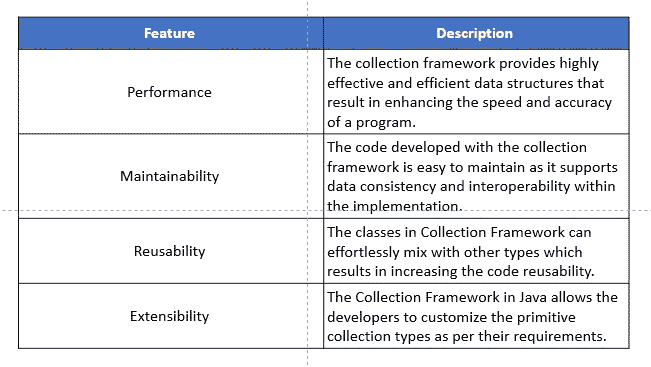

## 2.你所理解的 Java 中的集合框架是什么？

Java 集合框架提供了存储和管理一组对象的架构。它允许开发者访问预先打包的数据结构以及操纵数据的算法。收集框架包括以下内容:

*   接口
*   班级
*   算法

所有这些类和接口都支持各种操作，例如搜索、排序、插入、操作和删除，这使得数据操作变得非常容易和快速。

## **3。用 Java 描述集合层次结构。**

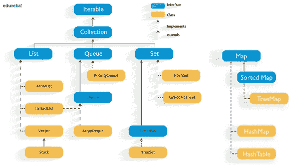

## 4.列出 Java 集合框架提供的主要接口？

以下是收集框架提供的主要接口:

*   ***集合接口* :** java.util .集合是 java 集合框架的根，Java 中的大部分集合都继承自这个接口。

```
public interface Collection<E>extends Iterable
```

*   ***List 接口* :** java.util.List 是一个数组的扩展形式，包含有序元素，可能包含重复元素。它支持基于索引的搜索，但是可以很容易地插入元素，而不考虑位置。List 接口由 ArrayList、LinkedList、Vector 等各种类实现。

```
public interface List<E> extends Collection<E>
```

*   ***Set 接口* :** java.util.Set 是指不能包含重复元素的集合类。因为它没有定义元素的顺序，所以不支持基于索引的搜索。它主要用作数学集合抽象模型。Set 接口由各种类实现，如 HashSet、treeset 和 LinkedHashSet。

```
public interface Set<E> extends Collection<E>
```

*   ***队列接口* :** java 中的 java.util.Queue 遵循 FIFO 方法，即它以先进先出的方式对元素进行排序。队列中的元素将
*   ***Map 接口* :** java.util.Map 是 java 中的一种二维数据结构，用于以键值对的形式存储数据。这里的关键是表示元素的惟一 hashcode 和值。Java 中的 Map 是 Java 集合的另一种形式，但是不能包含重复的元素。

## 5.为什么集合不扩展可克隆和可序列化的接口？

Java 中的集合接口指定了一组称为元素的对象。元素的可维护性和排序完全依赖于每个集合提供的具体实现。因此，没有必要扩展可克隆和可序列化的接口。

## 6.列出通用集合的主要优点。

以下是在 Java 中使用泛型集合的主要优点:

*   在编译时提供更强的类型检查
*   消除了类型转换的需要
*   支持泛型算法的实现，使代码可自定义、类型安全且易于阅读

## 7.使用属性文件的主要好处是什么？

在 java 中使用属性文件的主要优点是，如果属性文件中的值发生变化，它会自动反映出来，而不必重新编译 Java 类。因此，它主要用于存储易于更改的信息，如用户名和密码。这使得应用程序的管理变得简单而高效。下面是一个相同的例子:

```
import java.util.*;
import java.io.*;
public class PropertiesDemo{
public static void main(String[] args)throws Exception{ 
FileReader fr=new FileReader("db.properties"); 
Properties pr=new Properties();
pr.load(fr);
System.out.println(pr.getProperty("user"));
System.out.println(pr.getProperty("password"));
}
}
```

## 8.你所理解的 Java 集合框架中的迭代器是什么？

Java 中的迭代器是 java.util 包中集合框架的一个接口。它是 Java 中的一个游标，用于迭代对象集合。下面是迭代器接口提供的一些其他主要功能:

*   逐个遍历集合对象元素
*   称为通用 Java 游标，因为它适用于集合框架的所有类
*   支持读取和移除操作。
*   迭代器方法名很容易实现

## 9.Java 中重写 equals()方法的必要性是什么？

equals 方法的初始实现有助于检查两个对象是否相同。但是如果你想根据属性比较对象，你必须重写这个方法。

## 10.Java 中集合对象是如何排序的？

Java 集合中的排序是通过[比较器](https://www.edureka.co/blog/comparable-in-java/)和[比较器](https://www.edureka.co/blog/comparator-interface-java/)接口实现的。当使用 Collections.sort()方法时，元素根据 compareTo()方法中指定的自然顺序进行排序。另一方面，当使用 Collections.sort(Comparator)方法时，它基于 Comparator 接口的 compare()方法对对象进行排序。

# 列表— Java 集合面试问题

## 11.列表界面有什么用？

Java 中的 List 接口是元素的有序集合。它保持插入顺序，并允许重复值存储在。该接口包含各种方法，可以根据元素索引平滑地操作元素。实现集合框架列表接口的主要类有 **ArrayList** 、 **LinkedList** 、 **Stack、Vector** 。

## 12.Java 中的数组列表是什么？

ArrayList 是 List 接口的实现，可以动态地在列表中添加或删除元素。集合框架中的 ArrayList 提供了元素的位置访问和插入。这是一个允许重复值的有序集合。如果元素的数量大于初始大小，数组列表的大小可以动态增加。

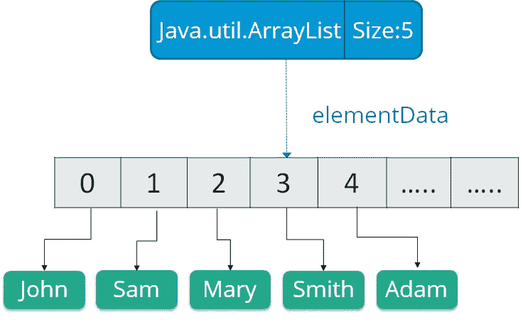

**语法:**

```
ArrayList object = new ArrayList ();
```

## 13.如何将数组列表转换为数组，将数组转换为数组列表？

通过使用 Array 类提供的 asList()方法，可以将数组转换为 ArrayList。它是一个静态方法，接受列表对象作为参数。

**语法:**

```
Arrays.asList(item)
```

而使用 ArrayList 类的 toArray()方法可以将 ArrayList 转换为数组。

**语法:**

```
List_object.toArray(new String[List_object.size()])
```

## **14。你将如何反转一个列表？**

使用 Collections 类的 reverse()方法可以反转 ArrayList。

**语法:**

```
public static void reverse(Collection c)
```

***例如:***

```
public class ReversingArrayList { 
public static void main(String[] args) { 
List<String> myList = new ArrayList<String>(); 
myList.add("AWS"); 
myList.add("Java"); 
myList.add("Python"); 
myList .add("Blockchain"); 
System.out.println("Before Reversing"); 
System.out.println(myList.toString()); 
Collections.reverse(myList); 
System.out.println("After Reversing"); 
System.out.println(myList); 
} 
}
```

## 15.Java 中的 LinkedList 是什么意思？Java 支持多少种类型的 LinkedList？

Java 中的 LinkedList 是包含一系列链接的数据结构。这里每个链接都包含一个到下一个链接的连接。

**语法:**

```
Linkedlist object = new Linkedlist();
```

Java LinkedList 类使用两种类型的 LinkedList 来存储元素:

*   ***单链表:*** 在单链表中，这个链表中的每个节点都存储了该节点的数据以及指向链表中下一个节点的指针或引用。


*   ***双向链表:*** 在双向链表中，它有两个引用，一个指向下一个节点，另一个指向上一个节点。

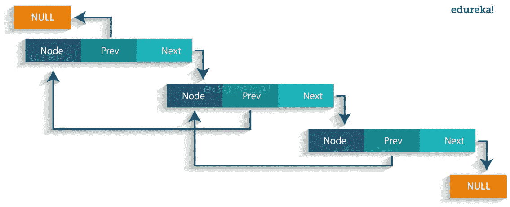

## 16 岁。Java 中的 Vector 是什么？

向量类似于数组，向量对象的元素可以通过向量的索引来访问。Vector 实现了一个动态数组。此外，矢量不限于特定的大小，它可以根据需要自动缩小或增大。它类似于 ArrayList，但有两个不同之处:

*   矢量同步。
*   vector 包含许多不属于集合框架的遗留方法。

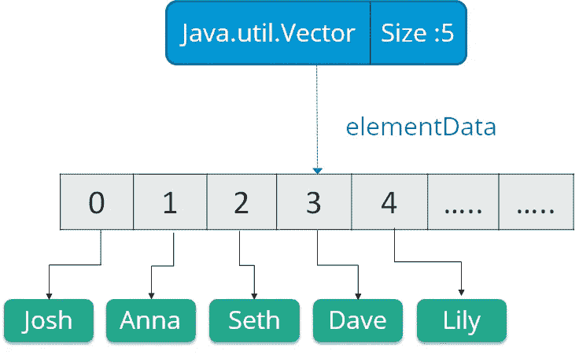

```
Vector object = new Vector(size,increment);
```

# 队列— Java 集合面试问题

## 17.队列接口提供的各种方法有哪些？

下面是 Java 队列接口的一些方法:

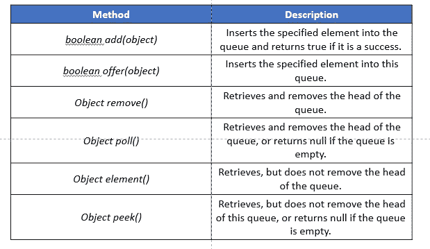

## 18.BlockingQueue 是什么意思？

BlockingQueue 接口属于 **java.util.concurrent** 包。该接口通过激活阻塞来增强流控制，以防线程试图使空队列出列或使已满队列入队。在 Java 中使用 BlockingQueue 接口时，必须记住它不接受空值。如果你试图这样做，它会立即抛出一个 NullPointerException。下图显示了 Java 中 BlockingQueue 接口的工作方式。

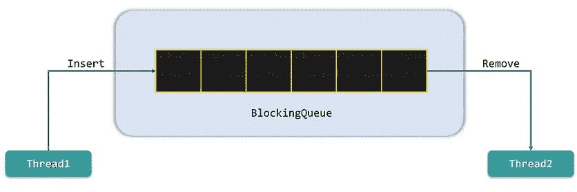

## 19.Java 中什么是优先级队列？

Java 中的优先级队列是一种抽象数据类型，类似于常规队列或堆栈数据结构，但有一个特殊的特性，称为与每个元素相关联的优先级。在这个队列中，高优先级元素在低优先级元素之前被服务，而不考虑它们的插入顺序。PriorityQueue 基于优先级堆。优先级队列的元素根据自然排序进行排序，或者由队列构造时提供的比较器进行排序，这取决于所使用的构造函数。

## 20.Java 中的 Stack 类是什么，它提供的各种方法是什么？

Java 堆栈类是 Java 集合框架的重要组成部分，它基于后进先出的基本原则。换句话说，元素是从后端添加和移除的。将一个元素添加到堆栈中的动作称为 push，而移除一个元素的动作称为 pop。下面是该类提供的各种方法:

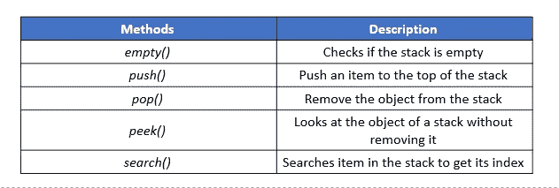

# Set — Java 集合面试问题

## 21.Java 集合框架中设置了什么，并列出它的各种实现？

集合是指不能包含重复元素的集合。它主要用于对数学集合抽象进行建模。Java 平台提供了三种通用 Set 实现，它们是:

1.  哈希特
2.  树集
3.  LinkedHashSet

## 22.Java 中的 HashSet 类是什么，它是如何存储元素的？

java.util.HashSet 类是 java 集合框架的成员，它继承 AbstractSet 类并实现 Set 接口。它隐式实现了一个哈希表，用于创建和存储唯一元素的集合。Hashtable 是 HashMap 类的一个实例，它使用哈希机制来存储 HashSet 中的信息。哈希是将信息内容转换为唯一值的过程，这个唯一值通常被称为哈希代码。然后，这个 hashcode 用于索引与该键相关联的数据。将信息键转换成 hashcode 的整个过程是在内部执行的。

## 23.你能把一个空元素添加到树集或者散列集中吗？

在 HashSet 中，只能添加一个 null 元素，但是在 TreeSet 中不能添加，因为它使用 NavigableMap 来存储元素。这是因为 NavigableMap 是 SortedMap 的一个子类型，它不允许空键。因此，如果您试图向 TreeSet 添加空元素，它将抛出一个 NullPointerException。

## 24.解释集合框架中的 emptySet()方法？

Collections.emptySet()用于在删除空元素时返回空的不可变集合。此方法返回的集合是可序列化的。下面是 emptySet()的方法声明。

**语法:**

```
public static final <T> Set<T> emptySet()
```

## 25.Java 集合框架中的 LinkedHashSet 是什么？

java.util.LinkedHashSet 是 HashSet 类的子类，实现 Set 接口。它是 HashSet 的有序版本，维护一个包含所有元素的双向链表。它保持插入顺序，只包含像其父类一样的唯一元素。

**语法:**

```
LinkedHashSet<String> hs = new LinkedHashSet<String>();
```

# **地图— Java 集合面试问题**

## 26.Java 中的 Map 接口是什么？

java 中的 java.util.Map 接口以键-值对的形式存储元素，这是为更快的查找而设计的。这里每个键都是唯一的，并映射到一个值。这些键值对被称为映射条目。该接口包括基于键插入、移除和检索元素的方法签名。有了这样的方法，它就是一个用于键值关联映射的完美工具，比如字典。

## 27。为什么 Map 不扩展收藏接口？

Java 中的 Map 接口遵循键/值对结构，而 Collection 接口是对象的集合，这些对象以结构化的方式存储，并具有指定的访问机制。Map 不扩展 Collection 接口的主要原因是 Collection 接口的 add(E e)方法不像 Map 接口的 put(K，V)方法那样支持键值对。它可能不会扩展集合接口，但仍然是 Java 集合框架不可或缺的一部分。

## 28.列出 Java 集合框架中 Map 接口提供的不同集合视图？

Map 接口提供了 3 种键值对视图，它们是:

*   密钥集视图
*   值集视图
*   条目集视图

使用迭代器可以很容易地浏览所有这些视图。

## 29.Java 中的 ConcurrentHashMap 是什么，你们实现了吗？

ConcurrentHashMap 是一个 Java 类，实现了 ConcurrentMap 和可序列化接口。这个类是 HashMap 的增强版本，因为它在多线程环境中不能很好地执行。与 HashMap 相比，它具有更高的性能。

下面是一个演示 ConcurrentHashMap 实现的小例子:

```
package edureka;
import java.util.concurrent.*;

public class ConcurrentHashMapDemo {
    public static void main(String[] args) 
    { 
        ConcurrentHashMap m = new ConcurrentHashMap(); 
        m.put(1, "Welcome"); 
        m.put(2, "to"); 
        m.put(3, "Edureka's");
        m.put(4, "Demo");

        System.out.println(m);

        // Here we cant add Hello because 101 key 
        // is already present in ConcurrentHashMap object 
        m.putIfAbsent(3, "Online"); 
        System.out.println("Checking if key 3 is already present in the ConcurrentHashMap object: "+ m);

        // We can remove entry because 101 key 
        // is associated with For value 
        m.remove(1, "Welcome");
        System.out.println("Removing the value of key 1: "+m);

        // Now we can add Hello 
        m.putIfAbsent(1, "Hello");
        System.out.println("Adding new value to the key 1: "+m);

        // We cant replace Hello with For 
        m.replace(1, "Hello", "Welcome"); 
        System.out.println("Replacing value of key 1 with Welcome: "+ m); 
    }
}
```

## 30.可以使用任何类作为映射键吗？

是的，只要考虑以下几点，任何类都可以用作映射键:

*   覆盖 equals()方法的类也必须覆盖 hashCode()方法
*   对于所有实例，该类应该遵守与 equals()和 hashCode()相关的规则
*   equals()方法中没有使用的 class 字段也不应该在 hashCode()方法中使用
*   使用用户定义的键类的最好方法是使它不可变。它有助于缓存 hashCode()值以获得更好的性能。同样，如果这个类是不可变的，它将确保 hashCode()和 equals()在将来不会改变。

# **差异— Java 集合面试问题**

## 31.区分集合和集合。

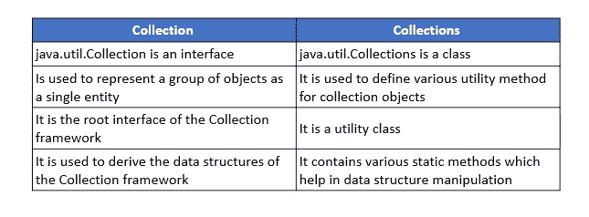

## 32.区分数组和数组列表。

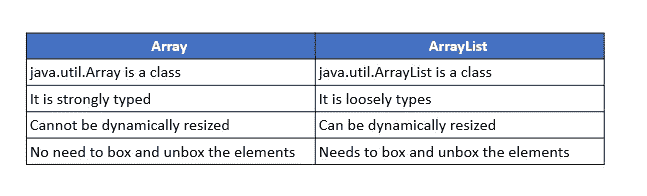

## 33.区分 Iterable 和 Iterator。

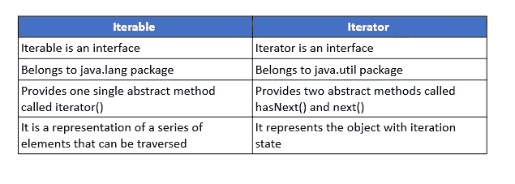

## 34.区分 ArrayList 和 LinkedList。

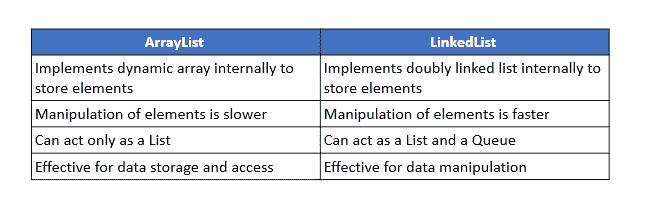

## 35.区分可比和比较。

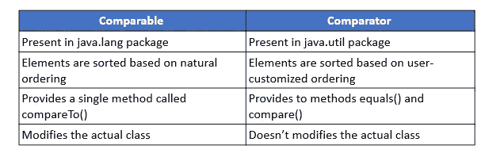

## 36.区分列表和集合。

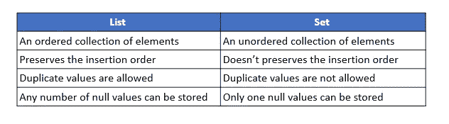

## 37.区分集合和映射。

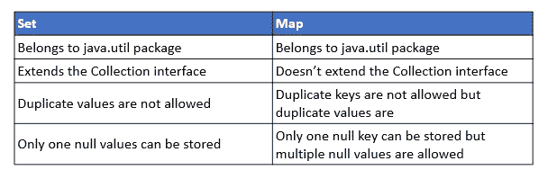

## 38.区分列表和地图。

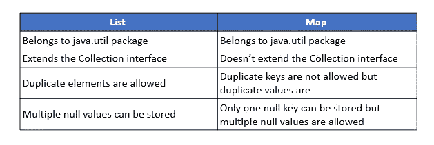

## 39.区分队列和堆栈。

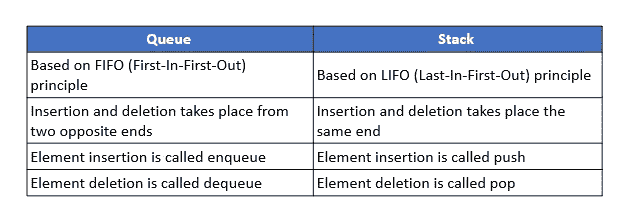

## 40.区分 PriorityQueue 和 TreeSet。

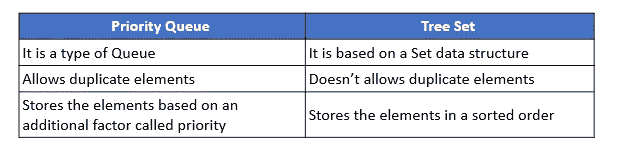

## 41.区分单向链表和双向链表。

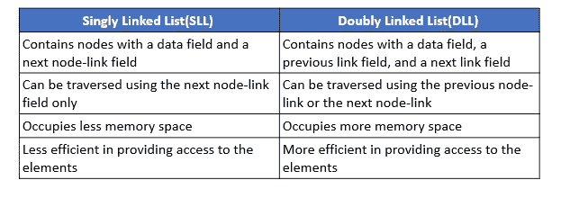

## 42.区分迭代器和枚举。

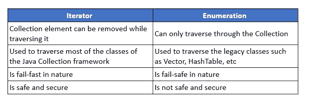

## 43.区分 HashMap 和 HashTable。

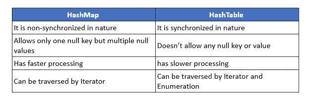

## 44.区分 HashSet 和 HashMap。

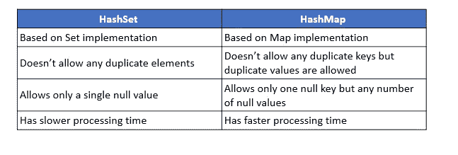

## 45.区分迭代器和列表迭代器。

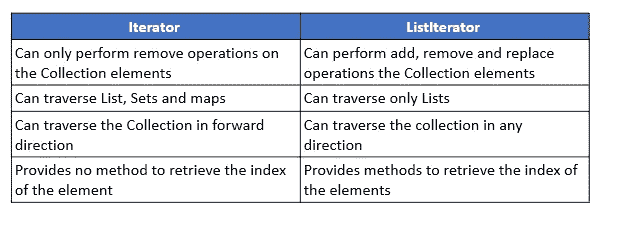

## 46.区分 HashSet 和 TreeSet。

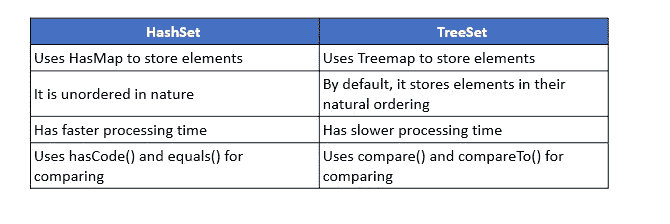

## 47.区分队列和出队。

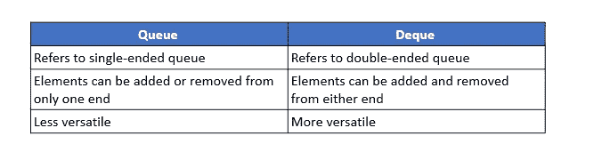

## 48.区分 HashMap 和 TreeMap。

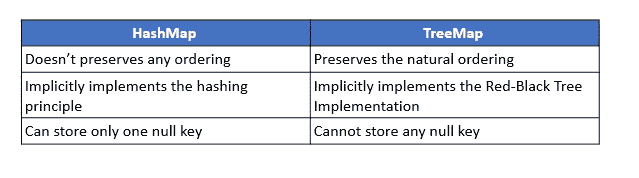

## 49.区分数组列表和向量。

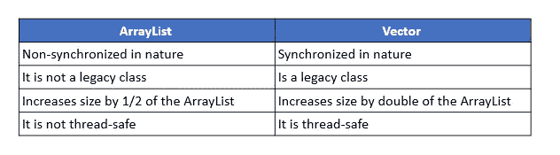

## 50.区分故障快速和故障安全。

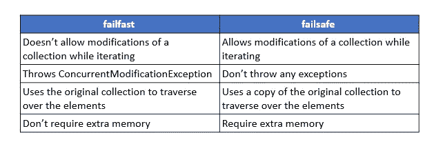

这就是 Java 集合面试问题的结尾。您在 Java 集合面试问题中学习的主题是招聘人员在 Java 专业人员中寻找的最受欢迎的技能。这几套 Java 集合面试问题，一定能帮你在求职面试中 ace。**祝你面试好运！**

如果你想查看更多关于人工智能、DevOps、道德黑客等市场最热门技术的文章，那么你可以参考 [Edureka 的官方网站。](https://www.edureka.co/blog/?utm_source=medium&utm_medium=content-link&utm_campaign=java-collections-interview-questions)

请留意本系列中的其他文章，它们将解释 Java 的各个方面。

> *1。* [*面向对象编程*](/edureka/object-oriented-programming-b29cfd50eca0)
> 
> *2。* [*Java 教程*](/edureka/java-tutorial-bbdd28a2acd7)
> 
> *3。*[*Java 中的多态性*](/edureka/polymorphism-in-java-9559e3641b9b)
> 
> *4。*[*Java 中的抽象*](/edureka/java-abstraction-d2d790c09037)
> 
> *5。* [*Java 字符串*](/edureka/java-string-68e5d0ca331f)
> 
> *6。* [*Java 数组*](/edureka/java-array-tutorial-50299ef85e5)
> 
> *7。* [*Java 收藏*](/edureka/java-collections-6d50b013aef8)
> 
> 8。 [*Java 线程*](/edureka/java-thread-bfb08e4eb691)
> 
> *9。*[*Java servlet 简介*](/edureka/java-servlets-62f583d69c7e)
> 
> *10。* [*Servlet 和 JSP 教程*](/edureka/servlet-and-jsp-tutorial-ef2e2ab9ee2a)
> 
> *11。*[*Java 中的异常处理*](/edureka/java-exception-handling-7bd07435508c)
> 
> *12。* [*高级 Java 教程*](/edureka/advanced-java-tutorial-f6ebac5175ec)
> 
> *13。* [*Java 面试题*](/edureka/java-interview-questions-1d59b9c53973)
> 
> *14。* [*Java 程序*](/edureka/java-programs-1e3220df2e76)
> 
> *15。*[*kot Lin vs Java*](/edureka/kotlin-vs-java-4f8653f38c04)
> 
> *16。* [*依赖注入使用 Spring Boot*](/edureka/what-is-dependency-injection-5006b53af782)
> 
> *17。* [*堪比 Java 中的*](/edureka/comparable-in-java-e9cfa7be7ff7)
> 
> *18。* [*十大 Java 框架*](/edureka/java-frameworks-5d52f3211f39)
> 
> *19。* [*Java 反射 API*](/edureka/java-reflection-api-d38f3f5513fc)
> 
> *20。*[*Java 中的 30 大模式*](/edureka/pattern-programs-in-java-f33186c711c8)
> 
> *21。* [*核心 Java 备忘单*](/edureka/java-cheat-sheet-3ad4d174012c)
> 
> *22。*[*Java 中的套接字编程*](/edureka/socket-programming-in-java-f09b82facd0)
> 
> *23。* [*Java OOP 备忘单*](/edureka/java-oop-cheat-sheet-9c6ebb5e1175)
> 
> *24。*[*Java 中的注解*](/edureka/annotations-in-java-9847d531d2bb)
> 
> 25。[*Java 中的库管理系统项目*](/edureka/library-management-system-project-in-java-b003acba7f17)
> 
> *26。*[*Java 中的树*](/edureka/java-binary-tree-caede8dfada5)
> 
> *27。*[*Java 中的机器学习*](/edureka/machine-learning-in-java-db872998f368)
> 
> 28。 [*顶级数据结构&Java 中的算法*](/edureka/data-structures-algorithms-in-java-d27e915db1c5)
> 
> *29。* [*Java 开发者技能*](/edureka/java-developer-skills-83983e3d3b92)
> 
> 三十。 [*前 55 名 Servlet 面试问题*](/edureka/servlet-interview-questions-266b8fbb4b2d)
> 
> *31。*[](/edureka/java-exception-handling-7bd07435508c)*[*顶级 Java 项目*](/edureka/java-projects-db51097281e3)*
> 
> *32。 [*Java 字符串备忘单*](/edureka/java-string-cheat-sheet-9a91a6b46540)*
> 
> **33。*[*Java 中的嵌套类*](/edureka/nested-classes-java-f1987805e7e3)*
> 
> *34. [Java 集合面试问答](/edureka/java-collections-interview-questions-162c5d7ef078)*
> 
> *35.[Java 中如何处理死锁？](/edureka/deadlock-in-java-5d1e4f0338d5)*
> 
> *36. [*Java 教程*](/edureka/java-tutorial-bbdd28a2acd7)*
> 
> *37.[Java 中的字符串池是什么概念？](/edureka/java-string-pool-5b5b3b327bdf)*
> 
> *38.[C、C++和 Java 有什么区别？](/edureka/difference-between-c-cpp-and-java-625c4e91fb95)*
> 
> *39.[Java 中的回文——如何检查一个数字或字符串？](/edureka/palindrome-in-java-5d116eb8755a)*
> 
> *40.[你需要知道的顶级 MVC 面试问答](/edureka/mvc-interview-questions-cd568f6d7c2e)*
> 
> *41.[Java 编程语言的十大应用](/edureka/applications-of-java-11e64f9588b0)*
> 
> *42.[Java 中的死锁](/edureka/deadlock-in-java-5d1e4f0338d5)*
> 
> *43.[Java 中的平方和平方根](/edureka/java-sqrt-method-59354a700571)*
> 
> *44.[Java 中的类型转换](/edureka/type-casting-in-java-ac4cd7e0bbe1)*
> 
> *45.[Java 中的运算符及其类型](/edureka/operators-in-java-fd05a7445c0a)*
> 
> *46.[Java 中的析构函数](/edureka/destructor-in-java-21cc46ed48fc)*
> 
> *47.[Java 中的二分搜索法](/edureka/binary-search-in-java-cf40e927a8d3)*
> 
> *48.[Java 中的 MVC 架构](/edureka/mvc-architecture-in-java-a85952ae2684)*
> 
> *49. [Hibernate 面试问答](/edureka/hibernate-interview-questions-78b45ec5cce8)*

**原载于*[*https://www.edureka.co*](https://www.edureka.co/blog/interview-questions/java-collections-interview-questions/)*。**