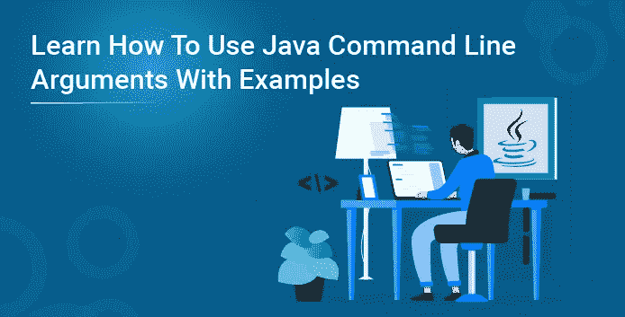
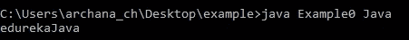
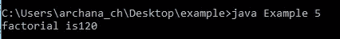
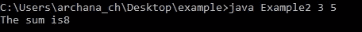
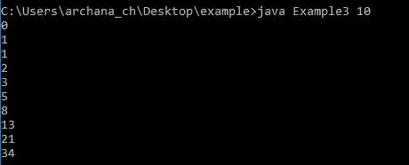

# 通过示例了解如何使用 Java 命令行参数

> 原文：<https://medium.com/edureka/java-command-line-arguments-with-examples-863fc8bc5955?source=collection_archive---------3----------------------->



Java 编程语言在各个方面都是通用的，它是独立于平台的，这使得 Java 成为任何开发人员的不二选择。任何 Java 程序的执行都是流畅而精确的。我们甚至可以在程序执行期间使用命令行参数传递参数。在本文中，您将学习如何在 Java 中使用命令行参数。以下是本文中讨论的主题:

*   什么是命令行参数？
*   Java 命令行参数示例
*   数字的阶乘
*   两个数的和
*   斐波纳契级数
*   需要记住的要点

# 什么是命令行参数？

命令行参数在运行时传递给程序。在 Java 程序中传递命令行参数非常容易。它们作为字符串存储在传递给 Java 中 main()方法的 args 参数的字符串数组中。

```
class Example0{
public static void main(String[] args){
System.out.println("edureka" + args[0]);
}
}
```

**输出:**



要在命令提示符下编译和运行 java 程序，请遵循下面的步骤。

*   将您的程序保存在扩展名为. java 的文件中
*   打开命令提示符并转到保存文件的目录。
*   运行命令—贾瓦克·filename.java
*   编译后运行命令— java filename
*   确保 Java 路径设置正确。

# Java 命令行参数示例

这里有几个例子来展示我们如何在 Java 程序中使用命令行参数。

这种美依赖于 Integer 类中的 parseInt 方法。每一个数字类，比如 Integer、Float、Double 等等，都有 parseXXX 方法将 String 转换成它们各自类型的对象。

众所周知，数组的索引从零开始。因此，args[0]是这个 String[]数组中的第一个索引，它取自控制台。同样，args[1]是第二个，args[2]是第三个元素，依此类推。

当应用程序启动时，运行时系统通过字符串数组将命令行参数传递给应用程序的 main 方法。

# 使用命令行参数计算数字的阶乘

```
class Example1{
public static void main(String[] args){
int a , b = 1;
int n = Integer.parseInt(args[0]);
for(a = 1; a<= n ; a++)
{ 
b = b*a;
}
System.out.println("factorial is" +b);
}
}
```

**输出:**



# 使用命令行参数对两个数求和

```
class Example2{
public static void main(String[] args){
int a = Integer.parseInt(args[0]);
int b = Integer.parseInt(args[1]);
int sum = a + b;
System.out.println("The sum is" +sum);
}
}
```

**输出:**



# 使用命令行参数的斐波那契数列程序

```
class Example3{
public static void main(String[] args){
int n = Integer.parseInt(args[0]);
int t1 = 0;
int t2 = 1;

for(int i = 1; i <=n; i++){
System.out.println(t1);
int sum = t1+t2;
t1 = t2;
t2 = sum;
}
}
}
```

**输出:**



# 需要记住的要点

*   启动应用程序时，可以使用命令行参数来指定配置信息。
*   当您使用命令行参数时，参数的数量没有限制。你可以根据你的需要使用许多。
*   命令行参数中的信息作为字符串传递。
*   命令行参数存储在程序的 main()方法的字符串 args 中。

这就把我们带到了本文的结尾，我们已经通过例子了解了 Java 命令行参数。我希望你清楚本教程中与你分享的所有内容。

这就把我们带到了本文的结尾，我们已经通过例子了解了 Java 命令行参数。我希望你清楚本教程中与你分享的所有内容。

如果你想查看更多关于人工智能、Python、道德黑客等市场最热门技术的文章，你可以参考 Edureka 的官方网站。

请留意本系列中解释 Java 其他各方面的其他文章。

> *1。* [*面向对象编程*](/edureka/object-oriented-programming-b29cfd50eca0)
> 
> *2。*[*Java 中的继承*](/edureka/inheritance-in-java-f638d3ed559e)
> 
> *3。*[*Java 中的多态性*](/edureka/polymorphism-in-java-9559e3641b9b)
> 
> *4。*[*Java 中的抽象*](/edureka/java-abstraction-d2d790c09037)
> 
> *5。* [*Java 字符串*](/edureka/java-string-68e5d0ca331f)
> 
> *6。* [*Java 数组*](/edureka/java-array-tutorial-50299ef85e5)
> 
> *7。* [*Java 收藏*](/edureka/java-collections-6d50b013aef8)
> 
> *8。* [*Java 线程*](/edureka/java-thread-bfb08e4eb691)
> 
> *9。*[*Java servlet 简介*](/edureka/java-servlets-62f583d69c7e)
> 
> *10。* [*Servlet 和 JSP 教程*](/edureka/servlet-and-jsp-tutorial-ef2e2ab9ee2a)
> 
> *11。*[*Java 中的异常处理*](/edureka/java-exception-handling-7bd07435508c)
> 
> *12。* [*Java 教程*](/edureka/java-tutorial-bbdd28a2acd7)
> 
> *13。* [*Java 面试题*](/edureka/java-interview-questions-1d59b9c53973)
> 
> *14。* [*Java 程序*](/edureka/java-programs-1e3220df2e76)
> 
> *15。* [*科特林 vs Java*](/edureka/kotlin-vs-java-4f8653f38c04)
> 
> 16。 [*依赖注入使用*](/edureka/what-is-dependency-injection-5006b53af782)
> 
> 17。 [*堪比 Java 中的*](/edureka/comparable-in-java-e9cfa7be7ff7)
> 
> 18。 [*十大 Java 框架*](/edureka/java-frameworks-5d52f3211f39)
> 
> *19。* [*Java 反射 API*](/edureka/java-reflection-api-d38f3f5513fc)
> 
> 20。[*Java 中的 30 大模式*](/edureka/pattern-programs-in-java-f33186c711c8)
> 
> *21。* [*核心 Java 备忘单*](/edureka/java-cheat-sheet-3ad4d174012c)
> 
> *二十二。*[*Java 中的套接字编程*](/edureka/socket-programming-in-java-f09b82facd0)
> 
> *23。* [*Java OOP 备忘单*](/edureka/java-oop-cheat-sheet-9c6ebb5e1175)
> 
> *24。*[*Java 中的注释*](/edureka/annotations-in-java-9847d531d2bb)
> 
> *25。*[*Java 中的库管理系统项目*](/edureka/library-management-system-project-in-java-b003acba7f17)
> 
> *26。*[*Java 中的树*](/edureka/java-binary-tree-caede8dfada5)
> 
> *27。*[*Java 中的机器学习*](/edureka/machine-learning-in-java-db872998f368)
> 
> *28。*[*Java 中的顶级数据结构&算法*](/edureka/data-structures-algorithms-in-java-d27e915db1c5)
> 
> *29。* [*Java 开发者技能*](/edureka/java-developer-skills-83983e3d3b92)
> 
> 三十。 [*前 55 名 Servlet 面试问题*](/edureka/servlet-interview-questions-266b8fbb4b2d)
> 
> *31。*[](/edureka/java-exception-handling-7bd07435508c)*[*顶级 Java 项目*](/edureka/java-projects-db51097281e3)*
> 
> **32。* [*Java 字符串备忘单*](/edureka/java-string-cheat-sheet-9a91a6b46540)*
> 
> **33。*[*Java 中的嵌套类*](/edureka/nested-classes-java-f1987805e7e3)*
> 
> *34。 [*Java 合集面试问答*](/edureka/java-collections-interview-questions-162c5d7ef078)*
> 
> *35。[*Java 中如何处理死锁？*](/edureka/deadlock-in-java-5d1e4f0338d5)*
> 
> *36。 [*你需要知道的 50 大 Java 集合面试问题*](/edureka/java-collections-interview-questions-6d20f552773e)*
> 
> **37。*[*Java 中的字符串池是什么概念？*](/edureka/java-string-pool-5b5b3b327bdf)*
> 
> *38。[*C、C++和 Java 有什么区别？*](/edureka/difference-between-c-cpp-and-java-625c4e91fb95)*
> 
> *39。[*Java 中的回文——如何检查一个数字或字符串？*](/edureka/palindrome-in-java-5d116eb8755a)*
> 
> *40。 [*你需要知道的顶级 MVC 面试问答*](/edureka/mvc-interview-questions-cd568f6d7c2e)*
> 
> **41。*[*Java 编程语言的十大应用*](/edureka/applications-of-java-11e64f9588b0)*
> 
> **42。*[*Java 中的死锁*](/edureka/deadlock-in-java-5d1e4f0338d5)*
> 
> **43。*[*Java 中的平方和平方根*](/edureka/java-sqrt-method-59354a700571)*
> 
> **44。*[*Java 中的类型转换*](/edureka/type-casting-in-java-ac4cd7e0bbe1)*
> 
> **45。*[*Java 中的运算符及其类型*](/edureka/operators-in-java-fd05a7445c0a)*
> 
> **46。*[*Java 中的析构函数*](/edureka/destructor-in-java-21cc46ed48fc)*
> 
> **47。*[*Java 中的二分搜索法*](/edureka/binary-search-in-java-cf40e927a8d3)*
> 
> **48。*[*Java 中的 MVC 架构*](/edureka/mvc-architecture-in-java-a85952ae2684)*
> 
> **49。* [*冬眠面试问答*](/edureka/hibernate-interview-questions-78b45ec5cce8)*

**原载于 2019 年 9 月 19 日*[*https://www.edureka.co*](https://www.edureka.co/blog/java-command-line-argument/)*。**