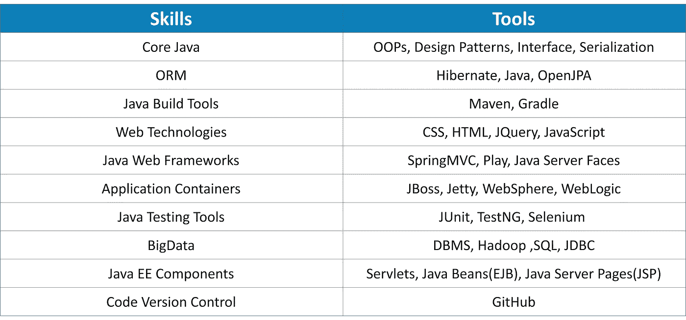
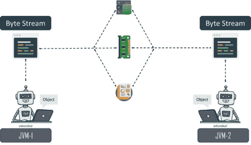

# Java 开发人员技能:Java 开发人员的重要技能

> 原文：<https://medium.com/edureka/java-developer-skills-83983e3d3b92?source=collection_archive---------6----------------------->

Java Developer Skills — Edureka

Java 是 IT 界最流行、最常青的编程语言。这就是为什么 Java 开发人员在稳步提升他们的技能。这篇文章专门针对 2019 年所需的关键 Java 开发人员技能。

*   谁是 Java 开发人员？
*   如何成为一名 Java 开发者
*   Java 开发人员技能概述
*   Java 开发人员的技能
*   Java 开发人员的工资明细

# 谁是 Java 开发人员？

Java 开发人员是计算机软件开发人员/程序员，他们将 Java 编程语言集成到计算机应用程序的开发、Web 开发以及客户端和服务器端所需的其他需求中。

# 如何成为一名 Java 开发人员？

成为 Java 开发人员有三个基本阶段。

## 获得大学学位

第一阶段要求你完成**计算机科学**的资格认证，重点是**软件开发。这可能是信息技术学位或计算机科学工程学士学位。**

第二阶段要求你完成一门专门针对核心和高级 Java 的在线或离线课程。尝试在线示例是发展您的 Java 专业技能的好方法。

## **获得经验**

第三阶段需要你在学习的同时在实习项目中寻找一个位置。这将为你提供相关的经验，以及来自经验丰富的软件开发人员的指导和辅导。

# Java 开发人员技能概述

让我们在下一节中详细了解一个 Java 开发人员所需的技能。

# Java 开发人员的技能

Java 开发人员所需的技能可以分为以下几类:

1.  Java 开发人员技能(**技术**)
2.  Java 开发者技能**(软技能**)

# Java 开发人员技能(技术)

## **核心 Java**

让我们了解成为一名 Java 开发人员所需的最基本和最重要的技能。核心 Java 技能是每个成功的 Java 开发人员的基石。大多数招聘人员寻找的关键 Java 核心技能是，

*   **面向对象编程技巧**

面向对象的编程方法引入了处理继承、封装、抽象和多态概念的类和对象风格的编码。 **OOP** 的座右铭是将数据和函数绑定在一起，以提高代码的稳定性和安全性。

*   **Java 设计模式**

Java 中的设计模式是用来解决软件设计生命周期中面临的常规问题的标准解决方案。每一个**设计模式**都充当着**蓝图**的角色，允许在软件模块的开发过程中，通过定制来解决任何代码中任何给定的设计问题。

*   **Java 中的抽象类**

Java 中的抽象类帮助开发者实现抽象。面向对象编程中的抽象通过只显示程序中使用的对象的相关细节来降低代码的复杂性，并增强代码的可读性。我们需要 java 中的抽象类，原因如下。

*   Java 中的**接口**

**Java** **接口**是 Java 编程语言中实现抽象的高级层次。Java 中的接口提供了一种更好、更有效的方式来实现 Java 中的抽象

*   **Java 中的序列化**

**java 中的序列化**是一个概念，处理对象到字节流的转换，以将 Java 对象从一个 Java 虚拟机传输到另一个，并将其重新创建为原始形式。序列化使开发人员能够满足实时编程中的各种因素。

## **Java 构建工具**

根据分配的任务，开发人员需要为特定的任务使用特定的工具。对于 Java 开发人员来说，理解 Java 中构建工具的术语是很方便的，从源代码自动创建可执行应用程序的程序也是如此。必须知道的构建工具有 **Java 构建**工具 **Maven** 和 **Gradle**

## **网络技术**

**Web** **技术**提供了一种简化、快速的方式来创建动态 **web** 内容。更好地掌握 Web 技术很重要，因为它有助于理解通过标记语言在多个计算机系统之间建立通信的技术。它提供了一种与主机进行信息交互的方式，比如网站。涉及到 **HTML、JQuery、**和 **CSS 的使用。**

## **Java Web 框架**

为了用最好的特性和有限的代码构建一个移动应用程序，Java web 框架是同类解决方案中最好的。它们支持以标准方式开发 web 应用程序，包括 web 服务、web 资源和 web APIs，以便在万维网上构建和部署 web 应用程序。一些最好的框架是 **Spring MVC** 和 **Play。**

## **Java 应用程序容器**

Java 应用程序容器是一个应用程序，软件的构造块(称为)在其中运行。应用程序容器旨在提供多种功能，例如提供用户身份验证、日志记录或建立与数据库的连接。顶级的 Java 应用容器是 **componentJBoss** 和 **Jetty。**

## **Java 测试工具**

分析。测试工具是 **Java 测试工具**允许你用一个界面测试你的 JSP 页面和 web 应用程序，在这个界面上你不需要在 Web 浏览器上启动你的应用程序。它们支持多种**测试**活动，从计划、需求、创建构建、**测试**执行、缺陷记录，以及**测试硒**和**测试。**

## **大数据**

已经成为一个万亿美元的产业，并且通过传统的数据处理软件处理如此大量的数据已经变得几乎不可能。学习大数据技术有助于开发人员从复杂的数据集中分析和提取信息。一些强大的大数据技术是**大数据 Hadoop** 和 **Spark**

## **Java EE 组件**

Java EE 组件使开发人员能够编写服务器端应用程序。企业开发人员面临的最常见挑战之一是如何处理来自基于 web 的客户端的请求。为了缓解这一挑战，Java EE 提供了 Servlet 和 JavaServer Pages APIs，它们支持在用户浏览器上使用 cookies 记录活动的方法，简化了这类问题，并提供了最佳解决方案。一些主要的 Java EE 组件是**servlet、Java bean**和 **Java 服务器页面。**

## **代码版本控制**

**GitHub 版本控制**允许开发人员跟踪他们的工作，并帮助他们轻松地探索他们在数据、编码脚本、注释等方面所做的更改，从而使实现更加顺畅和容易

# **Java 开发者技能(软技能)**

软技能是人际交往技能、沟通技能、性格和社交智能等，它使人们能够驾驭环境，与他人合作愉快，表现出色并取得成就。Java 开发人员的软技能是:

## **良好的沟通技巧**

良好的沟通技巧包括**积极倾听**，在这种情况下，你要密切注意和你说话的人，并努力使你的**沟通风格**适应你的听众，以更好的方式传达你的信息。

## **开放学习**

知识永无止境。成功的 Java 开发人员应该总是乐于学习新的技术升级，并保持自我更新

## **团队工作**

**团队合作**是一个团队为了实现共同的目标，以最**高效**和**有效**的方式完成一项任务的协作努力。

## **工作道德**

职业道德是一种信念，认为努力工作和奉献精神具有道德上的益处和内在的能力、美德或价值，可以增强性格和个人能力

## **人际交往能力**

人际交往技能是一个人用来与他人进行适当互动(T21)的品质和行为。人际交往能力越好，一个人职业生涯中的**成长**就越好。

# Java 开发人员的工资明细

Java 编程语言是当前 IT 行业最需要的语言之一。现在让我们讨论一下提供给 Java 开发人员的薪水。

到此，我们来结束这篇文章。我希望你已经理解了重要的 Java 开发人员技能。

到此，我们结束了这个博客。如果你想查看更多关于人工智能、DevOps、道德黑客等市场最热门技术的文章，你可以参考 Edureka 的官方网站。

请留意本系列中的其他文章，它们将解释 Java 的各个方面。

> 1.[面向对象编程](/edureka/object-oriented-programming-b29cfd50eca0)
> 
> 2.[Java 中的继承](/edureka/inheritance-in-java-f638d3ed559e)
> 
> 3.[Java 中的多态性](/edureka/polymorphism-in-java-9559e3641b9b)
> 
> 4.[Java 中的抽象](/edureka/java-abstraction-d2d790c09037)
> 
> 5. [Java 字符串](/edureka/java-string-68e5d0ca331f)
> 
> 6. [Java 数组](/edureka/java-array-tutorial-50299ef85e5)
> 
> 7. [Java 集合](/edureka/java-collections-6d50b013aef8)
> 
> 8. [Java 线程](/edureka/java-thread-bfb08e4eb691)
> 
> 9.[Java servlet 简介](/edureka/java-servlets-62f583d69c7e)
> 
> 10. [Servlet 和 JSP 教程](/edureka/servlet-and-jsp-tutorial-ef2e2ab9ee2a)
> 
> 11.[Java 中的异常处理](/edureka/java-exception-handling-7bd07435508c)
> 
> 12.[高级 Java 教程](/edureka/advanced-java-tutorial-f6ebac5175ec)
> 
> 13. [Java 面试问题](/edureka/java-interview-questions-1d59b9c53973)
> 
> 14. [Java 程序](/edureka/java-programs-1e3220df2e76)
> 
> 15. [Kotlin vs Java](/edureka/kotlin-vs-java-4f8653f38c04)
> 
> 16.[依赖注入使用 Spring Boot](/edureka/what-is-dependency-injection-5006b53af782)
> 
> 17.[Java 中的可比性](/edureka/comparable-in-java-e9cfa7be7ff7)
> 
> 18.[十大 Java 框架](/edureka/java-frameworks-5d52f3211f39)
> 
> 19. [Java 反射 API](/edureka/java-reflection-api-d38f3f5513fc)
> 
> 20.[Java 中的 30 大模式](/edureka/pattern-programs-in-java-f33186c711c8)
> 
> 21.[核心 Java 备忘单](/edureka/java-cheat-sheet-3ad4d174012c)
> 
> 22.[Java 中的套接字编程](/edureka/socket-programming-in-java-f09b82facd0)
> 
> 23. [Java OOP 备忘单](/edureka/java-oop-cheat-sheet-9c6ebb5e1175)
> 
> 24.[Java 中的注释](/edureka/annotations-in-java-9847d531d2bb)
> 
> 25.[Java 中的图书管理系统项目](/edureka/library-management-system-project-in-java-b003acba7f17)
> 
> 26.[Java 中的树](/edureka/java-binary-tree-caede8dfada5)
> 
> 27.[Java 中的机器学习](/edureka/machine-learning-in-java-db872998f368)
> 
> 28.[Java 中的顶级数据结构&算法](/edureka/data-structures-algorithms-in-java-d27e915db1c5)
> 
> 29. [Java 教程](/edureka/java-tutorial-bbdd28a2acd7)
> 
> 30.[前 55 个 Servlet 面试问题](/edureka/servlet-interview-questions-266b8fbb4b2d)
> 
> 31.  [顶级 Java 项目](/edureka/java-projects-db51097281e3)
> 
> 32. [Java 字符串备忘单](/edureka/java-string-cheat-sheet-9a91a6b46540)
> 
> 33.[Java 中的嵌套类](/edureka/nested-classes-java-f1987805e7e3)
> 
> 34. [Java 集合面试问答](/edureka/java-collections-interview-questions-162c5d7ef078)
> 
> 35.[Java 中如何处理死锁？](/edureka/deadlock-in-java-5d1e4f0338d5)
> 
> 36.[你需要知道的 50 大 Java 集合面试问题](/edureka/java-collections-interview-questions-6d20f552773e)
> 
> 37.[Java 中的字符串池是什么概念？](/edureka/java-string-pool-5b5b3b327bdf)
> 
> 38.[C、C++和 Java 有什么区别？](/edureka/difference-between-c-cpp-and-java-625c4e91fb95)
> 
> 39.[Java 中的回文——如何检查一个数字或字符串？](/edureka/palindrome-in-java-5d116eb8755a)
> 
> 40.[你需要知道的顶级 MVC 面试问答](/edureka/mvc-interview-questions-cd568f6d7c2e)
> 
> 41.[Java 编程语言的十大应用](/edureka/applications-of-java-11e64f9588b0)
> 
> 42.[Java 中的死锁](/edureka/deadlock-in-java-5d1e4f0338d5)
> 
> 43.[Java 中的平方和平方根](/edureka/java-sqrt-method-59354a700571)
> 
> 44.[Java 中的类型转换](/edureka/type-casting-in-java-ac4cd7e0bbe1)
> 
> 45.[Java 中的运算符及其类型](/edureka/operators-in-java-fd05a7445c0a)
> 
> 46.[Java 中的析构函数](/edureka/destructor-in-java-21cc46ed48fc)
> 
> 47.[爪哇的二分搜索法](/edureka/binary-search-in-java-cf40e927a8d3)
> 
> 48.[Java 中的 MVC 架构](/edureka/mvc-architecture-in-java-a85952ae2684)
> 
> 49.[冬眠面试问答](/edureka/hibernate-interview-questions-78b45ec5cce8)

*原载于 2019 年 9 月 12 日*[*https://www.edureka.co*](https://www.edureka.co/blog/java-developer-skill)*。*