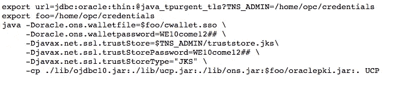

# 专用自主事务处理的 Java 开发(ATP-D)

> 原文：<https://medium.com/oracledevs/java-development-with-autonomous-transaction-processing-dedicated-atp-d-f0355a2f9abd?source=collection_archive---------0----------------------->

Oracle Autonomous Transaction Processing Dedicated([ATP-D](https://blogs.oracle.com/oracle-database/autonomous-database-dedicated-exadata-cloud-infrastructure))是一种数据库云服务，支持在 Oracle 公共云中的专用数据库云服务器基础设施上实施私有数据库云服务。这篇博客文章的目标是帮助 Java 开发人员或架构师使用 ATP-D 构建和部署快速、可伸缩和可靠的 Java 应用程序，使用普通 Java、Java Servlets 或 Java 微服务，以及 WebLogic、Helidon、WebSphere、Liberty、Tomcat、wildly(JBoss)、Spring 等等。

我将向您介绍:(I)到 ATP-D 的先决条件和 Java 连接性；(ii)使用 ATP-D 的 Java 应用程序零停机时间；(iii)最后，使用 ATP-D 的 Java 应用程序的性能和可伸缩性。

虽然这个博客使用 Linux 命令行和脚本，但是即将到来的对[Oracle Cloud infra structure toolkit for Eclipse](https://github.com/oracle/oci-toolkit-eclipse/releases)的扩展将使体验对 Java 开发人员更加友好。

# 先决条件和与 ATP-D 的 Java 连接

在 Java 中使用 ATP-D 需要以下步骤:

*   在 [Oracle 云基础设施](https://cloud.oracle.com/sign-in)上提供 ATP-D 云服务实例，并填充您的数据库；看视频[这里](https://cloud.oracle.com/en_US/atp/videos)。
*   从云服务控制台获取客户端凭据；您将被要求提供保护钱包和信任商店的密码；在此处查看详情[(特别是先决条件下的步骤#2)。](https://www.oracle.com/technetwork/database/application-development/jdbc/documentation/atp-5073445.html)
*   客户端凭证包的一部分, *ojdbc.properties* 属性文件已经预先配置好，可以使用 Oracle Wallet 简化与 ATP-D 的连接。

```
oracle.net.wallet_location=(SOURCE=(METHOD=FILE)(METHOD_DATA=(DIRECTORY=${TNS_ADMIN})))
```

对于使用 JKS 的连接，您需要如下编辑 *ojdbc.properties* 文件

```
javax.net.ssl.trustStore=${TNS_ADMIN}/truststore.jks
javax.net.ssl.trustStorePassword=....
```

*   ATP-D 提供了五种支持 TCP 和 TCP 协议的预配置服务(推荐使用 TCP)。


Pre-configured ATP-D Services (must used the _tls equivalent)

*   从上面的列表中选择您的数据库服务名。这些类似于 JNDI 名字，并且隐藏/虚拟化数据库服务的细节；这些细节在 *tnsnames.ora* 文件中(如下所示)，是客户端凭证的一部分。


*   虚拟化允许服务透明地从一个实例移动到另一个实例。您的 ATP-D 服务的名称由您选择的服务名组成(例如， *tpurgent* ),以您的数据库名为前缀，在我的例子中是“java”，后缀是“tls”。比如: *java_tpurgent_tls* 支持 TCP，而 *java_tpurgent* 虽然是有效的 ATP-D 实例名，但是只支持 TCP，不推荐使用。
*   您的责任是编辑该文件并更改一些默认值(例如， *RETRY_COUNT、RETRY_DELAY、CONNECT_TIMEOUT* )以满足您的特定需求。
*   直接在 JDBC 连接字符串中设置 ATP-D 服务名，或者将其导出并从环境变量中检索(我的偏好)。

```
export url=jdbc:oracle:thin:@**java_tpurgent_tls**
```

*   出于安全原因，您不能从本地运行的 Java 应用程序(例如，从您的笔记本电脑)直接连接到 ATP-D；您需要在同一个虚拟云网络(也称为 VCN)中配置一个计算实例，并从该计算实例中通过 Java 代码、客户端凭据和网络配置文件执行 CI/CD 工作。你需要一对(私人的，公共的)密钥来访问计算机；详见[文档](https://docs.cloud.oracle.com/iaas/Content/Functions/Tasks/functionssetupapikey.htm)。

```
ssh -i ~/ocikey opc@xxx.yyy.zzz.ttt
```

*   获取最新的 JDK8 (JDK8u163+)、JDK9、JDK10 或 JDK11
*   从 [Maven Central](/@kuassimensah/oracle-jdbc-drivers-on-maven-central-64fcf724d8b?source=your_stories_page---------------------------) 或者 [Oracle Maven repository](https://blogs.oracle.com/dev2dev/get-oracle-jdbc-drivers-and-ucp-from-oracle-maven-repository-without-ides) 或者 [JDBC 下载页面](https://www.oracle.com/technetwork/database/application-development/jdbc/downloads/jdbc-ucp-183-5013470.html) : *ojdbc8.jar 或者 ojdbc10.jar* (取决于你的 JDK)， *ucp.jar，oraclepki.jar，osdt_core.jar，osdt_cert.jar，ons.jar，simplefan.jar**xdb . jar+xmlparserv 2 . jar*如果打算使用 XML 数据类型；以及 *orai18n.jar* 如果需要处理民族语言。
*   将 TNS_ADMIN 环境变量设置到您提取客户机凭证的位置，可以在 JDBC URL(DB 18c 的新特性)中，或者作为环境变量，或者使用*Oracle . net . TNS _ ADMIN*Java 系统属性；设置 TNS_ADMIN 这是驱动程序定位网络配置文件 *tnsnames.ora、*以及新的 *ojdbc.properties* 文件等所必需的。

```
export TNS_ADMIN=/home/opc/credentials
```

下面是从 Java 代码中获取连接的代码片段；此片段使用的是通用连接池(UCP)数据源，而不是 JDBC 数据源。

JDBC 数据源的等价物应该是(在*类路径*中不需要 *ucp.jar*


收集

```
javac -classpath ./lib/ojdbc10.jar:./lib/ucp.jar:./lib/ons.jar UCP.java
```

使用 Oracle Wallet
运行——Oracle . ons . Wallet file 和*Oracle . ons . Wallet password*的设置作为 JDK 系统属性对所有数据源/连接都是全局的；可以替换为新的每个连接的属性*Oracle . JDBC . ons . wallet file*和*Oracle . JDBC . ons . wallet password*
——在*类路径*中使用 *oraclepki.jar、osdt_core.jar 和 osdt_cert.jar、*，以便使用 oraclepki 提供程序，而不是不支持所有 PKCS12 功能的 SunJSSE 提供程序。


使用 JKS 运行
注意 *trustStore.jks* 文件的位置以及*trust store password*，这是您在下载客户端凭证时输入的密码(如上)。本例中的 *oraclepki.jar* 由 Oracle 通知系统(ONS)使用(见后面)。



# 使用 ATP-D 实现 Java 应用的零停机

面对计划内和/或计划外的数据库实例停机，如何实现 Java 应用程序的连续可用性？有了 ATP-D，基础设施可以透明地处理大部分机制，以确保零停机时间。然而，作为 Java 开发人员/架构师，您只需负责很少的步骤。这是强调 ATP-D 服务、iow 数据库和 ATP-D 实例(运行服务的 RDBMS 基础设施)之间差异的最佳位置。
以下代码片段将打印运行 ATP-D 服务的实例名称。


**Where is my service running?**

## ATP-D 中的高可用性机制

以下机制显然有助于零停机:快速应用程序通知事件、应用程序连续性和透明的应用程序连续性。

*快速应用通知(FAN)事件*
传统上，在数据库操作或尝试连接它的过程中，Java 应用会在超时到期时收到一个异常；不幸的是，超时不是立即的和不可预测的。另一方面，快速应用程序通知(FAN)提供即时通知。风扇事件由以下数据库事件触发:


Fast Application Notification (FAN) Events

使用 ATP-D，Oracle 通知系统(ONS)会自动启用并传送/交付 FAN 事件。作为 Java 开发人员/架构师，您的职责是:(I)在 Java 连接池(UCP)的*类路径*中为 FAN 订阅设置*ons . jar*；或者(ii)相反，如果不使用 UCP，则由 JDBC 驱动程序为 fan 订阅在*类路径*中设置 *simplefan.jar* 。
在 ATP-D 环境中，通知系统(ONS)本身使用 Oracle Wallet 进行通信；您的职责是:
(i)在您的 Java 代码中以系统属性(*-do racle . ons . wallet file =…-do racle . ons . wallet password =…*)或以 JDBC 连接/数据源属性(*Oracle . JDBC . ons . wallet file*，*Oracle . JDBC . ons . wallet password*)的形式指定钱包文件和钱包密码的位置；
(ii)将 *oraclepki.jar* 添加到 *classpath* 中，无论您是使用 JKS 还是 Oracle Wallet 进行 Java 连接(这是 ons 所必需的)。

*应用连续性(AC)*

应用程序连续性(AC)是 RDBMS 版本 12.1 中引入的一项成熟技术，它跨越了 RDBMS 及其客户端(驱动程序、连接池)。启用时，AC 包括在驱动程序内存中记录应用程序工作单元(通常是事务)期间进行的所有数据库调用，并在隐藏异常后，在一个实例、主机或网络出现故障时，针对同一数据库的另一个实例重放这些调用。在重放时，如果结果是相同的(即，结果集校验和)，则 AC 是成功的，并且控制被交还给应用程序以继续，就像什么也没有发生一样；否则，异常将被重新转换，并在 Java 代码中可见。
ATP-D 基础设施可确保数据库服务的持续可用性，但是，如上所述，Java 开发人员只需采取几个步骤，就能在计划内或计划外停机期间透明、持续地访问服务。
AC 建立在事务保护之上，它保证在 *COMMIT* 或 *ROLLBACK* 语句失败时——如果正在进行的事务的状态检查返回“不确定”, *COMMIT 或 ROLLBACK* 将永远不会完成，因此重放记录的调用是安全的。

对于 ATP-D，所有预配置服务默认启用 AC。作为 Java 开发人员，您的职责是通过如下设置连接工厂来使用 Oracle JDBC 驱动程序的重放数据源

```
pds.setConnectionFactoryClassName(“oracle.jdbc.replay.OracleDataSourceImpl”);
```

启用交流时，还需要考虑其他因素:

*   不使用 Oracle UCP 或 Weblogic 活动网格链接时，使用 *conn.beginRequest()* 和 *conn.endRequest()* 调用显式划分工作单元(也称为数据库请求)
*   Java 应用程序可能具有非事务性数据库状态，例如 NLS 设置、优化器首选项、事件设置、PL/SQL 全局变量、临时表、高级队列、lob 和结果缓存。简单的状态被恢复，但是许多其他的和复杂的状态，比如临时表或 sys_context，将不会被 AC 恢复；作为 Java 开发人员，您有责任了解您的应用程序并实现“ [UCP 连接标记回调](https://docs.oracle.com/en/database/oracle/oracle-database/19/jjucp/application-continuity-using-ucp.html#GUID-83526888-0AA4-4112-B962-4057D64F192B)”，以便在重放期间恢复 AC 未覆盖的状态。
*   如果您通常在检查池中的连接时设置初始自定义状态，AC 基础结构将不会在重放期间重置这些状态；为此，实现 [JDBC 连接初始化回调](https://docs.oracle.com/en/database/oracle/oracle-database/19/jjdbc/application-continuity.html#GUID-715A5BE7-93F3-43CE-89E6-EA350AF6363D)是您的责任。
*   数据库可变函数，如 *SYSDATE，SYSTIMESTAMP，SYS_GUID* 和 *sequence。NEXTVAL* 返回与其原始调用不同的值，这使得重放无效。通过向数据库用户授予 *KEEP* 特权，可以防止这些可变函数在重放期间返回不同的值。
*   从数据库内部调用外部系统的应用程序，如 FTP callout(文件传输)、发送电子邮件等，会在重放过程中产生副作用。您可以通过在*Oracle . JDBC . replay . replayable connection*接口上使用 *disableReplay* 调用来显式禁用重放，如下所示:


*   AC 基础设施支持作为具体类实现的传统 Oracle JDBC 类型，但是不支持少数类型，如 *oracle.sql.OPAQUE 和 oracle.sql.ANYDATA* (即，重放将不起作用)。

*透明应用连续性(TAC)*

Oracle 数据库版本 18c 及相应的驱动程序和池中引入的透明应用程序连续性(TAC)是对应用程序连续性(AC)的增强。有了 TAC，留给开发人员的大部分 AC 设置都得到透明的处理。
(i) TAC 具有能够恢复大多数会话状态的状态跟踪机制(*_ *，CLIENT_INFO，MODULE，ACTION，CLIENT_ID，ECONTEXT_** )，对于复杂的会话状态，如临时表或 sys_context，您需要恢复到 AC 并实现“JDBC 连接初始化回调”或“UCP 连接标记回调”。
(ii)您不需要实现回调来恢复初始会话状态；可变的数据库函数被“保留”(即，在重放期间返回相同的值)。
(iii)不使用 Oracle pools (UCP、Weblogic Active GridLink)时，不需要明确划分工作单元(也称为数据库请求)，这些都是隐式标识的。
(iv)不需要显式禁用副作用。(v)你不需要使用连接池，只需要普通的 JDBC；但是，您仍然需要使用重放数据源。

TAC 默认启用 *TPURGENT* 和 *TP* 服务(例如 java_tpurgent_tls)。

现在让我们看看这些机制如何在计划内或计划外停机期间为您的 Java 应用程序提供零停机时间。

## 维持计划内数据库停机

目标是对 Java 应用程序隐藏运行 ATP-D 服务的实例的计划停机时间。
在触发预定的计划维护操作(由车队管理员发起，有时应用户请求)时，连接池和驱动程序会发出并接收风扇“计划停机”事件。
最简单也是最推荐的方法是将 UCP 与普通 Java，或者 Weblogic 或者第三方 Java 容器一起使用；它停止分发到该 ATP-D 实例的连接，然后将后续请求重新路由到另一个主机或数据库容器，其中相同/相同的数据库服务已经被基础架构重新打开，这对您的 Java 应用程序是透明的。
默认的 drain_timeout 大约为 5 分钟，使用 *TP 和 TPURGENT* 服务(使用*高、中和低*服务最多 1 小时)允许在维护的目标实例上完成运行中的数据库操作。不能完成的长时间运行的操作或飞行中的工作单元，将在超时后被终止，并由 AC/TAC 重放。
如果您没有使用 UCP，而只是使用普通 JDBC，ATP-D 会标记连接/会话以进行排水；当调用下面描述的“*安全排出 API*之一时，JDBC 驱动程序关闭使用中的连接，以便允许这些连接被安全移除。

Safe Draining APIs

Java 容器和框架包括 Tomcat、Weblogic、WebSphere、Liberty、Wildfly/JBoss、SpringBoot、Helidon 可能有特定的连接验证选项，例如: *PreTest Connection、TestConnectionOnReserve、TestOnBorrow* 、check-valid-connection-sql —要在它们的数据源配置中指定。

理由如下:调用这些 API 中的一个——这是 Java 开发人员的职责——向驱动程序表明 Java 应用程序已经准备好在调用结果为*假*的情况下做一些事情(即，完成工作单元、关闭连接对象等)；因此，终止连接是安全。

在数据库从一个实例到另一个实例的透明转换过程中(平均来说与清空超时时间相同)，新的连接请求可能不会立即成功，您有责任在 *tnsnames.ora* 文件中调整 ATP-D 服务条目的 *RETRY_COUNT、RETRY_DELAY 和 CONNECT_TIMEOUT* ，正如在“*先决条件和到 ATP-D 的 Java 连接性*中已经讨论过的。

## 持续计划外的数据库中断

目标是对 Java 应用程序隐藏 ATP-D 实例的意外中断。
当您的 ATP-D 实例出现故障时，会发出一个 FAN“Down”事件，表明基础架构和一个相同的数据库已在另一个主机或容器数据库上预配。
TAC 或 AC 介入(即取得控制权)以:

*   对应用程序隐藏 SQL 异常(假设这是一个可恢复的异常；详见 [JDBC 文件](https://docs.oracle.com/en/database/oracle/oracle-database/19/jjdbc/jdbc-developers-guide.pdf)。
*   通过删除连接到失败实例的孤立连接来清理池。
*   创建到新实例(相同数据库)的临时连接；然后恢复由 TAC/AC 或用户回叫保留的会话状态。它还对可变函数的值进行了重新造型(使用 AC 显式地保持特权，或者使用 TAC 透明地保持特权)。
*   在后台调用事务保护(TG ),检查正在进行的工作是否已经提交(或回滚)。如果 TG 返回“不确定”,那么它会重放正在进行的工作单元的记录。
*   在重放时，如果结果与原始调用相同(即，结果集的校验和)，则 TAC/AC 成功，并且控制被交还给应用以继续；否则，异常将被重新转换，并在用户 Java 代码中可见。

## 关于零停机时间的更多信息

TAC/AC 适用于大多数 Java 应用程序，但是可能会出现 TAC/AC 无法成功重放的情况。我们建议运行 ORAchk 实用程序，请参考[我的 Oracle 支持说明 1268927.2](https://support.oracle.com/CSP/main/article?cmd=show&type=NOT&id=1268927.2) 。
除了这篇博文，还有更多值得商榷的地方；请参见《Oracle 数据库应用的 [MAA》白皮书，以及《Oracle JDBC 文档》中的【Java 应用连续性](https://www.oracle.com/technetwork/database/options/clustering/applicationcontinuity/adb-continuousavailability-5169724.pdf)章节了解更多详细信息。

# 使用 ATP-D 的 Java 应用程序的性能和可伸缩性

使用 ATP-D 为您的 Web 应用程序获得最佳性能和可伸缩性包括:加速数据库连接、加速 SQL 语句处理、优化网络流量、就地处理和扩展 Java 工作负载。
我在之前的[博文](/oracledevs/revisiting-java-applications-performance-scalability-with-rdbms-68d9f85466ca)中详细讨论了这些以及相关的 JDBC、UCP 或 OJVM 特性。

感谢阅读。