# 使用 Payara Micro 运行基于 Java EE 的微服务

> 原文：<https://medium.com/oracledevs/java-ee-based-microservice-on-oracle-cloud-with-payara-micro-32f8f823103f?source=collection_archive---------0----------------------->

这篇博客向你展示了如何使用 Payara Micro 构建一个基于 Java EE 的微服务。

# 概观

## Payara Micro？

Payara Micro 是一个基于 Java EE 的解决方案，用于构建微服务风格的应用程序。让我们稍微扩展一下

*   **Java EE** : Payara Micro 支持 *Java EE Web Profile* 标准，同时还支持不属于 Web Profile 的其他规范(例如批处理、并发实用程序等)。)
*   这是一个库:以 JAR 文件的形式提供，它封装了所有这些特性

## 发展研制模型

Payara Micro 为您提供多种开发风格的选择…

*   **WAR** :将你的 Java EE 应用打包成 WAR 文件，使用***Java–jar Payara-Micro-<version>用 Payara Micro 启动。jar —部署 mystocks.war***
*   **嵌入式模式**:因为它是一个库，所以可以使用它的 API 将其嵌入到 Java 应用程序中
*   **优步罐**:使用 Payara Micro Maven 支持和 [exec 插件](http://www.mojohaus.org/exec-maven-plugin/java-mojo.html)将你的 WAR 和 Payara 微库打包成一个大罐

我们将在博客中展示的示例应用程序中使用 fat JAR 技术

## 利益

一些潜在的好处如下

*   友好的微服务:给你 Java EE 作为一个库的能力，它可以很容易地在应用程序中使用，以灵活的方式打包(WAR + JAR 或只是一个 fat JAR ),并在多种环境中运行，如 PaaS、基于容器的平台
*   **利用 Java EE 技能集**:继续利用你在 Java EE 规范方面的专业知识，如 JAX-RS、JPA、EJB、CDI 等。

# 关于示例应用程序

它是一个普通的 Java EE 应用程序，使用了以下 API—*JAX-RS、EJB、CDI 和 WebSocket* 。它有助于跟踪纽约证券交易所的股票价格。

*   用户可以使用一个简单的 REST 界面来查看股票价格
*   还可以进行实时价格跟踪，但这仅适用于甲骨文公司(Oracle)

**这是一个高层次的图表和一些背景知识**

*   EJB 调度程序获取(ORCL)定期获取股票价格，触发 CDI 事件，这些事件由 WebSocket 组件(标记为 CDI 事件观察器)接收，连接的客户端使用最新价格进行更新
*   JAX-RS REST 端点用于按需获取任何股票的价格——这是典型的基于请求-响应的 HTTP 交互，与双向、全双工 WebSocket 交互相反

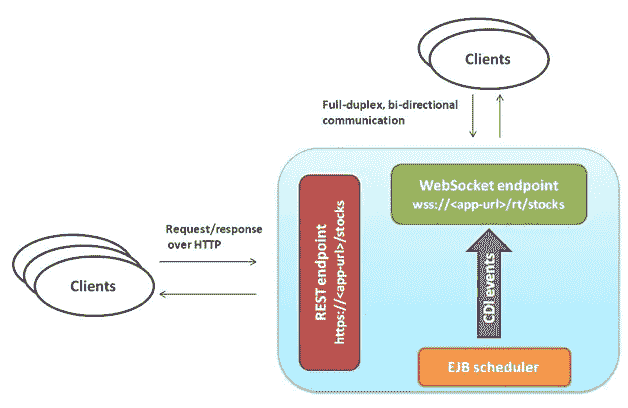

# 密码

让我们简单地看一下代码的相关部分(为了简洁起见，省略了 import 语句)

**RealTimeStockTicker.java**

StockDataEventQualifier.java

```
/** Custom CDI qualifier to stamp CDI stock price CDI events **/ @Qualifier 
@Retention(RUNTIME) 
@Target({METHOD, FIELD, PARAMETER, TYPE}) public @interface StockDataEventQualifier { }
```

**【StockPriceScheduler.java **

****RESTConfig.java****

```
/** * JAX-RS configuration class * */ 
@ApplicationPath("api") 
public class RESTConfig extends Application{}
```

****StockDataParser.java****

# **关于包装的一点说明**

**如前所述，从开发的角度来看，这是一个典型的基于 WAR 的 Java EE 应用程序，它与 Payara 微容器一起打包成一个大罐子**

> **请注意容器是如何与应用程序打包在一起的，而不是如何将应用程序部署到容器中的**

**Java EE APIs 只在编译时需要( *scope = provided* )，因为它们存在于 Payara 微库中**

```
<dependency> 
 <groupId>javax</groupId> 
 <artifactId>javaee-api</artifactId> 
 <version>7.0</version> 
 <scope>provided</scope> 
</dependency>
```

****使用 Maven 插件制作一个胖罐子****

```
<plugin>
 <groupId>org.codehaus.mojo</groupId>
 <artifactId>exec-maven-plugin</artifactId>
 <version>1.5.0</version>
 <dependencies>
 <dependency>
 <groupId>fish.payara.extras</groupId>
 <artifactId>payara-micro</artifactId>
 <version>4.1.1.164</version>
 </dependency>
 </dependencies>
 <executions>
 <execution>
 <id>payara-uber-jar</id>
 <phase>package</phase>
 <goals>
 <goal>java</goal>
 </goals>
 <configuration>
 <mainClass>fish.payara.micro.PayaraMicro</mainClass>
 <arguments>
 <argument> — deploy</argument>
 <argument>${basedir}/target/${project.build.finalName}.war</argument>
 <argument> — outputUberJar</argument>
 <argument>${basedir}/target/${project.build.finalName}.jar</argument>
 </arguments>
 <includeProjectDependencies>false</includeProjectDependencies>
 <includePluginDependencies>true</includePluginDependencies>
 <executableDependency>
 <groupId>fish.payara.extras</groupId>
 <artifactId>payara-micro</artifactId>
 </executableDependency>
 </configuration>
 </execution>
 </executions>
</plugin>
```

**现在，为了进行部署，我们将在 Oracle 云上利用以下服务:**

*   ****Oracle 开发者云服务**:托管代码(Git repo)，提供持续集成&持续部署能力(得益于其与其他 Oracle PaaS 服务的集成)**
*   ****Oracle 应用容器云服务**:运行 Java EE 微服务的可扩展 aPaaS**

# **设置持续集成和部署**

**以下部分讨论了在 Oracle 开发者云服务中进行的配置**

## **项目和代码库创建**

**请参考开发者云服务博客[跟踪 JUnit 测试结果中的**项目&代码库创建**部分，或者查看产品](https://community.oracle.com/community/cloud_computing/oracle-cloud-developer-solutions/blog/2016/10/05/junit-testing-using-oracle-developer-cloud)[文档](http://docs.oracle.com/cloud/latest/devcs_common/CSDCS/GUID-3317B279-A9C0-4566-A289-BD651A89D7B5.htm#GUID-7B30C8EC-6CDA-4F14-9791-8AE3BB3E8343)了解更多详情**

## **在 Git 存储库中配置源代码**

**[将项目](http://docs.oracle.com/cloud/latest/devcs_common/CSDCS/GUID-B4C03296-8497-4356-8C74-2031D1FB96FC.htm#CSDCS-GUID-A33E83CE-845C-4393-8C93-936527033715)从您的本地系统推送到您刚刚创建的开发人员云 Git repo。我们将通过命令行来完成，您所需要的就是在您的本地机器上安装 Git 客户端。你可以使用 Git 或者任何你选择的工具**

```
cd <project_folder> git init git remote add origin <developer_cloud_git_repo>  
//e.g. [https://john.doe@developer.us.oraclecloud.com/developer007-foodomain/s/developer007-foodomain-project_2009/scm/sample.git](https://john.doe@developer.us.oraclecloud.com/developer007-foodomain/s/developer007-foodomain-project_2009/scm/sample.git//john.doe@developer.us.oraclecloud.com/developer007-foodomain/s/developer007-foodomain-project_2009/scm/sample.git) git add . git commit -m "first commit" git push -u origin master  //Please enter the password for your Oracle Developer Cloud account when prompted
```

## **配置版本**

**创建一个**新工作****

**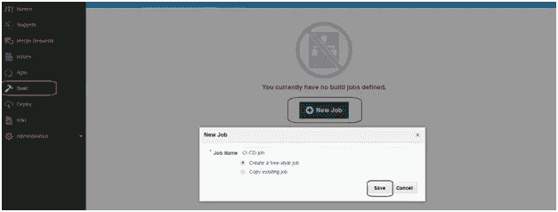**

****选择 JDK****

**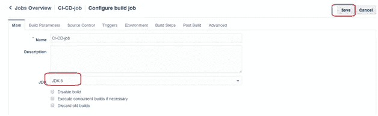**

## **持续集成**

****选择 Git 库****

**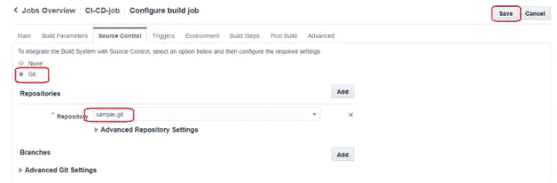**

**设置构建触发器—该构建作业将被触发，以响应 Git 存储库中的更新(例如，通过 **git 推送**)**

**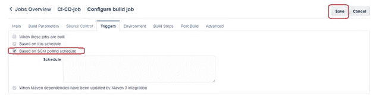**

**添加构建步骤**

*   **一个 **Maven** 建造步骤——生产战争和肥罐子**
*   **一个**执行** **Shell** 步骤——将应用程序 JAR 和所需的部署描述符(*应用程序容器云*所需的 manifest.json)打包**

**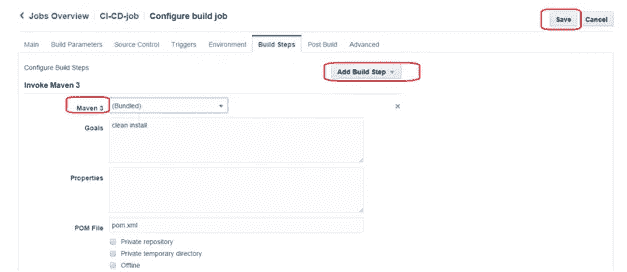****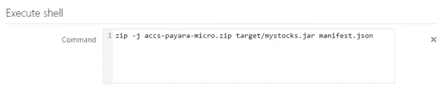**

**以下是命令供您参考**

```
zip -j accs-payara-micro.zip target/mystocks.jar manifest.json
```

****manifest.json** 如下**

```
{
 “runtime”: {
 “majorVersion”: “8”
 },
 “command”: “java -jar mystocks.jar — port $PORT — noCluster”,
 “release”: {
 “build”: “23022017.1202”,
 “commit”: “007”,
 “version”: “0.0.1”
 },
 “notes”: “Java EE on ACC with Payara Micro”
}
```

****激活构建后操作以归档可部署的 zip 文件****

**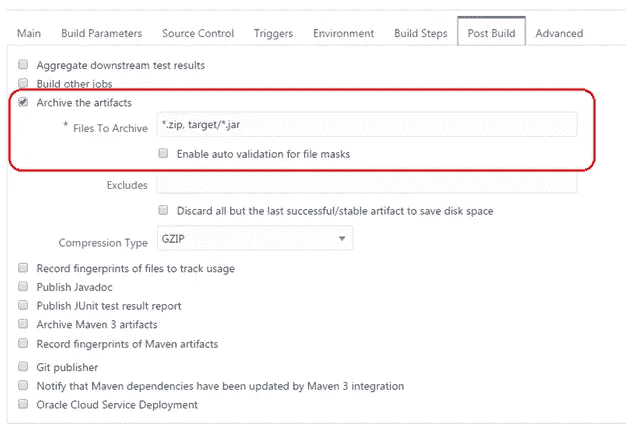**

## **执行构建**

**在配置部署之前，我们需要触发构建，以便产生可以被部署配置引用的工件**

****

**构建完成后，您可以**

*   **检查构建日志**
*   **确认存档的工件**

****日志****

**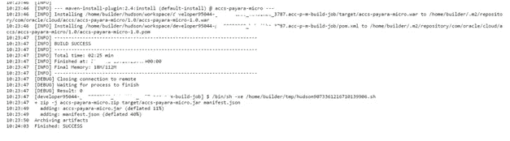**

****工件****

**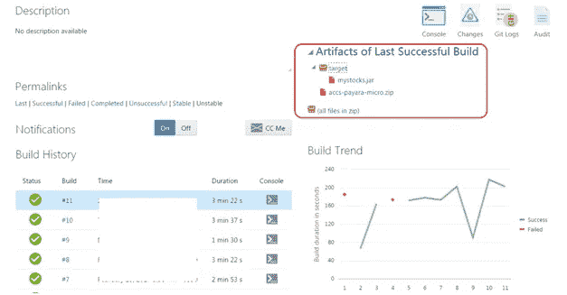**

# **持续部署(CD)到应用容器云**

**为部署创建一个**新配置****

**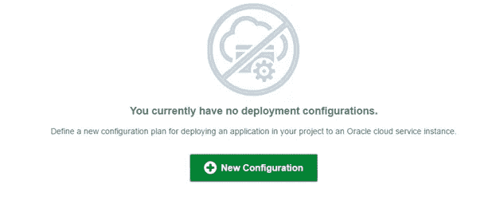**

*   **输入所需的详细信息并配置**部署目标****
*   **配置应用程序容器云实例**
*   **在最终确认页面上配置**自动**展开选项**

**您将得到下面的配置**

**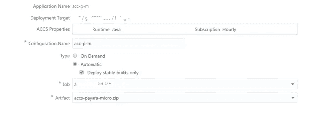**

****确认屏幕****

**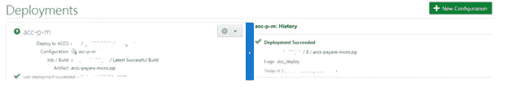**

****在应用程序容器云中检查您的应用程序****

**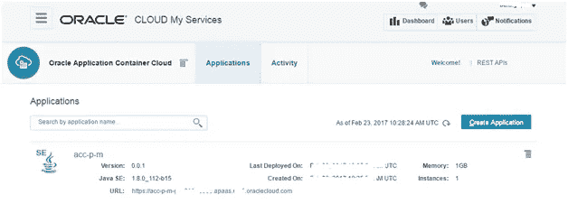**

# **测试 CI/CD 流**

**做一些代码修改，推送给开发者云服务 Git repo。这应该**

*   **自动触发**构建**，一旦成功将**
*   **自动触发**部署**过程，并且**
*   **将新的应用程序版本重新部署到应用程序容器云**

# **测试应用程序**

**我推荐使用可以作为插件安装到 Chrome 浏览器中的客户端— [简单 WebSocket 客户端](https://chrome.google.com/webstore/detail/simple-websocket-client/pfdhoblngboilpfeibdedpjgfnlcodoo?hl=en)**

**这篇博文到此为止..**

> **本文表达的观点是我个人的观点，不一定代表甲骨文的观点**