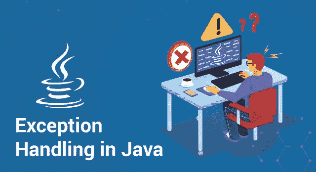
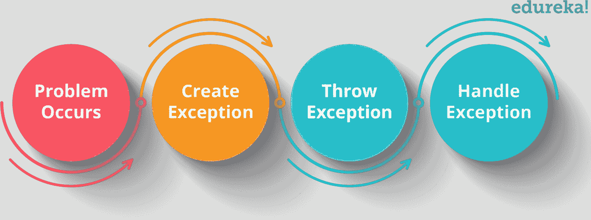
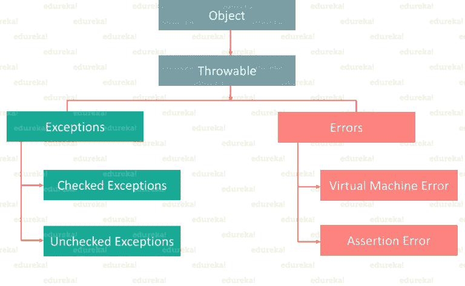
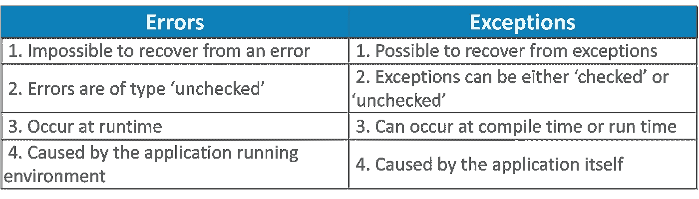
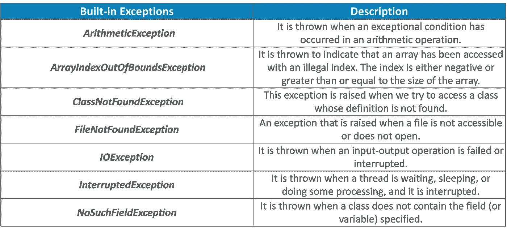
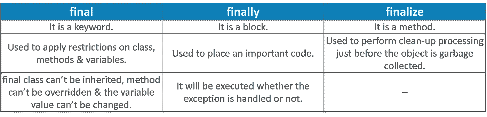
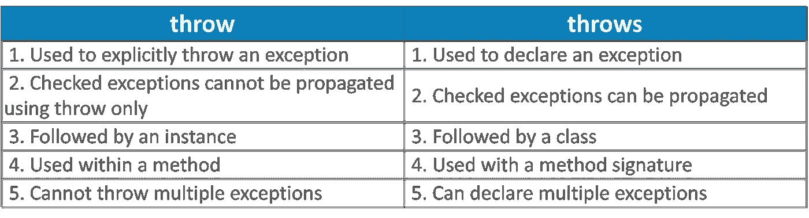

# Java 中的异常处理——Java 异常初学者指南

> 原文：<https://medium.com/edureka/java-exception-handling-7bd07435508c?source=collection_archive---------0----------------------->



意外出现的错误会导致正常的执行流程中断。这是每个程序员在编码时都会面临的问题。Java **、**作为最突出的面向对象语言，提供了处理这些错误/异常的强大机制。通过这篇关于 Java 异常处理的文章，我将让您全面了解异常处理的基础和各种方法。

在这篇文章中，我将涉及以下主题。

1.  异常处理简介
2.  例外层次结构
3.  基本异常示例
4.  例外的类型
5.  异常处理方法
6.  最终版 vs 最终版 vs 最终版
7.  投掷 vs 投掷

# 异常处理简介

异常是在程序执行过程中出现的问题。它可能因为各种原因发生，比如-

*   用户输入了无效数据
*   找不到文件
*   网络连接在通信过程中丢失
*   JVM 已耗尽内存

异常处理机制遵循下图所示的流程。但是如果不处理异常，可能会导致系统故障。这就是处理异常非常重要的原因。



The flow of Exception Handling - Java Exception Handling

接下来，从理解异常层次结构开始。

# 例外层次结构

所有异常和错误类型都是类 ***Throwable*** 的子类，是层次结构的基类。一个分支以运行时发生的 ***错误*** 为首，另一个分支以编译时或运行时可能发生的 ***异常*** 为首。



Exceptions Hierarchy - Java Exception Handling

基本上，Java 运行时系统(JVM)使用**错误**来指示与运行时环境(JRE)相关的错误。StackOverflowError 就是这种错误的一个例子。而 **异常** *用于用户程序应该捕捉的异常情况。NullPointerException 就是这种异常的一个例子。*

现在你知道了什么是错误和异常，让我们找出它们之间的基本区别。看看下面的表格，这两者之间有一条清晰的界限。



现在，我们将深入研究异常，看看如何处理它们。首先，让我们看看不同类型的异常。

*   **检查异常**
    它是发生在编译时的异常，也叫编译时异常。如果一个方法中的一些代码抛出了一个检查过的异常，那么这个方法要么必须处理这个异常，要么必须使用 *throws* 关键字指定这个异常。
*   **未检查的异常**
    它是在执行时发生的异常。这些也称为*运行时异常。*在 C++中，所有的异常都是未检查的，所以编译器不会强制处理或指定异常。由程序员来指定或捕捉异常。

## 例外的基本示例

```
class Exception{
public static void main(String args[]){
try{
//code that may raise exception
}
catch(Exception e){
// rest of the program
  }
 }
}
```

上面代码代表了一个异常，其中在 try 块中，我们将编写一个可能引发异常的代码，然后在 catch 块中处理该异常。

# 例外的类型

## **内置异常**



## 用户定义的异常

有时，Java 中的内置异常不能描述特定的情况。在这种情况下，用户也可以创建被称为“用户定义的例外”的例外。
**注意要点:**

> 用户定义的异常必须扩展异常类。
> 
> 使用 *throw* 关键字抛出异常。

**示例:**

```
class MyException extends Exception{ 
 String str1;
 MyException(String str2) {str1=str2;}
  public String toString(){
   return ("MyException Occurred: "+str1);
 }
}
class Example1{
public static void main(String args[]){
 try{
      System.out.println("Start of try block");
      throw new MyException(“Error Message");
    }
    catch(MyException exp){System.out.println("Catch Block");
    System.out.println(exp);
 }
}
```

现在您已经看到了不同类型的异常，让我们更深入地研究这个 Java 异常处理博客，了解处理这些异常的各种方法。

# 异常处理方法

正如我已经提到的，处理异常非常重要，否则会导致系统故障。但是如何处理这些异常呢？

Java 提供了各种方法来处理异常，例如:

*   尝试
*   捕捉
*   最后
*   扔
*   投

让我们详细了解一下这些方法。

## 尝试阻止

try 块包含一组可能发生异常的语句。它后面总是跟一个 catch 块，该块处理相关 try 块中发生的异常。try 块后面必须跟 catch 块或 finally 块，或者两者都跟。

```
try{
//code that may throw exception
}catch(Exception_class_Name ref){}
```

## 嵌套 try 块

try 块中的 try 块在 java 中称为嵌套 try 块。

```
class Exception{
  public static void main(String args[]){
    try{
      try{
          System.out.println("going to divide");
          int b=59/0;
         }catch(ArithmeticException e){System.out.println(e);}
      try{
          int a[]=new int[5];
         a[5]=4;
         }
        catch(ArrayIndexOutOfBoundsException e) {System.out.println(e);}
            System.out.println("other statement);
        }catch(Exception e)
         {System.out.println("Exception handeled");}
       System.out.println("casual flow");
    }
}
```

## 捕捉块

catch 块是处理异常的地方。这个块必须跟在 try 块后面，一个 try 块可以有几个与之相关联的 catch 块。您可以在不同的 catch 块中捕获不同的异常。当 try 块中出现异常时，处理该异常的相应 catch 块将执行。

```
public class Testtrycatch1{
  public static void main(String args[]){
    int data=50/0;//may throw exception
    System.out.println("rest of the code...");
 }
}
```

## 多重捕捉块

如果您必须在出现各种异常时执行各种任务，您可以使用 multi-catch 块。

```
public class SampleMultipleCatchBlock{
 public static void main(String args[]){
    try{
       int a[]=new int[5];
       a[5]=30/0;
      }
      catch(ArithmeticException e)
        {System.out.println("task1 is completed");}
      catch(ArrayIndexOutOfBoundsException e)
        {System.out.println("task 2 completed");}
      catch(Exception e)
        {System.out.println("task 3 completed");}
      System.out.println("remaining code");
  }
}
```

## 最终阻止

*finally 块*包含所有关键语句，无论是否出现异常，都必须执行这些语句。无论 try 块中是否出现异常(如关闭连接、流等),该块中的语句将始终执行。

```
class SampleFinallyBlock{
 public static void main(String args[]){
   try{
     int data=55/5;
     System.out.println(data);
    }
    catch(NullPointerException e)
       {System.out.println(e);} 
    finally {System.out.println("finally block is executed");}
    System.out.println("remaining code");
  }
}
```

所以，这就是处理异常的各种方法。

您可能听说过 final、finally 和 finalize 是 Java 中的关键字。是的，他们是，但是他们在各方面彼此不同。那么，让我们借助下表来看看 ***最终和*** 最终是如何相互区别的。

# 最终版 vs 最终版 vs 最终版



类似地，throw & throws 听起来很像，但是它们彼此不同。让我们看看如何，在下表的帮助下。

# 投掷 vs 投掷



```
//Java throw example
void a()
{
  throw new ArithmeticException("Incorrect");
}
//Java throws example
void a()throws ArithmeticException
{
  //method code
}
//Java throw and throws example
void a()throws ArithmeticException
{
  throw new ArithmeticException("Incorrect");
}
```

*这让我们结束了关于 Java 异常处理的博客。我希望你发现这个博客信息丰富，增加了你的知识价值。*

如果你想查看更多关于人工智能、DevOps、道德黑客等市场最热门技术的文章，你可以参考 Edureka 的官方网站。

请留意本系列中的其他文章，它们将解释 Java 的各个方面。

> 1.[面向对象编程](/edureka/object-oriented-programming-b29cfd50eca0)
> 
> 2.[Java 中的继承](/edureka/inheritance-in-java-f638d3ed559e)
> 
> 3.[Java 中的多态性](/edureka/polymorphism-in-java-9559e3641b9b)
> 
> 4.[Java 中的抽象](/edureka/java-abstraction-d2d790c09037)
> 
> 5. [Java 字符串](/edureka/java-string-68e5d0ca331f)
> 
> 6. [Java 数组](/edureka/java-array-tutorial-50299ef85e5)
> 
> 7. [Java 集合](/edureka/java-collections-6d50b013aef8)
> 
> 8. [Java 线程](/edureka/java-thread-bfb08e4eb691)
> 
> 9.[Java servlet 简介](/edureka/java-servlets-62f583d69c7e)
> 
> 10. [Servlet 和 JSP 教程](/edureka/servlet-and-jsp-tutorial-ef2e2ab9ee2a)
> 
> 11. [](/edureka/java-exception-handling-7bd07435508c) [Java 教程](/edureka/java-tutorial-bbdd28a2acd7)
> 
> 12.[高级 Java 教程](/edureka/advanced-java-tutorial-f6ebac5175ec)
> 
> 13. [Java 面试问题](/edureka/java-interview-questions-1d59b9c53973)
> 
> 14. [Java 程序](/edureka/java-programs-1e3220df2e76)
> 
> 15.[科特林 vs Java](/edureka/kotlin-vs-java-4f8653f38c04)
> 
> 16.[依赖注入使用 Spring Boot](/edureka/what-is-dependency-injection-5006b53af782)
> 
> 17.[在 Java 中可比](/edureka/comparable-in-java-e9cfa7be7ff7)
> 
> 18.[十大 Java 框架](/edureka/java-frameworks-5d52f3211f39)
> 
> 19. [Java 反射 API](/edureka/java-reflection-api-d38f3f5513fc)
> 
> 20.[Java 中的 30 大模式](/edureka/pattern-programs-in-java-f33186c711c8)
> 
> 21.[核心 Java 备忘单](/edureka/java-cheat-sheet-3ad4d174012c)
> 
> 22.[Java 中的套接字编程](/edureka/socket-programming-in-java-f09b82facd0)
> 
> 23. [Java OOP 备忘单](/edureka/java-oop-cheat-sheet-9c6ebb5e1175)
> 
> 24.[Java 中的注释](/edureka/annotations-in-java-9847d531d2bb)
> 
> 25.[Java 中的图书管理系统项目](/edureka/library-management-system-project-in-java-b003acba7f17)
> 
> 26.[Java 中的树](/edureka/java-binary-tree-caede8dfada5)
> 
> 27.[Java 中的机器学习](/edureka/machine-learning-in-java-db872998f368)
> 
> 28.[Java 中的顶级数据结构&算法](/edureka/data-structures-algorithms-in-java-d27e915db1c5)
> 
> 29. [Java 开发者技能](/edureka/java-developer-skills-83983e3d3b92)
> 
> 30.[前 55 个 Servlet 面试问题](/edureka/servlet-interview-questions-266b8fbb4b2d)
> 
> 31. [](/edureka/java-exception-handling-7bd07435508c) [顶级 Java 项目](/edureka/java-projects-db51097281e3)
> 
> 32. [Java 字符串备忘单](/edureka/java-string-cheat-sheet-9a91a6b46540)
> 
> 33.[Java 中的嵌套类](/edureka/nested-classes-java-f1987805e7e3)
> 
> 34. [Java 集合面试问答](/edureka/java-collections-interview-questions-162c5d7ef078)
> 
> 35.[Java 中如何处理死锁？](/edureka/deadlock-in-java-5d1e4f0338d5)
> 
> 36.[你需要知道的 50 大 Java 集合面试问题](/edureka/java-collections-interview-questions-6d20f552773e)
> 
> 37.[Java 中的字符串池是什么概念？](/edureka/java-string-pool-5b5b3b327bdf)
> 
> 38.[C、C++和 Java 有什么区别？](/edureka/difference-between-c-cpp-and-java-625c4e91fb95)
> 
> 39.[Java 中的回文——如何检查一个数字或字符串？](/edureka/palindrome-in-java-5d116eb8755a)
> 
> 40.[你需要知道的顶级 MVC 面试问答](/edureka/mvc-interview-questions-cd568f6d7c2e)
> 
> 41.[Java 编程语言的十大应用](/edureka/applications-of-java-11e64f9588b0)
> 
> 42.[Java 中的死锁](/edureka/deadlock-in-java-5d1e4f0338d5)
> 
> 43.[Java 中的平方和平方根](/edureka/java-sqrt-method-59354a700571)
> 
> 44.[Java 中的类型转换](/edureka/type-casting-in-java-ac4cd7e0bbe1)
> 
> 45.[Java 中的运算符及其类型](/edureka/operators-in-java-fd05a7445c0a)
> 
> 46.[Java 中的析构函数](/edureka/destructor-in-java-21cc46ed48fc)
> 
> 47.[Java 中的二分搜索法](/edureka/binary-search-in-java-cf40e927a8d3)
> 
> 48.[Java 中的 MVC 架构](/edureka/mvc-architecture-in-java-a85952ae2684)
> 
> 49. [Hibernate 面试问答](/edureka/hibernate-interview-questions-78b45ec5cce8)

*原载于 2018 年 11 月 28 日*[*www.edureka.co*](https://www.edureka.co/blog/java-exception-handling)*。*