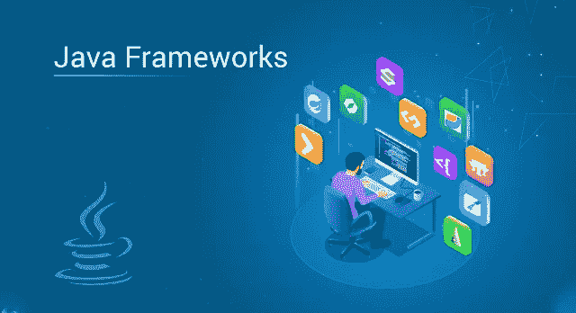

# 2021 年你应该知道的 10 大 Java 框架

> 原文：<https://medium.com/edureka/java-frameworks-5d52f3211f39?source=collection_archive---------1----------------------->

Java Frameworks — Edureka

Java 框架是预先编写的代码体，通过它你可以添加你自己的代码。但是有很多框架有各种各样的应用。因此，在本文中，我将讨论您应该掌握的 10 大 Java 框架。

让我们来看看这篇文章将要涉及的主题:

*   什么是 Java 框架？
*   使用的顶级 Java 框架

1.  春天
2.  冬眠
3.  支杆
4.  谷歌网络工具包[GWT]
5.  JavaServer Faces [JSF]
6.  Grails
7.  瓦丁
8.  叶片
9.  下拉向导
10.  玩

让我们开始吧！

# 什么是 Java 框架？

框架是一大堆预先写好的代码，你可以添加自己的代码来解决问题。通过调用框架的方法、继承，并提供回调、侦听器或模式的其他实现，可以利用框架。

框架通常会决定应用程序的结构。一些框架甚至提供了如此多的代码，以至于你只需要做很少的事情就可以编写你的应用程序。这可能是好的也可能是坏的，取决于它的易用性。框架是编程的实质。你建立在一个好的基础上，你的程序是可靠的，快速的，并且完美的结合在一起。你建立在一个坏的基础上，你的生活是悲惨的，野蛮的，短暂的。

现在让我们了解不同的框架。

# **使用的顶级 Java 框架**

## **1。弹簧框架**

Spring Framework 是一个用于企业 Java (JEE)的强大的轻量级应用程序开发框架。

*Spring 框架*的核心特性可以用于开发任何 Java 应用程序。它被描述为一个完整的模块化框架。该框架可用于实时应用程序的所有层实现。与其他框架不同，它还可以用于开发实时应用程序的特定层，但是使用 Spring，我们可以开发所有层。

并且所有的模块包括 *Spring MVC* ，Spring Core，Spring Security，Spring ORM 等都是在企业应用中使用的。

现在，让我们看看这个 Spring 框架用在哪里。

**用途**:

*   Web 应用程序开发
*   它的特性可以用来创建任何 Java 应用程序
*   它也用于企业 Java (JEE)

**优点**

*   它提供了一个轻量级容器，可以在不使用 web 服务器或应用服务器软件的情况下被触发
*   Spring 支持 JDBC，这提高了生产率并减少了错误
*   它的目标是使 J2EE 开发更容易使用
*   Spring 支持基于 XML 和注释的配置
*   它提供了代码的向后兼容性和可测试性

现在，谈到使用 Spring 框架进行应用程序开发的主要公司，我们有，

*   **网飞**使用弹簧靴
*   **Yatra** 使用 Spring MVC
*   亚马孙
*   通过易趣网购买

## 冬眠

当你使用像 Java 这样的面向对象语言时，你会遇到一个叫做对象-关系阻抗不匹配的问题，也叫做范式不匹配。这是因为 OO 语言和 RDBMSs 处理数据的方式不同，这会导致严重的不匹配问题。所以，这个 Hibernate 为你提供了一个框架，克服了 Java 的不匹配问题。

**用途**

*   它允许你按照面向对象的习语开发持久类
*   它允许您通过对代码进行非常微小的修改来与任何数据库进行通信，在对象和关系词之间架起了一座桥梁
*   它是一个高级的 ORM 框架，允许您在 Java 实体上执行数据库操作

**优势**

*   可移植性、生产力、可维护性
*   自由和开源框架
*   它从 JDBC API 中删除了大量重复的代码

现在，谈到使用 Hibernate 框架进行应用程序开发的主要公司，我们有，

*   神谕
*   国际商用机器公司
*   （里面或周围有树的）小山谷
*   埃森哲

## 支杆

这是另一个企业级框架，由 Apache 软件基金会(ASF)维护。这个全功能的 Java web 应用程序框架允许开发人员创建一个易于维护的 Java 应用程序。有两个版本。支柱 1 和支柱 2。Struts 2 是 OpenSymphony 的 webwork 框架和 Struts 1 的结合。但是所有的公司都倾向于使用 Struts 2，因为它是 Apache Struts 的升级版本。

**用途:**

*   Struts 2 框架用于开发基于 MVC 的 web 应用程序
*   它使用并扩展了 Java Servlet API 来帮助开发人员采用 MVC 架构

**优点:**

*   这个框架文档是为活跃的 web 开发人员编写的，并假设他们具备如何构建 Java web 应用程序的工作知识
*   减少开发时间并使应用程序的可管理性更容易
*   它提供了*集中式配置*，即，不是将信息编码到 Java 程序中，而是将许多 Struts 值表示在 XML 或属性文件中。
*   您可以将 Struts 与其他 Java 框架集成起来，以执行不是在该平台上构建的任务

现在，谈到使用 Struts 框架进行应用程序开发的主要公司，我们有，

*   印孚瑟斯
*   埃森哲
*   耐克森技术公司

## 谷歌网络工具包[GWT]

使用 GWT，开发人员可以轻松快速地编写复杂的浏览器应用程序。它还允许您用 Java 开发和调试 Ajax 应用程序。GWT 最棒的一点是，即使你不是 JavaScript 优化或响应式设计等前端技术的专家，你也可以编写复杂的基于浏览器的应用程序。

**用途:**

*   开发者友好的
*   Google APIs 的使用
*   帮助创建和维护复杂的 JavaScript 前端应用程序

**优点**

*   它支持常见 web 开发任务的可重用性
*   Google APIs 可以在 GWT 应用程序中使用
*   提供国际化、跨浏览器可移植性、UI 抽象、书签和历史管理

## JavaServer Faces [JSF]

这是一个基于**组件的** UI 框架。JSF 基于 MVC 软件设计模式，它的架构完全定义了应用程序逻辑和表现之间的区别。

**用途:**

*   基于组件的 UI 框架
*   帮助构建本机应用程序

**优势**

*   JSF 是 Java EE 不可或缺的一部分
*   提供优秀的工具和丰富的库
*   它允许用 web 接口扩展现有的后端 Java 代码，而不必通过引入新的框架来改变基础应用程序。

## **Grails**

Grails 是一个动态框架，由 Groovy JVM 编程语言创造。它是一种面向对象的 Java 平台语言，旨在提高开发人员的生产力。语法与 Java 兼容，并被编译成 JVM (Java 虚拟机)字节码。Grails 使用 Java 技术，包括 Java EE 容器、Spring、SiteMesh、Quartz 和 Hibernate。

**用途:**

*   它对开发人员非常友好，因为它附带了详细且易于阅读的文档
*   您还可以构建自己的插件，并包含对不同平台的 Grails IDE 支持。
*   大多数电子商务网站都使用 Grails

**优点**

*   它利用 Groovy 作为它的编码标准，由于 Groovy 类似于 Java，程序员认为从 Grails 开始更容易。
*   易于使用的对象映射功能
*   它通过以插件的形式模块化应用程序，促进了不同 Grails 应用程序之间的代码重用
*   提供灵活的配置文件

## 瓦丁

Vaadin 10 以一种全新的方式开发 web 应用程序。它让您可以从 Java 虚拟机直接访问 DOM。在新版本中，Vaadin 团队将以前的整体框架分成了两个部分。它还有一个名为 *Vaadin Flow* 的轻量级 Java 框架，用于处理路由和服务器-客户端通信。

**用途:**

*   这个框架自动化了浏览器和服务器之间的所有通信
*   它简化了 web 应用程序开发

**优点**

*   Vaadin 提供了使用 MVC 或 MVP 绑定数据的机会
*   拖放支持以及其他突出的特性简化了 Java 应用程序的单页 ui 的创建
*   支持 WebSocket 的自动服务器-客户端通信
*   使用 Java 或 HTML 构建视图
*   数据绑定
*   支持嵌套路由和参数的路由器
*   支持 JVM 语言，如 Kotlin 和 Scala
*   内置弹簧支架

## 叶片

这是一个简单、轻量级和高性能的 Java 框架，用于提供全栈 web 框架。Blade 是一个轻量级的 MVC 框架，它提供了一个 restful 路由接口，使得 web API 更简洁、更容易理解，并且有助于与网站同步数据。

Blade 基于 Java 8，web 服务器和模板引擎也内置在框架中。它给人的印象很小，意味着源代码总共不到 500kb。

**用途:**

*   帮助你变得独立、高效、优雅、直观和超快
*   用于创建一个小型 MVC 应用程序

**优势**

*   刀片支持插件扩展和 web jar 资源
*   支持配置多个文件
*   它还拥有 CSRF(跨站点请求伪造)和 XSS(跨站点脚本)防御支持

## 下拉向导

Dropwizard 是一个独立的生态系统，包含捆绑到单个包中的所有依赖项。

**用途**:

*   操作友好的 Java 框架
*   帮助创建 Java 微服务

**优点**

*   您可以轻松地执行快速原型制作
*   它开发高性能 RESTful web 服务
*   也支持许多开源和独立的库
*   快速项目引导
*   生产率增长

## 玩

Play 是一个独特的 Java 框架，因为它不依赖于 Java EE 标准。相反，它旨在消除传统 Java web 开发的所有不便，如缓慢的开发周期、大量的配置等等。Play framework 建立在 Akka Toolkit 的基础上，在 Java 虚拟机上截断了并发和分布式应用程序的创建。

**用途:**

*   需要内容创建的 Web 应用程序
*   构建 Java 和 Scala 应用程序

**优点**

*   提供热代码重载、约定优于配置和浏览器中的错误消息等功能
*   它支持对高性能应用至关重要的非阻塞 I/O
*   更灵活和容错的结果

这就把我们带到了本文的结尾，在这里我们讨论了正在使用的 10 个最好的 Java 框架。如果你想查看更多关于人工智能、DevOps、道德黑客等市场最热门技术的文章，那么你可以参考 [Edureka 的官方网站。](https://www.edureka.co/blog/?utm_source=medium&utm_medium=content-link&utm_campaign=java-frameworks)

请留意本系列中的其他文章，它们将解释 Java 的各个方面。

> 1.[面向对象编程](/edureka/object-oriented-programming-b29cfd50eca0)
> 
> 2.[Java 中的继承](/edureka/inheritance-in-java-f638d3ed559e)
> 
> 3.[Java 中的多态性](/edureka/polymorphism-in-java-9559e3641b9b)
> 
> 4.[Java 中的抽象](/edureka/java-abstraction-d2d790c09037)
> 
> 5. [Java 字符串](/edureka/java-string-68e5d0ca331f)
> 
> 6. [Java 数组](/edureka/java-array-tutorial-50299ef85e5)
> 
> 7. [Java 集合](/edureka/java-collections-6d50b013aef8)
> 
> 8. [Java 线程](/edureka/java-thread-bfb08e4eb691)
> 
> 9.[Java servlet 简介](/edureka/java-servlets-62f583d69c7e)
> 
> 10. [Servlet 和 JSP 教程](/edureka/servlet-and-jsp-tutorial-ef2e2ab9ee2a)
> 
> 11.[Java 中的异常处理](/edureka/java-exception-handling-7bd07435508c)
> 
> 12.[高级 Java 教程](/edureka/advanced-java-tutorial-f6ebac5175ec)
> 
> 13. [Java 面试问题](/edureka/java-interview-questions-1d59b9c53973)
> 
> 14. [Java 程序](/edureka/java-programs-1e3220df2e76)
> 
> 15.[科特林 vs Java](/edureka/kotlin-vs-java-4f8653f38c04)
> 
> 16.[依赖注入使用 Spring Boot](/edureka/what-is-dependency-injection-5006b53af782)
> 
> 17.[Java 中的可比](/edureka/comparable-in-java-e9cfa7be7ff7)
> 
> 18. [Java 教程](/edureka/java-tutorial-bbdd28a2acd7)
> 
> 19. [Java 反射 API](/edureka/java-reflection-api-d38f3f5513fc)
> 
> 20.[Java 中的 30 大模式](/edureka/pattern-programs-in-java-f33186c711c8)
> 
> 21.[核心 Java 备忘单](/edureka/java-cheat-sheet-3ad4d174012c)
> 
> 22.[Java 中的套接字编程](/edureka/socket-programming-in-java-f09b82facd0)
> 
> 23. [Java OOP 备忘单](/edureka/java-oop-cheat-sheet-9c6ebb5e1175)
> 
> 24.[Java 中的注释](/edureka/annotations-in-java-9847d531d2bb)
> 
> 25.[Java 中的图书管理系统项目](/edureka/library-management-system-project-in-java-b003acba7f17)
> 
> 26.[Java 中的树](/edureka/java-binary-tree-caede8dfada5)
> 
> 27.[Java 中的机器学习](/edureka/machine-learning-in-java-db872998f368)
> 
> 28.[Java 中的顶级数据结构&算法](/edureka/data-structures-algorithms-in-java-d27e915db1c5)
> 
> 29. [Java 开发者技能](/edureka/java-developer-skills-83983e3d3b92)
> 
> 30.[前 55 名 Servlet 面试问题](/edureka/servlet-interview-questions-266b8fbb4b2d)
> 
> 31.  [顶级 Java 项目](/edureka/java-projects-db51097281e3)
> 
> 32. [Java 字符串备忘单](/edureka/java-string-cheat-sheet-9a91a6b46540)
> 
> 33.[Java 中的嵌套类](/edureka/nested-classes-java-f1987805e7e3)
> 
> 34. [Java 集合面试问答](/edureka/java-collections-interview-questions-162c5d7ef078)
> 
> 35.[Java 中如何处理死锁？](/edureka/deadlock-in-java-5d1e4f0338d5)
> 
> 36.[你需要知道的 50 大 Java 集合面试问题](/edureka/java-collections-interview-questions-6d20f552773e)
> 
> 37.[Java 中的字符串池是什么概念？](/edureka/java-string-pool-5b5b3b327bdf)
> 
> 38.[C、C++和 Java 有什么区别？](/edureka/difference-between-c-cpp-and-java-625c4e91fb95)
> 
> 39.[Java 中的回文——如何检查一个数字或字符串？](/edureka/palindrome-in-java-5d116eb8755a)
> 
> 40.[你需要知道的顶级 MVC 面试问答](/edureka/mvc-interview-questions-cd568f6d7c2e)
> 
> 41.[Java 编程语言的十大应用](/edureka/applications-of-java-11e64f9588b0)
> 
> 42.[Java 中的死锁](/edureka/deadlock-in-java-5d1e4f0338d5)
> 
> 43.[Java 中的平方和平方根](/edureka/java-sqrt-method-59354a700571)
> 
> 44.[Java 中的类型转换](/edureka/type-casting-in-java-ac4cd7e0bbe1)
> 
> 45.[Java 中的运算符及其类型](/edureka/operators-in-java-fd05a7445c0a)
> 
> 46.[Java 中的析构函数](/edureka/destructor-in-java-21cc46ed48fc)
> 
> 47.[Java 中的二分搜索法](/edureka/binary-search-in-java-cf40e927a8d3)
> 
> 48.[Java 中的 MVC 架构](/edureka/mvc-architecture-in-java-a85952ae2684)
> 
> 49.[冬眠面试问答](/edureka/hibernate-interview-questions-78b45ec5cce8)

*原载于 2019 年 7 月 15 日*[*https://www.edureka.co*](https://www.edureka.co/blog/java-frameworks/)*。*