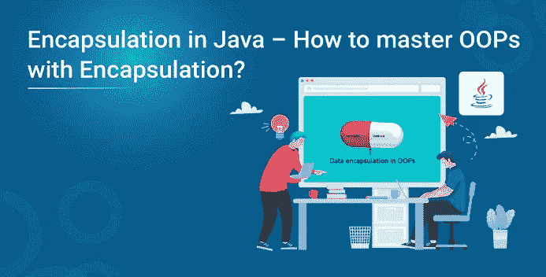
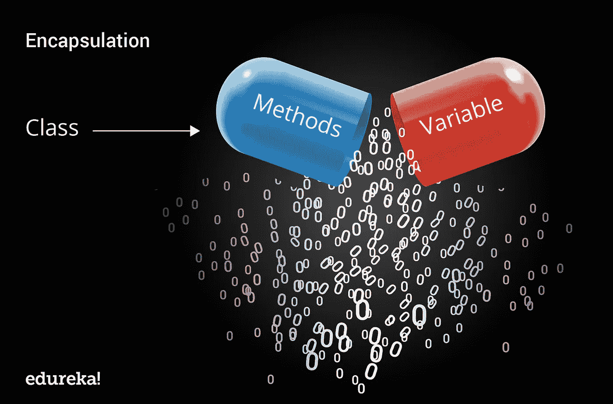

# Java 中的封装——如何掌握封装 OOPs？

> 原文：<https://medium.com/edureka/java-how-to-master-oops-with-encapsulation-255ada1b2ede?source=collection_archive---------0----------------------->



面向对象编程(或者更好地称为 OOPs)是 Java 的主要支柱之一，它充分利用了其强大的功能和易用性。要成为一名专业的 Java 开发人员，你必须对各种各样的 Java OOPs 概念有完美的控制，比如继承、抽象、封装和多态。通过这篇文章，我将让你全面了解 OOPs 的一个最重要的概念，即 Java 中的封装，以及它是如何实现的。

以下是我将在本文中讨论的主题:

*   封装介绍
*   为什么我们需要用 Java 封装？
*   封装的好处
*   一个实时例子

# 封装介绍

封装是指将数据封装在一个单元中。它是绑定代码和它所操作的数据的机制。考虑封装的另一种方式是，它是一个保护屏障，防止数据被屏障外的代码访问。在这种情况下，[类](https://www.edureka.co/blog/java-tutorial/#obj)的变量或数据对任何其他类都是隐藏的，只能通过声明它们的类的任何成员函数来访问。

现在，让我们以医用胶囊为例，药物在胶囊内始终是安全的。同样，通过封装，一个类的方法和变量被很好地隐藏和安全。



Java 中的封装可以通过以下方式实现:

*   将类的变量声明为私有。
*   提供公共 setter 和 getter 方法来修改和查看变量值。

现在，让我们看看代码，以便更好地理解封装:

```
**public** **class** Student {**private** String name;**public** String getName() {**return** name;}**public** **void** setName(String name) {**this**.name = name;}}**class** Test{**public** **static** **void** main(String[] args) {Student s=**new** Student();s.setName("Harry Potter");System.out.println(s.getName());}}
```

正如你在上面的代码中看到的，我创建了一个 class Student，它有一个私有变量名**。**接下来，我创建了一个 getter 和 setter 来获取和设置学生的名字。在这些方法的帮助下，任何希望访问 name 变量的类都必须使用这些 getter 和 setter 方法。

现在让我们再看一个例子，深入理解封装。在这个例子中，Car 类有两个字段——name 和 top speed。这里，两者都被声明为 private，这意味着不能在类外部直接访问它们。我们有一些 getter 和 setter 方法，如 get Name、set Name、set Top Speed 等。，并且它们被声明为公共的。这些方法对“外人”公开，可用于从 Car 对象中更改和检索数据。我们有一个方法来设置车辆的最高速度，有两个 getter 方法来检索最大速度值(MPH 或 KMHt)。所以基本上，这就是封装所做的——它隐藏了实现，给了我们想要的值。现在，让我们看看下面的代码。

```
**package** Edureka;**public** **class** Car {**private** String name;**private** **double** topSpeed;**public** Car() {}**public** String getName(){**return** name;}**public** **void** setName(String name){**this**.name= name;}**public** **void** setTopSpeed(**double** speedMPH){topSpeed = speedMPH;}**public** **double** getTopSpeedMPH(){**return** topSpeed;}**public** **double** getTopSpeedKMH(){**return** topSpeed*1.609344;}}
```

这里，主程序创建一个具有给定名称的 Car 对象，并使用 setter 方法存储该实例的最高速度。通过这样做，我们可以很容易地获得以英里/小时或 KMH 为单位的速度，而不用关心速度在汽车类中是如何转换的。

```
**package** Edureka;**public** **class** Example{**public** **static** **void** main(String args[])Car car =**new** Car();car.setName("Mustang GT 4.8-litre V8");car.setTopSpeed(201);System.out.println(car.getName()+ " top speed in MPH is " + car.getTopSpeedMPH());System.out.println(car.getName() + " top speed in KMH is " + car.getTopSpeedKMH());
```

这就是在 Java 中实现封装的方法。现在，让我们进一步看看为什么我们需要封装。

# 为什么我们需要用 Java 封装？

封装在 Java 中至关重要，因为:

*   它控制数据可访问性的方式
*   根据需求修改代码
*   帮助我们实现松散耦合
*   实现应用程序的简单性
*   它还允许您在不中断程序中任何其他功能或代码的情况下更改部分代码

现在，让我们考虑一个小例子来说明封装的必要性。

```
**class** Student {**int** id;String name;}**public** **class** Demo {**public** **static** **void** main(String[] args) {Student s = **new** Student();s.id = 0;s.name="";s.name=**null**;}}
```

在上面的例子中，它包含两个实例变量作为访问修饰符。因此，同一个包中的任何类都可以通过创建该类的对象来分配和更改这些变量的值。因此，我们无法控制作为变量存储在 Student 类中的值。为了解决这个问题，我们封装了学生类。

所以，这些是描述封装需求的几个要点。现在，让我们看看封装的一些好处。

# 封装的好处

*   **数据隐藏:**在这里，用户不知道这个类的内部实现。甚至用户也不知道类是如何在变量中存储值的。他/她只知道我们将值传递给一个 setter 方法，并且用该值初始化变量。
*   ()等。或者，如果我们希望使变量只写，那么我们必须省略 get 方法，如 getName()、getAge()等。从上面的程序来看。**增加了灵活性:**在这里，我们可以根据自己的需要将类的变量设为只读或只写。如果您希望将变量设为只读，那么我们必须省略 setName()之类的 setter 方法
*   **可重用性:**提高了可重用性，易于根据新的需求进行更改。

现在我们已经理解了封装的基础，让我们深入到本文的最后一个主题，并借助一个实时示例详细理解封装。

# 封装的实时示例

让我们考虑一个电视示例，并理解内部实现细节是如何对外部类隐藏的。基本上，在这个例子中，我们通过盖子隐藏了内部代码数据，即电路。现在在 [Java](https://www.edureka.co/blog/java-tutorial/) 中，这可以在访问修饰符的帮助下实现。访问修饰符设置类、构造函数变量等的访问或级别。正如您在下面的代码中看到的，我使用了一个私有访问修饰符来限制类的访问级别。声明为 private 的变量只能在 Television 类中访问。

```
**public** **class** Television{**private** **double** width;**private** **double** height;**private** **double** Screensize;**private** **int** maxVolume;print **int** volume;**private** **boolean** power;**public** Television(**double** width, **double** height, **double** screenSize){**this**.width=width;**this**.height=height;**this**.screenSize=ScreenSize;}**public** **double** channelTuning(**int** channel){**switch**(channel){case1: **return** 34.56;case2: **return** 54.89;case3: **return** 73.89;case1: **return** 94.98;}**return** 0;}**public** **int** decreaseVolume(){**if**(0<volume) volume --;**return** volume;}**public** **void** powerSwitch(){**this**.power=!power;}**public** **int** increaseVolume(){**if**(maxVolume>volume) volume++;**return** volume;}}**class** test{**public** **static** **void** main(String args[]){Television t= **new** Television(11.5,7,9);t.powerSwitch();t.channelTuning(2);t.decreaseVolume();t.increaseVolume();television.width=12; // Throws error as variable is private and cannot be accessed outside the class}}
```

在上面的例子中，我将所有的变量声明为私有，将方法、构造函数和类声明为公共。在这里，构造函数和方法可以在类外访问。当我创建一个 Television 类的对象时，它可以访问该类中的方法和构造函数，而用 private access 修饰符声明的变量是隐藏的。这就是为什么在上面的例子中，当你试图访问一个错误 ***宽度变量*** 时，它抛出。这就是对其他类隐藏内部实现细节的方式。Java 就是这样实现封装的。

这就把我们带到了“Java 中的封装”这篇文章的结尾。希望，你发现它信息丰富，有助于增加你的知识价值。如果你想学习更多关于 Java 的知识，可以参考**高级 Java 教程。**

*既然您已经理解了“什么是 Java 中的封装”,那么就来看看 Edureka 的* ***Java 认证课程*** *吧，edu reka 是一家值得信赖的在线学习公司，拥有遍布全球的 250，000 多名满意的学习者。Edureka 的 Java J2EE 和 SOA 培训和认证课程是为想成为 Java 开发人员的学生和专业人士设计的。该课程旨在为您提供 Java 编程的良好开端，并训练您掌握核心和高级 Java 概念以及各种 Java 框架，如 Hibernate & Spring。*

如果你想查看更多关于人工智能、Python、道德黑客等市场最热门技术的文章，那么你可以参考 [Edureka 的官方网站。](https://www.edureka.co/blog/?utm_source=medium&utm_medium=content-link&utm_campaign=encapsulation-in-java)

请留意本系列中解释 Java 其他各方面的其他文章。

> *1。* [*面向对象编程*](/edureka/object-oriented-programming-b29cfd50eca0)
> 
> *2。* [*继承 Java 中的*](/edureka/inheritance-in-java-f638d3ed559e)
> 
> *3。*[*Java 中的多态性*](/edureka/polymorphism-in-java-9559e3641b9b)
> 
> *4。*[*Java 中的抽象*](/edureka/java-abstraction-d2d790c09037)
> 
> *5。* [*Java 字符串*](/edureka/java-string-68e5d0ca331f)
> 
> *6。* [*Java 数组*](/edureka/java-array-tutorial-50299ef85e5)
> 
> 7。 [*Java 收藏*](/edureka/java-collections-6d50b013aef8)
> 
> *8。* [*Java 线程*](/edureka/java-thread-bfb08e4eb691)
> 
> *9。*[*Java servlet 简介*](/edureka/java-servlets-62f583d69c7e)
> 
> *10。* [*Servlet 和 JSP 教程*](/edureka/servlet-and-jsp-tutorial-ef2e2ab9ee2a)
> 
> *11。*[*Java 中的异常处理*](/edureka/java-exception-handling-7bd07435508c)
> 
> *12。* [*Java 教程*](/edureka/java-tutorial-bbdd28a2acd7)
> 
> *13。* [*Java 面试题*](/edureka/java-interview-questions-1d59b9c53973)
> 
> *14。* [*Java 程序*](/edureka/java-programs-1e3220df2e76)
> 
> *15。*[*kot Lin vs Java*](/edureka/kotlin-vs-java-4f8653f38c04)
> 
> *16。* [*依赖注入使用 Spring Boot*](/edureka/what-is-dependency-injection-5006b53af782)
> 
> *17。* [*堪比 Java 中的*](/edureka/comparable-in-java-e9cfa7be7ff7)
> 
> *18。* [*十大 Java 框架*](/edureka/java-frameworks-5d52f3211f39)
> 
> *19。* [*Java 反射 API*](/edureka/java-reflection-api-d38f3f5513fc)
> 
> *20。*[*Java 中的 30 大模式*](/edureka/pattern-programs-in-java-f33186c711c8)
> 
> *21。* [*核心 Java 备忘单*](/edureka/java-cheat-sheet-3ad4d174012c)
> 
> *22。*[*Java 中的套接字编程*](/edureka/socket-programming-in-java-f09b82facd0)
> 
> *23。* [*Java OOP 备忘单*](/edureka/java-oop-cheat-sheet-9c6ebb5e1175)
> 
> 24。[*Java 中的注释*](/edureka/annotations-in-java-9847d531d2bb)
> 
> *25。*[*Java 中的库管理系统项目*](/edureka/library-management-system-project-in-java-b003acba7f17)
> 
> *26。* [*爪哇树木*](/edureka/java-binary-tree-caede8dfada5)
> 
> 27。[*Java 中的机器学习*](/edureka/machine-learning-in-java-db872998f368)
> 
> *二十八。* [*顶级数据结构&Java 中的算法*](/edureka/data-structures-algorithms-in-java-d27e915db1c5)
> 
> *29。* [*Java 开发者技能*](/edureka/java-developer-skills-83983e3d3b92)
> 
> *30。* [*前 55 名 Servlet 面试问题*](/edureka/servlet-interview-questions-266b8fbb4b2d)
> 
> *31。*[](/edureka/java-exception-handling-7bd07435508c)*[*顶级 Java 项目*](/edureka/java-projects-db51097281e3)*
> 
> **32。* [*Java 字符串备忘单*](/edureka/java-string-cheat-sheet-9a91a6b46540)*
> 
> **33。*[*Java 中的嵌套类*](/edureka/nested-classes-java-f1987805e7e3)*
> 
> **34。* [*Java 集合面试问答*](/edureka/java-collections-interview-questions-162c5d7ef078)*
> 
> **35。*[*Java 中如何处理死锁？*](/edureka/deadlock-in-java-5d1e4f0338d5)*
> 
> **36。* [*你需要知道的 50 个 Java 合集面试问题*](/edureka/java-collections-interview-questions-6d20f552773e)*
> 
> **37。*[*Java 中的字符串池是什么概念？*](/edureka/java-string-pool-5b5b3b327bdf)*
> 
> **38。*[*C、C++和 Java 有什么区别？*](/edureka/difference-between-c-cpp-and-java-625c4e91fb95)*
> 
> **39。*[*Java 中的回文——如何检查一个数字或字符串？*](/edureka/palindrome-in-java-5d116eb8755a)*
> 
> *40。 [*你需要知道的顶级 MVC 面试问答*](/edureka/mvc-interview-questions-cd568f6d7c2e)*
> 
> *41。[*Java 编程语言十大应用*](/edureka/applications-of-java-11e64f9588b0)*
> 
> **42。*[*Java 中的死锁*](/edureka/deadlock-in-java-5d1e4f0338d5)*
> 
> **43。* [*平方和平方根*](/edureka/java-sqrt-method-59354a700571)*
> 
> *44。[*Java 中的类型转换*](/edureka/type-casting-in-java-ac4cd7e0bbe1)*
> 
> **四十五。*[*Java 中的运算符及其类型*](/edureka/operators-in-java-fd05a7445c0a)*
> 
> *46。[*Java 中的析构函数*](/edureka/destructor-in-java-21cc46ed48fc)*
> 
> **47。*[*Java 中的二分搜索法*](/edureka/binary-search-in-java-cf40e927a8d3)*
> 
> **48。*[*Java 中的 MVC 架构*](/edureka/mvc-architecture-in-java-a85952ae2684)*
> 
> *49。 [*冬眠面试问答*](/edureka/hibernate-interview-questions-78b45ec5cce8)*

**原载于 2021 年 6 月 17 日 https://www.edureka.co*[](https://www.edureka.co/blog/encapsulation-in-java/)**。***