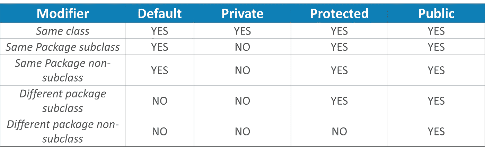
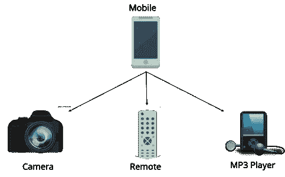

# 2021 年你必须准备的 100+ Java 面试问题

> 原文：<https://medium.com/edureka/java-interview-questions-1d59b9c53973?source=collection_archive---------0----------------------->


在本文中，我将列出一些最重要的 Java 面试问题和答案，它们将使你在面试过程中脱颖而出。全世界大约有 1000 万开发人员使用 Java 为 150 亿台支持 Java 的设备开发应用程序。它还被用于创建将大数据等趋势技术应用到手机和 DTH 盒子等家用设备的应用程序。因此今天，Java 到处都在使用！

我们编制了一份 Java 面试问题列表，分为 7 个部分，即:

1.  基本面试问题
2.  哎呀面试问题
3.  JDBC 面试问题
4.  春季面试问题
5.  冬眠面试问题
6.  JSP 面试问题
7.  例外和线索面试问题

作为一名 Java 专业人员，了解正确的流行词汇、学习正确的技术并为常见的 Java 面试问题准备正确的答案是至关重要的。这里有一个权威的 Java 面试问题列表，可以保证你轻松进入下一个阶段。

所以让我们从第一组基本的 Java 面试问题开始。

# 基本 Java 面试问题

## Q1。解释 JDK，JRE 和 JVM？


## Q2。解释 Java 中的公共静态 void main(String args[])。

Java 中的 main()是任何 Java 程序的入口点。它总是写成**public static void main(String[]args)**。

*   **public** : Public 是一个访问修饰符，用来指定谁可以访问这个方法。Public 意味着任何类都可以访问该方法。
*   **static** :它是 java 中的一个关键字，标识它是基于类的。main()在 Java 中是静态的，因此无需创建类的实例就可以访问它。如果 main 不是静态的，那么编译器将抛出一个错误，因为 JVM 在创建任何对象之前调用了 **main** ()并且只有静态方法可以通过该类直接调用。
*   **void** :是方法的返回类型。Void 定义了不会返回任何值的方法。
*   **main** :它是 JVM 搜索的方法的名称，作为一个只有特定签名的应用程序的起点。它是主要执行发生的方法。
*   **String args[]** :传递给 main 方法的参数。

## Q3。为什么 Java 是平台无关的？

Java 被称为平台无关的，因为它的字节码可以在任何系统上运行，而与它的底层操作系统无关。

## Q4。为什么 Java 不是 100%面向对象？

Java 不是 100%面向对象的，因为它使用了八种原始数据类型，如 Boolean、byte、char、int、float、double、long、short，它们都不是对象。

## Q5。Java 中的包装类是什么？

包装类将 Java 原语转换成引用类型(对象)。每种原始数据类型都有一个专用的类。这些被称为包装类，因为它们将原始数据类型“包装”到该类的对象中。参考下图，其中显示了不同的原始类型、包装类和构造函数参数。

## Q6。Java 中的构造函数是什么？

在 Java 中，构造函数指的是用来初始化对象的代码块。它必须与类的名称相同。此外，它没有返回类型，并且在创建对象时自动调用。

有两种类型的构造函数:

1.  **默认构造函数:**在 Java 中，默认构造函数不接受任何输入。换句话说，默认构造函数是无参数构造函数，如果用户没有定义其他构造函数，默认情况下会创建无参数构造函数。它的主要目的是用默认值初始化实例变量。此外，它主要用于对象创建。
2.  **参数化构造函数:**Java 中的参数化构造函数，是能够用提供的值初始化实例变量的构造函数。换句话说，接受参数的构造函数叫做参数化构造函数。

## Q7。什么是 Java 中的 singleton 类，怎样才能让一个类成为 singleton？

Singleton 类是这样一个类，在一个 JVM 中，在任何给定的时间只能创建一个实例。通过使类的构造函数私有，可以使类成为单例类。

## Q8。Java 中数组列表和 vector 有什么区别？


## Q9。Java 中 equals()和==有什么区别？

Equals()方法在 Java 的 Object 类中定义，用于检查业务逻辑定义的两个对象是否相等。

“==”或 Java 中的等式运算符是 Java 编程语言提供的一种二元运算符，用于比较原语和对象。*public boolean equals(Object o)*是 Object 类提供的方法。默认实现使用==运算符来比较两个对象。例如:方法可以像字符串类一样被覆盖。equals()方法用于比较两个对象的值。

## Q10。Java 中堆内存和栈内存有什么区别？

堆内存和堆栈内存之间的主要区别是:


## Q11。Java 中的包是什么？列出包装的各种优点。

Java 中的包是捆绑在一起的相关类和接口的集合。通过使用包，开发人员可以轻松地模块化代码并优化其重用。此外，包中的代码可以被其他类导入并重用。下面我列出了它的一些优点:

*   包有助于避免名称冲突
*   它们提供了对代码更容易的访问控制
*   包还可以包含隐藏类，这些隐藏类对外部类不可见，只在包内使用
*   创建适当的层次结构，使相关类的定位更加容易

## Q12。Java 中为什么不用指针？

Java 不使用指针，因为它们不安全，而且会增加程序的复杂性。因为 Java 以代码简单著称，所以添加指针的概念将是矛盾的。此外，由于 JVM 负责隐式内存分配，因此为了避免用户直接访问内存，Java 中不鼓励使用指针。

## Q13。Java 中的 JIT 编译器是什么？

JIT 代表 Java 中的实时编译器。它是一个帮助将 Java 字节码转换成直接发送给处理器的指令的程序。默认情况下，JIT 编译器在 Java 中是启用的，并且每当调用 Java 方法时都会被激活。然后，JIT 编译器将被调用方法的字节码编译成本机代码，编译成“实时”执行。一旦方法被编译，JVM 直接调用该方法的编译代码，而不是解释它。这就是为什么它经常负责 Java 应用程序在运行时的性能优化。

## Q14。Java 中的访问修饰符是什么？

在 Java 中，访问修饰符是特殊的关键字，用于限制一个类、构造函数、数据成员和另一个类中的方法的访问。Java 支持四种类型的访问修饰符:

1.  *默认*
2.  *私人*
3.  *被保护*
4.  *公开*



## Q15。定义一个 Java 类。

Java 中的类是一个蓝图，包含了你所有的数据。一个类包含描述对象行为的字段(变量)和方法。让我们来看看类的语法。

```
class Abc {
member variables // class body
methods  }
```

## Q16。Java 中的对象是什么，是如何创建的？

对象是现实世界中具有状态和行为的实体。一个对象有三个特征:

1.  状态
2.  行为
3.  身份

使用“new”关键字创建对象。例如:

class name obj = new class name()；

## Q17。什么是面向对象编程？

面向对象编程是一种编程模型或方法，其中程序是围绕对象而不是逻辑和功能来组织的。换句话说，OOP 主要关注的是需要被操作的对象，而不是逻辑。这种方法对于大型复杂代码的程序来说是理想的，并且需要积极地更新或维护。

## Q18。Java 中 OOPs 的主要概念是什么？

面向对象编程(OOPs)是一种编程风格，与以下概念相关联:

1.  ***继承:*** 继承是一个类获取另一个类的属性的过程。
2.  ***封装:***Java 中的封装是一种将数据和代码打包成一个单元的机制。
3.  ***抽象:*** 抽象是对用户隐藏实现细节，只向用户提供功能的方法论。
4.  ***多态性:*** 多态性是变量、函数或对象采取多种形式的能力。

## Q19。局部变量和实例变量有什么区别？

在 Java 中，**局部变量**通常用在方法、构造函数或**块**中，并且只有局部范围。因此，该变量只能在块的范围内使用。拥有局部变量的最大好处是，类中的其他方法甚至不知道这个变量。

***例题***

```
if(x > 100)
{
String test = "Edureka";
}
```

而 Java 中的**实例变量**，是一个绑定到其对象本身的变量。这些变量在一个**类**中声明，但是在一个方法之外。该类的每个对象在使用变量时都会创建自己的副本。因此，对变量的任何更改都不会反映在该类的任何其他实例中，而只会绑定到该特定实例。

```
class Test{
public String EmpName;
public int empAge;
}
```

## 问题 20。区分 Java 中的构造函数和方法？


## 问题 21。Java 中的 final 关键字是什么？

**final** 是 Java 中的一个特殊关键字，用作非访问修饰符。最终变量可用于不同的环境，例如:

*   **最终变量**

当 final 关键字与变量一起使用时，其值一旦赋值就不能更改。如果最后一个变量没有赋值，那么只使用类构造函数就可以给它赋值。

*   **最终方法**

当一个方法被声明为 final 时，它不能被继承类覆盖。

*   **期末班**

当一个类在 Java 中被声明为 final 时，它不能被任何子类扩展，但是它可以扩展其他类。

## 问题 22。break 和 continue 语句的区别是什么？


***例假断:***

```
for (int i = 0; i < 5; i++) 
{ 
if (i == 3) 
{ 
break; 
} 
System.out.println(i); 
}
```

***例子继续:***

```
for (int i = 0; i < 5; i++) 
{ 
if (i == 2) 
{ 
continue; 
} 
System.out.println(i); 
}
```

## 问题 23。什么是 Java 中的无限循环？举例说明。

无限循环是 Java 中的一个指令序列，当没有遇到函数出口时，它会无休止地循环。这种类型的循环可能是编程错误的结果，也可能是基于应用程序行为的故意行为。一旦应用程序退出，无限循环将自动终止。

***例如:***

```
public class InfiniteForLoopDemo
{
public static void main(String[] arg) {
for(;;)
System.out.println("Welcome to Edureka!");
// To terminate this program press ctrl + c in the console.
}
}
```

## 问题 24。Java 中的 this()和 super()有什么区别？

在 Java 中，super()和 this()都是用于调用构造函数的特殊关键字。


## 问题 25。什么是 Java 字符串池？

Java 字符串池指的是存储在堆内存中的字符串集合。在这种情况下，每当创建一个新对象时，String pool 首先检查该对象是否已经存在于池中。如果存在，那么相同的引用被返回到变量，否则新的对象将在字符串池中被创建，并且相应的引用将被返回。


## 问题 26。区分 Java 中的静态和非静态方法。


## Q27。什么是 Java 中的构造函数链？

在 Java 中，构造函数链接是从一个构造函数调用另一个关于当前对象的构造函数的过程。构造函数链接只有通过遗留才是可能的，在遗留中，子类构造函数负责首先调用超类的构造函数。构造函数链中可以有任意数量的类。构造函数链接可以通过两种方式实现:

1.  在同一个类中使用 this()
2.  使用 super()从基类

## **Q28。字符串、字符串生成器和字符串缓冲区之间的区别。**


## 问题 29。Java 中的类加载器是什么？

**Java 类加载器**是负责加载类文件的 JVM (Java 虚拟机)的子集。每当一个 Java 程序被执行时，它首先被类加载器加载。Java 提供了三种内置的类装入器:

1.  引导类装入器
2.  扩展类加载器
3.  系统/应用程序类加载器

## Q30。为什么 Java 字符串本质上是不可变的？

在 Java 中，字符串对象本质上是不可变的，这意味着一旦字符串对象被创建，它的状态就不能被修改。每当您试图更新该对象的值而不是更新该特定对象的值时，Java 都会创建一个新的 string 对象。Java 字符串对象是不可变的，因为字符串对象通常缓存在字符串池中。由于字符串通常在多个客户端之间共享，一个客户端的操作可能会影响其他客户端。它增强了应用程序的安全性、缓存、同步和性能。

## Q31。数组和数组列表有什么区别？


## Q32。Java 中的地图是什么？

在 Java 中，Map 是 Util 包的一个接口，它将唯一的键映射到值。Map 接口不是主集合接口的子集，因此它的行为与其他集合类型没有什么不同。以下是地图界面的一些特征:

1.  映射不包含重复的键。
2.  每个键最多可以映射一个值。

## Q33。Java 中的集合类是什么？列出它的方法和接口。

在 Java 中，集合是一个框架，充当存储和操作一组对象的体系结构。使用收藏，您可以执行各种任务，如搜索、排序、插入、操作、删除等。Java 集合框架包括以下内容:

*   接口
*   班级
*   方法

下图显示了 Java 集合的完整层次结构。


# 哎呀 Java 面试问题

## Q1。什么是多态性？



多态性简单描述为“一个接口，多个实现”。多态性是一种能够在不同的上下文中赋予事物不同的含义或用法的特性——特别是，允许一个实体(如变量、函数或对象)有不止一种形式。有两种类型的多态性:

1.  编译时多态性
2.  运行时多态性

编译时多态性是方法重载，而运行时多态性是使用继承和接口完成的。

## Q2。什么是运行时多态或动态方法调度？

在 Java 中，运行时多态或动态方法调度是一个在运行时而不是编译时解决对被覆盖方法的调用的过程。在这个过程中，通过超类的引用变量调用被覆盖的方法。让我们看看下面的例子来更好地理解它。

```
class Car {
void run()
{
System.out.println(&ldquo;car is running&rdquo;); 
}
}
class Audi extends Car {
void run()
{
System.out.prinltn(&ldquo;Audi is running safely with 100km&rdquo;);
}
public static void main(String args[])
{
Car b= new Audi();    //upcasting
b.run();
}
}
```

## Q3。Java 中的抽象是什么？

抽象是指处理思想而不是事件的品质。它基本上处理的是隐藏细节，向用户展示本质的东西。因此，你可以说 Java 中的抽象是对用户隐藏实现细节，只向他们展示功能的过程。抽象可以通过两种方式实现:

1.  **抽象类**(可以实现 0-100%的抽象)
2.  **接口**(可以实现 100%的抽象)

## Q4。Java 里的接口是什么意思？

Java 中的接口是一个类的蓝图，或者你可以说它是抽象方法和静态常量的集合。在接口中，每个方法都是公共的和抽象的，但是它不包含任何构造函数。因此，接口基本上是一组具有空体的相关方法。示例:

公共接口动物{，公共虚空吃()；
公共虚空睡眠()；
public void run()；
}

## Q5。抽象类和接口有什么区别？


## **Q6。Java 中的继承是什么？**

Java 中的继承概念是一个类的属性可以被另一个类继承。它有助于重用代码和建立不同类之间的关系。继承在两种类型的类之间执行:

1.  父类(超类或基类)
2.  子类(子类或派生类)

继承属性的类称为子类，而属性被继承的类称为父类。

## Q7。Java 中有哪些不同类型的继承？

Java 支持四种类型的继承，它们是:

1.  **单一继承:**在单一继承中，一个类继承另一个类的属性，即只有一个父类和一个子类。
2.  **多级继承:**当一个类是从另一个类派生出来的，即一个类有不止一个父类，但在不同的级别，这种类型的继承称为多级继承。
3.  **层次继承:**当一个类有不止一个子类(子类)，或者换句话说，不止一个子类有相同的父类，那么这种继承称为层次继承。
4.  **混合遗传:**混合遗传是两种*或两种以上*遗传的组合。

## Q8。什么是方法重载和方法重写？

***方法重载:***

*   在方法重载中，相同类的方法共享相同的名称，但是每个方法必须具有不同数量的参数或者具有不同类型和顺序的参数。
*   方法重载是对方法的行为进行更多的“添加”或“扩展”。
*   它是一种编译时多态性。
*   这些方法必须有不同的签名。
*   它可能需要也可能不需要方法重载中的继承。

让我们看看下面的例子来更好地理解它。

```
class Adder {
Static int add(int a, int b)
{
return a+b;
}
Static double add( double a, double b)
{
return a+b;
}
public static void main(String args[])
{
System.out.println(Adder.add(11,11));
System.out.println(Adder.add(12.3,12.6));
}}
```

***方法覆盖:***

*   在方法覆盖中，子类拥有与超类相同的名称、相同数量和类型的参数以及相同的返回类型。
*   方法重写是为了“改变”方法的现有行为。
*   它是一个运行时多态。
*   这些方法必须具有相同的签名。
*   在方法重写中总是需要继承。

让我们看看下面的例子来更好地理解它。

```
class Car {
void run(){
System.out.println(&ldquo;car is running&rdquo;); 
}
Class Audi extends Car{
void run()
{
System.out.prinltn(&ldquo;Audi is running safely with 100km&rdquo;);
}
public static void main( String args[])
{
Car b=new Audi();
b.run();
}
}
```

## Q9。你能在 Java 中重写私有或静态方法吗？

在 Java 中，不能重写私有或静态方法。如果你在子类中创建一个具有相同返回类型和相同方法参数的相似方法，那么它将隐藏超类方法；这就是所谓的方法隐藏。类似地，你不能覆盖子类中的私有方法，因为它在子类中是不可访问的。您可以做的是在子类中创建另一个同名的私有方法。让我们看看下面的例子来更好地理解它。

```
class Base {
private static void display() {
System.out.println("Static or class method from Base");
}
public void print() {
System.out.println("Non-static or instance method from Base");
}
class Derived extends Base {
private static void display() {
System.out.println("Static or class method from Derived");
}
public void print() {
System.out.println("Non-static or instance method from Derived");
}
public class test {
public static void main(String args[])
{
Base obj= new Derived();
obj1.display();
obj1.print();
}
}
```

## Q10。什么是多重继承？Java 支持吗？


如果一个子类继承了多个类的属性，则称为多重继承。Java 不允许扩展多个类。

多重继承的问题是，如果多个父类有相同的方法名，那么在运行时编译器很难决定从子类中执行哪个方法。

因此，Java 不支持多重继承。该问题通常被称为**钻石问题。**

## Q11。Java 中的封装是什么？

封装是一种将数据(变量)和代码(方法)作为一个单元绑定在一起的机制。在这里，数据对外界是隐藏的，只能通过当前的类方法来访问。这有助于保护数据免受任何不必要的修改。我们可以通过以下方式在 Java 中实现封装:

*   将类的变量声明为私有。
*   提供公共的 setter 和 getter 方法来修改和查看变量的值。

## Q12。什么是协会？

关联是一种关系，其中所有对象都有自己生命周期，且没有所有者。我们以老师和学生为例。多名学生可以与一名教师相关联，一名学生可以与多名教师相关联，但是对象之间没有所有权，两者都有自己的生命周期。这些关系可以是一对一、一对多、多对一和多对多。

## Q13。聚合是什么意思？

聚合是一种特殊形式关联，其中所有对象都有自己的生命周期，但存在所有权，子对象不能属于另一个父对象。我们举个部门和老师的例子。单个教师不能属于多个部门，但是如果我们删除了部门教师对象也不会破坏。

## Q14。Java 中的 composition 是什么？

组合又是一种特殊形式的聚合，我们可以称之为“死亡”关系。这是一种强类型的聚集。子对象没有生命周期，如果父对象删除，所有子对象也将被删除。让我们再举一个房子和房间之间关系的例子。房子可以包含多个房间，没有独立生活的房间，任何房间都不能属于两个不同的房子，如果我们删除了房子房间就会自动删除。

## **Q15。什么是标记接口？**

标记接口可以定义为没有数据成员和成员函数的接口。简单来说，空接口称为标记接口。Java 中标记接口最常见的例子是可串行化的、可克隆的等等。标记接口可以声明如下。

```
public interface Serializable{ 
}
```

## **Q16。Java 中的对象克隆是什么？**

Java 中的对象克隆是创建对象的精确副本的过程。它基本上意味着创建与原始对象具有相似状态的对象的能力。为了实现这一点，Java 提供了一种方法 **clone()** 来利用这一功能。此方法创建当前对象的类的新实例，然后用相应字段的完全相同的内容初始化其所有字段。为了 object clone()，必须实现标记接口 **java.lang.Cloneable** 以避免任何运行时异常。您必须注意的一点是 Object clone()是一个受保护的方法，因此您需要覆盖它。

## Q17。Java 中的复制构造函数是什么？

复制构造函数是一个成员函数，用于使用同一个类的另一个对象初始化一个对象。尽管在 Java 中不需要复制构造函数，因为所有的对象都是通过引用传递的。而且，Java 甚至不支持自动传值。

## Q18。什么是 Java 中的构造函数重载？

在 Java 中，构造函数重载是一种向类中添加任意数量的构造函数的技术，每个构造函数都有不同的参数列表。编译器使用列表中参数的数量及其类型来区分重载的构造函数。

```
class Demo
{
int i;
public Demo(int a)
{
i=k;
}
public Demo(int a, int b)
{
&hellip;
}
```

# Servlets 面试问题

## Q1。什么是 servlet？

*   Java Servlet 是服务器端技术，通过提供对动态响应和数据持久性的支持来扩展 web 服务器的功能。
*   javax.servlet 和 javax.servlet.http 包为编写我们自己的 servlet 提供了接口和类。
*   所有 Servlet 都必须实现 javax.servlet.Servlet 接口，该接口定义了 servlet 生命周期方法。在实现通用服务时，我们可以扩展 Java Servlet API 提供的 GenericServlet 类。HttpServlet 类提供了一些方法，如 doGet()和 doPost()，用于处理特定于 HTTP 的服务。
*   大多数时候，web 应用程序是使用 HTTP 协议访问的，这就是为什么我们主要扩展 HttpServlet 类。下图显示了 Servlet API 层次结构。


## Q2。Get 和 Post 方法有什么区别？


## Q3。什么是请求调度程序？

RequestDispatcher 接口用于将请求转发到另一个资源，该资源可以是 HTML、JSP 或同一应用程序中的另一个 servlet。我们还可以使用它将另一个资源的内容包含到响应中。

该接口中定义了两种方法:

1.void forward()

2.void include()


## Q4。forward()方法和 sendRedirect()方法有什么区别？


## Q5。servlet 的生命周期是什么？

servlet 的生命周期有 5 个阶段:


1.  Servlet 已加载
2.  Servlet 被实例化
3.  Servlet 已初始化
4.  服务请求
5.  Servlet 被破坏

## Q6。cookies 在 Servlets 中是如何工作的？

*   Cookies 是由服务器发送到客户端的文本数据，它保存在客户端的本地机器上。
*   Servlet API 通过实现可序列化和可克隆接口的 javax.servlet.http.Cookie 类提供 Cookie 支持。
*   提供 HttpServletRequest getcookies()方法是为了从请求中获取 Cookie 数组，因为没有必要向请求中添加 Cookie，所以没有向请求中设置或添加 Cookie 的方法。
*   类似地，提供了 http servlet response add Cookie(Cookie c)方法来在响应头中附加 Cookie，没有用于 Cookie 的 getter 方法。

## Q7。ServletContext 和 ServletConfig 有什么区别？

Servlets JSP 中 ServletContext 和 ServletConfig 的区别如下表所示。


## Q8。servlets 中有哪些不同的会话管理方法？

会话是客户机和服务器之间的对话状态，它可以由客户机和服务器之间的多个请求和响应组成。由于 HTTP 和 Web 服务器都是无状态的，维护会话的唯一方法是在每个请求和响应中在服务器和客户机之间传递一些关于会话的唯一信息(会话 id)。

servlets 中会话管理的一些常见方式有:

1.  用户认证
2.  HTML 隐藏字段
3.  饼干
4.  URL 重写
5.  会话管理 API


# JDBC 面试问题

## Q1。什么是 JDBC 司机？

JDBC 驱动程序是使 java 应用程序能够与数据库交互的软件组件。有 4 种类型的 JDBC 驱动程序:

1.  JDBC-ODBC 桥驱动程序
2.  原生 API 驱动程序(部分 java 驱动程序)
3.  网络协议驱动(全 java 驱动)
4.  瘦驱动程序(全 java 驱动程序)


## Q2。用 java 连接数据库的步骤有哪些？

*   注册驱动程序类
*   正在创建连接
*   创建语句
*   执行查询
*   关闭连接

## Q3。什么是 JDBC API 组件？

java.sql 包包含 JDBC API 的接口和类。

**接口:**

*   关系
*   声明
*   准备报表
*   结果集
*   结果集元数据
*   数据库元数据
*   可调用语句等。

**班级:**

*   驾驶员管理器
*   一滴
*   泥炭田
*   类型
*   SQLException 等。

## Q4。JDBC 驱动程序管理器类的作用是什么？

驱动管理器*类*管理注册的驱动。它可以用来注册和注销驱动程序。它提供了返回连接实例的工厂方法。

## Q5。什么是 JDBC 连接接口？

连接接口维护与数据库的会话。它可用于事务管理。它提供了返回 Statement、PreparedStatement、CallableStatement 和 DatabaseMetaData 实例的工厂方法。


## Q6。JDBC 结果集接口的目的是什么？

ResultSet 对象表示表中的一行。它可以用来改变光标指针并从数据库中获取信息。

## Q7。什么是 JDBC 结果集元数据接口？

ResultSetMetaData 接口返回表的信息，如总列数、列名、列类型等。

## Q8。什么是 JDBC 数据库元数据接口？

DatabaseMetaData 接口返回数据库的信息，如用户名、驱动程序名、驱动程序版本、表数、视图数等。

## Q9。你说的 JDBC 批量加工是什么意思？

批处理帮助您将相关的 SQL 语句分组到一个批处理中并执行它们，而不是执行单个查询。通过在 JDBC 中使用批处理技术，您可以执行多个查询，从而提高性能。

## Q10。execute，executeQuery，executeUpdate 有什么区别？

语句 ***execute(字符串查询)*** 用于执行任何 SQL 查询，如果结果是结果集，如运行 Select 查询，则返回 TRUE。当没有 ResultSet 对象(如运行插入或更新查询)时，输出为 FALSE。我们可以使用 *getResultSet()* 来获取结果集，并使用 *getUpdateCount()* 方法来检索更新计数。

语句 ***executeQuery(字符串查询)*** 用于执行选择查询并返回结果集。即使没有与查询匹配的记录，返回的结果集也不会为 null。当执行 select 查询时，我们应该使用 executeQuery 方法，这样如果有人试图执行 insert/update 语句，就会抛出 java.sql.SQLException，并显示消息“executeQuery 方法不能用于更新”。

语句****execute Update(字符串查询*** *)* 用于执行插入/更新/删除(DML)语句或不返回任何内容的 DDL 语句。输出是 int，等于 SQL 数据操作语言(DML)语句的行数。对于 DDL 语句，输出为 0。*

*只有在不确定语句类型时，才应该使用 execute()方法，否则请使用 executeQuery 或 executeUpdate 方法。*

## *Q11。你对 JDBC 的陈述有什么理解？*

*JDBC 语句基本上是用来向数据库发送 SQL 命令和从数据库检索数据的语句。像 execute()、executeUpdate()、executeQuery 等各种方法。由 JDBC 提供，用于与数据库交互。*

*JDBC 支持 3 种类型的语句:*

1.  ****语句:*** 用于对数据库的通用访问，在运行时执行静态 SQL 查询。*
2.  ****prepared statement:***用于为执行中的查询提供输入参数。*
3.  ****callable statement:****用于访问数据库存储过程，帮助接受运行时参数。**

# **春季面试问题**

## **Q1。春天是什么？**

**Wikipedia 将 Spring 框架定义为“Java 平台的应用程序框架和控制容器反转”。该框架的核心特性可以被任何 Java 应用程序使用，但也有用于在 Java EE 平台上构建 web 应用程序的扩展。”Spring 本质上是一个轻量级的集成框架，可用于用 java 开发企业应用程序。**

## **Q2。说出 Spring 框架的不同模块。**

**一些重要的 Spring 框架模块是:**

*   ****Spring Context****-**为依赖注入。**
*   ****Spring AOP -** 面向方面编程。**
*   ****弹簧刀** **-** 使用刀模式进行数据库操作**
*   ****春天的 JDBC -** 为 JDBC 和数据源提供支持。**
*   ****Spring ORM -** 对 Hibernate 等 ORM 工具的支持**
*   ****Spring Web 模块-** 用于创建 Web 应用程序。**
*   ****Spring MVC -** 模型-视图-控制器实现，用于创建 web 应用程序、web 服务等。**

****

## **Q3。列出基于注释的 Spring 配置中的一些重要注释。**

**重要的注释是:**

*   **@必填**
*   **@自动连线**
*   **@限定符**
*   **@资源**
*   **@PostConstruct**
*   **@PreDestroy**

## **Q4。解释春豆，列出春豆的不同范围。**

**Beans 是构成 Spring 应用程序主干的对象。它们由 Spring IoC 容器管理。换句话说，bean 是由 Spring IoC 容器实例化、组装和管理的对象。**

**Spring beans 中定义了五个作用域。**

****

*   ****Singleton** :每个容器只创建一个 bean 实例。这是 spring beans 的默认范围。在使用这个范围时，确保 spring bean 没有共享的实例变量，否则可能会导致数据不一致的问题，因为它不是线程安全的。**
*   ****原型**:每次请求 bean 时都会创建一个新的实例。**
*   ****Request** :这与原型作用域相同，但是它意味着用于 web 应用程序。将为每个 HTTP 请求创建一个新的 bean 实例。**
*   ****会话**:容器将为每个 HTTP 会话创建一个新的 bean。**
*   ****全局会话**:这用于为 Portlet 应用程序创建全局会话 beans。**

## **Q5。解释 DispatcherServlet 和 ContextLoaderListener 的作用。**

**DispatcherServlet 基本上是 Spring MVC 应用程序中的前端控制器，它加载 spring bean 配置文件并初始化所有已配置的 bean。如果启用了注释，它还会扫描包来配置任何用@Component、@Controller、@Repository 或@Service 注释注释的 bean。**

****

****ContextLoaderListener，**则是在 Spring 根中启动和关闭 WebApplicationContext 的监听器。它的一些重要功能包括将应用程序上下文的生命周期与 ServletContext 的生命周期联系起来，以及自动化应用程序上下文的创建。**

****

## **Q6。构造函数注入和 setter 注入有什么区别？**

****

## **Q7。什么是春季自动布线？什么是自动布线模式？**

**自动连接使程序员能够自动注入 bean。我们不需要编写显式的注入逻辑。让我们看看使用依赖注入来注入 bean 的代码。**

**自动布线模式如下所示:**

****

## **Q8。如何在 Spring MVC 框架中处理异常？**

**Spring MVC 框架提供了以下方法来帮助我们实现健壮的异常处理。**

****基于控制器:****

**我们可以在控制器类中定义异常处理方法。我们只需要用@ExceptionHandler 注释来注释这些方法。**

****全局异常处理程序:****

**异常处理是一个跨领域的问题，Spring 提供了@ControllerAdvice 注释，我们可以用它来定义我们的全局异常处理程序。**

****HandlerExceptionResolver 实现:****

**对于一般的异常，大多数时候我们提供静态页面。Spring 框架提供了 HandlerExceptionResolver 接口，我们可以实现该接口来创建全局异常处理程序。这种定义全局异常处理程序的额外方法背后的原因是，spring framework 还提供了默认的实现类，我们可以在 spring bean 配置文件中定义这些类，以获得 Spring framework 异常处理的好处。**

## **Q9。你用过哪些重要的 Spring 注释？**

**我在项目中使用的一些 Spring 注释是:**

****@控制器** -用于 Spring MVC 项目中的控制器类。**

****@RequestMapping** -用于在控制器处理程序方法中配置 URI 映射。这是一个非常重要的注释，因此您应该仔细阅读 Spring MVC RequestMapping 注释示例**

****@ResponseBody** -用于发送对象作为响应，通常用于发送 XML 或 JSON 数据作为响应。**

****@PathVariable** -用于将动态值从 URI 映射到处理程序方法参数。**

****@Autowired** -用于 spring beans 中的自动连接依赖项。**

****@Qualifier** -带有@Autowired 注释，以避免出现多个 bean 类型实例时的混淆。**

****@Service** -用于服务类。**

****@Scope** -用于配置春豆的范围。**

****@Configuration、@ComponentScan 和@Bean** -用于基于 java 的配置。**

**用于配置方面和建议的 AspectJ 注释，@Aspect，@Before，@After，@Around，@Pointcut 等。**

## **Q10。如何集成 Spring 和 Hibernate 框架？**

**我们可以使用 Spring ORM 模块来集成 Spring 和 Hibernate 框架。如果您使用 Hibernate 3+,其中 SessionFactory 提供当前会话，那么您应该避免使用 HibernateTemplate 或 HibernateDaoSupport 类，最好使用带有依赖注入的 DAO 模式进行集成。**

**此外，Spring ORM 支持使用 Spring 声明式事务管理，因此您应该利用这一点，而不是使用 hibernate 模板代码进行事务管理。**

## **Q11。说出 Spring 支持的事务管理类型。**

**Spring 支持两种类型的事务管理。它们是:**

1.  ****程序化交易管理:**在这种情况下，借助于编程来管理交易。它为您提供了极大的灵活性，但是很难维护。**
2.  ****声明式事务管理:**在这里，事务管理与业务代码分离。只有注释或基于 XML 的配置用于管理事务。**

# **冬眠面试问题**

## **Q1。什么是 Hibernate 框架？**

**对象关系映射或 ORM 是将应用程序域模型对象映射到关系数据库表的编程技术。Hibernate 是基于 Java 的 ORM 工具，它提供了一个将应用程序域对象映射到关系数据库表的框架，反之亦然。**

**Hibernate 提供了 Java 持久性 API 的参考实现，这使得它成为 ORM 工具的一个很好的选择，具有松耦合的优点。我们可以使用 Hibernate 持久性 API 进行 CRUD 操作。Hibernate 框架通过使用 JPA 注释和基于 XML 的配置，提供了将普通的旧 java 对象映射到传统数据库表的选项。**

**类似地，hibernate 配置也很灵活，既可以通过 XML 配置文件也可以通过编程来完成。**

## **Q2。使用 Hibernate 框架有什么重要的好处？**

**使用 hibernate 框架的一些重要好处是:**

1.  **Hibernate 消除了 JDBC 附带的所有锅炉板代码，并负责管理资源，因此我们可以专注于业务逻辑。**
2.  **Hibernate 框架提供了对 XML 和 JPA 注释的支持，这使得我们的代码实现是独立的。**
3.  **Hibernate 提供了一种类似于 SQL 的强大的查询语言(HQL)。然而，HQL 是完全面向对象的，理解继承、多态和关联等概念。**
4.  **Hibernate 是来自 Red Hat 社区的一个开源项目，在世界范围内广泛使用。这使它成为比其他软件更好的选择，因为学习曲线很小，而且有大量的在线文档，在论坛上很容易获得帮助。**
5.  **Hibernate 很容易与其他 Java EE 框架集成，它非常受欢迎，以至于 Spring Framework 为 hibernate 与 Spring 应用程序的集成提供了内置支持。**
6.  **Hibernate 支持使用代理对象的惰性初始化，并且只在需要时才执行实际的数据库查询。**
7.  **休眠缓存帮助我们获得更好的性能。**
8.  **对于数据库供应商特定特性，hibernate 是合适的，因为我们还可以执行原生 sql 查询。**

**总的来说，hibernate 是目前市场上 ORM 工具的最佳选择，它包含了你在 ORM 工具中需要的所有特性。**

## **Q3。解释 Hibernate 架构**

****

## **Q4。get 和 load 方法有什么区别？**

**get()和 load()方法之间的区别如下所示。**

****

## **Q5。Hibernate 比 JDBC 有什么优势？**

**Hibernate 框架相对于 JDBC 的一些重要优势是:**

1.  **Hibernate 删除了 JDBC API 附带的大量代码，代码看起来更干净，可读性更好。**
2.  **Hibernate 支持继承、关联和集合。这些功能是 JDBC API 所不具备的。**
3.  **Hibernate 隐式地提供了事务管理，事实上，大多数查询不能在事务之外执行。在 JDBC API 中，我们需要使用提交和回滚为事务管理编写代码。**
4.  **JDBC API 抛出的 SQLException 是检查过的异常，所以我们需要写很多 try-catch 块代码。大多数情况下，它在每个 JDBC 调用中都是冗余的，用于事务管理。Hibernate 包装了 JDBC 异常并抛出 JDBCException 或 HibernateException 未检查异常，所以我们不需要写代码来处理它。Hibernate 内置的事务管理消除了 try-catch 块的使用。**
5.  **Hibernate 查询语言(HQL)更面向对象，更接近 Java 编程语言。对于 JDBC，我们需要编写本地 SQL 查询。**
6.  **Hibernate 支持缓存，这有利于提高性能，JDBC 查询没有被缓存，因此性能较低。**
7.  **Hibernate 也提供了创建数据库表的选项，因为 JDBC 表必须存在于数据库中。**
8.  **Hibernate 配置帮助我们使用类似 JDBC 的连接以及连接池的 JNDI 数据源。这是企业应用程序中一个非常重要的特性，而在 JDBC API 中却完全没有。**
9.  **Hibernate 支持 JPA 注释，所以代码独立于实现，并且很容易用其他 ORM 工具替换。JDBC 代码与应用程序紧密结合。**

# **Java 面试问题:JSP**

## **Q1。jsp 的生命周期方法是什么？**

****

## **Q2。JSP 隐式对象有哪些？**

**JSP 默认提供 9 个隐式对象。它们如下:**

****

## **Q3。include 指令和 include 动作有什么区别？**

****

## **Q4。如何禁用浏览器后退按钮的缓存？**

****<**%
response . set header(" Cache-Control "，" no-store ")；
response.setHeader("Pragma "，" no-cache ")；
response.setHeader ("Expires "，" 0 ")；//防止在代理服务器上缓存
% **>****

## **Q5。在 JSTL 有哪些不同的标签？**

**有 5 种类型 JSTL 标签。**

1.  **核心标签**
2.  **sql 标记**
3.  **xml 标签**
4.  **国际化标签**
5.  **功能标签**

## **Q6。如何在 JSP 中禁用会话？**

****<**% @ page session = " false " %**>****

## **Q7。如何删除 JSP 中的 Cookie？**

**以下代码解释了如何删除 JSP 中的 Cookie:**

```
**Cookie mycook = new Cookie("name1","value1");
response.addCookie(mycook1);
Cookie killmycook = new Cookie("mycook1","value1"); 
killmycook . set MaxAge ( 0 );
killmycook . set Path ("/");
killmycook . addCookie ( killmycook 1 );**
```

## **Q8。解释 jspDestroy()方法。**

**每当 jsp 页面将要被销毁时，就会从**javax . servlet . JSP . JSP page**接口调用 jspDestry()方法。Servlets destroy 方法可以很容易地被覆盖来执行清理，比如在关闭数据库连接时。**

## **Q9。JSP 怎么比 Servlet 技术好？**

**JSP 是服务器端的一种技术，可以简化内容生成。它们是以文档为中心的，而 servlets 是程序。Java 服务器页面可以包含执行和实例化 Java 类的 Java 程序片段。但是，它们出现在 HTML 模板文件中。它为 Web 应用程序的开发提供了框架。**

# **Q10。为什么不应该在 web.xml 中配置 JSP 标准标签？**

**我们不需要在 web.xml 中配置 JSP 标准标记，因为当 container 加载 web 应用程序并找到 TLD 文件时，它会自动将它们配置为直接在应用程序 JSP 页面中使用。我们只需要使用 taglib 指令将它包含在 JSP 页面中。**

## **Q11。您将如何使用 JSP EL 来获取 HTTP 方法名？**

**使用 pageContext JSP EL 隐式对象，您可以获得请求对象引用，并利用点运算符来检索 JSP 页面中的 HTTP 方法名。用于此目的的 JSP EL 代码将类似于${pageContext.request.method}。**

# **异常和线程 Java 面试问题**

## **Q1。错误和异常的区别是什么？**

**错误是运行时出现的不可恢复的情况。例如内存不足错误。这些 JVM 错误不能在运行时修复。虽然可以在 catch 块中捕获错误，但是应用程序的执行将会停止并且不可恢复。**

**而异常是由于错误输入或人为错误等而发生的情况。例如，如果指定的文件不存在，将抛出 FileNotFoundException。或者，如果您尝试使用空引用，将会发生 NullPointerException。在大多数情况下，有可能从异常中恢复(可能是通过给用户输入正确值的反馈等。**

## **Q2。如何处理 Java 异常？**

**Java 中有五个关键字用于处理异常:**

1.  **尝试**
2.  **捕捉**
3.  **最后**
4.  **扔**
5.  **投**

## **Q3。检查异常和未检查异常有什么区别？**

*****检查出异常*****

*   **除了 RuntimeException 和 Error 之外，扩展 Throwable 类的类被称为检查异常。**
*   **被检查的异常在编译时被检查。**
*   **示例:IOException、SQLException 等。**

*****未检查的异常*****

*   **扩展 RuntimeException 的类被称为未检查的异常。**
*   **编译时不检查未检查的异常。**
*   **例如:ArithmeticException、NullPointerException 等。**

## **Q4。关键字 final、final 和 finalize 的目的是什么？**

*****最终:*****

**Final 用于对类、方法和变量应用限制。final 类不能被继承，final 方法不能被覆盖，final 变量值不能被改变。让我们看看下面的例子来更好地理解它。**

```
**class FinalVarExample {
public static void main( String args[])
{
final int a=10;   // Final variable
a=50;             //Error as value can't be changed
}**
```

*****最后:*****

**Finally 用于放置重要的代码，无论异常是否被处理，它都会被执行。让我们看看下面的例子来更好地理解它。**

```
**class FinallyExample {
public static void main(String args[]){
try {
int x=100;
}
catch(Exception e) {
System.out.println(e);
}
finally {
System.out.println("finally block is executing");}
}}
}**
```

*****敲定*****

**Finalize 用于在对象被垃圾回收之前执行清理处理。让我们看看下面的例子来更好地理解它。**

```
**class FinalizeExample {
public void finalize() {
System.out.println("Finalize is called");
}
public static void main(String args[])
{
FinalizeExample f1=new FinalizeExample();
FinalizeExample f2=new FinalizeExample();
f1= NULL;
f2=NULL;
System.gc();
}
}**
```

## **Q5。throw 和 throws 有什么区别？**

****

## **Q6。java 中的异常层次是什么？**

**层次结构如下:**

****

**Throwable 是所有异常类的父类。有两种类型的异常:已检查的异常和未检查的异常或运行时异常。两种类型的异常都扩展了异常类，而错误又进一步分为虚拟机错误和断言错误。**

## **Q7。如何创建自定义异常？**

**要创建自己的异常，请扩展异常类或它的任何子类。**

*   **类 New1Exception 扩展异常{ } //这将创建检查的异常**
*   **NewException 类扩展 IOException { } //这将创建检查的异常**
*   **class NewException 扩展了 nullponterexception { }//这将创建未检查的异常**

## **Q8。Java 异常类的重要方法有哪些？**

**Exception 及其所有子类不提供任何特定的方法，所有方法都在基类 Throwable 中定义。**

1.  ****String getMessage()** —该方法返回 Throwable 的消息字符串，该消息可以在通过其构造函数创建异常时提供。**
2.  ****String getlocalized message(**)—提供此方法是为了让子类可以覆盖它，以便向调用程序提供特定于语言环境的消息。Throwable 类实现这个方法只需使用 getMessage()方法返回异常消息。**
3.  ****Synchronized Throwable get cause()**—该方法返回异常或空 id 的原因，原因未知。**
4.  ****String toString()** —该方法以字符串格式返回 Throwable 的信息，返回的字符串包含 Throwable 类的名称和本地化的消息。**
5.  ****void printStackTrace()**—此方法将堆栈跟踪信息打印到标准错误流，此方法是重载的，我们可以将 PrintStream 或 PrintWriter 作为参数传递，以将堆栈跟踪信息写入文件或流。**

## **Q9。进程和线程有什么区别？**

****

## **Q10。什么是 finally 块？有没有最后不执行的情况？**

**Finally 块是一个总是执行一组语句的块。无论是否发生任何异常，它总是与 try 块相关联。
是，如果程序通过调用 System.exit()或导致致命错误(导致进程中止)而退出，finally 将不会执行。**

## **Q11。什么是同步？**

**同步指的是多线程。一个同步的代码块一次只能由一个线程执行。由于 Java 支持多线程的执行，两个或多个线程可以访问相同的字段或对象。同步是一个保持所有执行中的并发线程同步的过程。同步避免了由于共享内存视图不一致而导致的内存一致性错误。当一个方法被声明为 synchronized 时，线程持有该方法对象的监视器。如果另一个线程正在执行 synchronized 方法，该线程将被阻塞，直到该线程释放监视器。**

****

## **Q12。可以在单个 try 块下写多个 catch 块吗？**

**是的，我们可以在单个 try 块下有多个 catch 块，但是方法应该从特定到一般。让我们通过一个编程示例来理解这一点。**

```
**public class Example {
public static void main(String args[]) {
try {
int a[]= new int[10];
a[10]= 10/0;
}
catch(ArithmeticException e)
{
System.out.println("Arithmetic exception in first catch block");
}
catch(ArrayIndexOutOfBoundsException e)
{
System.out.println("Array index out of bounds in second catch block");
}
catch(Exception e)
{
System.out.println("Any exception in third catch block");
}
}**
```

## **Q13。Java 异常类的重要方法有哪些？**

**方法是在基类 Throwable 中定义的。下面是 Java 异常类的一些重要方法。**

1.  ****String getMessage()** —该方法返回关于异常的消息字符串。消息可以通过其构造函数提供。**
2.  ****public stack trace element[]getstack trace()—**该方法返回一个数组，包含堆栈跟踪中的每个元素。索引 0 处的元素表示调用堆栈的顶部，而数组中的最后一个元素表示调用堆栈底部的方法。**
3.  ****Synchronized Throwable get cause()**—该方法返回异常的原因或由 Throwable 对象表示的空 id。**
4.  ****String toString()** —该方法以字符串格式返回信息。返回的字符串包含可抛出类的名称和本地化消息。**
5.  ****void printStackTrace()** —此方法将堆栈跟踪信息打印到标准错误流中。**

## **Q14。Java 中的 OutOfMemoryError 是什么？**

**OutOfMemoryError 是 java.lang.Error 的子类，通常在 JVM 内存不足时发生。**

## **Q15。什么是线程？**

**线程是可由调度程序独立执行的最小程序指令。在 Java 中，所有的程序都至少有一个被称为主线程的线程。这个主线程是在程序开始执行时由 JVM 创建的。主线程用于调用程序的 main()。**

## **Q16。创建线程的两种方法是什么？**

**在 Java 中，可以通过以下两种方式创建线程:-**

*   **通过实现 Runnable 接口。**
*   **通过延长螺纹**

## **Q17。Java 中有哪些不同类型的垃圾收集器？**

**Java 中的垃圾收集一个帮助隐式内存管理的程序。因为在 Java 中，使用 new 关键字可以动态地创建对象，一旦创建了对象，就会消耗一些内存。一旦任务完成，并且不再有对对象的引用，Java 使用垃圾收集销毁对象并释放它所占用的内存。Java 提供了四种垃圾收集器:**

*   **串行垃圾收集器**
*   **并行垃圾收集器**
*   **CMS 垃圾收集器**
*   **G1 垃圾收集器**

**这就把我们带到了 Java 面试问题博客的结尾。您在这个 Java 面试问题博客中学习的主题是招聘人员在 Java 专业人员中寻找的最受欢迎的技能。这些 Java 面试问题一定会帮助你在面试中胜出。祝你面试顺利！**

**如果你想查看更多关于人工智能、DevOps、道德黑客等市场最热门技术的文章，那么你可以参考 [Edureka 的官方网站。](https://www.edureka.co/blog/?utm_source=medium&utm_medium=content-link&utm_campaign=java-interview-questions)**

**请留意本系列中的其他文章，它们将解释 Java 的各个方面。**

> **1.[面向对象编程](/edureka/object-oriented-programming-b29cfd50eca0)**
> 
> **2.[Java 中的继承](/edureka/inheritance-in-java-f638d3ed559e)**
> 
> **3.[Java 中的多态性](/edureka/polymorphism-in-java-9559e3641b9b)**
> 
> **4.[Java 中的抽象](/edureka/java-abstraction-d2d790c09037)**
> 
> **5. [Java 字符串](/edureka/java-string-68e5d0ca331f)**
> 
> **6. [Java 数组](/edureka/java-array-tutorial-50299ef85e5)**
> 
> **7. [Java 集合](/edureka/java-collections-6d50b013aef8)**
> 
> **8. [Java 线程](/edureka/java-thread-bfb08e4eb691)**
> 
> **9.Java Servlets 简介**
> 
> **10. [Servlet 和 JSP 教程](/edureka/servlet-and-jsp-tutorial-ef2e2ab9ee2a)**
> 
> **11.[Java 中的异常处理](/edureka/java-exception-handling-7bd07435508c)**
> 
> **12.[高级 Java 教程](/edureka/advanced-java-tutorial-f6ebac5175ec)**
> 
> **13. [Java 教程](/edureka/java-tutorial-bbdd28a2acd7)**
> 
> **14. [Java 程序](/edureka/java-programs-1e3220df2e76)**
> 
> **15. [Kotlin vs Java](/edureka/kotlin-vs-java-4f8653f38c04)**
> 
> **16.[使用 Spring Boot 的依赖注入](/edureka/what-is-dependency-injection-5006b53af782)**
> 
> **17.[堪比 Java](/edureka/comparable-in-java-e9cfa7be7ff7)**
> 
> **18.[十大 Java 框架](/edureka/java-frameworks-5d52f3211f39)**
> 
> **19. [Java 反射 API](/edureka/java-reflection-api-d38f3f5513fc)**
> 
> **20.[Java 中的 30 大模式](/edureka/pattern-programs-in-java-f33186c711c8)**
> 
> **21.[核心 Java 备忘单](/edureka/java-cheat-sheet-3ad4d174012c)**
> 
> **22.[Java 中的套接字编程](/edureka/socket-programming-in-java-f09b82facd0)**
> 
> **23. [Java OOP 备忘单](/edureka/java-oop-cheat-sheet-9c6ebb5e1175)**
> 
> **24.[Java 中的注释](/edureka/annotations-in-java-9847d531d2bb)**
> 
> **25.[Java 中的图书管理系统项目](/edureka/library-management-system-project-in-java-b003acba7f17)**
> 
> **26.[爪哇的树木](/edureka/java-binary-tree-caede8dfada5)**
> 
> **27.[Java 中的机器学习](/edureka/machine-learning-in-java-db872998f368)**
> 
> **28.[Java 中的顶级数据结构&算法](/edureka/data-structures-algorithms-in-java-d27e915db1c5)**
> 
> **29. [Java 开发者技能](/edureka/java-developer-skills-83983e3d3b92)**
> 
> **30.[前 55 个 Servlet 面试问题](/edureka/servlet-interview-questions-266b8fbb4b2d)**
> 
> **31. [](/edureka/java-exception-handling-7bd07435508c) [顶级 Java 项目](/edureka/java-projects-db51097281e3)**
> 
> **32. [Java 字符串备忘单](/edureka/java-string-cheat-sheet-9a91a6b46540)**
> 
> **33.[Java 中的嵌套类](/edureka/nested-classes-java-f1987805e7e3)**
> 
> **34. [Java 集合面试问答](/edureka/java-collections-interview-questions-162c5d7ef078)**
> 
> **35.[Java 中如何处理死锁？](/edureka/deadlock-in-java-5d1e4f0338d5)**
> 
> **36.[你需要知道的 50 大 Java 集合面试问题](/edureka/java-collections-interview-questions-6d20f552773e)**
> 
> **37.[Java 中的字符串池是什么概念？](/edureka/java-string-pool-5b5b3b327bdf)**
> 
> **38.[C、C++和 Java 有什么区别？](/edureka/difference-between-c-cpp-and-java-625c4e91fb95)**
> 
> **39.[Java 中的回文——如何检查一个数字或字符串？](/edureka/palindrome-in-java-5d116eb8755a)**
> 
> **40.[你需要知道的顶级 MVC 面试问答](/edureka/mvc-interview-questions-cd568f6d7c2e)**
> 
> **41.[Java 编程语言十大应用](/edureka/applications-of-java-11e64f9588b0)**
> 
> **42.[Java 中的死锁](/edureka/deadlock-in-java-5d1e4f0338d5)**
> 
> **43.[Java 中的平方和平方根](/edureka/java-sqrt-method-59354a700571)**
> 
> **44.[Java 中的类型转换](/edureka/type-casting-in-java-ac4cd7e0bbe1)**
> 
> **45.[Java 中的运算符及其类型](/edureka/operators-in-java-fd05a7445c0a)**
> 
> **46.[Java 中的析构函数](/edureka/destructor-in-java-21cc46ed48fc)**
> 
> **47.[Java 中的二分搜索法](/edureka/binary-search-in-java-cf40e927a8d3)**
> 
> **48.[Java 中的 MVC 架构](/edureka/mvc-architecture-in-java-a85952ae2684)**
> 
> **49.[冬眠面试问答](/edureka/hibernate-interview-questions-78b45ec5cce8)**

***原载于 2019 年 6 月 7 日*[*www.edureka.co*](https://www.edureka.co/blog/interview-questions/java-interview-questions/)*。***