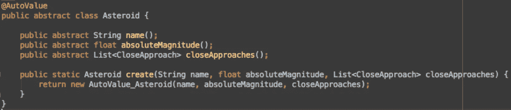

# Java 用 AutoValue 满足了“自动”不可变

> 原文：<https://medium.com/capital-one-tech/java-meets-auto-immutable-with-autovalue-805662dcba8d?source=collection_archive---------1----------------------->

> “希望没有人还在写豆子”——杰克·沃顿

过去，当我第一次开发 Android 应用程序时，我被告知要将数据模型类编写为“bean”——文件中的每个属性都有 getters 和 setters。当时，这是标准，但那是几年前的事了。

最终，Android 开发人员开始意识到 Beans 在某些情况下并不那么好。Beans 的一些缺点是可变性和样板文件。这种可变性违反了线程安全，其他线程可能会覆盖 Beans 的属性。此外，随着类的增长，为每个属性设置 getters 和 setters 会产生大量的样板文件。

但是不用担心！如果你还在写豆子，你不应该感到尴尬或觉得自己是个糟糕的开发者。最近才停写豆子！希望在读完这篇文章后，您也能找到编写 Beans 的替代方法，因为我在这里向您展示了创建和管理数据模型类的更好方法。

# 豆子是什么？

Asteroid model with “Beans” style

下面是一个 Beans 类的例子。这个小行星类有三个属性，每个属性都有 getter 和 setter 来引用和更改它的值。如您所见，这里的一切基本上都是可变的，因为每个属性中都有一个 mutator。因此，您可以从任何类、任何线程中更改这些实例属性。

在某些情况下，你可能需要一个可变的对象，比如一个类， *Comment。评论*允许用户发布、更新和删除。假设*注释*类具有*消息*和*更新数据*属性，并且它们都需要能够初始化、更新和删除。

这些例子怎么样？

*   **你有一个从 API 服务器获取数据并显示在 Android 屏幕上的应用。**
*   **用户在屏幕上输入一些数据，点击“发送”按钮，数据被发送到 API 服务器。**

在这两种情况下，模型都可以是不可变的。在第一个例子中，当您从 API 服务器获取数据时，您初始化一个数据模型类，并且您将只在任何视图类中引用它的属性来显示它。在第二个例子中，一旦用户输入数据并单击“send”按钮，您初始化一个数据模型并传递给一个 API 调用处理程序类，然后处理程序类只能读取属性以将其发送给服务器。

在这些情况下，只需设置一次数据，之后就可以引用属性了。因此，我们不需要允许这些属性是可变的——没有“Beans”。请记住这些案例，因为我们稍后将回到它。

现在，让我们使用上面的小行星例子，并使类不可变。

# 使其不可改变

Asteroid model with immutable approach

这里，属性只通过构造函数设置一次，每个字段都有一个 getter 来读取值。这个小行星类不是可变的。在“Beans”示例中，我故意省略了 *equals、hashCode* 和 *toString* 函数。然而，如果你写一个完整的模型类，你将需要所有那些函数。虽然 equals 和 hashCode 可能没有那么流行，但您至少应该编写 toString，以便其他开发人员可以看到实际的实例内容，而不是在日志中看到“ *Asteroid@66x1b21* ”。

查看该类，它充满了样板文件，主要是关于*名称、绝对大小*和*接近方式*。我需要知道的所有信息都在前几行，剩下的就是废话了。

你可以说 Android Studio 在你第一次创建文件的时候就生成了所有的 getters，*等于*， *hashCode* 和 *toString* 函数。这部分很简单。但是，当您尝试向现有类添加字段时，问题会变得更加明显。

要向类中添加一个字段，您可以添加:(数一数 fraidy 猫表情符号以获得快速回答)

Adding a single field to an existing model class, as shown using fraidy cat emojis

带有 fraidy 猫表情符号的绿色高亮线是添加的线。在这张图片中你能看到多少表情符号？有六个。添加一个属性需要写的六件事。Android Studio 在这里甚至没有太大的帮助——你基本上需要编写样板文件，没有捷径可走。

除了……如果用“自动赋值”呢？

# AutoValue-您的新好友

[AutoValue](https://github.com/google/auto/tree/master/value) 是一个基于注释的库，它使用简单的注释生成一个不可变的模型类，其中包含自动生成的 equals、hashCode 和 toString。它也给了我们在类中添加自定义函数的灵活性。

此外，还有一些扩展包可用于 Parcelable 和 JSON 转换器。

让我们以上面的小行星类为例，对其使用 AutoValue。

带 Gradle 的安装:

apt ' com . Google . auto . value:auto-value:1.2 '
提供' com . jakewharton . auto . value:auto-value-annotations:1.2-update 1 '

修改小行星类别:

Asteroid model with AutoValue

首先，在类名上添加*自动值*注释。然后将每个字段改为一个“公共抽象”函数；吸气剂的替代品。既然我们把它改成了 abstract，下一步就是把这个类也改成 abstract。然后我们创建一个静态工厂方法来实例化 AutoValue 的 Asteroid 对象。最后，去掉你之前准备好的所有样板文件。所有的人。

Without and With AutoValue

现在，你可能已经注意到班级变得有多小了。我们去掉了所有的 *equals、hashCode、toString* 函数和 getters(嗯，算是吧)。现在，我们或多或少只有我们想看到的信息——一个工厂方法(构造函数)和一些抽象的 getters。

一旦编译了这段代码，AutoValue 会自动生成一个名为$AutoValue_Asteroid 的类，它实现了所有的 getters、equals、hashCode 和 toString。

好吧。这很酷，那么…我如何将 AutoValue 应用到我在这篇文章前面提到的例子中呢？

你使用一个从 API 服务器获取数据并显示在 Android 屏幕上的应用程序。

自动值-Moshi + Retrofit2

我为此选择了[魔石转换器](https://github.com/square/moshi)，但你也可以选择其他转换器，如 Gson、Jackson 等。

用 Gradle 安装:

apt ' com . ryanharter . auto . value:auto-value-Moshi:0 . 3 . 0 '

修改小行星类别:

AutoValue with Moshi

为了让 AutoValue 类与 Moshi 转换器一起工作，如果需要的话，可以在抽象的 getter 行上添加 Json 注释。然后添加此块:

公共静态 JSON adapter<asteroid>JSON adapter(Moshi Moshi){
返回新的 AutoValue_Asteroid。MoshiJsonAdapter(莫希)；
}</asteroid>

如果一个类用于 JSON 响应，您可以删除一个工厂函数，这由转换器负责。

要将此应用于 HTTP 客户端 Retrofit2，您需要创建如下所示的翻新构建器:

Apply AutoValue Moshi to Retrofit2

代码的其余部分与您通常使用 Retrofit2 和 Android framework 编写的代码相同。

# 综上

AutoValue 引入了两个主要优势:它会自动创建一个不可变的对象，并清除数据模型类中的大部分样板文件。它还可以很好地与 Parcelable 和 JSON converter 配合使用。在某些情况下，您可能需要一个可变对象。然而，如果不是这样，为什么不用 AutoValue 使它不可变呢！

## 为了进一步阅读

*我推荐瑞安·哈特的这篇文章:
[http://ryanharter.com/blog/2016/05/16/autovalue-extensions/](http://ryanharter.com/blog/2016/05/16/autovalue-extensions/)

*几个月前，我偶然看到杰克·沃顿的一个演示视频。这个视频是 2016 年我最喜欢的 Android 视频之一，我肯定会推荐观看它。

*原载于*[*developer.capitalone.com*](https://developer.capitalone.com/blog-post/java-meets-immutable-with-autovalue/)*。*

如需了解更多关于 Capital One 的 API、开源、社区活动和开发人员文化的信息，请访问我们的一站式开发人员门户网站 DevExchange。【https://developer.capitalone.com/】