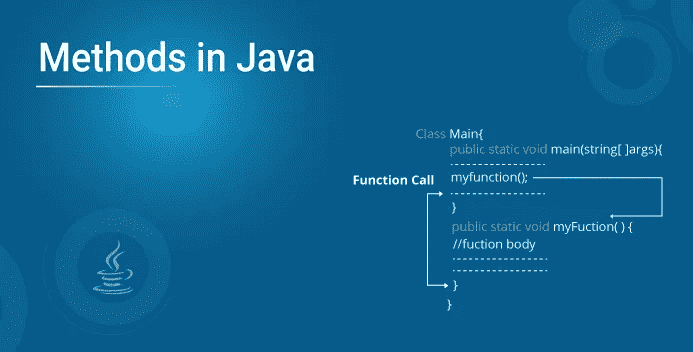
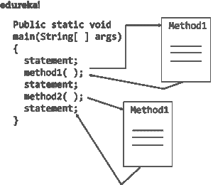

# Java 中的方法有哪些？从头开始了解 Java 方法

> 原文：<https://medium.com/edureka/java-methods-edureka-a489004edf81?source=collection_archive---------3----------------------->



Java 是一种通用编程语言，你需要一个函数来对应用程序执行所需的操作。这些函数通常被称为方法。在本文中，您将了解 Java 中的方法到底是如何工作的。

本文讨论了以下主题:

*   什么是方法？
*   Java 中不同类型的方法
*   标准库方法
*   用户定义的方法
*   如何创建方法？
*   如何调用方法/方法调用
*   方法参数
*   方法调用的内存分配

我们开始吧！

# 什么是方法？

一个方法基本上是一组通过名字引用的代码，可以在程序的任何地方调用，只要利用方法的名字。每个方法都有自己的名字。当该名称在程序中时，执行分支到该方法的主体。假设方法完成，控制返回到调用它的代码区域，程序继续执行下一行代码。



方法基本上被称为**省时器**，这意味着它们允许你不必重新输入代码就可以重复代码段。除此之外，方法还可以在新开发的程序中被保存和反复使用。这些**方法**用于执行特定的动作，它们也被称为 as 函数。

# Java 中不同类型的方法

谈到所使用的不同类型的方法，有两种类型，它们是:

*   标准库方法
*   用户定义的方法

下面我们来详细了解一下。

## 标准库方法

标准库方法是中的内置方法，随时可供使用。这些标准库与 Java 档案(*)中的 Java 类库一起提供。jar)文件与 JVM 和 JRE。

**如何使用标准库？**

文件 *stdlib.jar* 将所有标准库放在一个文件中。要访问这些库，您必须将 *stdlib.jar* 添加到您的 **Java 类路径中。有几种方法可以做到这一点。您可以通过以下两种方式做到这一点:**

```
% javac-introcs MyProject.java % java-introcs MyProject
```

标准库的一些例子有:

*   **print():** 这个方法属于 *java.io.PrintSteam* ，它帮助打印写在报价中的字符串。
*   **sqrt():** 这是 Math 类的一个方法，返回特定数字的平方根。

# **如何创建方法？**

方法必须在特定的类中声明。它由方法名定义，后跟括号“()”。Java 提供了一些预定义的方法，比如 *System.out.println()* 等等。

**语法:**

```
public static int methodName(int x, int y) { // body }
```

上面的代码可以分解为:

*   **公共静态**—访问修改器
*   **int**—返回类型
*   **方法名称**—方法的名称
*   **x，y**—形式参数
*   **int x，int y**—参数列表

方法定义由方法头和方法体组成。

现在，我们来了解一下如何在 Java 中创建一个用户自定义的方法？

## **如何在 Java 中创建自定义方法？** **语法:**

```
public static void my() 
{ 
System.out.println("My Function is created"); }
```

这里定义了一个名为 myMethod()的方法。

您可以在函数名前看到三个访问修饰符——public、static 和 void。

*   **public** 关键字使 myMethod()方法成为公共的。可以从类外部访问公共成员。要了解更多信息，请访问:*Java 中的访问修饰符*
*   **static** 关键字表示无需创建类的对象就可以访问该方法。
*   void 关键字表示该方法不返回任何值。

# 如何调用方法/方法调用？

要在 Java 中调用一个方法，你必须写下方法的名字，后跟括号 ***()*** 和一个分号

对于在程序中使用方法，应该调用它。调用方法有两种方式，即方法返回值或不返回值。

方法调用的过程很简单。当程序调用一个方法时，程序控制自动转移到被调用的方法。该被调用方法在以下两种情况下将控制权返回给调用方，即:

*   当执行*返回*语句时。
*   当控件到达结束大括号的方法时。

在这种情况下，

*   当 Java 执行程序代码时，它会遇到代码中的方法。
*   然后，执行分支到 myFunction()方法，并执行该方法体内的代码。
*   方法体内部的代码执行完成后，程序返回原始状态，执行下一条语句。

让我们通过定义一个 Java 类来看看 Java 方法的实际应用。

```
**class** Main {
**public** **static** **void** main(String[] args) {
System.out.println("In order to encounter a method");
// method call
myMethod();
System.out.println("the method was executed successfully!");
// method definition
**private** **static** **void** myMethod(){
System.out.println("Printing from inside myMethod()!");
}
}
```

当您运行该程序时，输出将是:

为了遇到一个从 myMethod()内部打印的方法
！
方法执行成功！

现在我们来谈谈方法参数。

# **方法参数**

参数在类中的方法名后面的括号内指定。您可以添加任意数量的参数，但只需用逗号分隔即可。数据可以作为参数传递给函数。实际上，参数在方法内部充当*变量*。

让我们看一个例子来理解这一点。

```
**public** **class** MyClass
{
**static** **void** myMethod(String fname)
{
System.out.println(fname + " Certification course");
}
**public** **static** **void** main(String[] args)
{
myMethod("Java");
myMethod("Kotlin");
myMethod("Selenium");
}
}
```

其输出将是:

Java 认证课程
科特林认证课程
硒认证课程

您也可以使用任何原始数据类型或内置 Java 类作为参数的数据类型，或者您也可以使用自己的类作为参数类型。

这是关于 Java 中的方法参数。

现在，让我们了解如何为被调用的方法分配内存。

**方法调用的内存分配**

*   方法调用是通过堆栈实现的。
*   每当堆栈调用一个方法时，就会在堆栈区域内创建一个框架。
*   之后，参数被传递给，局部变量和被调用方法返回的值被存储在堆栈框架中。
*   当被调用方法的执行完成时，分配的堆栈帧将被删除。
*   还有一个堆栈指针寄存器，跟踪堆栈的顶部，可以相应地进行调整。

这就把我们带到了本文的结尾，在这里我们学习了关于 Java 方法的常见问题*。确保你尽可能多的练习，恢复你的经验。我希望你发现它信息丰富。如果你想查看更多关于人工智能、DevOps、道德黑客等市场最热门技术的文章，那么你可以参考 [Edureka 的官方网站。](https://www.edureka.co/blog/?utm_source=medium&utm_medium=content-link&utm_campaign=java-methods)*

请留意本系列中解释 Java 其他各方面的其他文章。

> *1。* [*面向对象编程*](/edureka/object-oriented-programming-b29cfd50eca0)
> 
> *2。*[*Java 中的继承*](/edureka/inheritance-in-java-f638d3ed559e)
> 
> *3。*[*Java 中的多态性*](/edureka/polymorphism-in-java-9559e3641b9b)
> 
> *4。*[*Java 中的抽象*](/edureka/java-abstraction-d2d790c09037)
> 
> *5。* [*Java 字符串*](/edureka/java-string-68e5d0ca331f)
> 
> *6。* [*Java 数组*](/edureka/java-array-tutorial-50299ef85e5)
> 
> *7。* [*Java 集合*](/edureka/java-collections-6d50b013aef8)
> 
> *8。* [*Java 线程*](/edureka/java-thread-bfb08e4eb691)
> 
> *9。*[*Java servlet 简介*](/edureka/java-servlets-62f583d69c7e)
> 
> *10。* [*Servlet 和 JSP 教程*](/edureka/servlet-and-jsp-tutorial-ef2e2ab9ee2a)
> 
> *11。*[*Java 中的异常处理*](/edureka/java-exception-handling-7bd07435508c)
> 
> 12。 [*Java 教程*](/edureka/java-tutorial-bbdd28a2acd7)
> 
> *13。* [*Java 面试题*](/edureka/java-interview-questions-1d59b9c53973)
> 
> *14。* [*Java 程序*](/edureka/java-programs-1e3220df2e76)
> 
> 15。 [*科特林 vs Java*](/edureka/kotlin-vs-java-4f8653f38c04)
> 
> 16。 [*依赖注入使用 Spring Boot*](/edureka/what-is-dependency-injection-5006b53af782)
> 
> 17。 [*堪比 Java 中的*](/edureka/comparable-in-java-e9cfa7be7ff7)
> 
> *18。* [*十大 Java 框架*](/edureka/java-frameworks-5d52f3211f39)
> 
> *19。* [*Java 反射 API*](/edureka/java-reflection-api-d38f3f5513fc)
> 
> 20。[*Java 中的 30 大模式*](/edureka/pattern-programs-in-java-f33186c711c8)
> 
> *21。* [*核心 Java 备忘单*](/edureka/java-cheat-sheet-3ad4d174012c)
> 
> *22。*[*Java 中的套接字编程*](/edureka/socket-programming-in-java-f09b82facd0)
> 
> *23。* [*Java OOP 备忘单*](/edureka/java-oop-cheat-sheet-9c6ebb5e1175)
> 
> *24。*[*Java 中的注释*](/edureka/annotations-in-java-9847d531d2bb)
> 
> *25。*[*Java 中的库管理系统项目*](/edureka/library-management-system-project-in-java-b003acba7f17)
> 
> *26。*[*Java 中的树*](/edureka/java-binary-tree-caede8dfada5)
> 
> *27。*[*Java 中的机器学习*](/edureka/machine-learning-in-java-db872998f368)
> 
> *28。* [*顶级数据结构&Java 中的算法*](/edureka/data-structures-algorithms-in-java-d27e915db1c5)
> 
> *29。* [*Java 开发人员技能*](/edureka/java-developer-skills-83983e3d3b92)
> 
> 三十岁。 [*前 55 名 Servlet 面试问题*](/edureka/servlet-interview-questions-266b8fbb4b2d)
> 
> 31。 [](/edureka/java-exception-handling-7bd07435508c)[*顶级 Java 项目*](/edureka/java-projects-db51097281e3)
> 
> *32。* [*Java 字符串备忘单*](/edureka/java-string-cheat-sheet-9a91a6b46540)
> 
> 33。[*Java 中的嵌套类*](/edureka/nested-classes-java-f1987805e7e3)
> 
> 34。 [*Java 集合面试问答*](/edureka/java-collections-interview-questions-162c5d7ef078)
> 
> *35。*[*Java 中如何处理死锁？*](/edureka/deadlock-in-java-5d1e4f0338d5)
> 
> *36。* [*你需要知道的 50 大 Java 合集面试问题*](/edureka/java-collections-interview-questions-6d20f552773e)
> 
> *37。*[*Java 中的字符串池是什么概念？*](/edureka/java-string-pool-5b5b3b327bdf)
> 
> 38。[*C、C++和 Java 有什么区别？*](/edureka/difference-between-c-cpp-and-java-625c4e91fb95)
> 
> 39。[*Java 中的回文——如何检查一个数字或字符串？*](/edureka/palindrome-in-java-5d116eb8755a)
> 
> *40。* [*你需要知道的顶级 MVC 面试问答*](/edureka/mvc-interview-questions-cd568f6d7c2e)
> 
> *41。*[*Java 编程语言的十大应用*](/edureka/applications-of-java-11e64f9588b0)
> 
> *42。*[*Java 中的死锁*](/edureka/deadlock-in-java-5d1e4f0338d5)
> 
> *43。*[*Java 中的平方和平方根*](/edureka/java-sqrt-method-59354a700571)
> 
> *44。*[*Java 中的类型转换*](/edureka/type-casting-in-java-ac4cd7e0bbe1)
> 
> *45。*[*Java 中的运算符及其类型*](/edureka/operators-in-java-fd05a7445c0a)
> 
> *46。*[*Java 中的析构函数*](/edureka/destructor-in-java-21cc46ed48fc)
> 
> *47。* [*爪哇*二分搜索法](/edureka/binary-search-in-java-cf40e927a8d3)
> 
> 48。[*Java 中的 MVC 架构*](/edureka/mvc-architecture-in-java-a85952ae2684)
> 
> *49。* [*冬眠面试问答*](/edureka/hibernate-interview-questions-78b45ec5cce8)

*原载于 2019 年 7 月 29 日 https://www.edureka.co**T21*[。](https://www.edureka.co/blog/java-methods/)