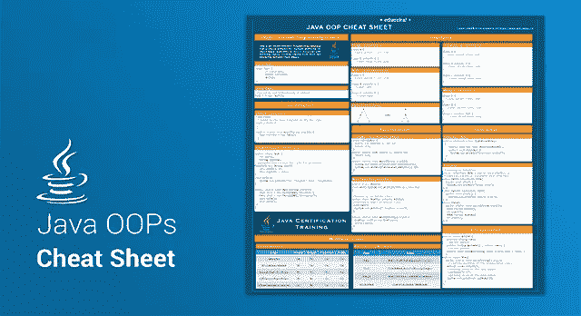

# Java OOP 备忘单——Java 面向对象编程快速指南

> 原文：<https://medium.com/edureka/java-oop-cheat-sheet-9c6ebb5e1175?source=collection_archive---------0----------------------->

Java OOPs Cheat Sheet — Edureka

面向对象编程(或者更好地称为 OOPs)是 Java 的主要支柱之一，它充分利用了其强大的功能和易用性。如果你是一个有抱负的 Java 开发人员，你肯定需要对 Java OOPs 概念有一个完美的控制。为了帮助你，我给你带来了 **Java OOP 小抄**。这个 Java OOP 备忘单将作为一个速成班…