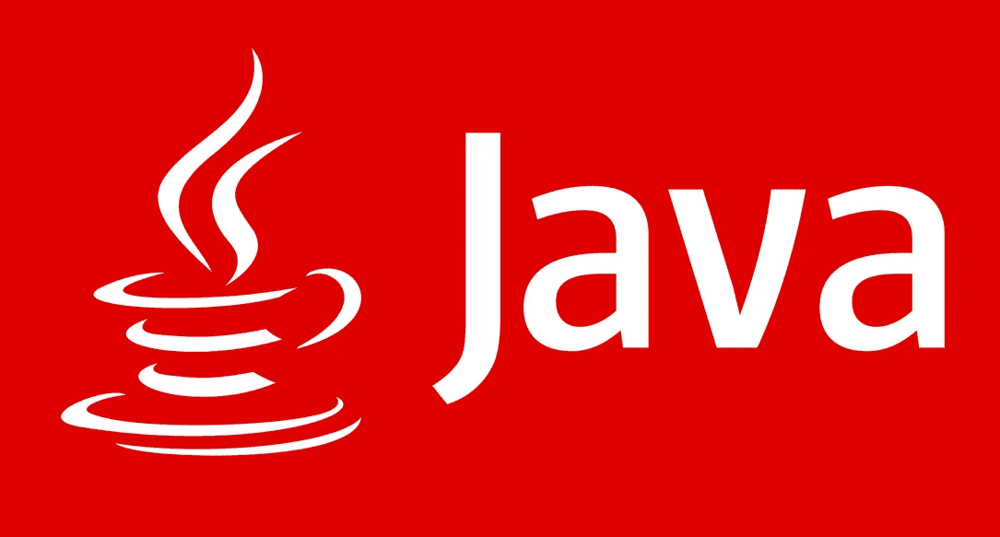

# Java —编程指南

> 原文：<https://medium.com/quick-code/java-programming-guide-18010407fc92?source=collection_archive---------0----------------------->

## Java 编程入门

ImageCredit-[https://techaeris.com](https://techaeris.com)

在我们的第一个学习路径中介绍了 Python 作为新兴语言之后，我们决定选择 Java 作为下一个编程指南的冠军。

## 概观

我认为任何新的或旧的现代程序员都需要关于 Java 的介绍。20 世纪和 21 世纪最有影响力的语言之一。从无数的网站、网络应用，甚至我们自己钟爱的 Android 都是基于 Java 的。谈到就业前景，即使根据 2019 年 3 月的最新 [Tiobe 指数](https://www.tiobe.com/tiobe-index/)，Java 也稳坐第一语言的宝座。所以如果你是抱着就业前景想学 Java 的，可以吗？这个选择不会错的。Java 作为编程语言的应用可能是最广泛的，几乎被每一家财富 1000 强公司所使用。

# 关注 Java 的初学者主题[第 1–7 天]

1.  下载并安装 JDK、类路径、IDE
2.  设置 Java 项目

3.写下你的第一首“你好，世界！”以及了解 System.out.println 语句的完整工作方式

4.变量、整数、字符串、布尔、字符数据类型介绍

5.完全理解变量、类、对象

6.条件语句(if、else-if、else 块)

7.循环和数组

8.方法和功能

9.包装和罐子

对于初学者来说，你可以在我们的平台 QuickCode 上查看下面列出的 **Java 课程**。

 [## Java 初学者-免费在线课程|快速代码

### 浏览 Java 的基本知识

www.quickcode.co](http://www.quickcode.co/free/course/learn/Java-for-beginners/361?utm_source=mediumPub&utm_medium=social&utm_campaign=LG_Java&utm_term=JavaGuide) 

# 关注 Java 的中级主题[第 9-15 天]

9.Junit 测试

10.对象继承，接口

11.抽象类，多态

12.字处理

13.异常处理

对于中级，您可以查看以下顶级免费 Java 课程之一:

 [## 100%折扣-完成 Java 课程:从零到英雄- Udemy 免费课程优惠券

### 从头开始学习 Java。通过这个完整的课程，在 Java 中从零到英雄。

www.quickcode.co](http://www.quickcode.co/free/course/learn/Complete-Java-Course:-Go-from-zero-to-hero/3142?utm_source=mediumPub&utm_medium=social&utm_campaign=LG_Java&utm_term=JavaGuide) 

# 关注 Java 的高级主题[第 16–25 天]

13.数据库操作，JDBC

14.多线程操作

15.集合和顺序编程

16.数据结构

17.排序和搜索算法

18.网络编程

对于高级 Java，您可以查看以下顶级免费 Java 课程之一:

 [## 95%折扣-面向初学者和高级开发人员的 Java 编程教程- Eduonix 课程优惠券

### 在本教程中，逐步学习核心 java 编程原则和高级 Java 概念。要提高你的 Java…

www.quickcode.co](http://www.quickcode.co/free/course/learn/Java-Programming-Tutorial-for-Beginners---Advanced-Developers-/2870?utm_source=mediumPub&utm_medium=social&utm_campaign=LG_Java&utm_term=JavaGuide) 

# 用 Java 开发项目的专门框架[第 18-30 天]

16.spring Framework with Java-web 应用程序开发专业工作中使用最广泛的框架。

17.Android 开发-

18.大数据- Apache HA

19.用 Java 开发游戏

20.人工智能与 Java

 [## 95 折- Java Spring 教程大师班-学习 Spring 框架 5 - Udemy 优惠券

### 找不到好的春季教程？终于明白 Spring 5 有 Spring Core，Spring MVC，Spring Boot 2 等等

www.quickcode.co](http://www.quickcode.co/free/course/learn/Java-Spring-Tutorial-Masterclass---Learn-Spring-Framework-5/2835?utm_source=mediumPub&utm_medium=social&utm_campaign=LG_Java&utm_term=JavaGuide)  [## Android 开发的 Java 基础——免费在线课程|快速代码

### 获得 Java 基础知识的入门级技能和知识，并介绍 Android Studio，为以下领域打下坚实的基础

www.quickcode.co](http://www.quickcode.co/free/course/learn/Java-Fundamentals-for-Android-Development/2086?utm_source=mediumPub&utm_medium=social&utm_campaign=LG_Java&utm_term=JavaGuide)  [## 面向数据科学的 Python 免费在线课程|快速代码

### 学习使用强大的开源 Python 工具，包括 Pandas、Git 和 Matplotlib，来操作、分析和…

www.quickcode.co](https://www.quickcode.co/free/course/learn/Python-for-Data-Science/2441?utm_source=mediumPub&utm_medium=social&utm_campaign=LG_Java&utm_term=JavaGuide) 

## 为找工作而复习的补充技能

顺便说一下，编程的就业市场是这样的，一种语言可能无法满足一个角色的所有要求。它需要搭配一些补充性的语言或技术技能，这将有助于你在一家拥有多个系统的公司工作。因此，为了增加你的工作机会，你应该让他们至少具备一种(如果不是更多的话)额外的编程语言技能:

1.  基本 HTML、CSS(用于 web 开发)
2.  基本 Javascript，Jquery(用于 web 开发)
3.  基本 SQL(任何角色都必须具备)
4.  Pig、Hive、HBase(针对大数据角色)
5.  线性代数(用于机器学习角色)

如果您需要修改以上任何课程，您可以在这里搜索我们同一平台的免费课程之一[。](https://www.quickcode.co/)

# Java 瞄准的热门工作角色

我们都想在学了东西之后有所成就，尤其是像编程这样严谨的东西。众所周知，未来的大部分工作将围绕计算机编程、编码和其他相关技能展开。当然，许多人学习是出于他们自己的兴趣或者是为了自己的应用。但是，如果你正在努力学习之后寻找工作，那么你可以将 Java 作为你编程技能的一些工作角色:

1.  软件工程师
2.  Web 应用程序开发人员
3.  大数据开发者
4.  Java 开发人员
5.  Java Hadoop 专家
6.  Java Spark 专家
7.  使用 Java 的人工智能软件工程师
8.  机器学习工程师 Java

# 结论

本文是我们新系列“编程指南”的第二篇，旨在帮助学生有计划地学习一门新语言。这是我们在与一些用户交谈后发现的痛点基础上采取的举措。我们认为这将有助于学生在对自己选择的主题感兴趣时寻找一些示例课程。此外，下一步，他们在考虑特定的工作角色时，还可能需要哪些补充技能。

然而，总有做得更好的余地。因此，如果你愿意分享任何想法来帮助我们更好地计划我们的下一篇文章，这是非常好的。无论是同一系列中的下一个学习路径，还是我们可以提供更好帮助的其他领域。Quickcode 将永远欢迎您的想法、赞赏和任何类型的反馈。

*原载于 2019 年 3 月 28 日*[*【www.quickcode.co】*](http://www.quickcode.co/learning-guide/learn-java-guide)*。*