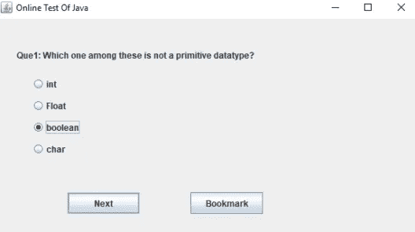
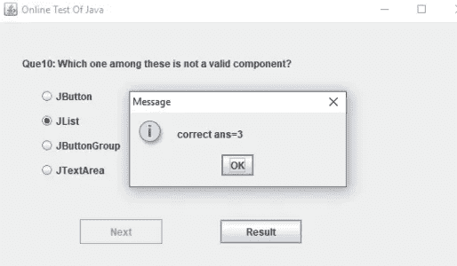
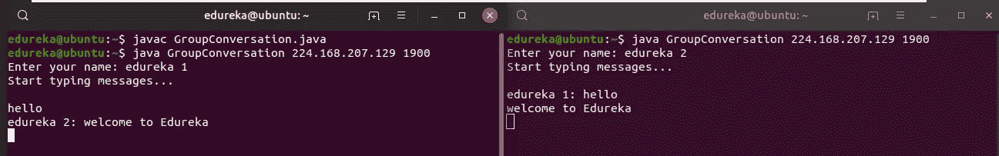

# 2021 年你需要知道的顶级 Java 项目

> 原文：<https://medium.com/edureka/java-projects-db51097281e3?source=collection_archive---------0----------------------->


Java Projects — Edureka

对 **Java** 的需求永无止境，许多顶级**跨国公司**都在寻找 **Java 开发人员。如今，拥有 java 实践经验和尝试 java 项目将会为你的简历增加砝码。在本文中，我们将尝试 2021 年你需要知道的前 5 个项目。**

# 在线考试

这个特定的项目旨在提供一个用户界面，该界面询问**多项选择**问题，并将用户的输入作为答案，然后，最终评估所有问题，并将输出作为个人**结果返回。**

```
package Edureka;

import java.awt.*;
import java.awt.event.*;
import javax.swing.*;

class OnlineTest extends JFrame implements ActionListener {
       JLabel l;
       JRadioButton jb[] = new JRadioButton[5];
       JButton b1, b2;
       ButtonGroup bg;
       int count = 0, current = 0, x = 1, y = 1, now = 0;
       int m[] = new int[10];

       OnlineTest(String s) {
              super(s);
              l = new JLabel();
              add(l);
              bg = new ButtonGroup();
              for (int i = 0; i < 5; i++) {
              jb[i] = new JRadioButton();
              add(jb[i]);
              bg.add(jb[i]);
        }
        b1 = new JButton("Next");
        b2 = new JButton("Bookmark");
        b1.addActionListener(this);
        b2.addActionListener(this);
        add(b1);
        add(b2);
        set();
        l.setBounds(30, 40, 450, 20);
        jb[0].setBounds(50, 80, 100, 20);
        jb[1].setBounds(50, 110, 100, 20);
        jb[2].setBounds(50, 140, 100, 20);
        jb[3].setBounds(50, 170, 100, 20);
        b1.setBounds(100, 240, 100, 30);
        b2.setBounds(270, 240, 100, 30);
        setDefaultCloseOperation(JFrame.EXIT_ON_CLOSE);
        setLayout(null);
        setLocation(250, 100);
        setVisible(true);
        setSize(600, 350);
}

public void actionPerformed(ActionEvent e) {
        if (e.getSource() == b1) {
              if (check())
                    count = count + 1;
                    current++;
                    set();
              if (current == 9) {
                    b1.setEnabled(false);
                    b2.setText("Result");
              }
        }
        if (e.getActionCommand().equals("Bookmark")) {
              JButton bk = new JButton("Bookmark" + x);
              bk.setBounds(480, 20 + 30 * x, 100, 30);
              add(bk);
              bk.addActionListener(this);
              m[x] = current;
              x++;
              current++;
              set();
              if (current == 9)
                    b2.setText("Result");
                    setVisible(false);
                    setVisible(true);
              }
              for (int i = 0, y = 1; i < x; i++, y++) {
                    if (e.getActionCommand().equals("Bookmark" + y)) {
                          if (check())
                          count = count + 1;
                          now = current;
                          current = m[y];
                          set();
                          ((JButton) e.getSource()).setEnabled(false);
                          current = now;
                    }
              }

              if (e.getActionCommand().equals("Result")) {
                     if (check())
                     count = count + 1;
                     current++;
                     JOptionPane.showMessageDialog(this, "correct ans=" + count);
                     System.exit(0);
              }
        }
        void set() {
                 jb[4].setSelected(true);
                 if (current == 0) {
                     l.setText("Que1: Which one among these is not a primitive datatype?");
                     jb[0].setText("int");
                     jb[1].setText("Float");
                     jb[2].setText("boolean");
                     jb[3].setText("char");
                 }
                 if (current == 1) {
                     l.setText("Que2: Which class is available to all the class automatically?");
                     jb[0].setText("Swing");
                     jb[1].setText("Applet");
                     jb[2].setText("Object");
                     jb[3].setText("ActionEvent");
                 }
                 if (current == 2) {
                     l.setText("Que3: Which package is directly available to our class without importing it?");
                     jb[0].setText("swing");
                     jb[1].setText("applet");
                     jb[2].setText("net");
                     jb[3].setText("lang");
                 }
                 if (current == 3) {
                     l.setText("Que4: String class is defined in which package?");
                     jb[0].setText("lang");
                     jb[1].setText("Swing");
                     jb[2].setText("Applet");
                     jb[3].setText("awt");
                 }
                 if (current == 4) {
                     l.setText("Que5: Which institute is best for java coaching?");
                     jb[0].setText("Utek");
                     jb[1].setText("Aptech");
                     jb[2].setText("SSS IT");
                     jb[3].setText("jtek");
                 }
                 if (current == 5) {
                     l.setText("Que6: Which one among these is not a keyword?");
                     jb[0].setText("class");
                     jb[1].setText("int");
                     jb[2].setText("get");
                     jb[3].setText("if");
                 }
                 if (current == 6) {
                     l.setText("Que7: Which one among these is not a class? ");
                     jb[0].setText("Swing");
                     jb[1].setText("Actionperformed");
                     jb[2].setText("ActionEvent");
                     jb[3].setText("Button");
                 }
                 if (current == 7) {
                     l.setText("Que8: which one among these is not a function of Object class?");
                     jb[0].setText("toString");
                     jb[1].setText("finalize");
                     jb[2].setText("equals");
                     jb[3].setText("getDocumentBase");
                 }
                 if (current == 8) {
                     l.setText("Que9: which function is not present in Applet class?");
                     jb[0].setText("init");
                     jb[1].setText("main");
                     jb[2].setText("start");
                     jb[3].setText("destroy");
                 }
                 if (current == 9) {
                     l.setText("Que10: Which one among these is not a valid component?");
                     jb[0].setText("JButton");
                     jb[1].setText("JList");
                     jb[2].setText("JButtonGroup");
                     jb[3].setText("JTextArea");
                 }
                 l.setBounds(30, 40, 450, 20);
                 for (int i = 0, j = 0; i <= 90; i += 30, j++)
                 jb[j].setBounds(50, 80 + i, 200, 20);
         }

        boolean check() {
              if (current == 0)
                      return (jb[1].isSelected());
              if (current == 1)
                      return (jb[2].isSelected());
              if (current == 2)
                      return (jb[3].isSelected());
              if (current == 3)
                      return (jb[0].isSelected());
              if (current == 4)
                      return (jb[2].isSelected());
              if (current == 5)
                      return (jb[2].isSelected());
              if (current == 6)
                      return (jb[1].isSelected());
              if (current == 7)
                      return (jb[3].isSelected());
              if (current == 8)
                      return (jb[1].isSelected());
              if (current == 9)
                      return (jb[2].isSelected());
              return false;
         }

         public static void main(String s[]) {
                new OnlineTest("Online Test Of Java");
       }
}
```

## **输出**



**//回答完所有问题后的最终输出**



下一个项目是小组对话。

# 小组对话

该项目旨在提供多个终端之间的**群组对话**。相同的代码如下。用户必须注意**端口号**和 **IP 地址。**相同的代码如下。

```
package groupchat;

import java.net.*;
import java.io.*;
import java.util.*;

public class GroupConversation {
        private static final String TERMINATE = "Exit";
        static String name;
        static volatile boolean finished = false;
        public static void main(String[] args) {
               if (args.length != 2)
                       System.out.println("Two arguments required: <multicast-host> <port-number>");
               else {
                       try {
                             InetAddress group = InetAddress.getByName(args[0]);
                             int port = Integer.parseInt(args[1]);
                             Scanner sc = new Scanner(System.in);
                             System.out.print("Enter your name: ");
                             name = sc.nextLine();
                             MulticastSocket socket = new MulticastSocket(port);
                             socket.setTimeToLive(0);
                             socket.joinGroup(group);
                             Thread t = new Thread(new ReadThread(socket, group, port));
                             t.start();
                             System.out.println("Start typing messages...n");
                             while (true) {
                                    String message;
                                    message = sc.nextLine();
                                    if (message.equalsIgnoreCase(GroupConversation.TERMINATE)) {
                                          finished = true;
                                          socket.leaveGroup(group);
                                          socket.close();
                                          break;
                                    }
                                    message = name + ": " + message;
                                    byte[] buffer = message.getBytes();
                                    DatagramPacket datagram = new DatagramPacket(buffer, buffer.length, group, port);
                                    socket.send(datagram);
                             }
                       } 
                       catch (SocketException se) {
                             System.out.println("Error creating socket");
                             se.printStackTrace();
                       } 
                       catch (IOException ie) {
                             System.out.println("Error reading/writing from/to socket");
                             ie.printStackTrace();
                       }
               }
        }
}

class ReadThread implements Runnable {
         private MulticastSocket socket;
         private InetAddress group;
         private int port;
         private static final int MAX_LEN = 1000;
         ReadThread(MulticastSocket socket, InetAddress group, int port) {
                this.socket = socket;
                this.group = group;
                this.port = port;
         }
         [@Override](http://twitter.com/Override)
          public void run() {
                while (!GroupConversation.finished) {
                        byte[] buffer = new byte[ReadThread.MAX_LEN]; 
                        DatagramPacket datagram = new DatagramPacket(buffer, buffer.length, group, port);
                        String message;
                try {
                        socket.receive(datagram);
                        message = new String(buffer, 0, datagram.getLength(), "UTF-8");
                        if (!message.startsWith(GroupConversation.name))
                                System.out.println(message);
                        } 
                        catch (IOException e) {
                                System.out.println("Socket closed!");
                        }
                 }
          }
}
```

## **//输出**



下一个项目是 OTP 生成器

# OTP 生成器

这个项目被设计成使用**随机函数实时生成 **OTP** 。**同样的代码如下。

```
package otp;
import java.util.*;

public class Edureka {
       static char[] OTP(int len) {
             System.out.println("Generating OTP using random() : ");
             System.out.print("Your OTP is : ");
             String numbers = "0123456789";
             Random rndm_method = new Random();
             char[] otp = new char[len];
             for (int i = 0; i < len; i++) {
                    otp[i] = numbers.charAt(rndm_method.nextInt(numbers.length()));
             }
             return otp;
       }
       public static void main(String[] args) {
             int length = 4;
             System.out.println(OTP(length));
       }
}
```

**//输出**

`Generating OTP using random() :`


下一个项目是密码生成器

# **密码生成器**

该项目旨在使用**随机函数实时生成**密码**。**相同的代码如下。

```
package OTP_Generator;

import java.util.*;
public class Edureka {
     public static void main(String[] args) {
          int length = 10;
          System.out.println(geek_Password(length));
     }
     static char[] geek_Password(int len) {
          System.out.println("Generating password using random() : ");
          System.out.print("Your new password is : ");
          String Capital_chars = "ABCDEFGHIJKLMNOPQRSTUVWXYZ";
          String Small_chars = "abcdefghijklmnopqrstuvwxyz";
          String numbers = "0123456789";
          String symbols = "!@#$%^&*_=+-/.?<>)";
          String values = Capital_chars + Small_chars + numbers + symbols;
          Random rndm_method = new Random();
          char[] password = new char[len];
          for (int i = 0; i < len; i++) {
                password[i] = values.charAt(rndm_method.nextInt(values.length()));
          }
          return password;
     }
}
```

## **//输出**

`Generating password using random() :` T41`Your new password is : /vZr_QsZNm`

至此，本 Java 项目教程到此结束。我希望您已经理解了这些 Java 项目及其实现。

如果你想查看更多关于人工智能、DevOps、道德黑客等市场最热门技术的文章，那么你可以参考 [Edureka 的官方网站。](https://www.edureka.co/blog/?utm_source=medium&utm_medium=content-link&utm_campaign=java-projects)

请留意本系列中的其他文章，它们将解释 Java 的各个方面。

> 1.[面向对象编程](/edureka/object-oriented-programming-b29cfd50eca0)
> 
> 2.[Java 中的继承](/edureka/inheritance-in-java-f638d3ed559e)
> 
> 3.[Java 中的多态性](/edureka/polymorphism-in-java-9559e3641b9b)
> 
> 4.[Java 中的抽象](/edureka/java-abstraction-d2d790c09037)
> 
> 5. [Java 字符串](/edureka/java-string-68e5d0ca331f)
> 
> 6. [Java 数组](/edureka/java-array-tutorial-50299ef85e5)
> 
> 7. [Java 集合](/edureka/java-collections-6d50b013aef8)
> 
> 8. [Java 线程](/edureka/java-thread-bfb08e4eb691)
> 
> 9.[Java servlet 简介](/edureka/java-servlets-62f583d69c7e)
> 
> 10. [Servlet 和 JSP 教程](/edureka/servlet-and-jsp-tutorial-ef2e2ab9ee2a)
> 
> 11.[Java 中的异常处理](/edureka/java-exception-handling-7bd07435508c)
> 
> 12.[高级 Java 教程](/edureka/advanced-java-tutorial-f6ebac5175ec)
> 
> 13. [Java 面试问题](/edureka/java-interview-questions-1d59b9c53973)
> 
> 14. [Java 程序](/edureka/java-programs-1e3220df2e76)
> 
> 15.[科特林 vs Java](/edureka/kotlin-vs-java-4f8653f38c04)
> 
> 16.[依赖注入使用 Spring Boot](/edureka/what-is-dependency-injection-5006b53af782)
> 
> 17.[Java 中的可比](/edureka/comparable-in-java-e9cfa7be7ff7)
> 
> 18.[十大 Java 框架](/edureka/java-frameworks-5d52f3211f39)
> 
> 19. [Java 反射 API](/edureka/java-reflection-api-d38f3f5513fc)
> 
> 20.[Java 中的 30 大模式](/edureka/pattern-programs-in-java-f33186c711c8)
> 
> 21.[核心 Java 备忘单](/edureka/java-cheat-sheet-3ad4d174012c)
> 
> 22.[Java 中的套接字编程](/edureka/socket-programming-in-java-f09b82facd0)
> 
> 23. [Java OOP 备忘单](/edureka/java-oop-cheat-sheet-9c6ebb5e1175)
> 
> 24.[Java 中的注释](/edureka/annotations-in-java-9847d531d2bb)
> 
> 25.[Java 中的图书管理系统项目](/edureka/library-management-system-project-in-java-b003acba7f17)
> 
> 26.[Java 中的树](/edureka/java-binary-tree-caede8dfada5)
> 
> 27.[Java 中的机器学习](/edureka/machine-learning-in-java-db872998f368)
> 
> 28.[Java 中的顶级数据结构&算法](/edureka/data-structures-algorithms-in-java-d27e915db1c5)
> 
> 29. [Java 开发者技能](/edureka/java-developer-skills-83983e3d3b92)
> 
> 30.[前 55 名 Servlet 面试问题](/edureka/servlet-interview-questions-266b8fbb4b2d)
> 
> 31. [](/edureka/java-exception-handling-7bd07435508c) [Java 教程](/edureka/java-tutorial-bbdd28a2acd7)
> 
> 32. [Java 字符串备忘单](/edureka/java-string-cheat-sheet-9a91a6b46540)
> 
> 33.[Java 中的嵌套类](/edureka/nested-classes-java-f1987805e7e3)
> 
> 34. [Java 集合面试问答](/edureka/java-collections-interview-questions-162c5d7ef078)
> 
> 35.[Java 中如何处理死锁？](/edureka/deadlock-in-java-5d1e4f0338d5)
> 
> 36.[你需要知道的 50 大 Java 集合面试问题](/edureka/java-collections-interview-questions-6d20f552773e)
> 
> 37.[Java 中的字符串池是什么概念？](/edureka/java-string-pool-5b5b3b327bdf)
> 
> 38.[C、C++和 Java 有什么区别？](/edureka/difference-between-c-cpp-and-java-625c4e91fb95)
> 
> 39.[Java 中的回文——如何检查一个数字或字符串？](/edureka/palindrome-in-java-5d116eb8755a)
> 
> 40.[你需要知道的顶级 MVC 面试问答](/edureka/mvc-interview-questions-cd568f6d7c2e)
> 
> 41.[Java 编程语言的十大应用](/edureka/applications-of-java-11e64f9588b0)
> 
> 42.[Java 中的死锁](/edureka/deadlock-in-java-5d1e4f0338d5)
> 
> 43.[Java 中的平方和平方根](/edureka/java-sqrt-method-59354a700571)
> 
> 44.[Java 中的类型转换](/edureka/type-casting-in-java-ac4cd7e0bbe1)
> 
> 45.[Java 中的运算符及其类型](/edureka/operators-in-java-fd05a7445c0a)
> 
> 46.[Java 中的析构函数](/edureka/destructor-in-java-21cc46ed48fc)
> 
> 47.[Java 中的二分搜索法](/edureka/binary-search-in-java-cf40e927a8d3)
> 
> 48.[Java 中的 MVC 架构](/edureka/mvc-architecture-in-java-a85952ae2684)
> 
> 49.[冬眠面试问答](/edureka/hibernate-interview-questions-78b45ec5cce8)

*原载于 2019 年 9 月 30 日*[*https://www.edureka.co*](https://www.edureka.co/blog/java-projects)*。*