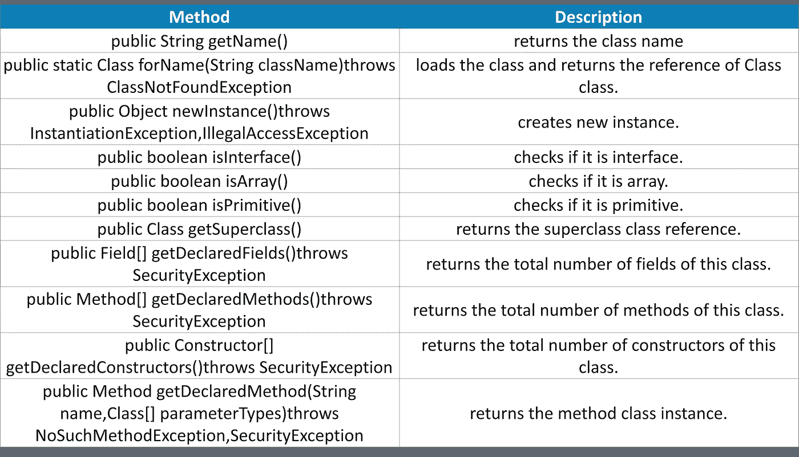

# Java 反射 API:您需要知道的一切

> 原文：<https://medium.com/edureka/java-reflection-api-d38f3f5513fc?source=collection_archive---------3----------------------->


Java Reflection API -Edureka

**Java 反射**是在运行时 **检查或修改类的运行时行为的*过程。Java 反射 API*** 用于操纵类及其成员，包括字段、方法、构造函数等。在运行时。在本文中，我们将详细了解 Java 反射 API。

本文将关注以下几点:

*   Java 反射 API 用在哪里？
*   java.lang.reflect 包中的类
*   java 中使用的方法。郎。班级
*   如何获取 Class class 的对象？
*   使用 Java 反射 API 的优缺点

因此，让我们从这篇关于 Java 反射 API 的文章中的这些指针开始吧

# Java 反射 API 用在哪里？

反射 API 主要用于:

*   IDE(集成开发环境)，例如 Eclipse、MyEclipse、NetBeans 等。
*   调试器
*   测试工具等。

那么 Java lang reflect 包中的 Class 是什么呢？

# java.lang.reflect 包中的类？

下面是 java.lang.package 中实现反射的各种 Java 类的列表

*   字段:这个类用于收集声明性信息，比如数据类型、访问修饰符、变量名和值。
*   **方法**:该类用于收集声明性信息，如方法的访问修饰符、返回类型、名称、参数类型和异常类型。
*   **构造函数**:这个类用于收集声明性信息，比如构造函数的访问修饰符、名称和参数类型。
*   **修饰符**:这个类用于收集关于特定访问修饰符的信息。

不，让我们看看 Java 反射 API 方法，

# java.lang.Class 中使用的方法



让我们继续讨论文章，

# 如何获取 Class class 的对象？

有 3 种方法可以获得类 Class 的实例。它们如下:

*   类 Class 的 forName()方法
*   对象类的 getClass()方法
*   的。类别语法

## 类 Class 的 forName()方法

*   用于动态加载该类。
*   返回 Class class 的实例。
*   如果您知道类的完全限定名，应该使用它。这不能用于基元类型。

让我们看看 forName()方法的简单例子。

```
class Simple{}
class Test{
public static void main(String args[]){
Class c=Class.forName("Simple");
System.out.println(c.getName());
}
}
```

**输出:**

简单的

# Java 反射:对象类的 API getClass()方法

它返回 Class class 的实例。如果你知道类型，就应该使用它。此外，它可以与原语一起使用。

```
class Simple{}
class Test{
void printName(Object obj){
Class c=obj.getClass();
System.out.println(c.getName());
}
public static void main(String args[]){
Simple s=new Simple();
Test t=new Test();
t.printName(s);
}
}
```

**输出:**

简单的

# 的。类别语法

如果一个类型是可用的，但是没有实例，那么可以通过追加来获得一个类。类”添加到该类型的名称。它也可以用于原始数据类型。

```
class Test{
public static void main(String args[]){
Class c = boolean.class;
System.out.println(c.getName());
Class c2 = Test.class;
System.out.println(c2.getName());
}
}
```

**输出:**

布尔型

试验

现在让我们继续这篇 Java 反射 API 文章

# 使用 Java 反射 API 的优缺点

## 使用 Java 反射 API 的优势

*   **可扩展性特性:**应用程序可以通过使用完全限定名创建可扩展性对象的实例来利用外部的、用户定义的类。
*   **调试和测试工具**:调试器使用反射的属性来检查类中的私有成员。

## 使用 Java 反射 API 的缺点

*   **性能开销:**反射操作的性能比非反射操作慢，应该避免在对性能敏感的应用程序中频繁调用的代码段中使用。
*   内部暴露:反射代码打破了抽象，因此可能会随着平台的升级而改变行为。

这样，我们就结束了这篇关于“Java 反射 API”的文章。如果你想查看更多关于人工智能、DevOps、道德黑客等市场最热门技术的文章，那么你可以参考 [Edureka 的官方网站。](https://www.edureka.co/blog/?utm_source=medium&utm_medium=content-link&utm_campaign=java-reflection-api)

请留意本系列中的其他文章，它们将解释 Java 的各个方面。

> 1.[面向对象编程](/edureka/object-oriented-programming-b29cfd50eca0)
> 
> 2.[Java 中的继承](/edureka/inheritance-in-java-f638d3ed559e)
> 
> 3.[Java 中的多态性](/edureka/polymorphism-in-java-9559e3641b9b)
> 
> 4.[Java 中的抽象](/edureka/java-abstraction-d2d790c09037)
> 
> 5. [Java 字符串](/edureka/java-string-68e5d0ca331f)
> 
> 6. [Java 数组](/edureka/java-array-tutorial-50299ef85e5)
> 
> 7. [Java 集合](/edureka/java-collections-6d50b013aef8)
> 
> 8. [Java 线程](/edureka/java-thread-bfb08e4eb691)
> 
> 9.[Java servlet 简介](/edureka/java-servlets-62f583d69c7e)
> 
> 10. [Servlet 和 JSP 教程](/edureka/servlet-and-jsp-tutorial-ef2e2ab9ee2a)
> 
> 11.[Java 中的异常处理](/edureka/java-exception-handling-7bd07435508c)
> 
> 12.[高级 Java 教程](/edureka/advanced-java-tutorial-f6ebac5175ec)
> 
> 13. [Java 面试问题](/edureka/java-interview-questions-1d59b9c53973)
> 
> 14. [Java 程序](/edureka/java-programs-1e3220df2e76)
> 
> 15. [Kotlin vs Java](/edureka/kotlin-vs-java-4f8653f38c04)
> 
> 16.[使用 Spring Boot 的依赖注入](/edureka/what-is-dependency-injection-5006b53af782)
> 
> 17.[堪比 Java](/edureka/comparable-in-java-e9cfa7be7ff7)
> 
> 18.[十大 Java 框架](/edureka/java-frameworks-5d52f3211f39)
> 
> 19. [Java 教程](/edureka/java-tutorial-bbdd28a2acd7)
> 
> 20.[Java 中的 30 大模式](/edureka/pattern-programs-in-java-f33186c711c8)
> 
> 21.[核心 Java 备忘单](/edureka/java-cheat-sheet-3ad4d174012c)
> 
> 22.[Java 中的套接字编程](/edureka/socket-programming-in-java-f09b82facd0)
> 
> 23. [Java OOP 备忘单](/edureka/java-oop-cheat-sheet-9c6ebb5e1175)
> 
> 24.[Java 中的注释](/edureka/annotations-in-java-9847d531d2bb)
> 
> 25.[Java 中的图书管理系统项目](/edureka/library-management-system-project-in-java-b003acba7f17)
> 
> 26.[爪哇的树木](/edureka/java-binary-tree-caede8dfada5)
> 
> 27.[Java 中的机器学习](/edureka/machine-learning-in-java-db872998f368)
> 
> 28.[Java 中的顶级数据结构&算法](/edureka/data-structures-algorithms-in-java-d27e915db1c5)
> 
> 29. [Java 开发者技能](/edureka/java-developer-skills-83983e3d3b92)
> 
> 30.[前 55 个 Servlet 面试问题](/edureka/servlet-interview-questions-266b8fbb4b2d)
> 
> 31. [](/edureka/java-exception-handling-7bd07435508c) [顶级 Java 项目](/edureka/java-projects-db51097281e3)
> 
> 32. [Java 字符串备忘单](/edureka/java-string-cheat-sheet-9a91a6b46540)
> 
> 33.[Java 中的嵌套类](/edureka/nested-classes-java-f1987805e7e3)
> 
> 34. [Java 集合面试问答](/edureka/java-collections-interview-questions-162c5d7ef078)
> 
> 35.[Java 中如何处理死锁？](/edureka/deadlock-in-java-5d1e4f0338d5)
> 
> 36.[你需要知道的 50 大 Java 集合面试问题](/edureka/java-collections-interview-questions-6d20f552773e)
> 
> 37.[Java 中的字符串池是什么概念？](/edureka/java-string-pool-5b5b3b327bdf)
> 
> 38.[C、C++和 Java 有什么区别？](/edureka/difference-between-c-cpp-and-java-625c4e91fb95)
> 
> 39.[Java 中的回文——如何检查一个数字或字符串？](/edureka/palindrome-in-java-5d116eb8755a)
> 
> 40.[你需要知道的顶级 MVC 面试问答](/edureka/mvc-interview-questions-cd568f6d7c2e)
> 
> 41.[Java 编程语言十大应用](/edureka/applications-of-java-11e64f9588b0)
> 
> 42.[Java 中的死锁](/edureka/deadlock-in-java-5d1e4f0338d5)
> 
> 43.[Java 中的平方和平方根](/edureka/java-sqrt-method-59354a700571)
> 
> 44.[Java 中的类型转换](/edureka/type-casting-in-java-ac4cd7e0bbe1)
> 
> 45.[Java 中的运算符及其类型](/edureka/operators-in-java-fd05a7445c0a)
> 
> 46.[Java 中的析构函数](/edureka/destructor-in-java-21cc46ed48fc)
> 
> 47.[Java 中的二分搜索法](/edureka/binary-search-in-java-cf40e927a8d3)
> 
> 48.[Java 中的 MVC 架构](/edureka/mvc-architecture-in-java-a85952ae2684)
> 
> 49.[冬眠面试问答](/edureka/hibernate-interview-questions-78b45ec5cce8)
> 
> 42.[Java 中的死锁](/edureka/deadlock-in-java-5d1e4f0338d5)
> 
> 43.[Java 中的平方和平方根](/edureka/java-sqrt-method-59354a700571)
> 
> 44.[Java 中的类型转换](/edureka/type-casting-in-java-ac4cd7e0bbe1)
> 
> 45.[Java 中的运算符及其类型](/edureka/operators-in-java-fd05a7445c0a)
> 
> 46.[Java 中的析构函数](/edureka/destructor-in-java-21cc46ed48fc)
> 
> 47.[Java 中的二分搜索法](/edureka/binary-search-in-java-cf40e927a8d3)
> 
> 48.[Java 中的 MVC 架构](/edureka/mvc-architecture-in-java-a85952ae2684)
> 
> 49. [Hibernate 面试问答](/edureka/hibernate-interview-questions-78b45ec5cce8)

*原载于 2019 年 7 月 18 日*[*https://www.edureka.co*](https://www.edureka.co/blog/java-reflection-api/)*。*