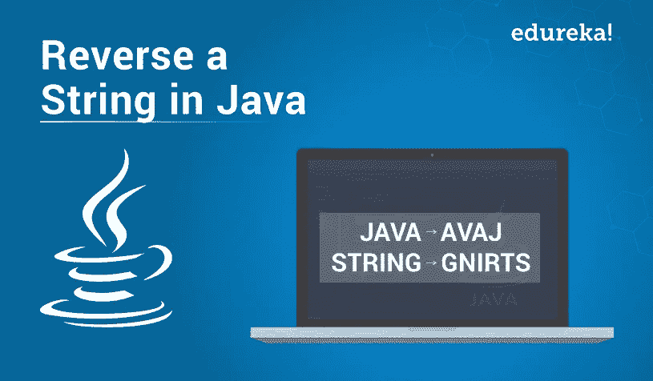

# 如何在 Java 中反转一个字符串？

> 原文：<https://medium.com/edureka/java-reverse-programs-2bfb35dc37f5?source=collection_archive---------2----------------------->



字符串是一个字符序列，在 Java 中被认为是一个对象。在中，您可以对字符串对象执行各种操作。字符串对象上最广泛使用的操作之一是字符串反转。在本文中，我将告诉您在 Java 中反转字符串的各种方法。

在 Java 中，字符串可以用五种不同的方式反转。它们如下:

1.  使用 CharAt 方法反转字符串
2.  使用字符串缓冲区/字符串生成器方法进行字符串反向
3.  使用反向迭代方法反转字符串
4.  使用递归进行字符串反转
5.  颠倒字符串中的字母

现在让我们深入了解每一种方法的细节，从理解如何使用 CharAt 方法在 Java 中反转一个字符串开始。

# 1.使用 CharAt 方法反转字符串

下面给出的 Java 程序将帮助你理解如何反转用户输入的字符串。这里，我使用了***CharAt()*** 方法来从输入字符串中提取字符。 ***CharAt()*** 方法的主要任务是返回给定字符串中指定索引处的字符。然后，我将它们以相反的顺序追加，以反转给定的字符串。这是 Java 中反转字符串的简单方法之一。

```
**package** Edureka;**import** java.util.*;**public** **class** StringReverse{**public** **static** **void** main(String args[]) {String initial, rev="";Scanner in=**new** Scanner(System.in);System.out.println("Enter the string to reverse");initial=in.nextLine();**int** length=initial.length();**for**(**int** i=length-1;i>=0;i--)rev=rev+initial.charAt(i);System.out.println("Reversed string: "+rev);}}
```

当您执行这个程序时，输出如下所示:

```
Enter the string to reverseHELLO EDUREKAReversed string: AKERUDE OLLEH
```

我希望您理解了如何用这个简单的方法反转给定的 Java 字符串。现在让我们进一步了解如何使用 *String Buffer/ StringBuilder 类反转字符串。*

# 2.使用字符串生成器/字符串缓冲区类反转字符串

StringBuffer 和 StringBuilder 由一个内置方法 ***reverse()*** 组成，该方法用于反转 StringBuffer 中的字符。该方法以相反的顺序替换字符序列。下面是使用 StringBuffer 类的内置方法反转字符串的代码。

```
**package** Edureka;**import** java.util.*;**public** **class** StringRev{// Function to reverse a string in Java using StringBuilder**public** **static** String rev(String s){**return** **new** StringBuilder(s).reverse().toString();}**public** **static** **void** main(String[] args){String s= "Welcome to Edureka"; // Note that string is immutable in Javas= rev(s);System.out.println("Result after reversing a string is : "+s);}}
```

执行上述代码时，输出如下所示:

```
Result after reversing a string is : akerudE ot emocleW
```

这都是关于 StringBuilder 类的。或者，您也可以使用一个**string buffer**class*reverse()*方法，就像 **StringBuilder** 一样。让我们看看下面的代码。

```
**package** Edureka;**import** java.util.*;**public** **class** StringRev{// Function to reverse a string in Java using StringBuffer**public** **static** String rev(String s){**return** **new** StringBufferr(s).reverse().toString();}**public** **static** **void** main(String[] args){String s= "Welcome to Edureka";// Note that string is immutable in Javas= rev(s);System.out.println("Result after reversing a string is : "+s);}}
```

当您运行程序时，输出将与 StringBuilder 类的输出相同。

**注意:** *你可以使用上面程序中的 StringBuffer reverse()反转为 String，也可以简单地使用如下所示的代码逻辑:*

```
StringBuffer sb =new StringBuffer("JavaEdureka"); System.out.println(sb.reverse()); Output: akerudEavaJ
```

StringBuilder 和 StringBuffer 都有相同的在 Java 中反转字符串的方法。但是，StringBuilder 是首选，因为它不是同步的，并且比 StringBuffer 快。理解了这一点，让我们更深入地研究这篇文章，学习另一种在 Java 中反转字符串的方法。

# 3.使用反向迭代反转字符串

在这种方法中，我首先使用 **CharArray()** 方法将给定的字符串转换为字符数组。之后，我刚刚以相反的顺序迭代了给定的数组。

```
**package** Edureka;**import** java.util.*;**public** **class** StringRev{// Function to reverse a string in Java**public** **static** String reverseString(String s){//Converting the string into a character array**char** c[]=s.toCharArray();String reverse="";//For loop to reverse a string**for**(**int** i=c.length-1;i>=0;i--){reverse+=c[i];}**return** reverse;}**public** **static** **void** main(String[] args) {System.out.println(reverseString("Hi All"));System.out.println(reverseString("Welcome to Edureka Blog"));}}
```

输出:

```
llA iH golB akerudE ot emocleW
```

我希望您理解了如何使用反向迭代方法在 Java 中反转一个字符串。现在让我们进一步理解使用递归来反转一个字符串。

# 4.使用递归进行字符串反转

**递归**只不过是一个调用自身的函数。在这种方法中，我将编写一个方法，通过递归调用字符串本身来反转字符串。让我们实现并检查它是如何工作的。

```
**package** Edureka;**import** java.util.*;**public** **class** StringRecursion{String rev(String str) {**if**(str.length() == 0)**return** " ";**return** str.charAt(str.length()-1) + rev(str.substring(0,str.length()-1)); }**public** **static** **void** main(String[ ] args) {StringRecursion r=**new** StringRecursion();Scanner sc=**new** Scanner(System.in);System.out.print("Enter the string : ");String s=sc.nextLine();System.out.println("Reversed String: "+r.rev(s)); }}
```

输出:

```
Enter the string : Java is the blooming technology since its existence
Reversed String: ecnetsixe sti ecnis ygolonhcet gnimoolb eht si avaJ
```

在上面的代码中，我为类 String revision***r .***创建了对象，然后，我使用 ***sc.nextLine()*** 读取了输入的字符串，并将其存储在字符串变量 ***s*** 中。最后，我把逆向方法称为。理解了这一点，现在让我们来理解本文中的最后一种方法。在这里，我将告诉你如何反转给定字符串中的字母。

# 5.颠倒字符串中的字母

这是用户输入的。它不像前面的方法那样反转整个字符串。例如 *Java* 程序反转 S *字符串*中的字母 **Hello People** 将被称为 **olleH elpoeP。让我们用 Java 来实现它。**

```
**package** Edureka;**public** **class** stringreverse {**public** **static** **void** main(String[] args) {// TODO Auto-generated method stubString str = "Welcome To Edureka";String[] strArray = str.split(" ");**for** (String temp: strArray){System.out.println(temp);}**for**(**int** i=0; i<3; i++){ **char**[] s1 = strArray[i].toCharArray(); **for** (**int** j = s1.length-1; j>=0; j--){System.out.print(s1[j]);}System.out.print(" ");}}}
```

上述程序的输出如下所示:

```
Welcome To Edureka emocleW oT akerudE
```

所以，这就是在给定的字符串中反转字母。这就把我们带到了关于在 Java 中反转字符串的文章的结尾。我希望你发现它信息丰富。

这就把我们带到了高级 Java 教程博客的结尾。我希望你发现这个博客信息丰富，增加了你的知识价值。如果你想查看更多关于人工智能、DevOps、道德黑客等市场最热门技术的文章，你可以参考 Edureka 的官方网站。

请留意本系列中的其他文章，它们将解释 Java 的各个方面。

> *1。* [*面向对象编程*](/edureka/object-oriented-programming-b29cfd50eca0)
> 
> *2。*[*Java 中的继承*](/edureka/inheritance-in-java-f638d3ed559e)
> 
> *3。*[*Java 中的多态性*](/edureka/polymorphism-in-java-9559e3641b9b)
> 
> *4。*[*Java 中的抽象*](/edureka/java-abstraction-d2d790c09037)
> 
> *5。* [*Java 字符串*](/edureka/java-string-68e5d0ca331f)
> 
> *6。* [*Java 数组*](/edureka/java-array-tutorial-50299ef85e5)
> 
> *7。* [*Java 收藏*](/edureka/java-collections-6d50b013aef8)
> 
> 8。 [*Java 线程*](/edureka/java-thread-bfb08e4eb691)
> 
> *9。*[*Java servlet 简介*](/edureka/java-servlets-62f583d69c7e)
> 
> *10。* [*Servlet 和 JSP 教程*](/edureka/servlet-and-jsp-tutorial-ef2e2ab9ee2a)
> 
> *11。*[*Java 中的异常处理*](/edureka/java-exception-handling-7bd07435508c)
> 
> *12。* [*Java 教程*](/edureka/java-tutorial-bbdd28a2acd7)
> 
> *13。* [*Java 面试题*](/edureka/java-interview-questions-1d59b9c53973)
> 
> *14。* [*Java 程序*](/edureka/java-programs-1e3220df2e76)
> 
> *15。*[*kot Lin vs Java*](/edureka/kotlin-vs-java-4f8653f38c04)
> 
> *16。* [*依赖注入使用 Spring Boot*](/edureka/what-is-dependency-injection-5006b53af782)
> 
> *17。* [*堪比 Java 中的*](/edureka/comparable-in-java-e9cfa7be7ff7)
> 
> *18。* [*十大 Java 框架*](/edureka/java-frameworks-5d52f3211f39)
> 
> *19。* [*Java 反射 API*](/edureka/java-reflection-api-d38f3f5513fc)
> 
> *20。*[*Java 中的 30 大模式*](/edureka/pattern-programs-in-java-f33186c711c8)
> 
> *21。* [*核心 Java 备忘单*](/edureka/java-cheat-sheet-3ad4d174012c)
> 
> *22。*[*Java 中的套接字编程*](/edureka/socket-programming-in-java-f09b82facd0)
> 
> *23。* [*Java OOP 备忘单*](/edureka/java-oop-cheat-sheet-9c6ebb5e1175)
> 
> *24。*[*Java 中的注解*](/edureka/annotations-in-java-9847d531d2bb)
> 
> 25。[*Java 中的库管理系统项目*](/edureka/library-management-system-project-in-java-b003acba7f17)
> 
> *26。*[*Java 中的树*](/edureka/java-binary-tree-caede8dfada5)
> 
> *27。*[*Java 中的机器学习*](/edureka/machine-learning-in-java-db872998f368)
> 
> 28。 [*顶级数据结构&Java 中的算法*](/edureka/data-structures-algorithms-in-java-d27e915db1c5)
> 
> *29。* [*Java 开发者技能*](/edureka/java-developer-skills-83983e3d3b92)
> 
> 三十。 [*前 55 名 Servlet 面试问题*](/edureka/servlet-interview-questions-266b8fbb4b2d)
> 
> *31。*[](/edureka/java-exception-handling-7bd07435508c)*[*顶级 Java 项目*](/edureka/java-projects-db51097281e3)*
> 
> *32。 [*Java 字符串备忘单*](/edureka/java-string-cheat-sheet-9a91a6b46540)*
> 
> **33。*[*Java 中的嵌套类*](/edureka/nested-classes-java-f1987805e7e3)*
> 
> **34。* [*Java 集合面试问答*](/edureka/java-collections-interview-questions-162c5d7ef078)*
> 
> **35。*[*Java 中如何处理死锁？*](/edureka/deadlock-in-java-5d1e4f0338d5)*
> 
> **36。* [*你需要知道的 50 个 Java 合集面试问题*](/edureka/java-collections-interview-questions-6d20f552773e)*
> 
> **37。*[*Java 中的字符串池是什么概念？*](/edureka/java-string-pool-5b5b3b327bdf)*
> 
> **38。*[*C、C++和 Java 有什么区别？*](/edureka/difference-between-c-cpp-and-java-625c4e91fb95)*
> 
> **39。*[*Java 中的回文——如何检查一个数字或字符串？*](/edureka/palindrome-in-java-5d116eb8755a)*
> 
> *40。 [*你需要知道的顶级 MVC 面试问答*](/edureka/mvc-interview-questions-cd568f6d7c2e)*
> 
> *41。[*Java 编程语言十大应用*](/edureka/applications-of-java-11e64f9588b0)*
> 
> *42。[*Java 中的死锁*](/edureka/deadlock-in-java-5d1e4f0338d5)*
> 
> **43。*[*Java 中的平方和平方根*](/edureka/java-sqrt-method-59354a700571)*
> 
> **44。*[*Java 中的类型转换*](/edureka/type-casting-in-java-ac4cd7e0bbe1)*
> 
> *45。[*Java 中的运算符及其类型*](/edureka/operators-in-java-fd05a7445c0a)*
> 
> *46。[*Java 中的析构函数*](/edureka/destructor-in-java-21cc46ed48fc)*
> 
> *47。[*Java 中的二分搜索法*](/edureka/binary-search-in-java-cf40e927a8d3)*
> 
> **48。*[*Java 中的 MVC 架构*](/edureka/mvc-architecture-in-java-a85952ae2684)*
> 
> **49。* [*冬眠面试问答*](/edureka/hibernate-interview-questions-78b45ec5cce8)*

**原载于 2019 年 6 月 11 日*[*https://www.edureka.co*](https://www.edureka.co/blog/reverse-a-string-in-java/)*。**