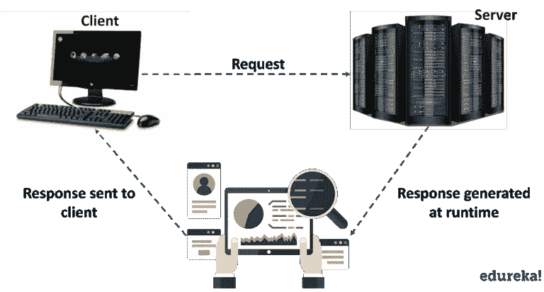

# Java Servlets 简介——简单来说就是 servlet

> 原文：<https://medium.com/edureka/java-servlets-62f583d69c7e?source=collection_archive---------0----------------------->


Introduction To Java Servlets - Edureka

在当今的互联网时代，每天都会产生数十亿字节的数据。为了获取如此海量的数据，每个人都需要在网络上发送请求并等待响应。我们大多数人都有一种误解，认为所有这些 web 应用程序都是在 HTML、PHP、JavaScript 等 web 框架上创建的。但是，您知道吗，web 应用程序可以基于 Java，使用一种叫做 Java Servlets 的服务。在本文中，让我们深入研究 Java Servlets，了解这项技术对于创建 web 应用程序是如何有用的。

下面是我将在本 Java Servlets 教程中涉及的主题列表:

*   网络导论
*   Web 和 HTTP
*   Servlet 简介
*   Servlet 架构
*   创建 Servlet 的步骤
*   通用 Servlet
*   Servlet 类和接口

在我们进入 servlets 之前，让我们了解一些 Web 的基础知识。

# 网络导论

Web 基本上是一个由支持格式化文档的互联网服务器组成的系统。这些文档是用一种叫做 HTML ( *超文本标记语言*)的标记语言格式化的，这种语言支持到其他文档的链接，比如图形、音频和视频文件。


Web 由通过有线和无线网络连接的数十亿个客户端和服务器组成。首先，web 客户端向 web 服务器发出请求。然后，web 服务器接收请求，找到资源并将响应返回给客户端。当服务器响应请求时，它通常会向客户端发送某种类型的内容。然后，客户端使用 web 浏览器向服务器发送请求。服务器通常会向浏览器发回一个响应，其中包含一组用 HTML 编写的指令。所有浏览器都知道如何向客户端显示 HTML 页面。

基本上，这都是关于万维网的后端工作。现在，让我们来理解 Web 和 HTTP 之间的连接。

# Web 和 HTTP

网站是静态文件的集合，即网页，如 HTML 页面、图像、图形等。一个*网络应用*是一个在服务器上具有动态功能的网站。***谷歌*******脸书*******推特*** 都是 web 应用的例子。**

**那么，Web 和 HTTP 之间的联系是什么呢？现在让我们来找出答案。**

****

# **超文本传输协议**

*   **HTTP 是网络上的客户端和服务器进行通信的协议。**
*   **类似于其他互联网协议如 **SMTP** (简单邮件传输协议) **FTP** (文件传输协议。**
*   **HTTP 是一个*无状态协议，即*它只支持每个连接一个请求。这意味着通过 HTTP，客户端连接到服务器发送一个请求，然后断开连接。这种机制允许更多的用户在一段时间内连接到给定的服务器。**
*   **客户端发送一个 HTTP 请求，服务器使用 HTTP 向客户端发送一个 HTML 页面作为响应。**

**可以使用多种方法发出 HTTP 请求，但是我们广泛使用的方法是 **Get** 和 **Post** 。方法名本身告诉服务器正在发出的请求的种类，以及消息的其余部分将如何格式化。**

**现在，在下表的帮助下，让我们理解 HTTP 的 Get 和 Post 方法之间的区别。**

****

**现在，您已经学习了一些 web 基础知识，让我们跳到核心主题，理解 servlet 的概念。**

# **Java servlet:servlet 简介**

**servlet 是一个 Java 编程语言类，用于扩展服务器的功能，这些服务器托管通过请求-响应编程模型访问的应用程序。尽管 servlets 可以响应任何类型的请求，但它们通常用于扩展 web 服务器托管的应用程序。它也是部署在服务器上创建动态网页的 web 组件。**

****

**在这张图中，您可以看到，一个客户端向服务器发送请求，服务器生成响应，对其进行分析，然后将响应发送给客户端。**

**因此，在我们深入探讨 servlet 之前，让我们先看看 servlet 出现之前使用的技术。**

# **CGI 与 Servlets**

**在 servlets 之前，我们有 **CGI** 即**C**ommon**G**ateway**I**interface。这是 Web 服务器将用户请求传递给应用程序并接收响应以转发给用户的标准方式。当用户请求一个网页时，服务器发送回所请求的页面。然而，当用户在网页上填写表单并发送时，它是由应用程序处理的。Web 服务器通常将表单信息传递给一个小的应用程序。这个程序处理数据并发回确认信息。这种在服务器和应用程序之间来回传递数据的过程称为公共网关接口(CGI)。它是网络超文本传输协议的一部分。**

**但是，为什么我们停止使用它，转而使用 servlets 呢？让我们借助下表来理解这一点:**

****

**我希望基于上面的比较，人们可以得出结论，为什么 Servlets 被用于 Web 应用程序。现在，让我们继续阅读本文，理解 Servlet 架构。**

# ****Servlet 架构****

**这里的**架构**讨论了通信接口、使用的协议、客户端和服务器的要求、使用的语言和软件的编程。基本上，它执行下面提到的任务。**

*   **首先，它读取客户端(浏览器)发送的显式数据。这些数据可以包括网页上的 HTML 表单、applet 或自定义 HTTP 客户端程序。它还读取客户端(浏览器)发送的隐式 HTTP 请求数据。这可以包括浏览器理解的 cookies、媒体类型和压缩方案等等。**

****

*   **之后，servlet 处理数据并生成结果。这个过程可能需要与数据库通信、执行 RMI、调用 Web 服务或直接计算响应。**
*   **处理后，它将显式数据(即文档)发送给客户端(浏览器)。该文档可以以多种格式发送，包括文本(HTML 或 XML)、二进制(GIF 图像)或 Excel 格式。**
*   **最后，它还向客户机(浏览器)发送隐式 HTTP 响应。这包括告诉浏览器或其他客户端返回的是什么类型的文档。**

**现在，让我们理解 servlet 生命周期中的各种方法。**

# **Servlet 生命周期**

**Servlet 生命周期主要包括以下四个阶段，**

*   **加载 Servlet**
*   **初始化 Servlet**
*   **请求处理**
*   **销毁 Servlet**

****

1.  **当 web 服务器(例如 Apache Tomcat)启动时，servlet 容器部署并加载所有的 servlet。**
2.  **通过调用 init *()* 方法来初始化 servlet。Servlet 容器调用 *Servlet.init()* 方法来表示这个 Servlet 实例已经成功实例化，并且即将投入使用。**
3.  **servlet 然后调用 *service()* 方法来处理客户机的请求。调用这个方法来通知 Servlet 关于客户机请求的信息。**
4.  **通过调用 *destroy()来终止 servlet。***
5.  ***destroy()* 方法在 Servlet 的生命周期中只运行一次，并发出 Servlet 实例结束的信号。**

**init()和 destroy()方法只被调用一次。最后，一个 servlet 由 JVM 的垃圾收集器进行垃圾收集。这就结束了 servlet 的生命周期。现在，让我指导您创建 java servlets 的步骤。**

# **创建 Servlet 的步骤**

1.  **创建目录结构**
2.  **创建一个 Servlet**
3.  **编译 Servlet**
4.  **向 web.xml 文件添加映射**
5.  **启动服务器并部署项目**
6.  **访问 servlet**

**现在，基于以上步骤，让我们编写一个程序，了解 servlet 是如何工作的。**

**要运行 servlet 程序，我们应该安装并配置 Apache Tomcat 服务器。Eclipse for Java EE 提供了内置的 Apache Tomcat。一旦配置好服务器，您就可以开始运行您的程序了。需要注意的重要一点是——对于任何 servlet 程序，您需要 3 个文件——index.html 文件、Java 类文件和 web.xml 文件。第一步是创建一个动态 Web 项目，然后继续下一步。**

**现在，让我们看看如何使用 servlets 将两个数字相加，并在浏览器中显示输出。**

**首先，我会写 index.html 的文件**

```
**<!DOCTYPE HTML> 
<html> 
<body> 

<form action = "add"> 
Enter 1st number: <input type="text" name ="num1">
 Enter 2nd number: <input type="text" name="num2">
 </form>

</body> 
</html>**
```

**上面的程序创建了一个表单来输入加法运算的数字。没有 Java 类文件，你不能对两个数进行加法运算。现在让我们创建一个类文件。**

```
**package edureka;
import java.io.IOException;
import java.io.PrintWriter;
import javax.servlet.http.HttpServlet;
import javax.servlet.http.HttpServletRequest;
import javax.servlet.http.HttpServletResponse;
public class Add extends HttpServlet{
public void service(HttpServletRequest req, HttpServletResponse res) throws IOException
{
int i = Integer.parseInt(req.getParameter("num1"));
int j = Integer.parseInt(req.getParameter("num2"));
int k= i+j;
PrintWriter out = res.getWriter();
out.println("Result is"+k);
}
}**
```

**编写完 Java 类文件后，最后一步是向 web.xml 文件添加映射。让我们看看如何做到这一点。**

***web.xml* 文件将出现在您的 web 内容的 WEB-INF 文件夹中。如果它不存在，那么您可以点击部署描述符并点击*生成部署描述符存根。*准备好 web.xml 文件后，需要向其中添加映射。让我们用下面的例子来看看映射是如何完成的:**

```
**<?xml version="1.0" encoding="UTF-8"?>
<web-app xmlns:xsi="http://www.w3.org/2001/XMLSchema-instance"  xsi:schemaLocation="http://java.sun.com/xml/ns/javaee http://java.sun.com/xml/ns/javaee/web-app_3_0.xsd" version="3.0">
<display-name>Basic</display-name>
<servlet>
<servlet-name>Addition</servlet-name>
<servlet-class>edureka.Add</servlet-class>
</servlet>
<servlet-mapping>
<servlet-name>Addition</servlet-name>
<url-pattern>/add</url-pattern>
</servlet-mapping>
<welcome-file-list>
<welcome-file>index.html</welcome-file>
</welcome-file-list>
</web-app>**
```

**完成后，您可以通过启动服务器来执行程序，并在浏览器上获得所需的输出。**

**让我们再举一个例子，我将创建一个简单的登录 servlet。同样，第一步是编写 html 文件。**

```
**<!**DOCTYPE** html>
<**html**>
<**body**>
<**form** action="Login" method="post">
<**table**>
<**tr**>
<**td**><**font** face="verdana" size="2px">Name:</**font**></**td**>
<**td**><**input** type="text" name="userName"></**td**>
</**tr**>
<**tr**>
<**td**><**font** face="verdana" size="2px">Password:</**font**></**td**>
<**td**><**input** type="password" name="userPassword"></**td**>
</**tr**>
</**table**>
<**input** type="submit" value="Login">
</**form**>
</**body**>
</**html**>**
```

**接下来，让我们编写 Java 类文件。**

```
****package** Edureka;
**import** java.io.IOException;
**import** java.io.PrintWriter;
**import** javax.servlet.ServletException;
**import** javax.servlet.http.HttpServlet;
**import** javax.servlet.http.HttpServletRequest;
**import** javax.servlet.http.HttpServletResponse;
**public** **class** Login **extends** HttpServlet
{
**protected** **void** doPost(HttpServletRequest req,HttpServletResponse res)**throws** ServletException,IOException
{
PrintWriter pw=res.getWriter();
res.setContentType("text/html");
String user=req.getParameter("userName");
String pass=req.getParameter("userPassword");
pw.println("Login Success...!");
**if**(user.equals("edureka") && pass.equals("edureka"))
pw.println("Login Success...!");
**else** pw.println("Login Failed...!");
pw.close();
}
}**
```

**在上面的代码中，我设置了一个条件——如果用户名和密码都等于 ***edureka，*** 才会显示成功登录，否则会拒绝登录。**

**现在让我们将映射添加到 web.xml 文件中。**

```
**<?**xml** version="1.0"encoding="UTF-8"?>
<**web-app** xmlns:xsi="http://www.w3.org/2001/XMLSchema-instance" xsi:schemaLocation="http://xmlns.jcp.org/xml/ns/javaee http://xmlns.jcp.org/xml/ns/javaee/web-app_3_1.xsd"version="3.1">
<**display-name**>LoginServlet</**display-name**>
<**servlet**>
<**servlet-name**>Login</**servlet-name**>
<**servlet-class**>Edureka.Login</**servlet-class**>
</**servlet**>
<**servlet-mapping**>
<**servlet-name**>Login</**servlet-name**>
<**url-pattern**>/Login</**url-pattern**>
</**servlet-mapping**>
<**welcome-file-list**>
<**welcome-file**>index.html</**welcome-file**>
</**welcome-file-list**>
</**web-app**>**
```

**这就是 servlet 的创建和配置方式。现在让我们看看什么是通用 servlet，以及它是如何创建的。**

# **通用 Servlets**

**通用 servlet 是一个独立于协议的 servlet，它应该总是覆盖 service()方法来处理客户机请求。service()方法接受两个参数， *ServletRequest 对象和 ServletResponse 对象。*请求对象告诉 servlet 客户端发出的请求，而响应对象用于向客户端返回响应。GenericServlet 是一个*抽象类*，它只有一个抽象方法，就是 *service()* 。这就是为什么当我们通过扩展 Generic Servlet 类来创建通用 Servlet 时，我们必须覆盖 service()方法。**

**现在，让我们看看如何创建和调用通用 servlet。我将再次编写如下所示的 3 个文件:**

****1。HTML 文件****

**我们正在创建一个 HTML 文件，当我们单击网页上的链接时，它将调用 servlet。在 WebContent 文件夹中创建此文件。该文件的路径应该如下所示:WebContent/index.html**

```
**<**html**>
<**title**>Generic Servlet Demo</**title**>
</**head**>
<**body**>
<**a** href="welcome">Click here to call Generic Servlet</**a**>
</**body**>
</**html**>**
```

**2. **Java 类文件****

**这里我们将通过扩展 Generic Servlet 类来创建一个通用 Servlet。创建 GenericServlet 时，必须重写 service()方法。右键单击 *src* 文件夹，创建一个新的类文件，并将该文件命名为 generic。文件路径应该如下所示:Java resources/src/default package/generic . Java**

```
**package EdurekaGeneric;
import java.io.*;
importjavax.servlet.*;
public class generic extends GenericServlet{
public void service(ServletRequest req,ServletResponse res) throws IOException,ServletException{
res.setContentType("text/html");
PrintWriter pwriter=res.getWriter();
pwriter.print("<html>");
pwriter.print("<body>");
pwriter.print("
<h2>Generic Servlet Example</h2>

");
pwriter.print("Welcome to Edureka YouTube Channel");
pwriter.print("</body>");
pwriter.print("</html>");
}
}**
```

****3。web.xml**
这个文件可以在以下路径找到:WebContent/WEB-INF/web.xml。因为我们在点击*index.html*上的链接时调用欢迎页面，它会将欢迎页面映射到我们上面已经创建的 Servlet 类。**

```
**<?xml version="1.0"encoding="UTF-8"?>
<web-app xmlns:xsi="http://www.w3.org/2001/XMLSchema-instance"xsi:schemaLocation="http://xmlns.jcp.org/xml/ns/javaee http://xmlns.jcp.org/xml/ns/javaee/web-app_3_1.xsd/"version="3.1"/>
<display-name>LoginServlet</display-name>
<servlet>
<servlet-name>MyGenericServlet</servlet-name>
<servlet-class>EdurekaGeneric.generic</servlet-class>
</servlet>
<servlet-mapping>
<servlet-name>MyGenericServlet</servlet-name>
<url-pattern>/welcome</url-pattern>
</servlet-mapping>
<welcome-file-list>
<welcome-file>index.html</welcome-file>
</welcome-file-list>
</web-app>**
```

**之后，启动 Tomcat 服务器并运行 servlet。您将获得期望的输出。现在，让我们跳到本文的最后一节，看看 Java servlets 的有用的类和接口。**

# **Servlet 类和接口**

**Servlet API 由两个封装了所有重要类和接口的重要包组成，即:**

*   ****javax.servlet****
*   ****javax.servlet.http****

**在下表的帮助下，让我们看看 servlet 的一些重要的*类和接口*。**

****

***这让我们结束了关于 Java Servlets 简介的博客。我希望你发现这个博客信息丰富，增加了你的知识价值。***

**如果你想查看更多关于人工智能、DevOps、道德黑客等市场最热门技术的文章，你可以参考 Edureka 的官方网站。**

**请留意本系列中的其他文章，它们将解释 Java 的各个方面。**

> **1.[面向对象编程](/edureka/object-oriented-programming-b29cfd50eca0)**
> 
> **2.[Java 中的继承](/edureka/inheritance-in-java-f638d3ed559e)**
> 
> **3.[Java 中的多态性](/edureka/polymorphism-in-java-9559e3641b9b)**
> 
> **4.[Java 中的抽象](/edureka/java-abstraction-d2d790c09037)**
> 
> **5. [Java 字符串](/edureka/java-string-68e5d0ca331f)**
> 
> **6. [Java 数组](/edureka/java-array-tutorial-50299ef85e5)**
> 
> **7. [Java 集合](/edureka/java-collections-6d50b013aef8)**
> 
> **8. [Java 线程](/edureka/java-thread-bfb08e4eb691)**
> 
> **9. [Java 教程](/edureka/java-tutorial-bbdd28a2acd7)**
> 
> **10. [Servlet 和 JSP 教程](/edureka/servlet-and-jsp-tutorial-ef2e2ab9ee2a)**
> 
> **11.[Java 中的异常处理](/edureka/java-exception-handling-7bd07435508c)**
> 
> **12.[高级 Java 教程](/edureka/advanced-java-tutorial-f6ebac5175ec)**
> 
> **13. [Java 面试问题](/edureka/java-interview-questions-1d59b9c53973)**
> 
> **14. [Java 程序](/edureka/java-programs-1e3220df2e76)**
> 
> **15.[科特林 vs 爪哇](/edureka/kotlin-vs-java-4f8653f38c04)**
> 
> **16.[依赖注入使用 Spring Boot](/edureka/what-is-dependency-injection-5006b53af782)**
> 
> **17.[Java 中的可比](/edureka/comparable-in-java-e9cfa7be7ff7)**
> 
> **18.[十大 Java 框架](/edureka/java-frameworks-5d52f3211f39)**
> 
> **19. [Java 反射 API](/edureka/java-reflection-api-d38f3f5513fc)**
> 
> **20.[Java 中的 30 大模式](/edureka/pattern-programs-in-java-f33186c711c8)**
> 
> **21.[核心 Java 备忘单](/edureka/java-cheat-sheet-3ad4d174012c)**
> 
> **22.[Java 中的套接字编程](/edureka/socket-programming-in-java-f09b82facd0)**
> 
> **23.Java OOP 备忘单**
> 
> **24.[Java 中的注释](/edureka/annotations-in-java-9847d531d2bb)**
> 
> **25.[Java 中的图书管理系统项目](/edureka/library-management-system-project-in-java-b003acba7f17)**
> 
> **26.[Java 中的树](/edureka/java-binary-tree-caede8dfada5)**
> 
> **27.[Java 中的机器学习](/edureka/machine-learning-in-java-db872998f368)**
> 
> **28.[Java 中的顶级数据结构&算法](/edureka/data-structures-algorithms-in-java-d27e915db1c5)**
> 
> **29. [Java 开发者技能](/edureka/java-developer-skills-83983e3d3b92)**
> 
> **30.[前 55 个 Servlet 面试问题](/edureka/servlet-interview-questions-266b8fbb4b2d)**
> 
> **31. [](/edureka/java-exception-handling-7bd07435508c) [顶级 Java 项目](/edureka/java-projects-db51097281e3)**
> 
> **32. [Java 字符串备忘单](/edureka/java-string-cheat-sheet-9a91a6b46540)**
> 
> **33.[Java 中的嵌套类](/edureka/nested-classes-java-f1987805e7e3)**
> 
> **34. [Java 集合面试问答](/edureka/java-collections-interview-questions-162c5d7ef078)**
> 
> **35.[Java 中如何处理死锁？](/edureka/deadlock-in-java-5d1e4f0338d5)**
> 
> **36.[你需要知道的 50 大 Java 集合面试问题](/edureka/java-collections-interview-questions-6d20f552773e)**
> 
> **37.[Java 中的字符串池是什么概念？](/edureka/java-string-pool-5b5b3b327bdf)**
> 
> **38.[C、C++和 Java 有什么区别？](/edureka/difference-between-c-cpp-and-java-625c4e91fb95)**
> 
> **39.[Java 中的回文——如何检查一个数字或字符串？](/edureka/palindrome-in-java-5d116eb8755a)**
> 
> **40.[你需要知道的顶级 MVC 面试问答](/edureka/mvc-interview-questions-cd568f6d7c2e)**
> 
> **41.[Java 编程语言的十大应用](/edureka/applications-of-java-11e64f9588b0)**
> 
> **42.[Java 中的死锁](/edureka/deadlock-in-java-5d1e4f0338d5)**
> 
> **43.[Java 中的平方和平方根](/edureka/java-sqrt-method-59354a700571)**
> 
> **44.[Java 中的类型转换](/edureka/type-casting-in-java-ac4cd7e0bbe1)**
> 
> **45.[Java 中的运算符及其类型](/edureka/operators-in-java-fd05a7445c0a)**
> 
> **46.[Java 中的析构函数](/edureka/destructor-in-java-21cc46ed48fc)**
> 
> **47.[爪哇的二分搜索法](/edureka/binary-search-in-java-cf40e927a8d3)**
> 
> **48.[Java 中的 MVC 架构](/edureka/mvc-architecture-in-java-a85952ae2684)**
> 
> **49.[冬眠面试问答](/edureka/hibernate-interview-questions-78b45ec5cce8)**

***原载于 2018 年 12 月 12 日*[*www.edureka.co*](https://www.edureka.co/blog/java-servlets)*。***