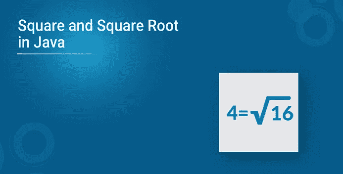

# Java 中如何计算平方和平方根？

> 原文：<https://medium.com/edureka/java-sqrt-method-59354a700571?source=collection_archive---------0----------------------->



最常见的一个 java 面试问题是，“给定一个整数 x，写一个 Java 程序求它的平方根”。有很多方法可以解决这个问题。在本文中，让我们看看在 Java 中求平方和平方根的不同方法。

1.  平方和平方根是什么？

2.如何在 Java 中求一个数的平方

*   通过将该数乘以自身
*   使用 *Math.pow* 函数

3.如何在 Java 中求一个数的平方根

*   使用 java.lang.Math.sqrt()方法
*   通过使用 Math.pow()函数
*   不使用任何内置函数

在讨论 Java 中的平方根代码之前，我们先来了解一下平方根这个术语。

# 平方和平方根

一个数的平方是这个数乘以它自己。换句话说，当我们将一个整数乘以它自己时，我们称乘积为*数字*的平方。从数学上来说，一个数的平方等于，

**n 的平方** = n*n

比如数字 4 的平方是 **4*4 = 16**

平方根正好是平方的反义词。一个数的平方根，n，是 n 与自身相乘得到的数。数学上，一个数的平方根是这样给出的，

**n 的平方根= √** n

现在你知道了什么是数的平方和平方根，让我们看看在 Java 中计算它们的不同方法。

# Java 中如何求一个数的平方？

在 Java 中，你可以用两种不同的方法计算一个数的平方:

1.  将这个数乘以它本身
2.  调用 *Math.pow* 函数

## 方法 1:用一个数乘以它自己来平方它

这是一个 Java 程序，通过将一个数乘以自身来计算它的平方。

```
**package** MyPackage;
**import** java.util.Scanner;
**public** **class** Square1 {
**public** **static** **void** main(String args[]) {
Double num;
Scanner sc= **new** Scanner(System.in);
System.out.print("Enter a number: ");
num=sc.nextDouble();
Double square = num*num;
System.out.println("Square of "+ num + " is: "+ square);
}
}
```

**输出**

```
Enter a number: 10 Square of 10.0 is: 100.0
```

## 方法 2:用 Math.pow 方法计算一个数的平方

这里有一个 Java 程序调用 *Math.pow* 方法来对一个数字求平方。

```
**package** MyPackage;
**import** java.util.Scanner;
**import** java.lang.Math;
**public** **class** Square2 {
**public** **static** **void** main(String args[]) {
Double num;
Scanner sc= **new** Scanner(System.in);
System.out.print("Enter a number: ");
num = sc.nextDouble();
Double square = Math.pow(num, 2);
System.out.println("Square of "+ num + " is: "+ square);
}
}
```

**输出**

```
Enter a number: 22 
Square of 22.0 is: 484.0
```

现在让我们看看如何在 Java 中计算一个数的平方根。

# 如何在 Java 中求一个数的平方根

在 Java 中有多种方法可以找到给定数字的平方根。让我们探索其中的一些。

## 方法 1: Java 程序使用 java.lang.Math.sqrt()方法求一个数的平方根

> **语法** 公共静态 double sqrt(double x)

1.  参数:x 是要计算其平方根的值。

2.Return:该方法返回传递给它的参数的平方根值。

*   如果参数 x 是正的 double 值，这个方法将返回 x 的平方根
*   当 x 为 **NaN** 或小于零时，该方法将返回 **NaN**
*   如果参数 x 是正的**无穷大**，该方法将返回正的**无穷大**
*   当 x 是正的或负的**零**时，该方法将返回结果为具有相同符号的**零**

**代码**

```
**package** MyPackage;
**public** **class** SquareRoot2 
{
**public** **static** **void** main(String args[])
{
**double** a = 100;
System.out.println(Math.sqrt(a));
// Input positive value, Output square root of x
**double** b = -81.00;
System.out.println(Math.sqrt(b));
// Input negative value, Output NaN
**double** c = 0.0/0;
// Input NaN, Output NaN
System.out.println(Math.sqrt(c));
**double** d = 1.0/0;
// Input positive infinity, Output positive infinity
System.out.println(Math.sqrt(d));
**double** e = 0.0;
// Input positive Zero, Output positive zero
System.out.println(Math.sqrt(e));
}
}
```

**输出**

```
10.0
NaN
NaN
Infinity
0.0
```

## 方法 2: Java 程序使用 java.lang.Math.pow()方法求一个数的平方根

我们可以用逻辑**√数=数**求一个数的平方根。

**代号**

```
**package** MyPackage;
**import** java.util.Scanner;
**public** **class** SquareRoot1 {
**public** **static** **void** main(String[] args)
{
Double num;
Scanner sc= **new** Scanner(System.in);
System.out.print("Enter a number: ");
num = sc.nextDouble();
Double squareroot = Math.pow(num, 0.5);
System.out.println("The Square of a Given Number  " + num + "  =  " + squareroot);
}
}
```

**输出**

```
Enter a number: 81
The Square of a Given Number 81.0 = 9.0
```

## 方法 3: Java 程序在不使用任何内置方法的情况下求一个数的平方根

我们使用的逻辑如下:


第一个 sqrt 编号应该是输入编号/ 2。下面是一个实现上述逻辑的 Java 程序。

**代码**

```
**package** MyPackage;
**public** **class** SquareRoot
{
**public** **static** **double** square(**double** number){
**double** t;
**double** squareroot = number / 2;
**do** 
{
t = squareroot;
squareroot = (t + (number / t)) / 2;
}
 **while** ((t - squareroot) != 0);
**return** squareroot;
}
**public** **static** **void** main(String[] args)
{
**double** number = 16;
**double** root;
root = square(number);
System.out.println("Number : "+number);
System.out.println("Square Root : "+root);
}
}
```

**输出**

```
Number : 121.0 
Square Root : 11.0
```

这就把我们带到了本文的结尾。

***一定要尽可能多的练习，还原经验。***

如果你想查看更多关于人工智能、DevOps、道德黑客等市场最热门技术的文章，你可以参考 Edureka 的官方网站。

请留意本系列中的其他文章，它们将解释 Java 的各个方面。

> *1。* [*面向对象编程*](/edureka/object-oriented-programming-b29cfd50eca0)
> 
> *2。* [*Java 教程*](/edureka/java-tutorial-bbdd28a2acd7)
> 
> *3。*[*Java 中的多态性*](/edureka/polymorphism-in-java-9559e3641b9b)
> 
> *4。*[*Java 中的抽象*](/edureka/java-abstraction-d2d790c09037)
> 
> *5。* [*Java 字符串*](/edureka/java-string-68e5d0ca331f)
> 
> *6。* [*Java 数组*](/edureka/java-array-tutorial-50299ef85e5)
> 
> *7。* [*Java 合集*](/edureka/java-collections-6d50b013aef8)
> 
> *8。* [*Java 线程*](/edureka/java-thread-bfb08e4eb691)
> 
> *9。*[*Java servlet 简介*](/edureka/java-servlets-62f583d69c7e)
> 
> *10。* [*Servlet 和 JSP 教程*](/edureka/servlet-and-jsp-tutorial-ef2e2ab9ee2a)
> 
> *11。*[*Java 中的异常处理*](/edureka/java-exception-handling-7bd07435508c)
> 
> *12。* [*高级 Java 教程*](/edureka/advanced-java-tutorial-f6ebac5175ec)
> 
> *13。* [*Java 面试题*](/edureka/java-interview-questions-1d59b9c53973)
> 
> *14。*[Java 程序 ](/edureka/java-programs-1e3220df2e76)
> 
> 15。[*kot Lin vs Java*](/edureka/kotlin-vs-java-4f8653f38c04)
> 
> *16。* [*依赖注入使用 Spring Boot*](/edureka/what-is-dependency-injection-5006b53af782)
> 
> *17。* [*堪比爪哇*](/edureka/comparable-in-java-e9cfa7be7ff7)
> 
> 18。 [*十大 Java 框架*](/edureka/java-frameworks-5d52f3211f39)
> 
> 19。 [*Java 反射 API*](/edureka/java-reflection-api-d38f3f5513fc)
> 
> 20。[*Java 中的 30 大模式*](/edureka/pattern-programs-in-java-f33186c711c8)
> 
> *21。* [*核心 Java 备忘单*](/edureka/java-cheat-sheet-3ad4d174012c)
> 
> *22。*[*Java 中的套接字编程*](/edureka/socket-programming-in-java-f09b82facd0)
> 
> *23。* [*Java OOP 备忘单*](/edureka/java-oop-cheat-sheet-9c6ebb5e1175)
> 
> *24。*[*Java 中的注释*](/edureka/annotations-in-java-9847d531d2bb)
> 
> *25。*[*Java 中的库管理系统项目*](/edureka/library-management-system-project-in-java-b003acba7f17)
> 
> *26。*[*Java 中的树木*](/edureka/java-binary-tree-caede8dfada5)
> 
> *27。*[*Java 中的机器学习*](/edureka/machine-learning-in-java-db872998f368)
> 
> *28。* [*顶级数据结构&Java 中的算法*](/edureka/data-structures-algorithms-in-java-d27e915db1c5)
> 
> *29。* [*Java 开发者技能*](/edureka/java-developer-skills-83983e3d3b92)
> 
> *30。* [*前 55 名 Servlet 面试问题*](/edureka/servlet-interview-questions-266b8fbb4b2d)
> 
> *31。*[](/edureka/java-exception-handling-7bd07435508c)*[*顶级 Java 项目*](/edureka/java-projects-db51097281e3)*
> 
> *32。 [*Java 字符串备忘单*](/edureka/java-string-cheat-sheet-9a91a6b46540)*
> 
> *33。[*Java 中的嵌套类*](/edureka/nested-classes-java-f1987805e7e3)*
> 
> *34。 [*Java 集合面试问答*](/edureka/java-collections-interview-questions-162c5d7ef078)*
> 
> **35。*[*Java 中如何处理死锁？*](/edureka/deadlock-in-java-5d1e4f0338d5)*
> 
> *36。 [*你需要知道的 50 个 Java 合集面试问题*](/edureka/java-collections-interview-questions-6d20f552773e)*
> 
> **37。*[*Java 中的字符串池是什么概念？*](/edureka/java-string-pool-5b5b3b327bdf)*
> 
> *38。[*C、C++和 Java 有什么区别？*](/edureka/difference-between-c-cpp-and-java-625c4e91fb95)*
> 
> **39。*[*Java 中的回文——如何检查一个数字或字符串？*](/edureka/palindrome-in-java-5d116eb8755a)*
> 
> *40。 [*你需要知道的顶级 MVC 面试问答*](/edureka/mvc-interview-questions-cd568f6d7c2e)*
> 
> *41。[*Java 编程语言的十大应用*](/edureka/applications-of-java-11e64f9588b0)*
> 
> **42。*[*Java 中的死锁*](/edureka/deadlock-in-java-5d1e4f0338d5)*
> 
> **43。*[*Java 中的平方和平方根*](/edureka/java-sqrt-method-59354a700571)*
> 
> **44。*[*Java 中的类型转换*](/edureka/type-casting-in-java-ac4cd7e0bbe1)*
> 
> **45。*[*Java 中的运算符及其类型*](/edureka/operators-in-java-fd05a7445c0a)*
> 
> **46。*[*Java 中的析构函数*](/edureka/destructor-in-java-21cc46ed48fc)*
> 
> **47。*[*Java 中的二分搜索法*](/edureka/binary-search-in-java-cf40e927a8d3)*
> 
> **48。*[*Java 中的 MVC 架构*](/edureka/mvc-architecture-in-java-a85952ae2684)*
> 
> **49。* [*冬眠面试问答*](/edureka/hibernate-interview-questions-78b45ec5cce8)*

**原载于 2019 年 9 月 12 日*[*https://www.edureka.co*](https://www.edureka.co/blog/java-sqrt-method/)*。**