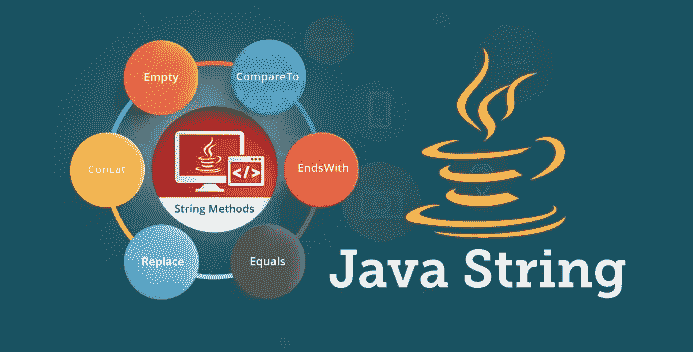
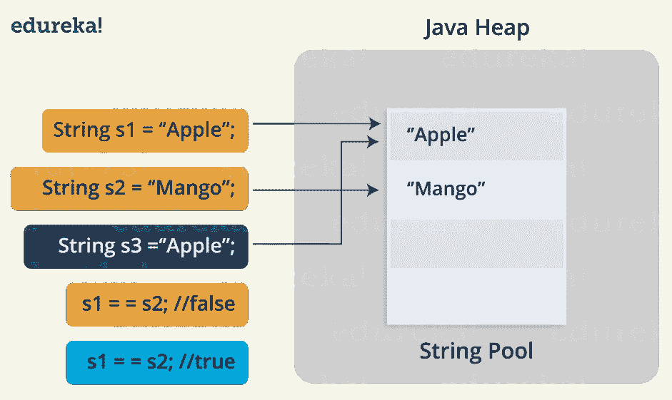
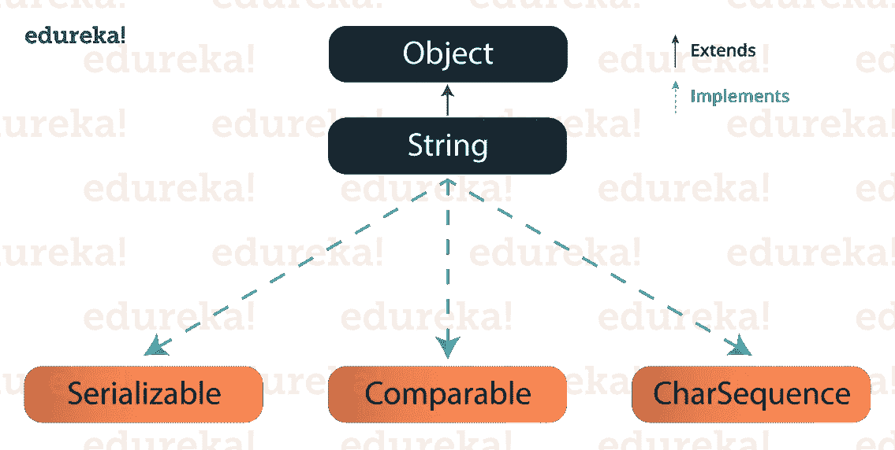

# Java String——Java 中字符串函数的综合指南，并附有示例

> 原文：<https://medium.com/edureka/java-string-68e5d0ca331f?source=collection_archive---------0----------------------->



Java String — Edureka

Java 是一个通用的、并发的、面向对象的、基于类的运行时环境(JRE ),它由 **JVM 组成。**在这篇博客中，我们将讨论一个新概念， **Java 字符串**。字符串是一系列字符。但是在 Java 中，字符串是表示一系列字符的对象。 ***java.lang.String*** 类用于创建一个 String 对象。

***创建字符串对象有两种方法:***

1.  **By String literal:**Java String literal 是用双引号创建的。
    例如:String s = " Welcome
2.  **By new 关键字:**使用关键字“new”创建 Java 字符串。
    例如:String s = new String(" Welcome ")；
    它创建两个对象(在字符串池和堆中)和一个引用变量，其中变量“s”将引用堆中的对象。

现在，让我们来理解一下 Java 字符串池的概念。

## Java 字符串池:

Java 字符串池指的是存储在堆内存中的字符串集合。在这种情况下，每当创建一个新对象时，String pool 首先检查该对象是否已经存在于池中。如果存在，则相同的引用被返回给变量，否则将在字符串池中创建新的对象，并返回相应的引用。为了更好地理解，请参考图示:



Java String Pool — Java String

在上图中，两个字符串是用文字创建的，即“*苹果*和“*芒果*”。现在，当用值“ *Apple* ”创建第三个字符串时，不是创建一个新对象，而是返回已经存在的对象引用。这就是 Java 字符串池出现的原因。

在我们继续之前，我想补充的一个关键点是，与 Java 中的其他数据类型不同，字符串是不可变的。所谓不可变，我们的意思是字符串是不变的，它们的值在创建后不能改变。因为字符串对象是不可变的，所以它们可以被共享。例如:

*String str = " ABC "；
相当于:*

*char data[] = {'a '，' b '，' c ' }；
String str =新字符串(数据)；*

现在让我们看看 String 类中的一些内置方法。

# Java 字符串方法

## Java 字符串长度():

Java String length()方法给出了字符串的长度。它返回字符串中出现的字符总数。例如:

```
public class Example{
public static void main(String args[]{ 
String s1="hello"; 
String s2="whatsup"; 
System.out.println("string length is: "+s1.length());  
System.out.println("string length is: "+s2.length()); 
}}
```

这里，String length()函数将分别为 s1 和 s2 返回长度 5 和 7。

## Java 字符串 compareTo():

Java String compareTo()方法比较给定的字符串和当前的字符串。是 String 类实现的*‘Comparable’*接口的方法。别担心，我们稍后将学习字符串接口。它返回正数、负数或 0。例如:

```
public class CompareToExample{ 
public static void main(String args[]){ 
String s1="hello";
String s2="hello"; 
String s3="hemlo"; 
String s4="flag";
System.out.println(s1.compareTo(s2)); // 0 because both are equal
System.out.println(s1.compareTo(s3)); //-1 because "l" is only one time lower than "m" 
System.out.println(s1.compareTo(s4)); // 2 because "h" is 2 times greater than "f"
}}
```

这个程序显示了各种字符串之间的比较。注意到
*如果 s1 > s2，则返回正数
如果 s1 < s2，则返回负数
如果 s1 == s2，则返回 0*

## Java 字符串连接() :

Java String concat()方法将一个特定的字符串组合在另一个字符串的末尾，并最终返回一个组合字符串。这就像附加另一个字符串。例如:

```
public class ConcatExample{
public static void main(String args[]){
String s1="hello";
s1=s1.concat("how are you");
System.out.println(s1);
}}
```

上面的代码返回“**hello 你好**”。

## Java 字符串 IsEmpty():

该方法检查字符串是否包含任何内容。如果 java 字符串为空，则返回 true，否则返回 false。例如:

```
public class IsEmptyExample{ 
public static void main(String args[]){ 
String s1=""; 
String s2="hello"; 
System.out.println(s1.isEmpty());      // true
System.out.println(s2.isEmpty());      // false
}}
```

## Java 字符串 Trim():

Java string trim()方法删除前导和尾随空格。它检查字符串前后的空格字符(' \u0020 ')的 Unicode 值。如果存在，则删除空格并返回省略的字符串。例如:

```
public class StringTrimExample{  
public static void main(String args[]){  
String s1="  hello   ";  
System.out.println(s1+"how are you");        // without trim()  
System.out.println(s1.trim()+"how are you"); // with trim()  
}}
```

在上面的代码中，第一个打印语句将使用 trim()函数打印“hello how are you”，而第二个语句将打印“ **hellohow are you** ”。

## Java 字符串 toLowerCase():

java string toLowerCase()方法将字符串中的所有字符转换成小写。例如:

```
public class StringLowerExample{
public static void main(String args[]){
String s1="HELLO HOW Are You?”;
String s1lower=s1.toLowerCase();
System.out.println(s1lower);}
}
```

上面的代码会返回“**你好你好**”。

## Java 字符串 toUpper():

Java String toUpperCase()方法将字符串中的所有字符转换成大写。例如:

```
public class StringUpperExample{  
public static void main(String args[]){  
String s1="hello how are you";  
String s1upper=s1.toUpperCase();  
System.out.println(s1upper);  
}}
```

上面的代码会返回“**你好你好**”。

## Java 字符串 ValueOf():

此方法将不同类型的值转换为字符串。使用这种方法，您可以将 int 转换为 string，long 转换为 string，Boolean 转换为 string，char 转换为 string，float 转换为 string，double 转换为 string，object 转换为 string，char array 转换为 string。字符串 valueOf()方法的签名或语法如下所示:公共静态字符串 valueOf(boolean b)

> 的公共静态字符串值(char c)
> 
> 的公共静态字符串值(char[] c)
> 
> 公共静态字符串 valueOf(int i)
> 
> 公共静态字符串 valueOf(long l)
> 
> 公共静态字符串值 Of(浮点型 f)
> 
> 的公共静态字符串值(双 d)
> 
> 的公共静态字符串值(对象 o)

让我们通过一个编程示例来理解这一点:

```
public class StringValueOfExample{
public static void main(String args[]){
int value=20; 
String s1=String.valueOf(value); 
System.out.println(s1+17);       //concatenating string with 10 
}}
```

在上面的代码中，它连接 Java 字符串并给出输出— **2017** 。

## Java 字符串替换():

Java String replace()方法返回一个字符串，将所有旧字符或 CharSequence 替换为新字符。有两种方法可以替换 Java 字符串中的方法。

```
public class ReplaceExample1{
public static void main(String args[]){ 
String s1="hello how are you"; 
String replaceString=s1.replace('h','t'); 
System.out.println(replaceString); }}
```

在上面的代码中，它将替换所有出现的' **h** '到' **t** '。输出到上面的代码将是“ **tello tow are you** ”。让我们看看在 java 字符串中使用 replace 方法的另一种类型:

## Java 字符串替换(CharSequence 目标，CharSequence 替换)方法:

```
public class ReplaceExample2{ 
public static void main(String args[]){ 
String s1="Hey, welcome to Edureka"; 
String replaceString=s1.replace("Edureka","Brainforce"); 
System.out.println(replaceString); 
}}
```

在上面的代码中，它会将所有出现的“ **Edureka** ”替换为“ **Brainforce** ”。因此，输出将是“**嘿，欢迎来到智囊团**”。

## Java 字符串包含() :

Java string contains()方法搜索字符串中的字符序列。如果找到了字符序列，则返回 true，否则返回 false。例如:

```
class ContainsExample{ 
public static void main(String args[]){ 
String name=" hello how are you doing?"; 
System.out.println(name.contains("how are you"));  // returns true
System.out.println(name.contains("hello"));        // returns true  
System.out.println(name.contains("fine"));         // returns false  
}}
```

在上面的代码中，前两个语句将返回 true，因为它匹配字符串，而第二个 print 语句将返回 false，因为字符串中不存在这些字符。

## Java 字符串等于() :

Java String equals()方法根据字符串的内容(即 Java 字符串表示)比较两个给定的字符串。如果所有字符都匹配，则返回 true，否则返回 false。例如:

```
public class EqualsExample{ 
public static void main(String args[]){ 
String s1="hello"; 
String s2="hello"; 
String s3="hi";
System.out.println(s1.equalsIgnoreCase(s2));   // returns true
System.out.println(s1.equalsIgnoreCase(s3));   // returns false
}
}
```

## Java 字符串 equalsIgnoreCase():

这个方法根据内容比较两个字符串，但是它不像 equals()方法那样检查大小写。在这个方法中，如果字符匹配，则返回 true，否则返回 false。例如:

```
public class EqualsIgnoreCaseExample{ 
public static void main(String args[]){ 
String s1="hello"; 
String s2="HELLO"; 
String s3="hi";
System.out.println(s1.equalsIgnoreCase(s2));   // returns true
System.out.println(s1.equalsIgnoreCase(s3));   // returns false
}}
```

在上面的代码中，第一条语句将返回 true，因为无论大小写，内容都是相同的。然后，在第二个 print 语句中将返回 false，因为相应字符串中的内容不匹配。

## Java 字符串 toCharArray():

该方法将字符串转换为字符数组，即首先计算给定 Java 字符串的长度，包括空格，然后创建一个具有相同内容的 char 类型的数组。例如:

```
StringToCharArrayExample{
public static void main(String args[]){
String s1="Welcome to Edureka";
char[] ch=s1.toCharArray();
for(int i=0;i<ch.length;i++){
System.out.print(ch[i]);
}}}
```

上面的代码会返回“**欢迎来到 Edureka** ”。

## Java StringGetBytes():

Java string getBytes()方法返回字节序列，也可以说是字符串的字节数组。例如:

```
public class StringGetBytesExample {
public static void main(String args[]){ 
String s1="ABC";
byte[] b=s1.getBytes(); 
for(int i=0;i<b.length;i++){ 
System.out.println(b[i]);
}
}}
```

在上面的代码中，它将返回值 **65，66，67** 。

## Java 字符串 IsEmpty():

此方法检查字符串是否为空。如果字符串的长度为 0，则返回 true，否则返回 false。例如:

```
public class IsEmptyExample{
public static void main(String args[]) { 
String s1=""; 
String s2="hello";
System.out.prinltn(s1.isEmpty());     // returns true
System.out.prinltn(s2.isEmpty());     // returns false
}}
```

在上面的代码中，第一个打印语句将**返回 true** ，因为它不包含任何内容，而第二个打印语句将**返回 false** 。

## Java 字符串 endsWith():

方法检查这个字符串是否以给定的后缀结尾。如果它返回给定的后缀，它将返回真，否则返回假。例如:

```
public class EndsWithExample{ 
public static void main(String args[]) {
String s1="hello how are you”; 
System.out.println(s1.endsWith("u"));       // returns true
System.out.println(s1.endsWith("you"));     // returns true   
System.out.println(s1.endsWith("how"));     // returns false
}}
```

这不是结局。有更多的 Java 字符串方法可以帮助您简化代码。

继续，Java String 类实现了三个**接口**，即——***可序列化、可比*** 和***char sequence****。*



String Interface — Java Strings

因为 Java 字符串是不可变的，也是最终的，所以每当我们进行字符串操作时，都会创建一个新的字符串。由于字符串操作消耗资源， **Java 提供了两个实用类**:***String buffer***和***StringBuilder***。
***让我们了解一下这两个实用类的区别:***

> 1.StringBuffer 和 StringBuilder 是可变类。StringBuffer 操作是线程安全和同步的，而 StringBuilder 操作不是线程安全的。
> 
> 2.当多个线程在单线程环境中处理同一个字符串和 StringBuilder 时，将使用 StringBuffer。
> 
> 3.与 StringBuffer 相比，StringBuilder 的性能更快，因为没有同步的开销。

我希望你们清楚 Java 字符串，它们是如何创建的，它们不同的方法和接口。我建议您尝试所有的 Java 字符串示例。

到此，我们结束了这个博客。如果你想查看更多关于人工智能、DevOps、道德黑客等市场最热门技术的文章，你可以参考 Edureka 的官方网站。

请留意本系列中的其他文章，它们将解释 Java 的各个方面。

> 1.[面向对象编程](/edureka/object-oriented-programming-b29cfd50eca0)
> 
> 2.[Java 中的继承](/edureka/inheritance-in-java-f638d3ed559e)
> 
> 3.[Java 中的多态性](/edureka/polymorphism-in-java-9559e3641b9b)
> 
> 4.[Java 中的抽象](/edureka/java-abstraction-d2d790c09037)
> 
> 5. [Java 教程](/edureka/java-tutorial-bbdd28a2acd7)
> 
> 6. [Java 数组](/edureka/java-array-tutorial-50299ef85e5)
> 
> 7. [Java 集合](/edureka/java-collections-6d50b013aef8)
> 
> 8. [Java 线程](/edureka/java-thread-bfb08e4eb691)
> 
> 9.[Java servlet 简介](/edureka/java-servlets-62f583d69c7e)
> 
> 10. [Servlet 和 JSP 教程](/edureka/servlet-and-jsp-tutorial-ef2e2ab9ee2a)
> 
> 11.[Java 中的异常处理](/edureka/java-exception-handling-7bd07435508c)
> 
> 12.[高级 Java 教程](/edureka/advanced-java-tutorial-f6ebac5175ec)
> 
> 13. [Java 面试问题](/edureka/java-interview-questions-1d59b9c53973)
> 
> 14. [Java 程序](/edureka/java-programs-1e3220df2e76)
> 
> 15.[科特林 vs 爪哇](/edureka/kotlin-vs-java-4f8653f38c04)
> 
> 16.[依赖注入使用 Spring Boot](/edureka/what-is-dependency-injection-5006b53af782)
> 
> 17.[Java 中的可比](/edureka/comparable-in-java-e9cfa7be7ff7)
> 
> 18.[十大 Java 框架](/edureka/java-frameworks-5d52f3211f39)
> 
> 19. [Java 反射 API](/edureka/java-reflection-api-d38f3f5513fc)
> 
> 20.[Java 中的 30 大模式](/edureka/pattern-programs-in-java-f33186c711c8)
> 
> 21.[核心 Java 备忘单](/edureka/java-cheat-sheet-3ad4d174012c)
> 
> 22.[Java 中的套接字编程](/edureka/socket-programming-in-java-f09b82facd0)
> 
> 23.Java OOP 备忘单
> 
> 24.[Java 中的注释](/edureka/annotations-in-java-9847d531d2bb)
> 
> 25.[Java 中的图书管理系统项目](/edureka/library-management-system-project-in-java-b003acba7f17)
> 
> 26.[Java 中的树](/edureka/java-binary-tree-caede8dfada5)
> 
> 27.[Java 中的机器学习](/edureka/machine-learning-in-java-db872998f368)
> 
> 28.[Java 中的顶级数据结构&算法](/edureka/data-structures-algorithms-in-java-d27e915db1c5)
> 
> 29. [Java 开发者技能](/edureka/java-developer-skills-83983e3d3b92)
> 
> 30.[前 55 个 Servlet 面试问题](/edureka/servlet-interview-questions-266b8fbb4b2d)
> 
> 31. [](/edureka/java-exception-handling-7bd07435508c) [顶级 Java 项目](/edureka/java-projects-db51097281e3)
> 
> 32. [Java 字符串备忘单](/edureka/java-string-cheat-sheet-9a91a6b46540)
> 
> 33.[Java 中的嵌套类](/edureka/nested-classes-java-f1987805e7e3)
> 
> 34. [Java 集合面试问答](/edureka/java-collections-interview-questions-162c5d7ef078)
> 
> 35.[Java 中如何处理死锁？](/edureka/deadlock-in-java-5d1e4f0338d5)
> 
> 36.[你需要知道的 50 大 Java 集合面试问题](/edureka/java-collections-interview-questions-6d20f552773e)
> 
> 37.[Java 中的字符串池是什么概念？](/edureka/java-string-pool-5b5b3b327bdf)
> 
> 38.[C、C++和 Java 有什么区别？](/edureka/difference-between-c-cpp-and-java-625c4e91fb95)
> 
> 39.[Java 中的回文——如何检查一个数字或字符串？](/edureka/palindrome-in-java-5d116eb8755a)
> 
> 40.[你需要知道的顶级 MVC 面试问答](/edureka/mvc-interview-questions-cd568f6d7c2e)
> 
> 41.[Java 编程语言的十大应用](/edureka/applications-of-java-11e64f9588b0)
> 
> 42.[Java 中的死锁](/edureka/deadlock-in-java-5d1e4f0338d5)
> 
> 43.[Java 中的平方和平方根](/edureka/java-sqrt-method-59354a700571)
> 
> 44.[Java 中的类型转换](/edureka/type-casting-in-java-ac4cd7e0bbe1)
> 
> 45.[Java 中的运算符及其类型](/edureka/operators-in-java-fd05a7445c0a)
> 
> 46.[Java 中的析构函数](/edureka/destructor-in-java-21cc46ed48fc)
> 
> 47.[爪哇的二分搜索法](/edureka/binary-search-in-java-cf40e927a8d3)
> 
> 48.[Java 中的 MVC 架构](/edureka/mvc-architecture-in-java-a85952ae2684)
> 
> 49.[冬眠面试问答](/edureka/hibernate-interview-questions-78b45ec5cce8)

*原载于 2017 年 5 月 8 日 www.edureka.co**[*。*](https://www.edureka.co/blog/java-string/)*