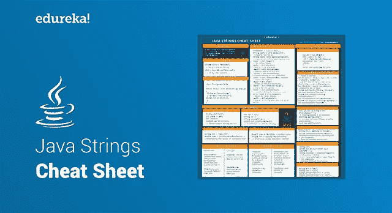
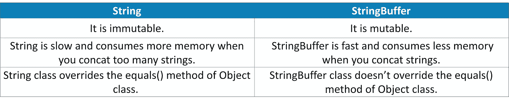
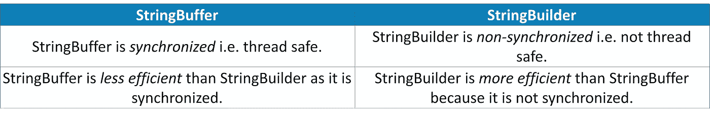

# Java 字符串备忘单——Java 字符串的完整参考

> 原文：<https://medium.com/edureka/java-string-cheat-sheet-9a91a6b46540?source=collection_archive---------2----------------------->



Java Strings Cheat Sheet — Edureka

你是一个正在寻找关于 Java 概念的快速指南的 Java 程序员吗？如果是，那么你必须考虑字符串。这个 **Java 字符串**备忘单是为已经踏上学习 Java 之旅的 Java 爱好者设计的。所以，让我们快速开始使用这个 Java 字符串备忘单。

# Java 字符串备忘单


字符串是一个字符序列。但是在 Java 中，字符串是表示一系列字符的对象。 *java.lang.String* 类用于创建一个字符串对象。

# 创建字符串

**Java 中的 String** 是一个表示 char 值序列的对象。可以通过两种方式创建字符串:

1.  使用文字
2.  使用“new”关键字

```
String str1 = “Welcome”; // Using literal

String str2 = new String(”Edureka”); // Using new keyword
```

# 字符串池

Java 字符串池指的是存储在堆内存中的字符串集合。在这种情况下，每当创建一个新对象时，字符串池首先检查该对象是否已经存在于池中。

```
String str1 = "abc";
     String str2 = "abc";

   System.out.println(str1 == str2);
   System.out.println(str1 == "abc");
```

# 字符串转换

## 字符串到整数的转换

```
String str="123";
	int inum1 = 100; 
	int inum2 = Integer.parseInt(str);// Converting a string to int
```

## Int 到 String 转换

```
int var = 111;
      String str = String.valueOf(var);     
      System.out.println(555+str); // Conversion of Int to String
```

## 字符串到双精度转换

```
String str = "100.222";
	double dnum = Double.parseDouble(str); //displaying the value of variable dnum
```

## 双精度到字符串转换

```
double dnum = 88.9999;  //double value
String str = String.valueOf(dnum);  //conversion using valueOf() method
```

# 重要程序

## 在字符串中查找重复字符

这个程序帮助你找出字符串中的重复字符。

```
public void countDupChars(String str)
{
//Create a HashMap 
    Map<Character, Integer> map = new HashMap<Character, Integer>(); 
     //Convert the String to char array
    char[] chars = str.toCharArray();
for(Character ch:chars){
      if(map.containsKey(ch)){
         map.put(ch, map.get(ch)+1);
      } else {
         map.put(ch, 1);
        }
   }
Set<Character> keys = map.keySet(); //Obtaining set of keys  
public static void main(String a[]){
Details obj = new Details();
System.out.println("String: Edureka"); 
obj.countDupChars("Edureka"); 
System.out.println("
String: StringCheatSheet"); 
obj.countDupChars("StringCheatSheet"); 
 }
}
```

## 删除字符串的尾随空格

这个程序告诉你如何从字符串中删除尾随空格，但不删除前导空格。

```
int len = str.length();
    for( ; len > 0; len--)
    {
      if( ! Character.isWhitespace( str.charAt( len - 1)))
         break;
    }
    return str.substring( 0, len);
```

## StringJoiner 类

```
StringJoiner mystring = new StringJoiner("-"); 
// Passing Hyphen(-) as delimiter   
mystring.add("edureka");   
// Joining multiple strings by using add() method 
mystring.add("YouTube");
```

## 使用递归进行字符串反转

```
class StringReverse 
{ 
 /* Function to print reverse of the passed string */
    void reverse(String str) 
    { 
        if ((str==null)||(str.length() <= 1)) 
           System.out.println(str); 
        else
        { 
            System.out.print(str.charAt(str.length()-1)); 
            reverse(str.substring(0,str.length()-1)); 
        } 
    } 
    /* Driver program to test above function */
    public static void main(String[] args){ 
        String str = "Edureka for Java"; 
        StringReverse obj = new StringReverse(); 
        obj.reverse(str); 
    }     
}
```

## 反转用户输入的字符串

```
String str = "Welcome To Edureka";
String[] strArray = str.split(" ");

for (String temp: strArray)
{
System.out.println(temp);
  for(int i=0; i<3; i++)
  {
char[] s1 = strArray[i].toCharArray();
for (int j = s1.length-1; j>=0; j--) 
{
System.out.print(s1[j]);
}
```

# 字符串类和接口

## 字符串与字符串缓冲区



## 字符串缓冲区与字符串生成器



现在，由 String、StringBuffer 和 StringBuilder 实现的接口显示在下面的代码中。

```
//String implements all the 3 interfaces
public final class String extends Object
implements *Serializable, Comparable<String>, CharSequence*

//StringBuffer implements Serializable & CharSequence interfaces
public final class StringBuffer extends Object
implements *Serializable, CharSequence*

//StringBuilder implements Serializable & CharSequence interfaces
public final class StringBuilder extends Object
implements *Serializable, CharSequence*
```

## string vs string buffer vs StringBuilder

在下面的代码中，我们将对 3 个不同的类执行连接操作。但是，连接只会发生在字符串缓冲区和生成器中。

```
class Edureka{ 
    // Concatenates to String 
    public static void concat1(String s1) 
    { 
        s1 = s1 + "edurekablog"; 
    } 
    // Concatenates to StringBuilder 
    public static void concat2(StringBuilder s2) 
    { 
        s2.append("edurekablog"); 
    } 
    // Concatenates to StringBuffer 
    public static void concat3(StringBuffer s3) 
    { 
        s3.append("edurekablog"); 
    } 
   public static void main(String[] args) 
    { 
        String s1 = "Andvideos"; 
        concat1(s1);  // s1 is not changed 
        System.out.println("String: " + s1); 
        StringBuilder s2 = new StringBuilder("Andvideos"); 
        concat2(s2); // s2 is changed 
        System.out.println("StringBuilder: " + s2); 
        StringBuffer s3 = new StringBuffer("Andvideos"); 
        concat3(s3); // s3 is changed 
        System.out.println("StringBuffer: " + s3); 
    } 
}
```

因此，在输出中，s1 将保持不变，s2 和 s3 将发生变化，并发生级联。

# 字符串方法

下面列出了一些最重要和最常用的字符串方法:

```
str1==str2 //compares address;
String newStr = str1.equals(str2); //compares the values
String newStr = str1.equalsIgnoreCase() //compares the values ignoring the case
newStr = str1.length() //calculates length
newStr = str1.charAt(i) //extract i'th character
newStr = str1.toUpperCase() //returns string in ALL CAPS
newStr = str1.toLowerCase() //returns string in ALL LOWERCASE
newStr = str1.replace(oldVal, newVal) //search and replace
newStr = str1.trim() //trims surrounding whitespace
newStr = str1.contains("value"); //check for the values
newStr = str1.toCharArray(); // convert String to character type array
newStr = str1.IsEmpty(); //Check for empty String
newStr = str1.endsWith(); //Checks if string ends with the given suffix
```

## 不可变字符串

在 Java 中， **string 对象是不可变的**。不可变仅仅意味着不可修改或不可改变。

```
class Stringimmutable{  

 public static void main(String args[]){  

   String s="JavaStrings";  
   s.concat(" CheatSheet");
  System.out.println(s); 

}
}
```

输出将是 JavaStrings，因为字符串是不可变的，值不会改变。

至此， **Java 字符串备忘单**告一段落。

如果你想查看更多关于人工智能、DevOps、道德黑客等市场最热门技术的文章，你可以参考 [Edureka 的官方网站。](https://www.edureka.co/blog/?utm_source=medium&utm_medium=content-link&utm_campaign=30-pattern-programs-in-java)

请留意本系列中的其他文章，它们将解释 Java 的各个方面。

> 1.[面向对象编程](/edureka/object-oriented-programming-b29cfd50eca0)
> 
> 2.[Java 中的继承](/edureka/inheritance-in-java-f638d3ed559e)
> 
> 3.[Java 中的多态性](/edureka/polymorphism-in-java-9559e3641b9b)
> 
> 4.[Java 中的抽象](/edureka/java-abstraction-d2d790c09037)
> 
> 5. [Java 字符串](/edureka/java-string-68e5d0ca331f)
> 
> 6. [Java 数组](/edureka/java-array-tutorial-50299ef85e5)
> 
> 7. [Java 集合](/edureka/java-collections-6d50b013aef8)
> 
> 8. [Java 线程](/edureka/java-thread-bfb08e4eb691)
> 
> 9.[Java servlet 简介](/edureka/java-servlets-62f583d69c7e)
> 
> 10. [Servlet 和 JSP 教程](/edureka/servlet-and-jsp-tutorial-ef2e2ab9ee2a)
> 
> 11.[Java 中的异常处理](/edureka/java-exception-handling-7bd07435508c)
> 
> 12.[高级 Java 教程](/edureka/advanced-java-tutorial-f6ebac5175ec)
> 
> 13. [Java 面试问题](/edureka/java-interview-questions-1d59b9c53973)
> 
> 14. [Java 程序](/edureka/java-programs-1e3220df2e76)
> 
> 15.[科特林 vs Java](/edureka/kotlin-vs-java-4f8653f38c04)
> 
> 16.[依赖注入使用 Spring Boot](/edureka/what-is-dependency-injection-5006b53af782)
> 
> 17.[Java 中的可比](/edureka/comparable-in-java-e9cfa7be7ff7)
> 
> 18.[十大 Java 框架](/edureka/java-frameworks-5d52f3211f39)
> 
> 19. [Java 反射 API](/edureka/java-reflection-api-d38f3f5513fc)
> 
> 20.[Java 中的 30 大模式](/edureka/pattern-programs-in-java-f33186c711c8)
> 
> 21.[核心 Java 备忘单](/edureka/java-cheat-sheet-3ad4d174012c)
> 
> 22.[Java 中的套接字编程](/edureka/socket-programming-in-java-f09b82facd0)
> 
> 23. [Java OOP 备忘单](/edureka/java-oop-cheat-sheet-9c6ebb5e1175)
> 
> 24.[Java 中的注释](/edureka/annotations-in-java-9847d531d2bb)
> 
> 25.[Java 中的图书管理系统项目](/edureka/library-management-system-project-in-java-b003acba7f17)
> 
> 26.[Java 中的树](/edureka/java-binary-tree-caede8dfada5)
> 
> 27.[Java 中的机器学习](/edureka/machine-learning-in-java-db872998f368)
> 
> 28.[顶级数据结构&Java 中的算法](/edureka/data-structures-algorithms-in-java-d27e915db1c5)
> 
> 29. [Java 开发者技能](/edureka/java-developer-skills-83983e3d3b92)
> 
> 30.[前 55 名 Servlet 面试问题](/edureka/servlet-interview-questions-266b8fbb4b2d)
> 
> 31. [](/edureka/java-exception-handling-7bd07435508c) [顶级 Java 项目](/edureka/java-projects-db51097281e3)
> 
> 32. [Java 教程](/edureka/java-tutorial-bbdd28a2acd7)
> 
> 33.[Java 中的嵌套类](/edureka/nested-classes-java-f1987805e7e3)
> 
> 34. [Java 集合面试问答](/edureka/java-collections-interview-questions-162c5d7ef078)
> 
> 35.[Java 中如何处理死锁？](/edureka/deadlock-in-java-5d1e4f0338d5)
> 
> 36.[你需要知道的 50 大 Java 集合面试问题](/edureka/java-collections-interview-questions-6d20f552773e)
> 
> 37.[Java 中的字符串池是什么概念？](/edureka/java-string-pool-5b5b3b327bdf)
> 
> 38.[C、C++和 Java 有什么区别？](/edureka/difference-between-c-cpp-and-java-625c4e91fb95)
> 
> 39.[Java 中的回文——如何检查一个数字或字符串？](/edureka/palindrome-in-java-5d116eb8755a)
> 
> 40.[你需要知道的顶级 MVC 面试问答](/edureka/mvc-interview-questions-cd568f6d7c2e)
> 
> 41.[Java 编程语言的十大应用](/edureka/applications-of-java-11e64f9588b0)
> 
> 42.[Java 中的死锁](/edureka/deadlock-in-java-5d1e4f0338d5)
> 
> 43.[Java 中的平方和平方根](/edureka/java-sqrt-method-59354a700571)
> 
> 44.[Java 中的类型转换](/edureka/type-casting-in-java-ac4cd7e0bbe1)
> 
> 45.[Java 中的运算符及其类型](/edureka/operators-in-java-fd05a7445c0a)
> 
> 46.[Java 中的析构函数](/edureka/destructor-in-java-21cc46ed48fc)
> 
> 47.[Java 中的二分搜索法](/edureka/binary-search-in-java-cf40e927a8d3)
> 
> 48.[Java 中的 MVC 架构](/edureka/mvc-architecture-in-java-a85952ae2684)
> 
> 49. [Hibernate 面试问答](/edureka/hibernate-interview-questions-78b45ec5cce8)

*最初发表于*[*【https://www.edureka.co】*](https://www.edureka.co/blog/cheatsheets/java-string-cheat-sheet/)*。*