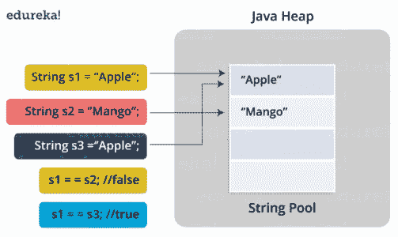

# Java 中的字符串池是什么概念？

> 原文：<https://medium.com/edureka/java-string-pool-5b5b3b327bdf?source=collection_archive---------0----------------------->


String Pool in Java — Edureka

你听说过术语**“Java 中的字符串池吗？”**好吧，如果没有，那你就来对地方了。Java 中的字符串池是存储在 Java 堆内存中的字符串池。让我们更深入一点，详细理解 Java 字符串池的概念。

本文将讨论以下几点:

*   如何创建字符串？
*   Java 中的字符串池是什么？
*   Java 中字符串池是如何工作的？
*   流程图
*   字符串池的 Java 程序

我们开始吧！

首先让我们了解一下 string 对象到底是怎么创建的！

# 如何创建字符串？

在 Java 中创建 String 对象有两种方法:

*   使用 new 运算符。举个例子，

```
String s1 = new String("Joey");
```

*   使用字符串或常量表达式。举个例子，

```
String s1="Joey"; (string literal) or
String s1="Joe" + "y"; (string constant expression)
```

现在，我所说的这个字符串池是什么，在 Java 中创建一个字符串与此有什么关系。让我把这些杂物清理一下！

# Java 中的字符串池是什么？

字符串池是 Java 堆中的一个存储区域。

像所有的对象分配一样，字符串分配在时间和内存上都是一件代价很高的事情。JVM 在初始化字符串文字时执行一些步骤，以提高性能和减少内存开销。为了减少 JVM 中创建的字符串对象的数量，String 类保留了一个字符串池。

每次创建一个字符串，JVM 首先检查字符串池。如果字符串池中已经存在该字符串，则返回对池化实例的引用。如果池中不存在该字符串，则会初始化一个新的 string 对象，并将其放入池中。

在理论上学习了概念之后，让我借助简单的实例一步一步的告诉你一个字符串池在 Java 中是如何工作的！

# Java 中字符串池是如何工作的？

当您像这样创建一个新字符串时:

```
String s1 = "Rachel"
```

JVM 自动检查字符串常量池中是否存在相同的值。

*   如果是，它将占用已经存在的值。
*   如果没有，它会自己创建一个新字符串，并将其添加到字符串池中。

如果要停止这种行为，请使用 new 运算符创建一个字符串:

```
String s1 = new String("Rachel")
```

现在，如果你愿意把这个字符串加入字符串文字池，Java 给你提供了一个方法，叫做，intern()方法；您可以像这样调用 native intern()方法:

```
S1.intern();
```

现在，我将通过一个例子向您展示字符串池的实现和工作方式。

但在此之前，有个简短的提醒！

如你所知，如果你使用==运算符比较两个对象，它会比较内存中的地址。

所以我们将使用==来比较字符串，以完全确定它是否是同一个对象。

现在，让我们开始实施过程。

# Java 中的字符串池:流程图



现在让我们一步一步地理解这里发生的事情:

*   该类在 JVM 被调用时被加载。
*   JVM 在程序中寻找所有的字符串
*   首先，它找到引用文字“Apple”的变量 s1，并在内存中创建它
*   然后，在字符串常量池内存中放置一个对文字“Apple”的引用。
*   然后，它找到另一个变量 s2，该变量指向同一个字符串文字“Mango”。
*   然后，它找到另一个变量 s3，该变量引用了文字“Apple”
*   既然 JVM 已经找到了一个字符串文字“Apple”，那么变量 s1 和 s3 将指向同一个对象，即“Apple”。

# 字符串池的 Java 程序

```
public class StringPoolExperiment
{
   public static void main(String[] args)
{
        String s1 = "Rachel";
        String s2 = "Rachel";
        String s3 = new String("Rachel");
        String s4 = new String("Rachel").intern();         System.out.println(s1 == s2); // true
        System.out.println(s1 == s3); // false
        System.out.println(s1 == s4); // true 
} 
}
```

**输出:**

真
假
真

在上面的例子中，你可以清楚地看到字符串初始化在所有三种方式中的用法；即:

```
String s1 = "Rachel";
String s2 = "Rachel";
String s3 = new String("Rachel");
String s4 = new String("Rachel").intern();
```

程序的内部工作现在也许应该清楚了。

至此，我的博客已经接近尾声。我希望这里阐述的内容能帮助你拓宽你的知识基础。我们将继续深入 Java 世界。敬请期待！

如果你想查看更多关于人工智能、DevOps、道德黑客等市场最热门技术的文章，那么你可以参考 [Edureka 的官方网站。](https://www.edureka.co/blog/?utm_source=medium&utm_medium=content-link&utm_campaign=java-string-pool)

请留意本系列中的其他文章，它们将解释 Java 的各个方面。

> *1。* [*面向对象编程*](/edureka/object-oriented-programming-b29cfd50eca0)
> 
> *2。*[*Java 中的继承*](/edureka/inheritance-in-java-f638d3ed559e)
> 
> *3。*[*Java 中的多态性*](/edureka/polymorphism-in-java-9559e3641b9b)
> 
> *4。*[*Java 中的抽象*](/edureka/java-abstraction-d2d790c09037)
> 
> *5。* [*Java 字符串*](/edureka/java-string-68e5d0ca331f)
> 
> *6。* [*Java 数组*](/edureka/java-array-tutorial-50299ef85e5)
> 
> *7。* [*Java 集合*](/edureka/java-collections-6d50b013aef8)
> 
> *8。* [*Java 线程*](/edureka/java-thread-bfb08e4eb691)
> 
> *9。*[*Java servlet 简介*](/edureka/java-servlets-62f583d69c7e)
> 
> *10。* [*Servlet 和 JSP 教程*](/edureka/servlet-and-jsp-tutorial-ef2e2ab9ee2a)
> 
> *11。*[*Java 中的异常处理*](/edureka/java-exception-handling-7bd07435508c)
> 
> *12。* [*高级 Java 教程*](/edureka/advanced-java-tutorial-f6ebac5175ec)
> 
> 13。 [*Java 面试题*](/edureka/java-interview-questions-1d59b9c53973)
> 
> 14。 [*Java 程序*](/edureka/java-programs-1e3220df2e76)
> 
> *15。*[*kot Lin vs Java*](/edureka/kotlin-vs-java-4f8653f38c04)
> 
> *16。* [*依赖注入使用*](/edureka/what-is-dependency-injection-5006b53af782)
> 
> 17。 [*堪比 Java 中的*](/edureka/comparable-in-java-e9cfa7be7ff7)
> 
> 18。 [*十大 Java 框架*](/edureka/java-frameworks-5d52f3211f39)
> 
> 19。 [*Java 反射 API*](/edureka/java-reflection-api-d38f3f5513fc)
> 
> *20。*[*Java 中的前 30 个模式*](/edureka/pattern-programs-in-java-f33186c711c8)
> 
> *21。* [*核心 Java 备忘单*](/edureka/java-cheat-sheet-3ad4d174012c)
> 
> *22。*[*Java 中的套接字编程*](/edureka/socket-programming-in-java-f09b82facd0)
> 
> *23。* [*Java OOP 备忘单*](/edureka/java-oop-cheat-sheet-9c6ebb5e1175)
> 
> *24。*[*Java 中的注释*](/edureka/annotations-in-java-9847d531d2bb)
> 
> *25。*[*Java 中的库管理系统项目*](/edureka/library-management-system-project-in-java-b003acba7f17)
> 
> *26。*[*Java 中的树木*](/edureka/java-binary-tree-caede8dfada5)
> 
> *27。* [*Java 教程*](/edureka/java-tutorial-bbdd28a2acd7)
> 
> *28。* [*顶级数据结构&Java 中的算法*](/edureka/data-structures-algorithms-in-java-d27e915db1c5)
> 
> *29。* [*Java 开发者技能*](/edureka/java-developer-skills-83983e3d3b92)
> 
> *三十。* [*前 55 名 Servlet 面试问题*](/edureka/servlet-interview-questions-266b8fbb4b2d)
> 
> 31。 [](/edureka/java-exception-handling-7bd07435508c)[*顶级 Java 项目*](/edureka/java-projects-db51097281e3)
> 
> *32。* [*Java 字符串备忘单*](/edureka/java-string-cheat-sheet-9a91a6b46540)
> 
> *33。*[*Java 中的嵌套类*](/edureka/nested-classes-java-f1987805e7e3)
> 
> 34。 [*Java 集合面试问答*](/edureka/java-collections-interview-questions-162c5d7ef078)
> 
> 35.[Java 中如何处理死锁？](/edureka/deadlock-in-java-5d1e4f0338d5)
> 
> 36.[你需要知道的 50 大 Java 集合面试问题](/edureka/java-collections-interview-questions-6d20f552773e)
> 
> 37. [Java 教程](/edureka/java-tutorial-bbdd28a2acd7)
> 
> 38.[C、C++和 Java 有什么区别？](/edureka/difference-between-c-cpp-and-java-625c4e91fb95)
> 
> 39.[Java 中的回文——如何检查一个数字或字符串？](/edureka/palindrome-in-java-5d116eb8755a)
> 
> 40.[你需要知道的顶级 MVC 面试问答](/edureka/mvc-interview-questions-cd568f6d7c2e)
> 
> 41.[Java 编程语言的十大应用](/edureka/applications-of-java-11e64f9588b0)
> 
> 42.[Java 中的死锁](/edureka/deadlock-in-java-5d1e4f0338d5)
> 
> 43.[Java 中的平方和平方根](/edureka/java-sqrt-method-59354a700571)
> 
> 44.[Java 中的类型转换](/edureka/type-casting-in-java-ac4cd7e0bbe1)
> 
> 45.[Java 中的运算符及其类型](/edureka/operators-in-java-fd05a7445c0a)
> 
> 46.[Java 中的析构函数](/edureka/destructor-in-java-21cc46ed48fc)
> 
> 47.[爪哇的二分搜索法](/edureka/binary-search-in-java-cf40e927a8d3)
> 
> 48.[Java 中的 MVC 架构](/edureka/mvc-architecture-in-java-a85952ae2684)
> 
> 49. [Hibernate 面试问答](/edureka/hibernate-interview-questions-78b45ec5cce8)

*原载于 2019 年 8 月 1 日*[*https://www.edureka.co*](https://www.edureka.co/blog/java-string-pool/)*。*