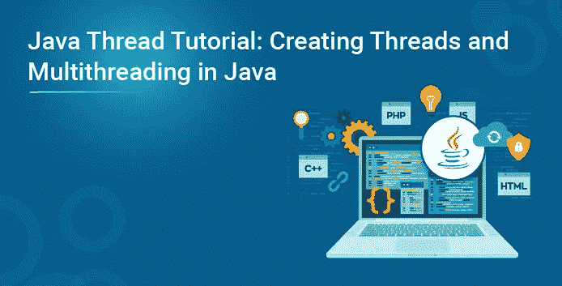
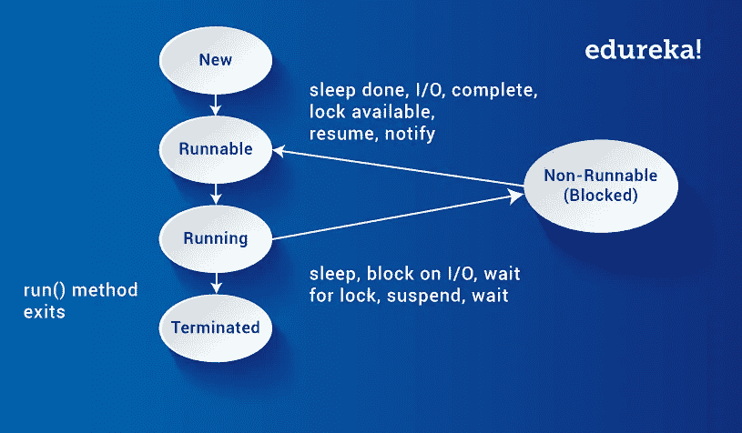
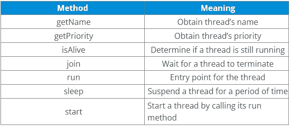

# Java 线程教程:用 Java 创建线程和多线程

> 原文：<https://medium.com/edureka/java-thread-creating-threads-and-multithreading-23e56264319f?source=collection_archive---------6----------------------->



与许多其他计算机语言不同，Java 提供了对多线程的内置支持。Java 中的多线程包含两个或更多可以并发运行的部分。Java 线程实际上是一个轻量级的进程。

这篇博客将向您介绍许多人觉得难以使用和理解的所有 Java 线程概念。那么让我们开始吧，好吗？

在这篇 Java Thread 博客中，我将讨论以下主题:

1.  Java 中的线程是什么？
2.  Java 线程模型
3.  Java 中的多线程
4.  主 Java 线程
5.  如何创建一个 Java 线程？

您可以浏览这个 Java Threads 视频讲座，我们的 Java 培训专家将讨论该技术的每一个细微差别。

在我们继续这个 Java 线程博客的第一个主题之前，考虑这个例子:-

想象一个具有许多复杂功能的股票经纪人应用程序。以下是它的一些功能:

*   下载最新的股票期权价格
*   检查价格是否有警告
*   分析 XYZ 公司的历史数据

这些都是耗时的函数。在单线程运行时环境中，这些动作一个接一个地执行。只有在前一个动作完成时，下一个动作才能发生。

现在，如果历史分析需要半个小时，并且用户选择执行下载并在之后检查，则警告可能来得太晚，以至于不能买或卖股票。我们只是想象了那种迫切需要多线程的应用程序。理想情况下，下载应该在后台进行(即在另一个线程中)。这样，其他过程可以同时发生，例如，可以立即传达警告。一直以来，用户都在与应用程序的其他部分进行交互。分析也可以在单独的线程中进行，因此用户可以在计算结果的同时处理应用程序的其余部分。

这就是 Java 线程发挥作用的地方。让我们先了解一下 Java 线程:

# Java 中的线程是什么？

线程实际上是一个轻量级的进程。与许多其他计算机语言不同，Java 为多线程编程提供了内置支持。多线程程序包含两个或多个可以并发运行的部分。这种程序的每个部分被称为一个线程，每个线程定义一个单独的执行路径。因此，多线程是多任务的一种特殊形式。

这个 Java 线程博客中的下一个概念是线程和多线程概念的一部分。

# Java 线程模型——为什么在 Java 中使用线程？

Java 运行时系统在许多方面都依赖于线程。线程通过防止 CPU 周期的浪费来降低效率。

线程有几种状态。以下是这些状态:

*   **New** —当我们创建一个线程类的实例时，一个线程处于一个新的状态。
*   **可运行—**Java 线程处于运行状态。
*   **Suspended**——一个正在运行的线程可以 **suspended** ，这将暂时中止它的活动。然后，一个挂起的线程可以被恢复，允许它从中断的地方恢复。
*   **阻塞**——Java 线程在等待资源时可以被阻塞。
*   **终止**——线程可以终止，在任何给定的时间立即停止执行。一旦线程终止，就不能再继续。



所以，这都是关于 Java 线程状态的。现在，让我们跳到 Java 线程最重要的主题，即线程类和可运行接口。我们将在下面逐一讨论。

# Java 中的多线程:Java 线程是如何工作的？

# 线程类和可运行接口

Java 的多线程系统建立在 Thread 类、它的方法和它的伴随接口 **Runnable** 之上。为了创建一个新的线程，您的程序将扩展**线程**或者**实现**可运行 **接口**。

Thread 类定义了几种帮助管理线程的方法。下表显示了相同的内容:



现在让我们看看如何使用一个线程，它以所有 java 程序都有的主 Java 线程**、**开始。

# 主 Java 线程

现在让我们看看如何使用 Thread 和 Runnable 接口来创建和管理线程，从所有 java 程序都有的主 Java 线程开始。所以，让我们讨论一下主线。

# 为什么主线如此重要？

*   因为这个线程会影响其他“子”线程
*   因为它执行各种关机动作
*   它是在程序启动时自动创建的。

所以，这是主线。让我们看看如何创建一个 java 线程？

# 如何创建一个 Java 线程？

Java 允许您通过以下两种方式创建一个线程:-

让我们看看这两种方式如何帮助实现 Java 线程。

# 可运行接口

创建线程最简单的方法是创建一个实现**可运行**接口的类。

为了实现一个可运行的接口，一个类只需要实现一个名为 run()的方法，其声明如下:

```
public void run( )
```

在 run()中，我们将定义构成新线程的代码

**例:**

```
public class MyClass implements Runnable {public void run(){System.out.println("MyClass running");}}
```

要通过线程执行 run()方法，请将 MyClass 的实例传递给其构造函数中的线程(Java 中的 *A* ***构造函数*** *是类似于创建对象实例时调用的方法的代码块*)。事情是这样的:

```
Thread t1 = new Thread(new MyClass ());t1.start();
```

当线程启动时，它将调用 MyClass 实例的 run()方法，而不是执行它自己的 run()方法。上面的例子将打印出文本“**我的类运行**”。

# 扩展 Java 线程

创建线程的第二种方法是创建一个扩展 thread 的新类，然后覆盖 run()方法，然后创建该类的一个实例。run()方法是在您调用 start()之后由线程执行的。下面是一个创建 Java 线程子类的例子:

```
public class MyClass extends Thread {public void run(){System.out.println("MyClass running");}}
```

要创建并启动上述线程，您可以这样做:

```
MyClass t1 = new MyClass ();T1.start();
```

当 run()方法执行时，它将打印出文本“ **MyClass running** ”。

到目前为止，我们只使用了两个线程:主线程和一个子线程。然而，我们的程序可以根据需要影响任意多的线程。让我们看看如何创建多线程。

# 创建多线程

```
class MyThread implements Runnable {String name;Thread t;MyThread (String thread){name = threadname;t = new Thread(this, name);System.out.println("New thread: " + t);t.start();}public void run() {try {for(int i = 5; i > 0; i--) {System.out.println(name + ": " + i);Thread.sleep(1000);}}catch (InterruptedException e) {System.out.println(name + "Interrupted");}System.out.println(name + " exiting.");}}class MultiThread {public static void main(String args[]) {new MyThread("One");new MyThread("Two");new NewThread("Three");try {Thread.sleep(10000);} catch (InterruptedException e) {System.out.println("Main thread Interrupted");}System.out.println("Main thread exiting.");}}}The output from this program is shown here:

New thread: Thread[One,5,main]
 New thread: Thread[Two,5,main]
 New thread: Thread[Three,5,main]
 One: 5
 Two: 5
 Three: 5
 One: 4
 Two: 4
 Three: 4
 One: 3
 Three: 3
 Two: 3
 One: 2
 Three: 2
 Two: 2
 One: 1
 Three: 1
 Two: 1
 One exiting.
 Two exiting.
 Three exiting.
 Main thread exiting.
```

这就是 java 中多线程的工作方式。这就把我们带到了 Java Thread 博客的结尾。

到此，我们来结束这篇文章。我希望你已经理解了 Java 设计模式，它们的类型，重要性，以及它们通过一些实时例子的实现。如果你想查看更多关于人工智能、Python、道德黑客等市场最热门技术的文章，你可以参考 [Edureka 的官方网站。](https://www.edureka.co/blog/?utm_source=medium&utm_medium=content-link&utm_campaign=java-thread)

请留意本系列中解释 Java 其他各方面的其他文章。

> *1。* [*面向对象编程*](/edureka/object-oriented-programming-b29cfd50eca0)
> 
> *2。*[*Java 中的继承*](/edureka/inheritance-in-java-f638d3ed559e)
> 
> *3。*[*Java 中的多态性*](/edureka/polymorphism-in-java-9559e3641b9b)
> 
> *4。*[*Java 中的抽象*](/edureka/java-abstraction-d2d790c09037)
> 
> *5。* [*Java 字符串*](/edureka/java-string-68e5d0ca331f)
> 
> *6。* [*Java 数组*](/edureka/java-array-tutorial-50299ef85e5)
> 
> *7。* [*Java 收藏*](/edureka/java-collections-6d50b013aef8)
> 
> *8。* [*Java 线程*](/edureka/java-thread-bfb08e4eb691)
> 
> *9。*[*Java servlet 简介*](/edureka/java-servlets-62f583d69c7e)
> 
> *10。* [*Servlet 和 JSP 教程*](/edureka/servlet-and-jsp-tutorial-ef2e2ab9ee2a)
> 
> *11。*[*Java 中的异常处理*](/edureka/java-exception-handling-7bd07435508c)
> 
> 12。 [*Java 教程*](/edureka/java-tutorial-bbdd28a2acd7)
> 
> *13。* [*Java 面试题*](/edureka/java-interview-questions-1d59b9c53973)
> 
> *14。* [*Java 程序*](/edureka/java-programs-1e3220df2e76)
> 
> 15。 [*科特林 vs Java*](/edureka/kotlin-vs-java-4f8653f38c04)
> 
> 16。 [*依赖注入使用 Spring Boot*](/edureka/what-is-dependency-injection-5006b53af782)
> 
> 17。 [*堪比 Java 中的*](/edureka/comparable-in-java-e9cfa7be7ff7)
> 
> *18。* [*十大 Java 框架*](/edureka/java-frameworks-5d52f3211f39)
> 
> *19。* [*Java 反射 API*](/edureka/java-reflection-api-d38f3f5513fc)
> 
> 20。[*Java 中的 30 大模式*](/edureka/pattern-programs-in-java-f33186c711c8)
> 
> *21。* [*核心 Java 备忘单*](/edureka/java-cheat-sheet-3ad4d174012c)
> 
> *22。*[*Java 中的套接字编程*](/edureka/socket-programming-in-java-f09b82facd0)
> 
> *23。* [*Java OOP 备忘单*](/edureka/java-oop-cheat-sheet-9c6ebb5e1175)
> 
> *24。*[*Java 中的注释*](/edureka/annotations-in-java-9847d531d2bb)
> 
> *25。*[*Java 中的库管理系统项目*](/edureka/library-management-system-project-in-java-b003acba7f17)
> 
> *26。*[*Java 中的树*](/edureka/java-binary-tree-caede8dfada5)
> 
> *27。*[*Java 中的机器学习*](/edureka/machine-learning-in-java-db872998f368)
> 
> *28。* [*顶级数据结构&Java 中的算法*](/edureka/data-structures-algorithms-in-java-d27e915db1c5)
> 
> *29。* [*Java 开发人员技能*](/edureka/java-developer-skills-83983e3d3b92)
> 
> 三十岁。 [*前 55 名 Servlet 面试问题*](/edureka/servlet-interview-questions-266b8fbb4b2d)
> 
> 31。 [](/edureka/java-exception-handling-7bd07435508c)[*顶级 Java 项目*](/edureka/java-projects-db51097281e3)
> 
> *32。* [*Java 字符串备忘单*](/edureka/java-string-cheat-sheet-9a91a6b46540)
> 
> 33。[*Java 中的嵌套类*](/edureka/nested-classes-java-f1987805e7e3)
> 
> 34。 [*Java 集合面试问答*](/edureka/java-collections-interview-questions-162c5d7ef078)
> 
> *35。*[*Java 中如何处理死锁？*](/edureka/deadlock-in-java-5d1e4f0338d5)
> 
> *36。* [*你需要知道的 50 大 Java 合集面试问题*](/edureka/java-collections-interview-questions-6d20f552773e)
> 
> *37。*[*Java 中的字符串池是什么概念？*](/edureka/java-string-pool-5b5b3b327bdf)
> 
> 38。[*C、C++和 Java 有什么区别？*](/edureka/difference-between-c-cpp-and-java-625c4e91fb95)
> 
> 39。[*Java 中的回文——如何检查一个数字或字符串？*](/edureka/palindrome-in-java-5d116eb8755a)
> 
> *40。* [*你需要知道的顶级 MVC 面试问答*](/edureka/mvc-interview-questions-cd568f6d7c2e)
> 
> *41。*[*Java 编程语言的十大应用*](/edureka/applications-of-java-11e64f9588b0)
> 
> *42。*[*Java 中的死锁*](/edureka/deadlock-in-java-5d1e4f0338d5)
> 
> *43。*[*Java 中的平方和平方根*](/edureka/java-sqrt-method-59354a700571)
> 
> *44。*[*Java 中的类型转换*](/edureka/type-casting-in-java-ac4cd7e0bbe1)
> 
> *45。*[*Java 中的运算符及其类型*](/edureka/operators-in-java-fd05a7445c0a)
> 
> *46。*[*Java 中的析构函数*](/edureka/destructor-in-java-21cc46ed48fc)
> 
> *47。* [*爪哇*二分搜索法](/edureka/binary-search-in-java-cf40e927a8d3)
> 
> 48。[*Java 中的 MVC 架构*](/edureka/mvc-architecture-in-java-a85952ae2684)
> 
> *49。* [*冬眠面试问答*](/edureka/hibernate-interview-questions-78b45ec5cce8)

*原载于 2021 年 9 月 30 日 ww.edureka.co**T21*[。](https://www.edureka.co/blog/java-thread/)