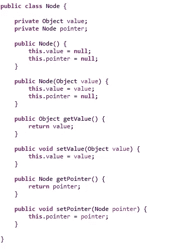
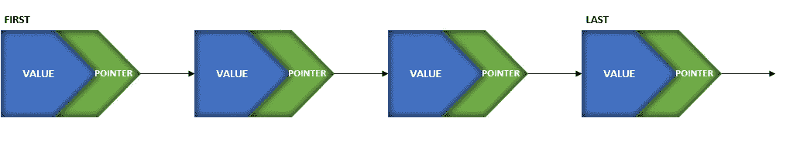
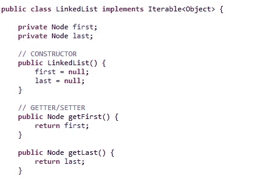
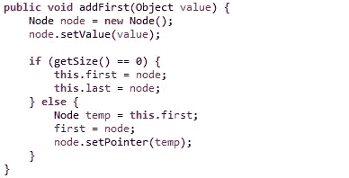
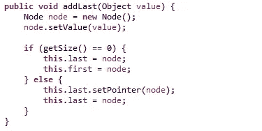
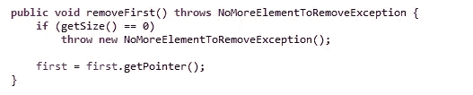
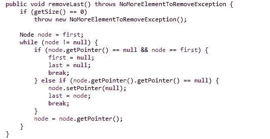
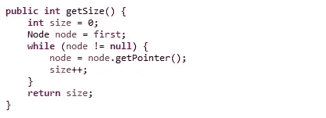
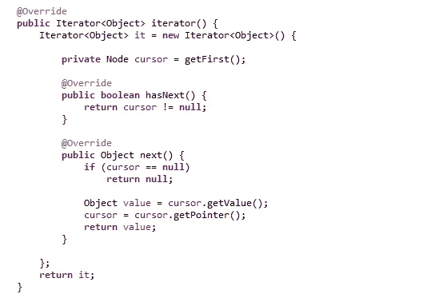
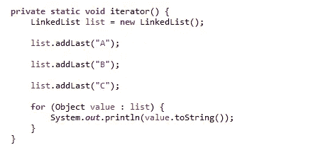

# Java 技巧——自制的链表

> 原文：<https://medium.com/quick-code/java-tips-a-homemade-linked-list-9adae0906332?source=collection_archive---------0----------------------->

不使用 java.util 库如何设计和实现链表

Photo by [C Drying](https://unsplash.com/@cdrying?utm_source=medium&utm_medium=referral) on [Unsplash](https://unsplash.com?utm_source=medium&utm_medium=referral)

# 介绍

Java SDK 实现了一个漂亮的库来管理对象的集合:这个库包含在 java.util.*包中。

为了更好地理解集合，并在头脑中留下深刻印象，通过引用对象的访问将尝试实现一个自制的链表。

这个链表，我们将尝试实现像添加，删除和许多其他需要操纵数据结构的操作。想象链表像一条链，有起点和终点，每个节点只链接到下一个环。

***走吧！***

# 列表的节点

首先，我们需要将集合定义为一组节点，每个节点都必须有:

*   **值**:每个节点携带的信息量；
*   指针:指向列表中下一个元素的指针；有了这条链路，每个节点都知道下一个节点；

节点的结构是:

Node class

**节点**类提供给:

*   一个维护**值**的类变量，一个维护指向下一个节点的**指针**
*   一个**默认构造函数**，初始化为空值和指针；
*   一个**值构造器**，用输入中接收的对象和指向 null 的指针初始化节点的值；
*   **Getter** 和 **setter** 方法来操纵节点。

链表将是一个节点序列，每个节点都将通过引用指向下一个节点，如下图所示:

Linked list structure

**LinkedList** 类提供给:

*   一个类变量用于维护对列表的第一个节点的引用，一个用于维护对最后一个节点的引用；
*   一个**默认构造函数**，初始化为空值和指针；
*   **Getter** 方法检索链表的第一个和最后一个节点；
*   **商业方法**对操纵单子有用。

LinkedList 类的结构是:

Extract of LinkedList class

链表的核心有两个类变量:一个维护列表头的引用(first)，一个维护列表尾的引用(last)。当列表被创建时，两者都是空的，并且需要为列表的每次操作进行更新。

而且链表核心类需要实现 *Iterable* 接口进行迭代。

# 操作:添加

创建列表后，我们可以添加节点来填充它。可以使用 **addFirst** 方法在列表顶部添加一个新节点，或者使用 **addLast** 方法在列表尾部添加一个新节点。

**addFirst** 方法需要区分两种情况:

*   **空列表**:在空列表的情况下，将要添加的节点将与第一个和最后一个节点重合，因为它将是列表中包含的唯一一个节点
*   **全列表**:如果是全列表，需要在临时节点上保存实际的第一个节点，用新节点设置第一个节点，并从新节点到临时节点增加一个参考点

这是 **addFirst** 的实现:

Add first method on LinkedList class

另外， **addLast** 方法需要区分两种情况:

*   **空列表**:在空列表的情况下，将要添加的节点将与第一个和最后一个节点重合，因为它将是列表中包含的唯一一个节点
*   **全列表**:如果是全列表，需要设置指针从实际最后一个指向新节点，并用新节点覆盖最后一个节点

这是 **addLast** 的实现:

Add last method on LinkedList class

在这两个 add 方法中，都将使用输入中接收的值初始化一个新的对象节点。

# 操作:移除

除了添加操作之外，还可以通过链表删除任何节点。remove can 操作通过 **removeFirst** 操作作用于第一个节点，或通过 **removeLast** 操作作用于尾部

**removeFirst** 方法需要区分两种情况:

*   **空列表**:如果列表为空，操作将停止，抛出自定义异常
*   **完整列表**:在这种情况下，需要用指向同一个第一节点的下一个节点的指针覆盖第一个变量的值。旧的第一个节点将保持不被引用，并将被垃圾收集器捕获

这是 **removeFirst** 的实现:

Remove first method on LinkedList class

另外 **removeLast** 方法需要区分三种情况:

*   **空列表**:如果列表为空，操作将停止，抛出自定义异常
*   **一元链表**:链表需要迭代，如果当前节点为空，则需要设置下一个节点的指针，使第一个和最后一个节点为空，因为链表现在为空。旧的第一个节点将保持不被引用，并将被垃圾收集器捕获
*   **两个或多个元素列表**:链表需要迭代，当发现当前节点的下一个节点没有下一个指针时，需要将当前节点的指针置空，用当前节点替换最后一个节点。旧的最后一个节点将保持不被引用，并将被垃圾收集器捕获

这是 **removeLast** 的实现:

Remove last method on LinkedList class

# 列表的大小和扫描

要计算链表中包含的对象，没有全局计数器，但是链表的大小是在运行时迭代整个链表计算出来的。

要迭代列表，我们可以从第一个元素开始，直到下一个元素为空，用指向以下内容的指针覆盖实际节点:

Sizing the list

在每次迭代中，计数器递增。

这个循环是 LinkedList 类的内部循环，但是如果要通过外部类迭代整个列表，就需要实现 iterator()方法:

Implementation of the hasNext() and next() method of the iterator

实现此方法后，只需使用 for 循环即可迭代 LinkedList 类的实例:

Example of iteration

# **结论**

这些例子有助于理解集合的概念，熟悉 Java 对象之间的引用。

当您需要自定义标准集合的行为时，您可以使用这种方法，或者您可以将这些示例用于教学目的。

在 GitHub repository 上，你可以找到完整的代码和许多使用示例。

**在 GitHub 上关注我** : [仓库](https://github.com/Mamix84/jtips/tree/master/Medium/src/it/mamino84/example/linkedlist)