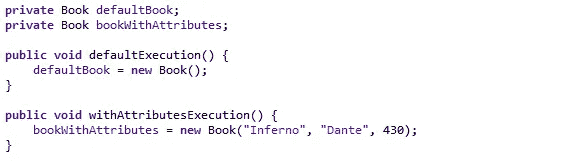
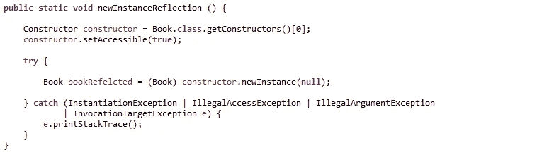

# Java 技巧——创建新对象

> 原文：<https://medium.com/quick-code/java-tips-creation-of-a-new-object-55408a410507?source=collection_archive---------10----------------------->

## 在 Java 中声明和初始化新对象的不同方法

Photo by [Samuel Zeller](https://unsplash.com/@samuelzeller?utm_source=medium&utm_medium=referral) on [Unsplash](https://unsplash.com?utm_source=medium&utm_medium=referral)

在 Java 中使用一个对象是必不可少的定义，当需要使用时，要执行命令的**语法所提供的新的**。

使用 new 命令调用 Java 虚拟机，该虚拟机分配内存中的位置，并在调用初始化内存区域的指定构造函数后获取与之关联的指针:现在对象是可用的。

有几种方法可以声明一个对象并使其可用，现在试着描述它们。

## 类对象中的构造函数方法

在开始描述初始化的方法之后，回忆一下创建对象实例的必要步骤是很有用的。

每个对象都被描述到一个 Java 类文件中:该文件需要与对象同名，还必须与类名相同。要最后初始化对象，必须定义一个或多个允许初始化的构造函数方法。

这是从 Oracle Java [文档](https://docs.oracle.com/javase/tutorial/java/javaOO/objectcreation.html)中得到的定义:

> **声明**:粗体显示的代码都是将一个变量名和一个对象类型关联起来的变量声明。
> 
> **实例化**:new 关键字是一个创建对象的 Java 操作符。
> 
> **初始化**:new 操作符后面是对构造函数的调用，它初始化新的对象。

这是默认构造函数和带参数的构造函数的示例:

Constructor examples

对于第一种类型的构造函数，new 的操作在对象的实例化完成后用它们的默认值初始化属性；与第一个不同，第二个构造函数方法允许调用者在输入中提供一组仅用于初始化对象局部属性的值。

## 在线初始化

创建对象最常见的用途是在需要时使用*。*

*通常在一行中定义、实例化和初始化对象:这种定义方式要求使用类型和变量名。该类型必须与它将创建的对象相同。*

*声明后立即调用构造函数方法:*

**

*Declaration and initialization in-line of object*

*内联初始化时，实例化的对象仅在大括号 *{ }* 中的方法或方法部分内可见。这些对象在大括号之外是不可用的。*

*当开发人员需要一个对象的实例，并且这个实例只需要被类的特定部分访问时，就使用内联初始化。*

## *单独声明和初始化*

*在任何情况下，对象的声明和初始化发生在不同的时间。*

*对象的声明位于一行，实例化和初始化位于不同的行。使用这种方法，声明将对象的可见性驱动到程序的执行中。*

**

*Separate declaration and initialization of objects*

*如果声明被定义为一个类变量，对象一旦被实例化，在类执行的每个部分都是可见的；否则应用内嵌声明的规则。*

## *反射初始化*

*执行对象初始化的另一个机会是[反射](https://www.oracle.com/technetwork/articles/java/javareflection-1536171.html)；使用反射可以从类定义中识别正确的构造函数方法，并使用 Java SE 中包含的反射库调用它。*

*反射初始化适用于串联模式或分离模式。*

**

*Initialization in-line of object by reflection*

*这种方法在需要高度动态性的情况下很有用，例如在开发一个库或一个框架时:在这些情况下，很难(并且不执行)定义所有需要使用的对象，所以通过反射初始化，可以预先安排软件使用通用信息。*

## *结论*

*我们已经追溯了一些在 Java 中声明、初始化和实例化对象的方法:从经典的内联初始化直到反射的使用。*

*对于对象创建的主题，许多设计模式(参考文献。[定义](https://en.wikipedia.org/wiki/Software_design_pattern)制作可重复使用的解决方案来创建对象；特别是有一类设计模式，其中包含了[创造模式](https://en.wikipedia.org/wiki/Creational_pattern)。*

***Git** : [仓库](https://github.com/Mamix84/jtips/tree/master/Medium/src/it/mamino84/example/create)*