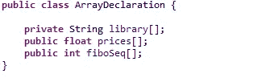
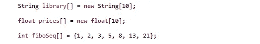
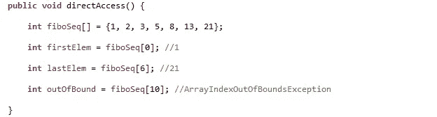
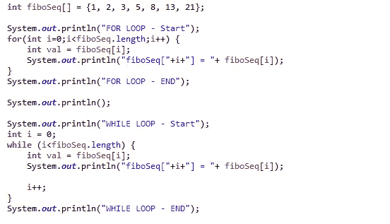
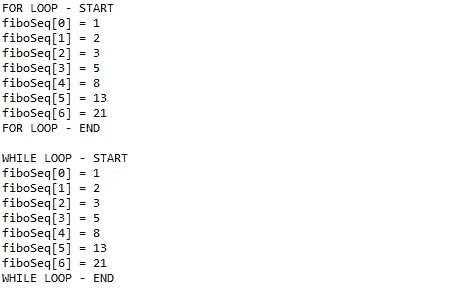
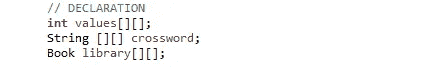
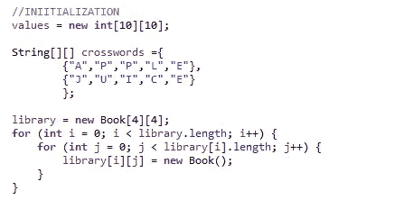
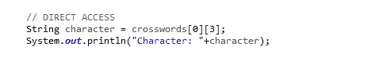
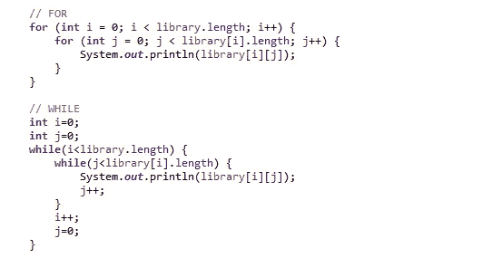

# Java 技巧—管理阵列

> 原文：<https://medium.com/quick-code/java-tips-managing-arrays-1dbe836d5c?source=collection_archive---------0----------------------->

## 创建、操作和使用数组的介绍

Photo by [Ilze Lucero](https://unsplash.com/@ilzelucero?utm_source=medium&utm_medium=referral) on [Unsplash](https://unsplash.com?utm_source=medium&utm_medium=referral)

要在内存中存储多个变量，可以使用数组；数组是一种结构，可以包含定义为基本类型或定义为对象的变量。

数组声明的语法特点是使用了*方括号* *[]* 。

## 数组的声明和初始化

声明一个数组需要两个信息:名称和类型。相反，初始化需要维度。详细来说:

*   **Name** :数组本身就是一个变量，需要声明一个名字
*   **类型**:每个数组都包含同类变量，因此需要定义数组中要包含的对象的类型
*   **Dimension** :数组的维数预先指定了它可以包含的变量的最大数量

Examples of array declaration

可以使用 new 命令实例化一个数组，指定可以包含的需要为正数的对象的数量，或者在大括号中指定值列表。在第一种情况下，数组将使用基于类型的默认值进行初始化，否则在第二种情况下，数组的维数将等于列表中包含的几个值。

Examples of array initialization

**数组对象一旦创建，其长度就不会改变。**

## 访问和扫描数组

数组中的位置从 0 开始，直到 *n-1* ，其中 *n-1* 是数组中包含的对象的最大数量。要直接访问数组中的位置，需要指定要获取的对象的 *dimension-1* ，例如:

Examples of direct access to an array

也可以使用 for 或 while 循环扫描整个或部分数组。在循环期间，它可以递增或递减指定变量在数组中的位置的索引。在下一张图中有两个扫描的例子(带有 for 和 while):

Examples of array scan (for and while loop)

在下一张图中，是执行前面代码的控制台输出:

Examples of array scan execution (for and while loop)

为了避免异常，在扫描阵列时保持对索引的控制是很重要的；可以捕捉的最常见的异常是`ArrayIndexOutOfBoundsException` ，它指定用于访问位置的索引小于 0 或大于 *dimension-1。*

## 阵列中的阵列

数组的类型本身可以是一个数组:这样就有可能创建一个多维数组，它可以像一维数组一样被创建、初始化和访问。

数组的数组的声明要求在类型定义中指定该类型是数组:

Examples of array-of-array declaration

现在要初始化数组，需要指定主数组的维数和包含在主数组中的数组的维数；维度可以不同，并且需要遵守一维数组的规则。包含在主数组中的数组将具有相同的维数。同样，在这些情况下，一旦创建了数组对象，其长度就不会改变。

Examples of array-of-array initialization

要直接访问数组的指定位置，需要指定两个坐标:一个坐标将该位置放入主数组，第二个坐标将该位置放入之前得到的数组。

Example of direct access to a specific position

这段代码的执行从前面的数组声明中提取字符“L”。

同样，通过改变两个(或多个)坐标，可以扫描整个或部分阵列中的阵列:

Examples of for and while loop used to scan the array-of-array

## 结论

数组是 Java SE 中包含的最简单的数据结构:它易于声明、初始化和使用。

在可能具有固定维度或者直接访问更频繁的情况下，建议使用数组；否则，在数组维数可变的动态上下文中，建议使用 java.util.*库的集合，该库实现了许多功能以简化使用和开发。

**Git** : [仓库](https://github.com/Mamix84/jtips/tree/master/Medium/src/it/mamino84/example/array)