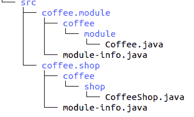
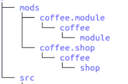
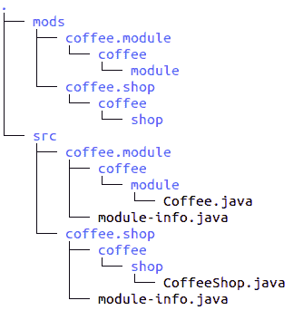

# Java 系列 1 — JDK9 —模块化

> 原文：<https://medium.com/oracledevs/java-train-1-jdk9-modularization-88174cd5bf95?source=collection_archive---------2----------------------->


正如这里宣布的，我现在正在做这个系列，其中将涵盖每个 JDK 版本的主要特性。所以…让我们开始吧！这是我们旅程的第一段。

# JDK 9

一些 Java 版本是特殊的。我几乎可以肯定，你会同意 JDK 9 号是其中之一。如果我问你“为什么”，你可能会回答:

*   模块系统，或项目拼图
*   它花了 3.5 年才变得可用(从版本 8 开始)

你(大部分)是对的！但是……就这些？Java 上的模块化快 4 年了？

当然不是。这个发布是巨大的！OpenJDK 9 的[发布页面](https://openjdk.java.net/projects/jdk9/)上正好提到了 91 个特性。

所以……我们来深究一下这个版本。当然这 91 个特点我就不一一细说了。我在这里的重点是帮助你改进你的代码、项目和职业。因此，我将涵盖/提及直接影响这三个领域之一(或全部)的特性。

在这篇文章中，我将介绍 Java 平台的模块化。

# 拼图项目

好吧，我不能不提到拼图游戏就谈论 JDK 9。但是因为它已经被广泛地研究过了，所以我会给你一些特别的亮点。

竖锯计划由许多 jep 组成:

*   200:模块化 JDK
*   201:模块化源代码
*   220:模块化运行时映像
*   253:为模块化准备 JavaFX UI 控件和 CSS APIs
*   261:模块系统
*   275:模块化 Java 应用程序打包

通过查看这些 jep，你会注意到一件事，JDK 本身现在是模块化的。这不仅仅是代码/包装组织的问题。这是一个重要的注意事项，因为它应该促使您改变对 Java 平台的看法。

模块化系统在 [JSR 376](https://openjdk.java.net/projects/jigsaw/spec/) 下指定并受到影响:

*   Java 语言规范
*   Java 虚拟机规范
*   美国石油学会技术规格

所以让我们看一个简单的例子，看看如何创建你的第一个模块。

# 咖啡应用

使用模块时，路径非常重要。所以，在我们开始之前，创建这个结构:



这将为您节省大量时间，并防止出现问题。

现在让我们编辑 src/coffee . module/coffee/module/coffee . Java 文件:

然后像这样编辑 src/coffee . module/module-info . Java:

现在我们给咖啡店编码。编辑 src/coffee . shop/coffee/shop/coffee shop . Java:

最后是这个模块的 module-info.java(在 src/coffee . shop/module-info . Java 下):

现在，在与 src 文件夹相同的级别中，创建以下文件夹结构:



您的最终树必须是这样的:



如果不是，就回去修！

现在，您已经准备好编译和运行您的 Coffee 应用程序了。严格按照这个顺序运行下面的命令。

首先，我们编译我们的咖啡模块:

```
javac -d mods/coffee.module src/coffee.module/module-info.java src/coffee.module/coffee/module/Coffee.java
```

然后我们编译 CoffeShope 模块，注意对 Coffe 模块的引用:

```
javac --module-path mods -d mods/coffee.shop src/coffee.shop/module-info.java src/coffee.shop/coffee/shop/CoffeeShop.java
```

模块路径模块告诉编译器在哪里可以找到编译这个模块所需的模块。

现在是时候点一杯咖啡了！

```
java --module-path mods -m coffee.shop/coffee.shop.CoffeeShop
```

如果您收到消息“享受您的[CoffeeType]”，那么您的模块工作成功！

你可以在这里查看这个例子的完整源代码:[https://github.com/eldermoraes/javatrain/tree/master/01](https://github.com/eldermoraes/javatrain/tree/master/01)

不要忘记留下你的问题和/或其他评论。下次见！