# Java 教程——Java 编程初学者指南

> 原文：<https://medium.com/edureka/java-tutorial-bbdd28a2acd7?source=collection_archive---------0----------------------->

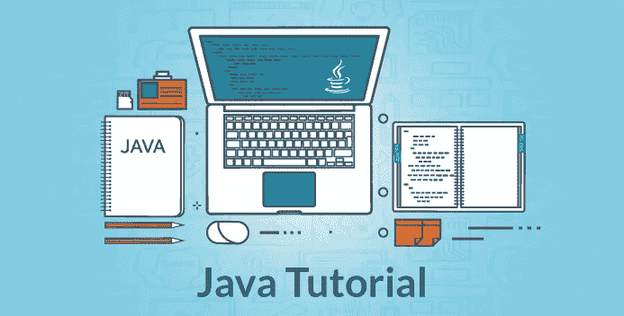

Java Tutorial - Edureka

在这篇 Java 教程博客中，我将向您介绍 Java 的一些基本概念。但是在继续之前，我建议您熟悉什么是 Java，Java 的特性以及如何在您的系统上安装 Java。这将有助于你快速轻松地掌握即将到来的概念。

现在，让我们继续这个 Java 教程博客，我们将按以下顺序理解 Java 的各个方面:

*   你好世界节目
*   Java 中的成员变量
*   数据类型和运算符
*   控制语句
*   类别和对象
*   程序的结构
*   数组
*   OOPs 概念——继承、封装、多态、抽象

让我们从 Java 教程博客的第一个话题开始，即 Hello World 程序。

# 你好世界节目

首先，我会给你一个简单的 Java 程序的概述。在下面的代码中，我已经 ***创建了一个类——MyFirstJavaProgram***和 ***打印了“Hello World”***。继续并尝试在您的 Eclipse IDE 中执行下面的示例。不要担心，我们一会儿将讨论 Java 类。

```
public class MyFirstJavaProgram {
       public static void main(String[] args)
   {
    System.out.println("Hello World");
   }
}
```

接下来，让我们了解一下 Java 中不同的成员变量。

# 成员变量

成员变量在类中起着重要的作用，因为它用于存储数据值。当我们定义一个类时，我们可以声明一个成员变量。这些变量是一个类的成员。
成员变量进一步分为三种类型:

*   局部变量
*   实例变量
*   类/静态变量

让我逐一讨论一下:

## **局部变量**:

这些是在类的方法中声明的变量。让我们通过一个编程示例来理解这一点:

```
**public** **class** Car {
      **public** **void** display(**int** m){  // Method
            **int** model=m;        // Created a local variable model
            System.out.println("Model of the car is" +model);
     }
```

在上面的代码中，我的局部变量是“model ”,我已经在具有参数“m”的方法“display”中声明了该变量。

## **实例变量**:

实例变量在类中声明，但在方法、构造函数或任何块之外。让我们通过一个编程示例来理解这一点。

```
public class Car {
      public String color;     // Created an instance variable color

Car(String c)
   {
    color=c;
   }

public void display() {  // Method 
      System.out.println("color of the car is"+color);
   }

public static void main(String args[]){
              Car obj=new Car("black");
                obj.display();
       }
}
```

在上面的代码中，“color”是我的实例变量，它有一个与之关联的值“black”。

## **类变量**:

类变量也叫 ***静态变量*** 。这些变量只有一个副本，由一个类中的所有不同对象共享。让我们通过一个编程示例来理解这一点。

```
public class Car {
      public static int tyres;   // Created a class variable tyres
        public static void main(String args[]){
           tyres=4;
           System.out.println("Number of tyres are"+tyres);
        }
}
```

所有的车都必须有 4 个轮胎，对吗？所以在我上面的代码中，我声明了一个静态变量为' tyre ',它的值在整个类中保持不变。

让我们继续这篇文章，看看我们的下一个主题，即 Java 中的数据类型和操作符。

# 数据类型

数据类型用于表示存储在变量中的不同值。它们主要分为 4 个不同的方面——I***整数、浮点、字符、*** 和 ***布尔*** 。您可以参考下图来了解不同的数据类型与分配给它们的内存的关系。

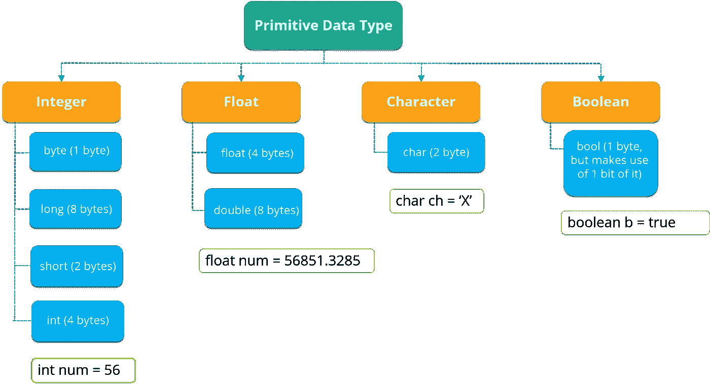

Primitive Data Types - Java Tutorial

如上图所示，数据类型有 4 种主要类型。

*   第一种数据类型是存储数值的整数*。*
*   *现在，如果一个数值包含小数部分，它将被称为 *float* 。*
*   *接下来，如果你想存储一个字符，那么使用第三种数据类型，即 *char* 。在 char 中，可以存储任何字母字符以及特殊字符。*
*   *最后一种数据类型是*布尔型*，它只存储“真”或“假”值。*

*让我们向前看，看看可以在 Java 中执行的各种数据操作。*

# *数据运算符*

*主要有 4 种不同类型的运算符，如下所列:*

*   ***算术运算符:**进行加、减、乘、除、取模等算术运算。*
*   ***一元运算符:**一元运算符用于增加或减少特定值。比如:++代表增量，———代表减量。*
*   ***关系运算符:**定义两个实体之间的某种关系。比如:<、>、< =、> =、！=, ==.*
*   ***逻辑运算符:**逻辑运算符通常与布尔(逻辑)值一起使用。*

*接下来，让我们向前看，理解控制语句的概念。*

# *控制语句*

*控制语句是定义程序流程的语句。Java 中有 3 类控制语句: ***选择、迭代、*** *和* ***跳转语句*** 。*

*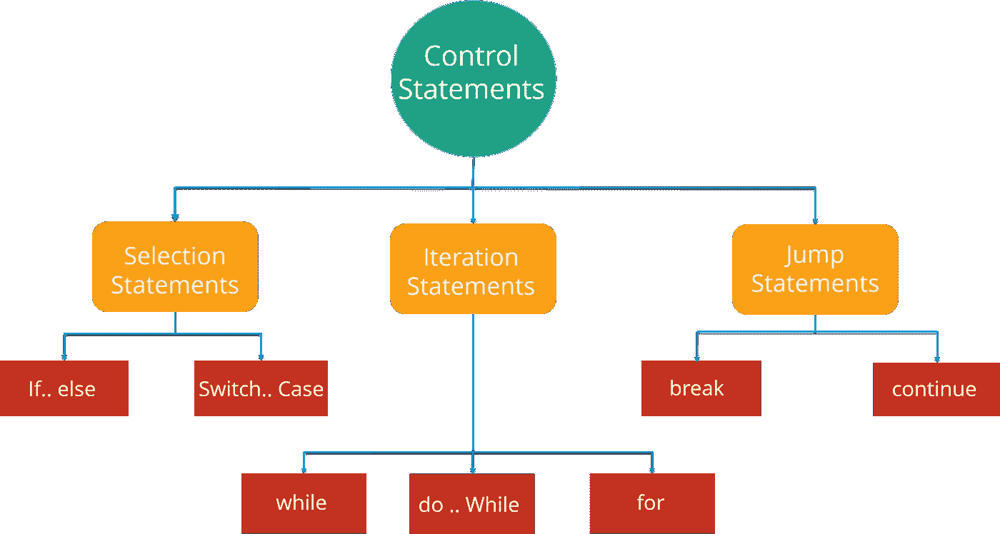*

*Control Statements in Java - Java Tutorial*

*让我们一个一个地看这些控制语句。*

## ***选择语句:***

*选择语句允许你在运行时根据表达式的结果或变量的状态来控制程序的流程。举个例子:你想吃披萨，但是你在哪里可以买到最便宜的披萨。你可以在各种受欢迎的选择中进行选择，如达美乐、必胜客或任何其他商店。因此，在这里，您将遵循从各种可用选项中进行选择的过程。*

*现在，这些陈述可以进一步分为以下几类:*

*   ****If-else 语句****
*   ****切换报表****

*请参考下面的流程图，以便更好地理解 if-else 语句:*

*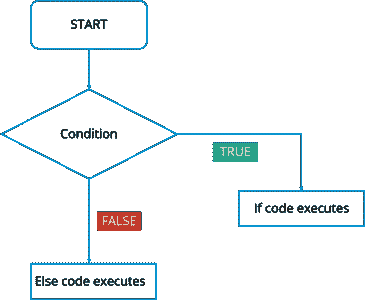*

*If- Else Statement Flowchart - Java Tutorial*

*在此流程图中，代码将以下列方式响应:*

1.  *首先，它将进入检查条件的循环。*
2.  *如果条件为真，将执行“If”部分中的语句集。*
3.  *如果条件为假，将执行“else”部分中的语句集。*

*在这里，您一定已经了解了这些 if-else 语句是如何工作的。现在，我们如何在 Eclipse IDE 中使用这些语句呢？让我们看一下代码:*

```
*public class Compare {
     int a=10,
     int b=5;

if(a>b)
      {  // if condition
     System.out.println(" A is greater than B");
      }
else
      {     // else condition
      System.out.println(" B is greater");
      }
}*
```

*在上面的代码中，我创建了一个 Compare 类，其中我比较了两个数字‘a’和‘b’。首先，它将进入“if”条件，检查“a”的值是否大于“b”。如果条件为真，它将打印“A 大于 B”，否则它将执行“B 大于”。*

*接下来，我们有一个 **Switch case** 语句。switch 语句为一组语句的执行定义了多条路径。这是一个比使用大量 if-else 语句更好的选择，因为它是一个多路分支语句。*

*请参考下面的流程图，以便更好地理解 switch 语句:*

*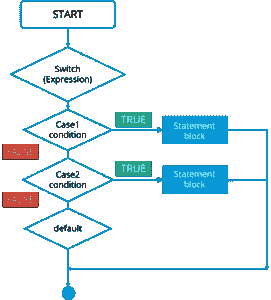*

*Switch Statement Flowchart- Java Tutorial*

*在此开关情况流程图中，代码将按照以下步骤进行响应:*

1.  *首先，它将进入有表达式的开关情况。*
2.  *接下来，它将转到 Case 1 条件，检查传递给该条件的值。如果为真，将执行语句块。之后，它将从那个开关盒中断开。*
3.  *如果它是假的，那么它将切换到下一种情况。如果情况 2 的条件为真，它将执行该语句并从该情况中断，否则它将再次跳转到下一个情况。*
4.  *现在，假设您没有指定任何 case，或者用户输入了一些错误，那么它将转到默认 case，打印您的默认语句。*

*同样，如果我们看看 IDE 中 switch 语句的代码，它是这样的:*

```
*public class SwitchExample { 
     int week=7;
     String weeknumber;

switch(week){    // switch case
case 1:
          weeknumber="Monday";
       break;

case2:
          weeknumber="tuesday";
       break;

case3:
          weeknumber="wednesday";
       break;

default:        // default case
          weeknumber="invalid week";
       break;
     }
  System.out.println(weeknumber);
     } 
}*
```

*在上面的代码中，我创建了一个*类 SwitchExample* ，它有 3 个打印一周中各天的案例。它还有一个默认的 case，每当用户没有指定 case 时就会执行。*

*总结这两个选择语句，我们知道，如果我们比较两个语句，我们使用 if-else，但是假设您根据特定语句检查特定值，那么我们使用 Switch 语句。*

*接下来是另一组控制语句，即**迭代语句**。*

## ***迭代语句:***

*在 Java 中，这些语句通常被称为 ***循环*** ，因为它们用于迭代小段代码。迭代语句提供了以下类型的循环来处理循环需求。*

*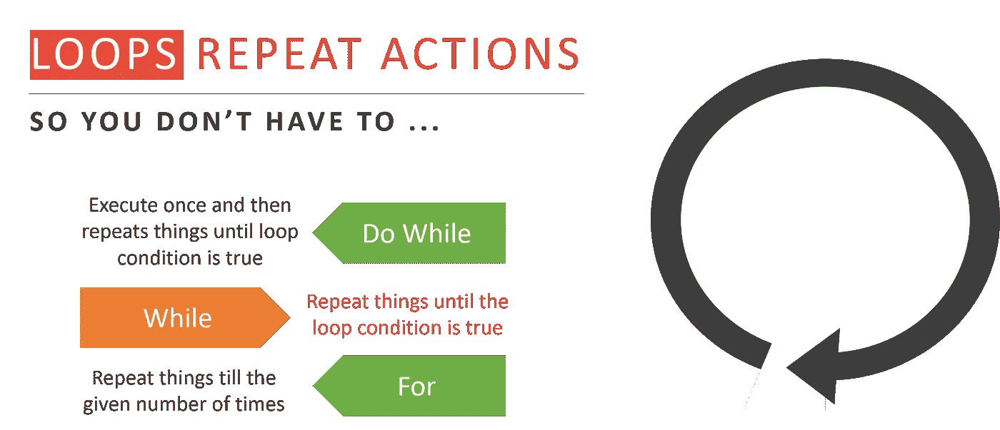*

*Loop Types - Java Tutorial*

*让我们详细了解其中的每一项:*

****While 语句:****

*当给定条件为真时，重复一组语句。它在执行循环体之前测试条件。让我们通过流程图更好地理解这一点:*

*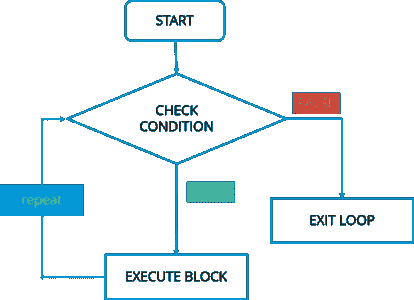*

*While Loop Flowchart - Java Tutorial*

*在此流程图中，代码将在以下步骤中响应:*

1.  *首先，它将进入检查条件的循环。*
2.  *如果为真，它将执行这组代码并重复这个过程。*
3.  *如果为假，则直接退出循环。*

*现在，让我们看看如何在 IDE 中实现代码。*

```
*public class WhileExample {
      public static void main(String args[]) {
         int a=5;
   while(a<10)   //while condition
         {
         System.out.println("value of a" +a);
         a++;
   System.out.println("\n");
         }
    }
}*
```

*在上面的代码中，它首先检查 a 的值是否小于 10。这里，a 的值是 5，这又满足条件，从而执行功能。*

****Do-while 语句:****

*它类似于 while 语句，但它测试循环体末尾的条件。此外，它将至少执行一次程序。让我们通过流程图更好地理解这一点:*

*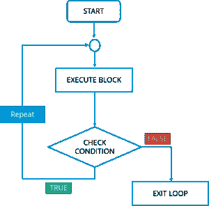*

*Do-while Loop Flowchart — Java Tutorial*

*在这个 do-while 流程图中，代码将按照下列步骤进行响应:*

1.  *首先，它将执行你的“do”块中提到的一组语句。*
2.  *之后，它将进入“while”部分检查条件。*
3.  *如果条件为真，它将返回并执行语句。*
4.  *如果条件为假，则直接退出循环。*

*让我们看看如何在 IDE 中实现代码。*

```
*public class DoWhileExample {
      public static void main(string args[]){
          int count=1;
do {                        // do statement
     System.out.println("count is:"+count);
     count++;
   }
 while (count<10)            // while condition
       }
  }*
```

*在上面的代码中，它将首先执行“do”语句，然后跳转到 while 部分。在这个程序中，*的输出将是:1 2 3 4 5 6 7 8 9。**

****为语句:****

*For 语句多次执行一系列语句，以便管理循环变量。这里你基本上有 3 个操作: ***初始化，条件，*** 和 ***迭代*** 。让我们通过流程图更好地理解这一点:*

*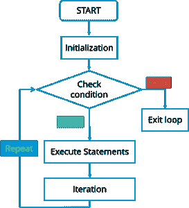*

*For Loop Flowchart - Java Tutorial*

*在此流程图中，代码将在以下步骤中响应:*

1.  *首先，它将进入检查条件的循环。*
2.  *接下来，如果条件为真，将执行这些语句。*
3.  *如果条件为假，则直接退出循环。*

*让我们看看如何在 IDE 中实现代码。*

```
*public class ForExample {
      public static void main(String args[]) {
          for(int i=0; i<=10; i++)  // for condition  
          {
          System.out.println(i);
          }
     }
}*
```

*在上面的代码中，它会直接*打印从 1 到 10 的数字*。*

*我们将要讨论的最后一种控制语句是**跳转语句**。*

****跳转语句:****

*跳转语句用于将控制转移到程序的另一部分。这些又进一步分为— ***破*** 和 ***续*** 。*

*让我们详细了解一下它们:*

***Break 语句:***

*每当使用 break 语句时，循环被终止，程序控制恢复到循环后的下一条语句。让我们通过流程图更好地理解这一点:*

*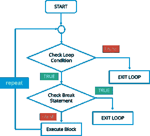*

*Break Statement Flowchart - Java Tutorial*

> *在此流程图中，代码将按照以下步骤进行响应:
> 1。首先，它将进入检查条件的循环。*
> 
> *2.如果循环条件为假，则直接退出循环。*
> 
> *3.如果条件为真，它将检查中断条件。*
> 
> *4.如果中断条件为真，则它存在于循环中。*
> 
> *5.如果中断条件为假，那么它将执行循环中剩余的语句，然后重复相同的步骤。*

*该语句的语法是' *break* '关键字后跟一个分号。*

***继续陈述:***

*继续语句是另一种类型的控制语句。continue 关键字使循环立即跳转到循环的下一次迭代。让我们通过流程图更好地理解这一点:*

*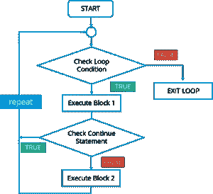*

*Continue Statement Flowchart - Java Tutorial*

*在此流程图中，代码将在以下步骤中响应:*

> *1.首先，它将进入检查条件的循环。*
> 
> *2.如果循环条件为假，则直接退出循环。*
> 
> *3.如果循环条件为真，它将执行 block 1 语句。*
> 
> *4.之后，它将检查“继续”语句。如果存在，那么之后的语句将不会在循环的同一次迭代中执行。*
> 
> *5.如果“continue”语句不存在，那么将执行其后的所有语句。*

*语法只是“continue”关键字后跟一个分号。
接下来，让我们看看什么是 Java 中的类和对象。*

# *类别和对象*

*Java 中的类是一个蓝图，包含了你所有的数据。一个类包含描述对象行为的字段(变量)和方法。让我们来看看类的语法。*

```
*class Abc {
      member variables // class body
        methods
 }*
```

*但是如何访问这些成员变量和方法呢？这里就出现了 ***对象*** 的概念。*

*对象是类中具有状态和行为的主要元素。它是一个可以访问你的数据的类的实例。让我们看看用 Java 创建对象的语法:*

*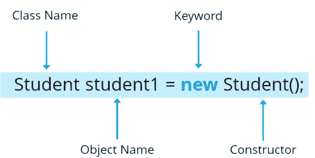*

*The syntax of Java Objects - Java Tutorial*

*这里，Student 是您的类名，后跟对象名。然后有一个“ ***新的*** ”关键字用来分配内存。最后，调用构造函数。这个调用初始化新的对象。
现在让我们看看如何在 Java 中使用对象调用方法:*

```
*class Student()
      void display(); {            // Method
     ------                           // logic of method
}
public static void main(String args[]){
      Student obj=new Student();   // Created an object
      obj.display();               // Method called
}*
```

*接下来，让我们在 Java 教程博客中继续讨论另一个关键概念，即*数组*。*

# *数组*

*Java 中的数组类似于 C++或任何其他编程语言中的数组。数组是保存相同类型的顺序元素的数据结构。*

*假设您想要存储 50 个数字。而不是声明单独的变量，比如 number0，number1，…等等。您可以声明一个数组变量——“numbers”，并使用 number[0]，number[1]来表示单个变量。这将减轻您的任务，并最大限度地减少冗余。*

**每个数组有两个分量* : **指标**和**值**。为了更好地理解，请参考下图:*

*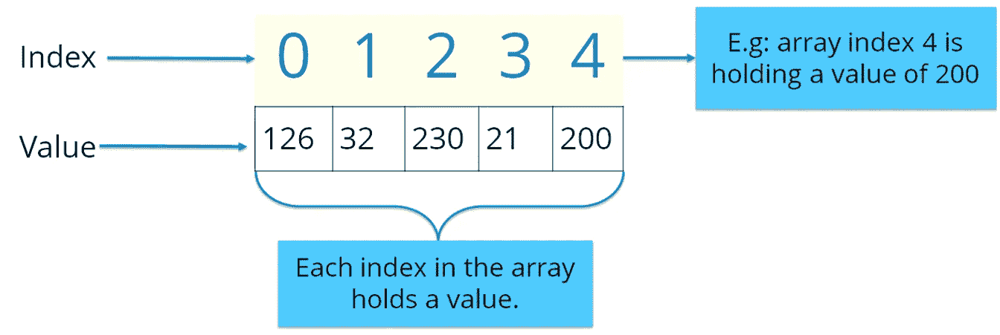*

*Components of Array - Java Tutorial*

*这里，索引从零开始，一直到(n-1)，其中 n=数组的大小。假设你想存储 10 个数字，那么索引从 0 开始，一直到 9。*

*Java 中有两种类型的数组:*

*   ****一维数组****
*   ****多维数组****

## ***一维数组:***

*在一维数组中，相同类型的变量列表可以通过一个公共名称来访问。您可以使用以下语法初始化数组:*

*int a[]= new int[12]；*

*你可以参考下面的图片，我已经存储了关于给定索引的数据。*

*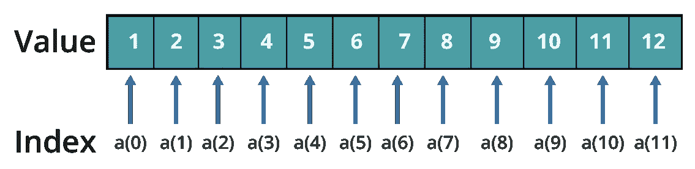*

*Single Dimension Array - Java Tutorial*

## ***多维数组:***

*在多维数组中，数据以矩阵形式存储。这里，您可以使用以下语法初始化数组:*

*int table[][]= new int[4][5]；*

*它与我们在数学中使用的矩阵非常相似。参考下图，我已经存储了不同维度的数据。*

*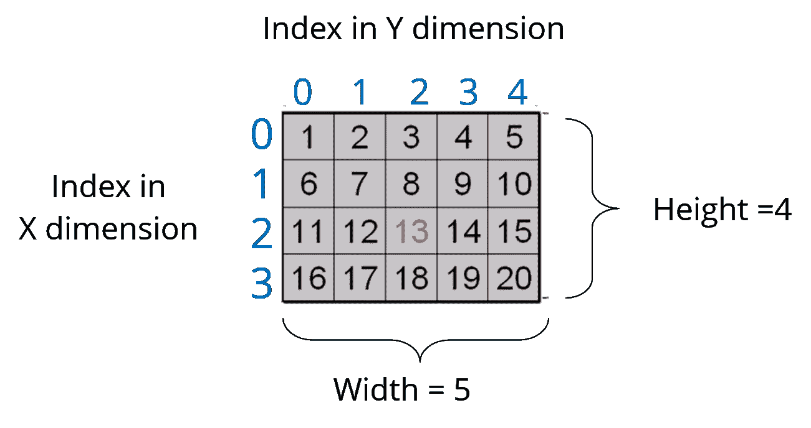*

*Multi - Dimension Array*

*因此，数组帮助您优化代码，您可以在任何位置插入数据。*

*让我们看看下面的代码来理解 Java 中数组的概念。*

```
*import java.util.*;
public class ArrayExample {
      public static void main( String args[])
     {
     double invoice[][]= new double[10][2];  // Initializing array
          Scanner obj= new Scanner(System.in);    // creating a scanner object to take input from user
          for(i=0;i<10;i++){                       // nested for loops
              for(j=0;j<2;j++);
               {
               System.out.println("Enter the value");
               invoice[i][j]=obj.nextDouble();         // store values to array    
          for(i=0;i<10;i++){
              for(j=0;j<2;j++)
               {
                System.out.println(invoice[i][j]);
               }
         }
     }
}*
```

*在上面的代码中，我解释了如何获取数组的输入并打印出来。我希望你们清楚数组是什么样子的，以及如何初始化数组。现在，让我们总结一下上面的主题，看看一个 Java 程序的整体结构。*

# *程序的结构*

*到目前为止，我们已经学习了成员变量、数据类型、控制语句、类和对象。让我们看看它们是如何在 Java 的一个类中组织在一起的。*

```
*public class Car{                    // Class creation
       String color;                        // Member variables   
       String model;
       public void SpeedCheck(int s)        // Method 
         {
         int speed=s;
           if(speed>100)                        // Control statement
           {
           System.out.println(" You are driving very fast");
           }
           else
           {
            System.out.println("You are driving at normal speed");
           }
public static void main ( String args[]) 
         {
         Car obj= new Car();                  // Object creation
         obj.speed(60);
         }*
```

*最后，我们来到本文的最后一个主题，即 ***面向对象编程概念*** 。*

# *哎呀概念*

*我们已经讨论了 Java 中的类和对象。让我们讨论面向对象编程的 4 个主要概念——继承、封装、多态和抽象。*

*让我们从第一个概念开始，即 ***继承*** 。*

## ***传承:***

*你们大多数人一定对继承很熟悉。继承是一个类获得另一个类的属性的过程。但是谁的属性是继承的呢？这里我们有两个类，一个*子类*继承了一个*基类*的属性。继承这些属性的类被称为**子类。**它也被称为派生类或子类。接下来，其属性被继承的类被称为**父类**或基类。

让我们通过看这个现实生活中动物的例子来了解这些类。*

*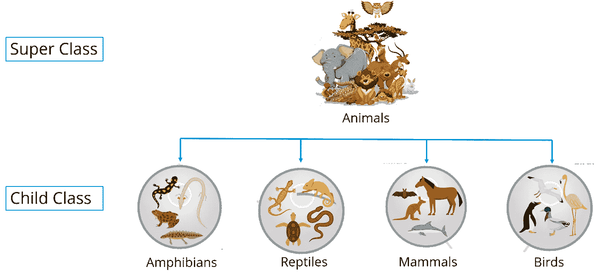*

*Inheritance Example - Java Tutorial*

*在上图中，动物是超类，而两栖动物、爬行动物、哺乳动物和鸟类是子类，它们继承了“动物”类的属性。*

## ***封装:***

*Java 中的封装是一种将数据和代码包装成一个单元的机制。参考下图，所有的方法和变量都绑定在一个类中。*

**

*Encapsulation- Java Tutorial*

*在封装中，一个类的变量对其他类是隐藏的，只能通过当前类的方法来访问。*

## ***多态性:***

*多态性是变量、函数或对象采取多种形式的能力。多态性在 OOPs 中最常见的应用是当一个父类被用来引用一个子类对象时。多态性也是通过函数重载实现的。放心吧！我将在下一篇博客中解释整个概念。现在，让我们来看一个真实的生活场景，老师告诉学生画出具有不同功能的不同形状/图形。*

**

*Polymorphism Example - Java Tutorial*

*假设我想画一个特定的形状，它已经有了多种功能，作为我程序的一部分。所以处理形状的函数，我称之为 draw()。现在根据我传递给这些函数的值，它会画出不同的形状。假设是一个矩形，我要传递两个值——长度和宽度。同样，对于一个圆，我正在传递一个半径。基于您传递的值，将调用不同的函数来服务于不同的目的。所以这可以通过函数重载来实现。请继续关注，函数重载的概念将在我的下一篇博客中详细讨论。*

## ***抽象:***

*基本上是处理想法而不是事件的素质。抽象是对用户隐藏实现细节，只向用户提供功能的方法。让我们看看这个汽车的真实例子，我将帮助你理解抽象到底是什么。*

**

*Abstraction Example - Java Tutorial*

*如果你考虑这辆车的情况，这里机械师正在修理一辆车的某个功能。但是用户或者你可以说司机不想知道这些事情，他只是想让他的车回到工作状态。所以在这里，你基本上分离了实现，并向其他人展示了他实际上想要看到的东西，而这正是所谓的**抽象**。*

*到此，我们结束了这个博客。如果你想查看更多关于人工智能、DevOps、道德黑客等市场最热门技术的文章，你可以参考 Edureka 的官方网站。*

*请留意本系列中的其他文章，它们将解释 Java 的各个方面。*

> *1.[面向对象编程](/edureka/object-oriented-programming-b29cfd50eca0)*
> 
> *2.[Java 中的继承](/edureka/inheritance-in-java-f638d3ed559e)*
> 
> *3.[Java 中的多态性](/edureka/polymorphism-in-java-9559e3641b9b)*
> 
> *4.[Java 中的抽象](/edureka/java-abstraction-d2d790c09037)*
> 
> *5. [Java 字符串](/edureka/java-string-68e5d0ca331f)*
> 
> *6. [Java 数组](/edureka/java-array-tutorial-50299ef85e5)*
> 
> *7. [Java 集合](/edureka/java-collections-6d50b013aef8)*
> 
> *8. [Java 线程](/edureka/java-thread-bfb08e4eb691)*
> 
> *9.[Java servlet 简介](/edureka/java-servlets-62f583d69c7e)*
> 
> *10. [Servlet 和 JSP 教程](/edureka/servlet-and-jsp-tutorial-ef2e2ab9ee2a)*
> 
> *11.[Java 中的异常处理](/edureka/java-exception-handling-7bd07435508c)*
> 
> *12.[高级 Java 教程](/edureka/advanced-java-tutorial-f6ebac5175ec)*
> 
> *13. [Java 面试问题](/edureka/java-interview-questions-1d59b9c53973)*
> 
> *14. [Java 程序](/edureka/java-programs-1e3220df2e76)*
> 
> *15.[科特林 vs Java](/edureka/kotlin-vs-java-4f8653f38c04)*
> 
> *16.[依赖注入使用 Spring Boot](/edureka/what-is-dependency-injection-5006b53af782)*
> 
> *17.[Java 中的可比](/edureka/comparable-in-java-e9cfa7be7ff7)*
> 
> *18.[十大 Java 框架](/edureka/java-frameworks-5d52f3211f39)*
> 
> *19. [Java 反射 API](/edureka/java-reflection-api-d38f3f5513fc)*
> 
> *20.[Java 中的 30 大模式](/edureka/pattern-programs-in-java-f33186c711c8)*
> 
> *21.[核心 Java 备忘单](/edureka/java-cheat-sheet-3ad4d174012c)*
> 
> *22.[Java 中的套接字编程](/edureka/socket-programming-in-java-f09b82facd0)*
> 
> *23. [Java OOP 备忘单](/edureka/java-oop-cheat-sheet-9c6ebb5e1175)*
> 
> *24.[Java 中的注释](/edureka/annotations-in-java-9847d531d2bb)*
> 
> *25.[Java 中的图书管理系统项目](/edureka/library-management-system-project-in-java-b003acba7f17)*
> 
> *26.[Java 中的树](/edureka/java-binary-tree-caede8dfada5)*
> 
> *27.[Java 中的机器学习](/edureka/machine-learning-in-java-db872998f368)*
> 
> *28.[Java 中的顶级数据结构&算法](/edureka/data-structures-algorithms-in-java-d27e915db1c5)*
> 
> *29. [Java 开发者技能](/edureka/java-developer-skills-83983e3d3b92)*
> 
> *30.[前 55 个 Servlet 面试问题](/edureka/servlet-interview-questions-266b8fbb4b2d)*
> 
> *31. [](/edureka/java-exception-handling-7bd07435508c) [顶级 Java 项目](/edureka/java-projects-db51097281e3)*
> 
> *32. [Java 字符串备忘单](/edureka/java-string-cheat-sheet-9a91a6b46540)*
> 
> *33.[Java 中的嵌套类](/edureka/nested-classes-java-f1987805e7e3)*
> 
> *34. [Java 集合面试问答](/edureka/java-collections-interview-questions-162c5d7ef078)*
> 
> *35.[Java 中如何处理死锁？](/edureka/deadlock-in-java-5d1e4f0338d5)*
> 
> *36.[你需要知道的 50 大 Java 集合面试问题](/edureka/java-collections-interview-questions-6d20f552773e)*
> 
> *37.[Java 中的字符串池是什么概念？](/edureka/java-string-pool-5b5b3b327bdf)*
> 
> *38.[C、C++和 Java 有什么区别？](/edureka/difference-between-c-cpp-and-java-625c4e91fb95)*
> 
> *39.[Java 中的回文——如何检查一个数字或字符串？](/edureka/palindrome-in-java-5d116eb8755a)*
> 
> *40.[你需要知道的顶级 MVC 面试问答](/edureka/mvc-interview-questions-cd568f6d7c2e)*
> 
> *41.[Java 编程语言的十大应用](/edureka/applications-of-java-11e64f9588b0)*
> 
> *42.[Java 中的死锁](/edureka/deadlock-in-java-5d1e4f0338d5)*
> 
> *43.[Java 中的平方和平方根](/edureka/java-sqrt-method-59354a700571)*
> 
> *44.[Java 中的类型转换](/edureka/type-casting-in-java-ac4cd7e0bbe1)*
> 
> *45.[Java 中的运算符及其类型](/edureka/operators-in-java-fd05a7445c0a)*
> 
> *46.[Java 中的析构函数](/edureka/destructor-in-java-21cc46ed48fc)*
> 
> *47.[Java 中的二分搜索法](/edureka/binary-search-in-java-cf40e927a8d3)*
> 
> *48.[Java 中的 MVC 架构](/edureka/mvc-architecture-in-java-a85952ae2684)*
> 
> *49. [Hibernate 面试问答](/edureka/hibernate-interview-questions-78b45ec5cce8)*

**原载于 2017 年 4 月 27 日 www.edureka.co*[](https://www.edureka.co/blog/java-tutorial/)**。***