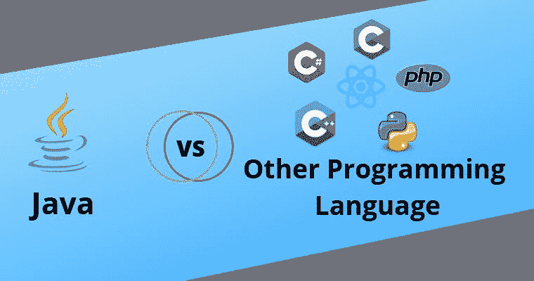

# Java 与其他编程语言(Python、Ruby、C++)的对比:Java 会胜出吗？

> 原文：<https://medium.com/quick-code/java-vs-other-programming-languages-python-ruby-c-does-java-come-out-on-top-82e2e0cb6a4?source=collection_archive---------1----------------------->



可以说，Java 是开发人员中最流行的编程语言之一，用于创建 web 应用程序、定制软件和 web 门户，包括电子商务和移动商务解决方案。

对于许多开发人员来说，编程语言都是以 Java 开始和结束的。

毫无疑问，Java 多年来一直很强大，因此肯定做对了很多事情，但如果认为没有其他语言比 Java 更好，那就错了。

事实是，每种语言都有长处和短处；是的，即使是 Java 也有一堆被程序员忽略的缺陷，因为它带来了大量的好处。作为一名程序员，将 Java 与其他编程语言进行比较是很重要的，这样您就能够为特定的项目选择最佳的语言。

本文将 Java 与其他一些常用语言进行了比较，并试图找出 Java 是否处于领先地位。

(注意:我们没有对本文所涉及的语言提供的每个特性进行比较。我们已经确定了它们提供的某些关键特性，并讨论了它们与 Java 中类似特性的比较。)了解更多信息，请访问 [**Ruby On Rails 在线培训**](https://onlineitguru.com/ruby-on-rails-online-training-placement.html) **。**

# 1.计算机编程语言

Python 是一种完全支持面向对象编程的高级语言。另一方面，Java 不是一种纯面向对象的语言。

Python 是一种功能强大、易于使用的脚本语言，它是一种优秀的“粘合”语言，因为它连接系统组件，而 Java 是一种低级实现语言。

两者之间的一个关键区别是 Python 程序比 Java 程序短。让我们来看一下' *Hello World':* 的例子

Java 语言的“Hello World ”:

```
public class example{public static void main(String[] args){System.out.println(“hello world”);}}
```

Python 中的“Hello World ”:

```
print “hello world”;
```

Python 内置了丰富的高层数据类型，甚至支持动态类型化；这使得它成为新手程序员的首选之一，因为他们需要编写更少的代码。但是 Java 就不一样了，因为开发人员需要在使用每个变量之前定义它的类型。

苹果今年为 iOS 和 OS X 开发的编程语言 Swift 有一些 Python 启发的语法。许多大型组织，如谷歌，雅虎，美国宇航局等。正在使用 Python。如果他们可以信任 Python，你也可以！

总而言之，Python 确实有一些缺陷。Python 程序通常比 Java 程序运行得慢，这使得 Java 成为企业级应用程序开发的首选。此外，对于某些用例，Java 比 Python 有更好的库支持。

[](https://onlineitguru.com/blog/ruby-vs-python) [## Ruby Vs Python |和 Python 的区别| OnlineITGuru

### Ruby 是灵活的，它赋予程序员权力。有了 Ruby on rails，我们可以设计许多漂亮的网站…

onlineitguru.com](https://onlineitguru.com/blog/ruby-vs-python) 

# 2.C++

Java 基本上来源于 C++。然而，由于这两种语言的目标不同，两者之间存在着惊人的差异。C++主要是为系统编程和扩展 C 编程语言而设计的，而 Java 最初是为支持网络计算而创建的。

尽管 Java 比 Python 快，但它的运行速度明显比 C++慢。

如果我们比较两种语言的库，C++标准库简单而健壮，提供容器和关联数组，而 Java 有强大的跨平台库。

两者之间的另一个重要区别是——在 Java 中，垃圾收集是自动进行的，但在 C++中没有自动垃圾收集；所有对象必须通过代码手动销毁。开发人员很有可能在最后忘记删除所有对象。这导致软件的大小和内存增加，从而导致成本增加。

# 3.红宝石

Ruby 和 Java 有很多共同点，首先是两者都是面向对象的语言，都是强类型的。

这两种编程语言的主要区别在于执行代码的方法。Java 代码首先被翻译成虚拟机代码，虚拟机代码比 Ruby 的解释代码运行得更快。

就像 Python 一样，开发人员更喜欢 Ruby 而不是 Java 的最大原因是，与 Java 相比，用 Ruby 实现的函数需要更少的代码行。这使得 [**Ruby On Rails 课程**](https://onlineitguru.com/ruby-on-rails-online-training-placement.html) 的开发者更容易管理代码。

一般来说，高流量网站使用 Java 而不是 Ruby。几年前，Twitter 从 Ruby 迁移到 Java 和 Scala。

Java 和 Ruby 可以一起使用，两者相辅相成。JRuby 基本上是用 Java 编写的，是 Ruby 编程语言在 Java 虚拟机上的实现。

# 4.C#

自从最近几年以来，在开发社区中有一场关于哪种语言更胜一筹的激烈辩论——Java 和 C#。

如果考虑安全性或性能，那么两种语言会得到相似的分数。但是，Java 比 C#有比较优势，因为它是一种平台无关的语言。与 C#相比，它在更多的操作系统上受到支持，无需重新编译代码。另一方面，C#并不完全独立于平台，因为它可以在 Windows 和 Mac OS-X 上运行，但不能在 Linux 上运行。

这两种语言在语法和编程风格上非常相似。

开发人员应该选择一种完全适合他们项目需求的语言；重点应该放在使用一种语言，确保项目可以容易和有效地开发。例如，如果你正在为 Windows 桌面或 Windows phone 开发一个应用程序，那么选择 C#，但是如果是为 Android 手机开发，那么选择 Java。

[](https://ruby-programminglanguage.blogspot.com/2019/12/why-ruby-on-rails-is-ideal-for-web-app.html) [## 为什么 Ruby on Rails 是 Web 应用开发的理想选择

### 如果今天没有您最喜爱的 web 应用程序，您会怎样？想象一下，你不再有能力使用相同的…

ruby-programminglanguage.blogspot.com](https://ruby-programminglanguage.blogspot.com/2019/12/why-ruby-on-rails-is-ideal-for-web-app.html) 

# 5.服务器端编程语言（Professional Hypertext Preprocessor 的缩写）

PHP 是一种服务器端脚本语言，而 Java 是一种通用语言。这两种语言在结构上是不同的，但又相互包容。

PHP 是弱类型语言，而 Java 是强类型语言，程序员需要为每个变量和/或值声明一种数据类型。这可能会使 PHP 对程序员更有吸引力，因为它不像 Java 那样遵循固定的标准，但反过来它可能会使某些任务变得复杂。

除了结构上的不同，两者之间的一个主要区别是，在 PHP 中，JVM 在每次请求后都要重启；这可能会导致额外的性能问题。

如果程序员没有很多时间来完成一个项目，他/她应该选择 PHP，但是如果项目强调可伸缩性、性能和安全性等特性，则应该选择 Java。

# 结论

在对比了 Java 和五种语言之后，我们现在有明确的答案了吗，Java 是否优于其他所有语言？

答案是“是”和“不是”。

> 要深入了解 Ruby，请在 [**注册免费现场演示 Ruby 认证**](https://onlineitguru.com/ruby-on-rails-online-training-placement.html)

*是的*，因为它是一种低级语言，通过以尽可能简单的形式实现算法，让你理解基础，同时又足够高级，可以有效地实现任何任务。

而*没有*，因为所有能用 Java 写的东西都可以用其他语言写(比如 C#)但是反过来就不行了。

Java 自诞生以来已经有了很大的发展，并且在软件开发的许多领域都处于领先地位。所以，它的生存能力是毋庸置疑的。

事实上,《虎胆龙威》的人预计会坚持多年！然而，建议程序员在使用编程语言的同时，采取一种以马换课程的策略。语言的选择应该取决于他们的需要和要求，而不是语言的受欢迎程度。