# Java 与 Python——最佳编程语言之间的比较

> 原文：<https://medium.com/edureka/java-vs-python-31d7433ed9d?source=collection_archive---------3----------------------->

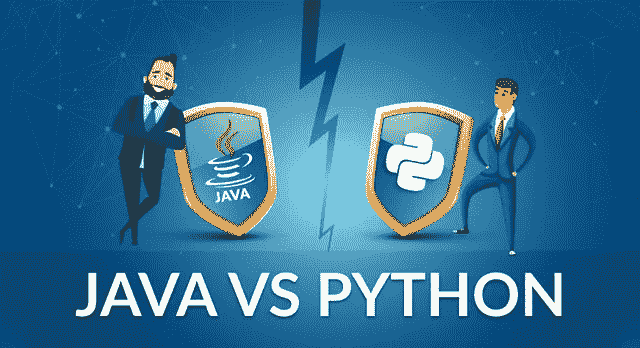

Java vs Python — Edureka

这个关于 **Java 和 Python** 的比较将为你提供关于这两种编程语言的清晰知识，并帮助你找到哪一种更适合你的目标。 **Java** 和 **Python** 是目前市场上最热门的两种编程语言，因为它们的通用性、效率和自动化能力。这篇 **Java vs Python** 博客将按以下顺序为您提供对这些语言的全面了解:

*   Java 和 Python 的历史
*   比较因素

1.  速度
2.  遗产
3.  密码
4.  实用灵活性
5.  趋势
6.  薪水
7.  句法

让我们回到过去，看看这两种语言的起源，看看 Python 和 Java 是否相似。

# Java 和 Python 的历史


**Java** 是一种面向对象的语言，具有许多程序员熟悉的类似 C/C++的语法。它是动态链接的，允许下载和运行新代码，但不是动态类型的。

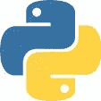

Python 是两种语言中较老的一种，由它的发明者吉多·范·罗苏姆于 1991 年首次发布。它是一种可读、高效、强大的高级语言，具有自动内存管理功能。

# 比较因素

Python 和 Java 有什么区别？这两种语言有相似之处也有不同之处，这使得从两种语言中选择一种变得更加困难。程序员问得最多的问题是 Python 是否比 Java 好。所以让我们开始比较，找出 Java 和 Python 的胜者。

让我们来看看**因素**，我们将使用这些因素对 **Java 和**Python 进行**比较**:

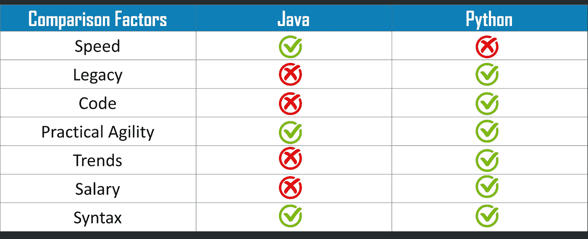

该表显示 Python 比 Java 略胜一筹，但是让我们详细讨论一下比较因素，并找出哪种编程语言更好。

# 速度

## ***Java***

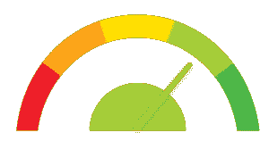

就速度而言，Java 比 Python 快，因为它是一种编译语言。执行一个代码需要更少的时间。

## ***Python***

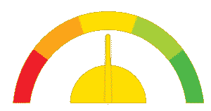

Python 是一种解释型语言，它在运行时决定数据的类型，这使得它相对来说要慢一些。

# 遗产

## Java 语言(一种计算机语言，尤用于创建网站)


Java 在企业中的历史及其略显冗长的编码风格意味着 Java 遗留系统通常比 python 的系统更大、数量更多。

## 计算机编程语言


Python 有较少的遗留问题，所以组织发现脚本复制和粘贴代码的难度比其他语言稍有优势。

当我们谈论这两种语言时，出现的另一个困惑是 Java 和 python 之间哪一种更容易。因此，让我们看看用两种语言编写代码时所需的行数。

# 密码

## Java 语言(一种计算机语言，尤用于创建网站)

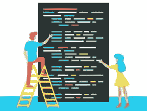

与 Python 相比，Java 非常冗长。用 Java 读取一个文件需要 10 行代码。

## 计算机编程语言


在 Python 中只需要 **2 行**代码。这使得 Python 成为更受欢迎的语言。

# 实用灵活性

## Java 语言(一种计算机语言，尤用于创建网站)

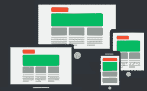

由于 Java 的静态类型系统和 IDE 在开发中的通用性，它比 python 享有更多不变的重构支持。更受欢迎的是**手机和网络应用**。

## 计算机编程语言


Python 一直在人才空间中存在，并被认为是机器学习、人工智能、物联网等领域最有利的语言。

# 趋势

## 美国

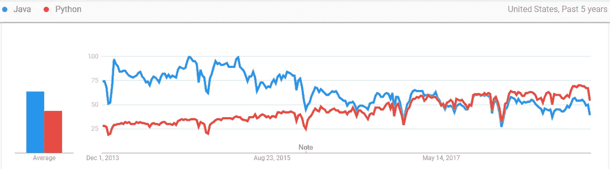

## 印度

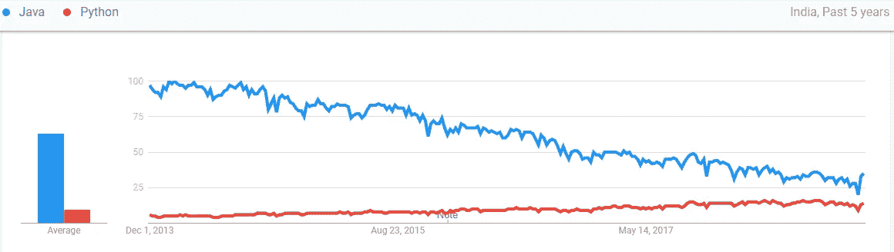

虽然不再像以前那样流行，但无论从哪方面来看，Java 仍然是最受欢迎的编程语言。另一方面，Python 的增长是天文数字，尤其是在发达的高收入国家。这一惊人增长的原因包括**开发人员生产力**、**语言灵活性**、**库支持、社区支持和学习便利性**。

# 薪水

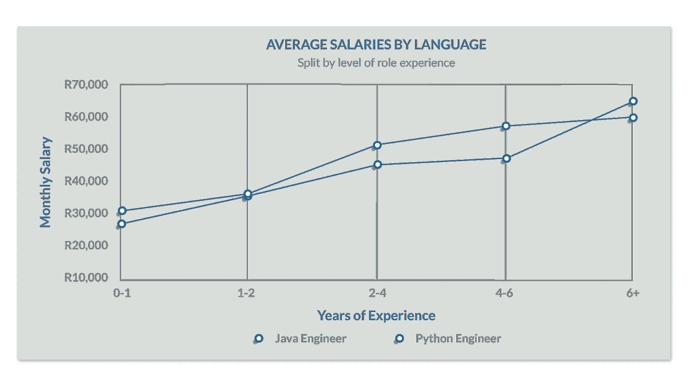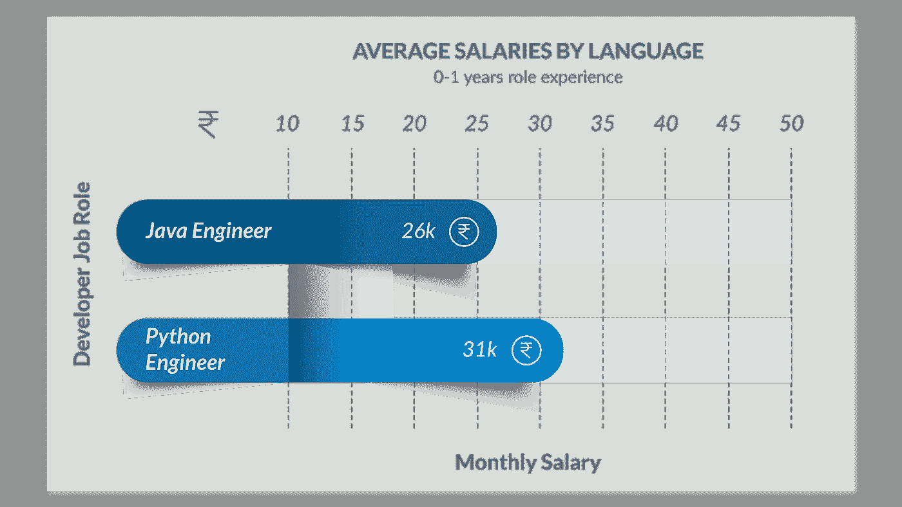

现在我们大多数人都想知道 Python 是否会在最近取代 Java。当我们比较两个工程师在新生情况下的增长时， **Python** 比 java 有一点优势，因为最近它的**需求**增加了。如今，这些工作大多与自动化和人工智能有关，相比 Java，它们更喜欢 Python，这就是为什么我们可以在图表中看到这种转变。

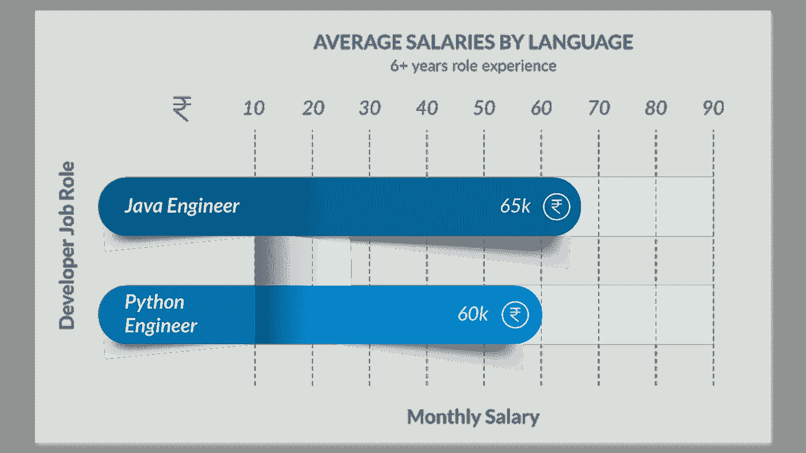

然而，如果我们看看有经验的工程师的增长情况，java 一直占据主导地位。因为 **Java** 在 python 流行之前就已经在用了。经验丰富的工程师们发现，对他们来说，坚守自己的舒适区比迁移到一门新语言更方便。

# 基本差异

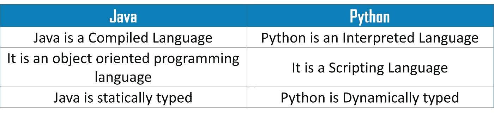

# 句法

## 行数

## Java 语言(一种计算机语言，尤用于创建网站)

```
public class HelloWorld {

public static void main(String[] args) {
System.out.println("Hello, World");
}

}
```

## 计算机编程语言

```
print ('Hello, World!')
```

## 分号

## Java 语言(一种计算机语言，尤用于创建网站)

```
class programming {

programming() {

system.out.println("Constructor method called");

}

public static void main(String[] args) {

programming object = new programming();

}

}
```

## 计算机编程语言

```
class Student:

  def __init__(self, name):

     print("This is parameterized constructor")

     self.name = name

  def show(self):

     print("Hello", self.name)

student = Student("Daniel")

student.show()
```

## 刻痕

## Java 语言(一种计算机语言，尤用于创建网站)

```
class Greater {

public static void main (String args[]) {

int a = 10;

if (a>0) {

system.out.println("a is positive");

}

else {

system.out.println("a is not positive");

}

system.out.println("This is executed");

}

}
```

## 计算机编程语言

```
a=200

b=300

if b > a:

  print("b is greater than a")

elif a==b:

  print("a and b are equal")

else:

  print("a is greater than b")
```

## 读取文件

## Java 语言(一种计算机语言，尤用于创建网站)

```
import java.io.*;
public class ReadFromFile2
{
public static void main(String[] args)throws Exception
{
File file = new File("C:UsersdanielDesktoptest.txt");

BufferedReader br = new BufferedReader(new FileReader(file));

String st;
while ((st = br.readLine()) != null)
System.out.println(st);
}
}
```

## 计算机编程语言

```
> f = open("test.txt",'r',encoding = 'utf-8')
>>> f.read()
```

至此，我们结束了对 Java 和 Python 的比较。我希望你们喜欢这篇文章，并且理解 ***Python 如何比 Java 略胜一筹，并且在*** 的大部分因素中胜出。所以，如果你读过这篇文章，你可能会清楚地知道哪种编程语言更好，你应该选择哪种。如果你想查看更多关于人工智能、DevOps、道德黑客等市场最热门技术的文章，你可以参考 Edureka 的官方网站。

请留意本系列中的其他文章，它们将解释 Python 和数据科学的各个方面。

> 1. [Python 教程](/edureka/python-tutorial-be1b3d015745)
> 
> 2. [Python 编程语言](/edureka/python-programming-language-fc1015de7a6f)
> 
> 3. [Python 函数](/edureka/python-functions-f0cabca8c4a)
> 
> 4.[Python 中的文件处理](/edureka/file-handling-in-python-e0a6ff96ede9)
> 
> 5. [Python Numpy 教程](/edureka/python-numpy-tutorial-89fb8b642c7d)
> 
> 6. [Scikit 学习机器学习](/edureka/scikit-learn-machine-learning-7a2d92e4dd07)
> 
> 7.[蟒蛇熊猫教程](/edureka/python-pandas-tutorial-c5055c61d12e)
> 
> 8. [Matplotlib 教程](/edureka/python-matplotlib-tutorial-15d148a7bfee)
> 
> 9. [Tkinter 教程](/edureka/tkinter-tutorial-f655d3f4c818)
> 
> 10.[请求教程](/edureka/python-requests-tutorial-30edabfa6a1c)
> 
> 11. [PyGame 教程](/edureka/pygame-tutorial-9874f7e5c0b4)
> 
> 12. [OpenCV 教程](/edureka/python-opencv-tutorial-5549bd4940e3)
> 
> 13.[用 Python 进行网页抓取](/edureka/web-scraping-with-python-d9e6506007bf)
> 
> 14. [PyCharm 教程](/edureka/pycharm-tutorial-d0ec9ce6fb60)
> 
> 15.[机器学习教程](/edureka/machine-learning-tutorial-f2883412fba1)
> 
> 16.[Python 中从头开始的线性回归算法](/edureka/linear-regression-in-python-e66f869cb6ce)
> 
> 17.[用于数据科学的 Python](/edureka/learn-python-for-data-science-1f9f407943d3)
> 
> 18.[Python 中的循环](/edureka/loops-in-python-fc5b42e2f313)
> 
> 19. [Python 正则表达式](/edureka/python-regex-regular-expression-tutorial-f2d17ffcf17e)
> 
> 20. [Python 项目](/edureka/python-projects-1f401a555ca0)
> 
> 21.[机器学习项目](/edureka/machine-learning-projects-cb0130d0606f)
> 
> 22.[Python 中的数组](/edureka/arrays-in-python-14aecabec16e)
> 
> 23.[在 Python 中设置](/edureka/sets-in-python-a16b410becf4)
> 
> 24.[Python 中的多线程](/edureka/what-is-mutithreading-19b6349dde0f)
> 
> 25. [Python 面试问题](/edureka/python-interview-questions-a22257bc309f)
> 
> 26.[如何成为一名 Python 开发者？](/edureka/how-to-become-a-python-developer-462a0093f246)
> 
> 27. [Python Lambda 函数](/edureka/python-lambda-b84d68d449a0)
> 
> 28.[网飞如何使用 Python？](/edureka/how-netflix-uses-python-1e4deb2f8ca5)
> 
> 29.[Python 中的套接字编程是什么](/edureka/socket-programming-python-bbac2d423bf9)
> 
> 30. [Python 数据库连接](/edureka/python-database-connection-b4f9b301947c)
> 
> 31. [Golang vs Python](/edureka/golang-vs-python-5ac32e1ef2)
> 
> 32. [Python Seaborn 教程](/edureka/python-seaborn-tutorial-646fdddff322)
> 
> 33. [Python 职业机会](/edureka/python-career-opportunities-a2500ce158de)

*原载于 2018 年 11 月 27 日*[*https://www.edureka.co*](https://www.edureka.co/blog/java-vs-python/)*。*