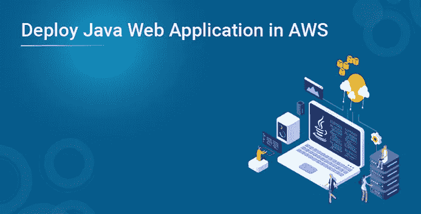
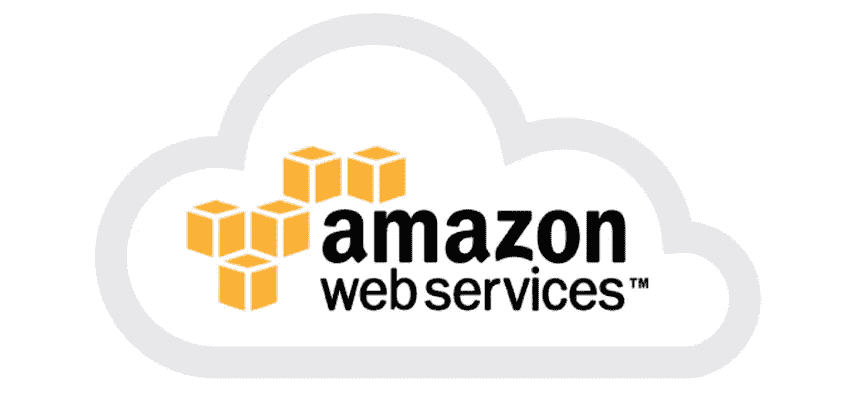
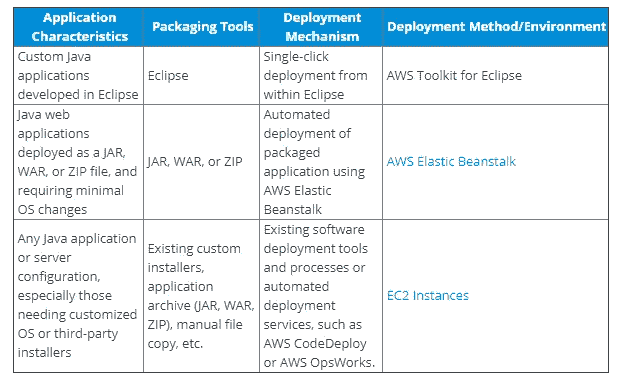
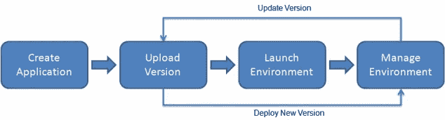
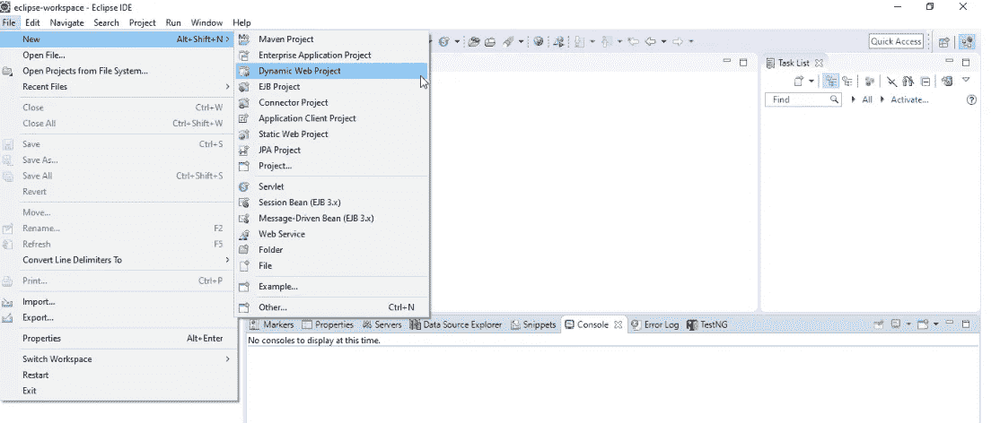
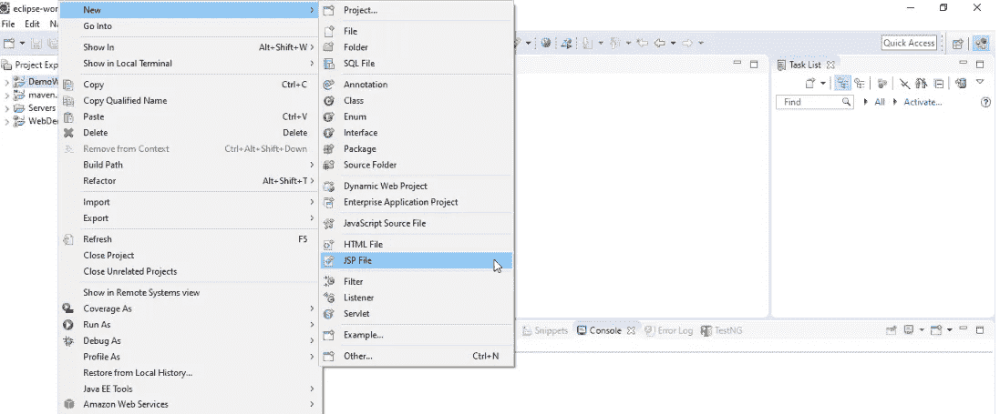
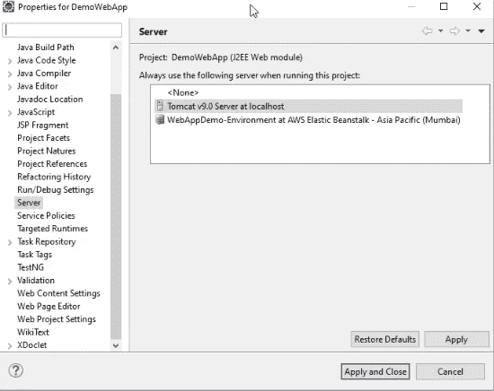
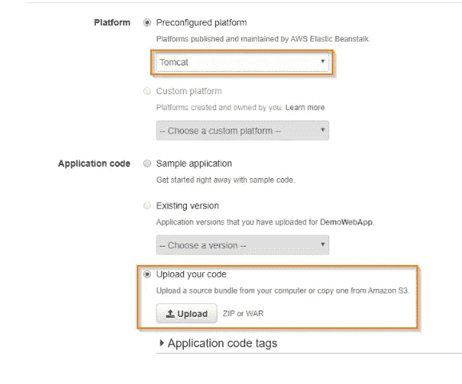
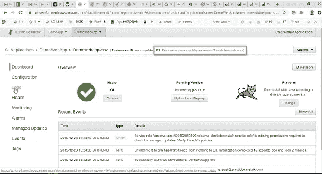

# 如何在 AWS 中部署 Java Web 应用？

> 原文：<https://medium.com/edureka/java-web-application-in-aws-a8e0264164d4?source=collection_archive---------0----------------------->

您是否在配置和管理服务器以部署 Java Web 应用程序方面遇到了困难？如果是，那么你来对地方了。因此在本文中，我将向您展示如何在 **AWS** 上部署 Java Web 应用程序。在 AWS 上部署 Java web 应用程序的过程完全没有麻烦，而且耗时更少。在这里，我将讨论以下几点:

*   什么是 AWS？
*   为什么要在 AWS 中使用 Java Web 应用？
*   如何在 AWS 中部署 Java Web 应用？

让我们从第一个话题开始。

# 什么是 AWS？

**亚马逊网络服务(AWS)** 是来自亚马逊的云服务，它以构建块的形式提供服务，这些构建块可以用来在云中创建和部署任何类型的应用程序。

这些服务或构建块被设计为彼此协同工作，并产生复杂且高度可伸缩的应用程序。

每种类型的服务都在一个域下进行分类，广泛使用的几个域是:

*   计算
*   储存；储备
*   数据库ˌ资料库
*   移民
*   网络和内容交付
*   管理工具
*   安全性和身份合规性
*   信息发送

现在您已经知道 AWS 是什么，让我列出在 AWS 中部署 Java Web 应用程序的好处。

**为什么在 AWS 上使用 Java Web 应用？**

**易于使用**

AWS 旨在允许应用程序提供商、ISV 和供应商快速、安全地托管您的应用程序，无论是现有应用程序还是基于 SaaS 的新应用程序。您可以使用 AWS 管理控制台或文档完善的 web 服务 API 来访问 AWS 的应用程序托管平台。

**灵活**

AWS 使您能够选择操作系统、编程语言、web 应用程序平台、数据库和您需要的其他服务。借助 AWS，您可以获得一个虚拟环境，让您加载应用程序所需的软件和服务。这简化了现有应用程序的迁移过程，同时保留了构建新解决方案的选项。

**性价比高**

您只需为您使用的计算能力、存储和其他资源付费，没有长期合同或前期承诺。有关 AWS 与其他托管服务的成本比较的更多信息，请参见 AWS 经济中心

**可靠**

通过 AWS，您可以利用可扩展、可靠且安全的全球计算基础设施，这是亚马逊数十亿美元在线业务的虚拟主干，已经磨砺了十多年。

**可扩展的高性能**

使用 AWS 工具、自动伸缩和弹性负载平衡，您的应用程序可以根据需要伸缩。在亚马逊庞大基础设施的支持下，您可以在需要时访问计算和存储资源。

**安全**

AWS 利用端到端方法来保护和强化我们的基础设施，包括物理、运营和软件措施。有关详细信息，请参阅 AWS 安全中心。

# 如何在 AWS 中部署 Java Web 应用？

在我们了解如何部署 Java Web 应用程序之前，让我分享一些您必须遵循的最佳实践。

# 一般最佳实践

web 应用程序的规模和安装复杂性可能会有很大的不同，因此很少有一个放之四海而皆准的解决方案来部署和托管 Java 应用程序。但是，在部署任何 web 应用程序时，有一些通用的最佳实践需要考虑:

*   了解应用程序的部署、安装和配置特征。
*   从初始部署到未来的可扩展性、可用性以及备份和恢复要求，了解应用程序的期望。
*   对于一致性非常重要的部署和其他任务，尽可能使用自动化。
*   利用源代码或应用程序库来保护您的应用程序。

现在让我们看看各种类型的 Java 应用程序及其机制。

# AWS 上的应用

AWS 提供了几个工具和服务来支持 AWS 管理的和客户管理的 Java 应用程序部署。下表是一个高层次的参考，有助于确定最适合特定场景的选项。下面几节将更详细地描述这些不同的方法及其适用的用例。

# AWS 弹性豆茎

Elastic Beanstalk 是一个易于使用的服务，用于部署和扩展 Java web 应用程序。Elastic Beanstalk 支持 Java 应用程序的多种平台配置，包括带有 Apache Tomcat 应用服务器的多个版本的 Java，以及不使用 Tomcat 的应用程序的纯 Java 配置。

纯 Java 选项允许客户在不使用 web 容器或使用不同容器(如 Jetty 或 GlassFish)的 Java web 应用程序的源代码包中包含任何所需的库 JAR 文件。部署后，Elastic Beanstalk 会自动管理容量供应、负载平衡和自动扩展。这种方法适用于部署包含以下标准的 Java 应用程序的公司:

*   需要最少的操作系统更改。(请注意，Elastic Beanstalk 配置文件支持高级平台和操作系统配置选项。然而，这需要额外的弹性豆茎包装的努力和专业知识。)
*   要么在 Apache Tomcat 7 或 8 中运行，要么打包在自己的 web 容器中

Elastic Beanstalk 支持以下打包和部署机制:

*   使用 Eclipse 和 AWS Toolkit for Eclipse 开发并直接部署到 Elastic Beanstalk 的定制应用程序
*   应用程序打包到一个 JAR、WAR 或 ZIP 文件中，然后使用 Elastic Beanstalk 控制台、EB CLI 或 Elastic Beanstalk API 调用进行部署。要将多个应用程序部署到一个弹性 Beanstalk 环境中，客户可以将多个 WAR 文件捆绑到一个 ZIP 文件中。

**将 Java 应用程序部署到 AWS 云的步骤**

在继续之前，有几个先决条件。

1.  JDK 8 或更高
2.  Tomcat 8 或更高版本
3.  用于 Java EE 的 Eclipse IDE
4.  免费 AWS 帐户

一旦你有了这些，我们就可以开始了。

1.  首先，让我们在 Eclipse 中创建一个示例 Java Web 应用程序。为此，请单击“文件”->“新建”->“动态 Web 项目”。现在用你想要的名字命名这个项目。在这里，我将其命名为 DemoWebApp。单击下一步，然后单击完成。在这之后，您将会看到您的项目已经在您的工作区中创建好了。

2.现在，您可以创建任何 web 应用程序，如 servlets、JSP 等。这里我将选择 JSP。右键点击 DemoWebApp -> New -> [JSP](https://www.edureka.co/blog/jsp-in-java/) 文件。将文件命名为 sample.jsp。一旦你这样做了，那么在这个文件的主体部分，写一个简单的文本，比如“这是一个示例 JSP”或者你想要的任何东西。

3.现在，在使用 AWS 之前，我将在本地测试这个应用程序。为此，您需要使用命令提示符导航到您的 tomcat 目录(因为我使用的是 Windows 10 操作系统)并使用 startup.bat 命令。

4.一旦 Tomcat 启动，转到您在 Eclipse 上的项目。右键单击项目，然后单击属性。然后点击服务器并选择 Tomcat 服务器。点击应用并关闭。

5.现在右键单击您的项目->运行方式->在服务器上运行。如果一切正常，您将能够看到文本“这是一个示例 JSP”的输出。这样，我们已经在本地测试了我们的应用程序。现在右键单击您的项目->导出-> WAR 文件。在此输入保存 war 文件的目的地。

7.现在我们将在 AWS 上部署这个应用程序。为此，请访问 AWS 主页。点击服务->计算->弹性豆茎。现在点击创建一个新的应用程序。输入应用程序的名称，并为其创建一个新环境。现在选择 Web 服务器环境。现在在基本配置中，选择预配置平台中的 Tomcat。在应用程序代码中，选择我们在上一步中创建的 WAR 文件。现在点击上传。

8.上传 WAR 文件需要几分钟时间。完成后，您将看到以下页面。在这里你可以看到网址。点击 URL，您将看到一个 JSP，其中包含您的文本消息。

这就是如何在 AWS 中部署 Java web 应用程序。至此，我们已经结束了这篇关于在 AWS 中部署 Java Web 应用程序的文章。我希望你已经理解了我在这里解释的一切。

就是这样，伙计们，这就把我们带到了这篇文章的结尾。如果你想查看更多关于人工智能、DevOps、道德黑客等市场最热门技术的文章，你可以参考 Edureka 的官方网站。

请留意本系列中解释 AWS 各个方面的其他文章。

> *1。* [*AWS 教程*](/edureka/amazon-aws-tutorial-4af6fefa9941)
> 
> *2。* [*AWS EC2*](/edureka/aws-ec2-tutorial-16583cc7798e)
> 
> *3。*[*AWS Lambda*](/edureka/aws-lambda-tutorial-cadd47fbd39b)
> 
> *4。* [*AWS 弹性豆茎*](/edureka/aws-elastic-beanstalk-647ae1d35e2)
> 
> *5。* [*AWS S3*](/edureka/s3-aws-amazon-simple-storage-service-aa71c664b465)
> 
> *6。* [*AWS 控制台*](/edureka/aws-console-fd768626c7d4)
> 
> *7。* [*AWS RDS*](/edureka/rds-aws-tutorial-for-aws-solution-architects-eec7217774dd)
> 
> *8。* [*AWS 迁移*](/edureka/aws-migration-e701057f48fe)
> 
> *9。*[*AWS Fargate*](/edureka/aws-fargate-85a0e256cb03)
> 
> *10。* [*亚马逊 Lex*](/edureka/how-to-develop-a-chat-bot-using-amazon-lex-a570beac969e)
> 
> *11。* [*亚马逊光帆*](/edureka/amazon-lightsail-tutorial-c2ccc800c4b7)
> 
> *12。* [*AWS 定价*](/edureka/aws-pricing-91e1137280a9)
> 
> *13。* [*亚马逊雅典娜*](/edureka/amazon-athena-tutorial-c7583053495f)
> 
> *14。* [*AWS CLI*](/edureka/aws-cli-9614bf69292d)
> 
> *15。* [*亚马逊 VPC 教程*](/edureka/amazon-vpc-tutorial-45b7467bcf1d)
> 
> *15。*[*AWS vs Azure*](/edureka/aws-vs-azure-1a882339f127)
> 
> *17。* [*内部部署 vs 云计算*](/edureka/on-premise-vs-cloud-computing-f9aee3b05f50)
> 
> 18。 [*亚马逊迪纳摩 DB 教程*](/edureka/amazon-dynamodb-tutorial-74d032bde759)
> 
> 19。 [*如何从快照恢复 EC2？*](/edureka/restore-ec2-from-snapshot-ddf36f396a6e)
> 
> *二十。* [*AWS 代码提交*](/edureka/aws-codecommit-31ef5a801fcf)
> 
> *21。* [*顶级 AWS 架构师面试问题*](/edureka/aws-architect-interview-questions-5bb705c6b660)
> 
> 22。 [*如何从快照恢复 EC2？*](/edureka/restore-ec2-from-snapshot-ddf36f396a6e)
> 
> *23。* [*使用 AWS 创建网站*](/edureka/create-websites-using-aws-1577a255ea36)
> 
> *二十四。* [*亚马逊路线 53*](/edureka/amazon-route-53-c22c470c22f1)
> 
> *25。* [*AWS 简历*](/edureka/aws-resume-7453d9477c74)

*原载于 2019 年 12 月 24 日*[*https://www.edureka.co*](https://www.edureka.co/blog/deploy-java-web-application-in-aws/)*。*