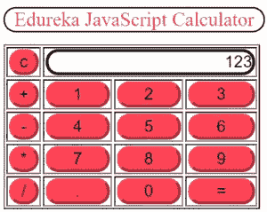

# 如何搭建一个 JavaScript 计算器？

> 原文：<https://medium.com/edureka/javascript-calculator-47778c7596f3?source=collection_archive---------4----------------------->


How to build a JavaScript Calculator? — Edureka

任何开始学习一门新语言的人，在从事真正的行业特定项目之前，都不得不费力地学习各种模块。正如我们熟悉的从“hello world”节目开始的一般惯例一样，我们可以练习学习任何语言基础的节目很少。如果你曾经尝试过系统地学习，毫无疑问，你还没有遇到“建立一个计算器”阶段。所以，今天我们要用 JavaScript 构建一个基本的计算器。这里涉及的各种主题有:

*   构建 Javascript 计算器的要求
*   构建计算器的 JavaScript 函数
*   可见部分
*   添加 CSS 的味道

为了简化这个过程，当我们在这里阅读整篇文章时，让我们的编译器准备好测试是非常重要的。让我们上车吧！

JavaScript，更广为人知的是网页的“脚本语言”，可以创造奇迹。众所周知，计算器将完成我们的基本运算，即。加法、减法、乘法和除法。首先，你应该熟悉 HTML 和 CSS。JavaScript 代码部分，我们会处理的。

# 使用 JavaScript 构建计算器的要求

*   **集成开发环境**
*   **本地服务器/在线编译器**

如果你是网站开发的新手，你应该知道在部署之前需要一个本地服务器来测试代码。你可以使用 wamp、xampp 或任何其他服务器。编写代码有很多选择:Sublime Text 3、NetBeans、括号等等。一旦你完成了平台的搭建，剩下的工作就是小菜一碟了。

要链接各种文件，可以使用以下命令:

## 嵌入 CSS

*   **内联 CSS:** 当我们想要给自己想要的元素添加 CSS 时，内联 CSS 就是我们的调用。如果你是开发新手，你可能更喜欢内联 CSS 而不是其他类型。这是一个良好的开端，但肯定不是搜索引擎优化友好。
*   **内部或嵌入 CSS:**CSS 属性和规则设置在同一个 HTML 文档中，由< head >部分的< style > < /style >标签指定。
*   **外部 CSS:** 一个单独的 CSS 文件，其样式属性与根目录下的主文件相链接。

在我们的 JavaScript 计算器中，我们将使用内部 CSS。首先，我们需要计算出我们需要多少个按钮。目前，我们坚持基本计算器的最小可行功能。所以，下面提到了元素列表:

1.  **显示屏:**用于用户输入和输出结果。即使我们开发了完整的计算器，没有实时显示屏也没有用。
2.  **按钮:**对于一个基本的计算器，我们至少需要 17 个按钮:

*   **数字:**数字按钮是必需的。我们需要这个类别的 10 个按钮。1-9 和一个 0。
*   **操作:**对于四个基本操作，我们需要 4 个按钮。
*   **其他:**小数，清，结果，我们还需要 3 个按钮。

为了使计算器形象化，我们最好考虑形成一个表格。表格什么都不是，只有行和列。在 CSS 的帮助下，可见部分进入主体部分。不可见的部分是 JavaScript，放在

# JavaScript 部分

1.  **显示功能:**该功能只显示用户输入，后面是结果。我们只是一个可以被“document.getElementById”调用的 id。在这里，id 是“edu”。
2.  **求解函数:** eval()是 JavaScript 中的一个 gobal 函数，有一个明确的目的，就是求解 JavaScript 代码。
3.  **Clear 函数:**我们只需要在引号之间留出一个空格来执行这个函数。

该部分将包括显示、求解和清除功能。

```
<script>
//function for displaying values
function dis(val)
{
document.getElementById("edu").value+=val
 }
//function for evaluation
function solve()
{
let x = document.getElementById("edu").value
let y = eval(x)
document.getElementById("edu").value = y
}
//function for clearing the display
function clr()
{
document.getElementById("edu").value = ""
}
</script>
```

# 可见部分

1.  **标题:**你可以在这里写任何东西，我们更喜欢叫它“Edureka JavaScript Calculator”。
2.  **创建表格:**每一行都必须有按钮和输入功能。对于显示屏，我们需要一个带有<列跨度>的文本输入类型，因为我们需要更长的字符串。其他的仍然是按钮类型。
3.  这里显示的只是 onclick()函数，所以我们在这里使用 dis()函数。

```
<!-- create table -->
<body>
<div class = title >Edureka JavaScript Calculator</div>
<table border="1">
<tr>
<td><input type="button" value="c" onclick="clr()"/> </td>
<td colspan="3"><input type="text" id="edu"/></td>
<!-- clr() function will call clr to clear all value -->
</tr>
<tr>
<!-- creating buttons and assigning values-->
<td><input type="button" value="+" onclick="dis('+')"/> </td>
<td><input type="button" value="1" onclick="dis('1')"/> </td>
<td><input type="button" value="2" onclick="dis('2')"/> </td>
<td><input type="button" value="3" onclick="dis('3')"/> </td>
</tr>
<tr>
<td><input type="button" value="-" onclick="dis('-')"/> </td>
<td><input type="button" value="4" onclick="dis('4')"/> </td>
<td><input type="button" value="5" onclick="dis('5')"/> </td>
<td><input type="button" value="6" onclick="dis('6')"/> </td>
</tr>
<tr>
<td><input type="button" value="*" onclick="dis('*')"/> </td>
<td><input type="button" value="7" onclick="dis('7')"/> </td>
<td><input type="button" value="8" onclick="dis('8')"/> </td>
<td><input type="button" value="9" onclick="dis('9')"/> </td>
</tr>
<tr>
<td><input type="button" value="/" onclick="dis('/')"/> </td>
<td><input type="button" value="." onclick="dis('.')"/> </td>
<td><input type="button" value="0" onclick="dis('0')"/> </td>
<!-- Evaluating function call eval()-->
<td><input type="button" value="=" onclick="solve()"/> </td>
</tr>
</table>
</body>
```

# 添加 CSS 的味道

1.  标题元素是可选的，玩玩吧
2.  边框半径保持在 10px，以便为元素提供圆角。宽度应保持在 100%，以覆盖整个跨度。
3.  文本对齐由您决定，请随意。
4.  RGB 颜色代码:#ff4456

```
<!-- for styling -->
<style>
.title{
border-radius: 10px;
margin-bottom: 10px;
text-align:center;
width: 210px;
color:#ff4456;
border: solid black 1px;
}
input[type="button"]
{
border-radius: 10px;
background-color:#ff4456;
color: black;
border-color:#ff4456 ;
width:100%;
}
input[type="text"]
{
border-radius: 10px;
text-align: right;
background-color:white;
border-color: black ;
width:100%
}
</style>
```

现在我们已经有了完整的截面，让我们把它们放在一起看看结果:

**输出画面:**



说到这里，我们的文章就到此为止了。我希望您了解构建 JavaScript 计算器的最简单方法。

如果你想查看更多关于人工智能、Python、道德黑客等市场最热门技术的文章，那么你可以参考 [Edureka 的官方网站。](https://www.edureka.co/blog/?utm_source=medium&utm_medium=content-link&utm_campaign=javascript-calculator)

请留意本系列中的其他文章，它们将解释 JavaScript 的各个方面。

> 1.[十大 JavaScript 框架](/edureka/top-10-javascript-frameworks-3179f1b5bd41)
> 
> 2. [JavaScript 项目](/edureka/javascript-projects-f718db7dd7d5)
> 
> 3. [JSP 面试问答](/edureka/jsp-interview-questions-41b240f9414c)
> 
> 4.[JQuery 简介](/edureka/jquery-tutorial-for-beginners-679021d74ab4)

*原载于 2019 年 7 月 18 日*[*【https://www.edureka.co*](https://www.edureka.co/blog/javascript-calculator/)*。*