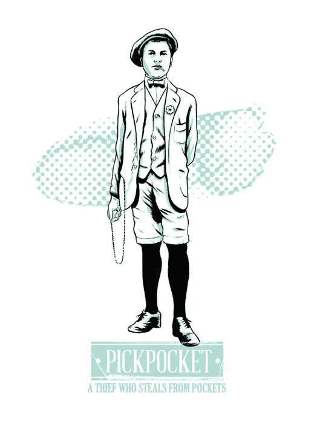
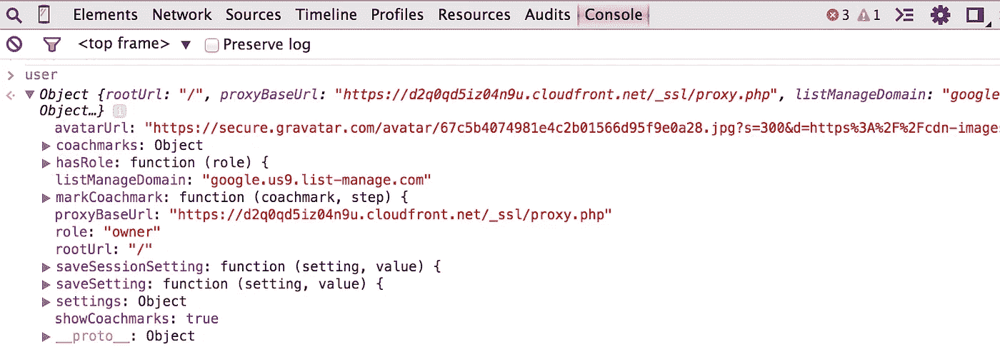
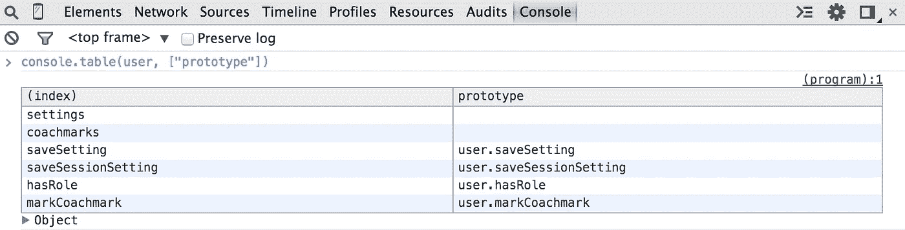

# JavaScript——马戏团的怪胎和流氓

> 原文：<https://medium.com/google-developer-experts/javascript-circus-freaks-and-rascals-4e65ef3579d4?source=collection_archive---------1----------------------->

一些和朋友一起使用的 JavaScript 技巧


[Joel Kimmel](http://joelkimmel.com/blog/drawings/circus-freaks-and-rascals/) — illustrator

在 Twitter 上关注我的最新动态 [@gerardsans](https://twitter.com/gerardsans) 。

使用 JavaScript 一段时间后，你可能会认为你已经看到了一切。但是有一天，马戏团来到了镇上，你认识了马戏团的怪胎和流氓。近距离感受魔法！

# 遗产代码野兽(大胡子女士)

有时候你的任务是研究别人的代码，当你第一眼看到代码时，你会有一种可怕的感觉…让我们想象你看到了这个函数

wtfjs.com

> 呜哇？！！上帝救救我！

最糟糕的是，[以优异的成绩通过了](http://plnkr.co/edit/34wVqpA3B0av0aRwoYP3)……你让自己和那个长胡子的女士相亲了！


# 花哨的标识符(纹身男)

让我们来看看有效的 JavaScript 标识符。这个可能会让你会心一笑。你知道你可以在你的代码中使用这些吗？

```
ÆÐßÞæøþāēīıōūƂƌƔƖƗƨǀǁǂṡəΘΔΛθλµφτ
```

你一定要在下一次每日混战后查看一下[无限选项](http://en.wikipedia.org/wiki/List_of_Unicode_characters)。

> 感谢分享这个[在线检查器](https://mothereff.in/js-variables)，但是如果你今天觉得冒险，请阅读 [ECMA-262 规范](http://www.ecma-international.org/ecma-262/5.1/#sec-7.6)。

留下旧的$(美元)和 _(下划线),在您的新库中给新的一个机会。上面的 [jsbin](https://jsbin.com/vizerotebu/edit?js,console) 代码。

> 生产中绝对要用这个！

只要确保你在午饭时间提交之前借了一个孤儿键盘。

# 虚伪的对象(扒手)

一位 C#开发者说，小心扒手。不幸的是为时已晚…这是为新手准备的。



遇到[假物体](/sons-of-javascript/javascript-falsy-objects-and-comparisons-92d5888be09d)。这些流氓总是找麻烦。

```
- empty string
- the number zero
- null
- NaN
- the boolean false
- undefined
```

再看看他们。他们会让你检查你的钱包几次。看看这些，告诉我你以前没有爱上它们。

带回家。对 falsy 对象使用否定，但保留==，===，！=, !==其余部分。

> Falsy 值并不总是等于 false，但是当与 negation 一起使用时，所有的 falsy 值都计算为 true。

# Chrome 的 console.table(报童)

谁不喜欢获得格式优美的最新消息呢？这就是报童的工作。你愿意读这个吗:



因为这个？



等等…你甚至可以通过你想要的部分。闭嘴，拿走我的钱，报童！


# 基尔罗伊曾在这里评论(飞刀者)

像童子军一样评论你的代码是好的。但是加入一些香料怎么样？有多少次你想放松片刻，享受一个良好的 geeky one 班轮。认识一下[马 js](https://twitter.com/horse_js) ！

让我们从 io.js 源代码中取出一个小文件，尽管它仍然不是 Node.js 的一部分。

*Ok you got me there. What else do you want me to do? I want to jump out of the window! Boring…*

下面这个版本呢？

*Now this is a team I want to work with. This is how you get me working into the TODOs with a smile.*

感谢飞刀！你做得很好。

# 潮人编码器(肖像艺术家)

感觉附庸风雅？下次在将代码推送到远程存储库之前，请三思。浏览一些优秀的 ASCII 艺术网站，并在其中加入一些大师作品。没有什么比在代码中加入 ASCII 艺术更能说明你是一个糟糕的 JavaScripter 程序员了。现在它有艺术价值可以延续几个世纪！

Cool AngularJs app.js

看看[Chris.com ASCII 艺术区](http://www.chris.com/ascii/)获得完整的 IMAX 体验，或者 [one line art](http://1lineart.kulaone.com/) 如果你仍然对此感到害羞。

感谢阅读！有什么问题吗？在 Twitter 上 Ping 我 [@gerardsans](https://twitter.com/gerardsans) 。

# 资源

[wtfjs](http://wtfjs.com/)