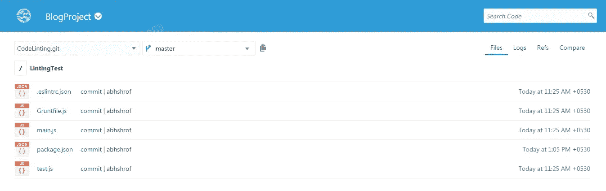
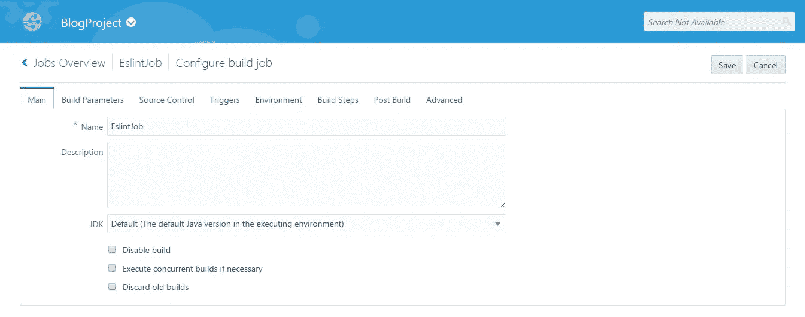
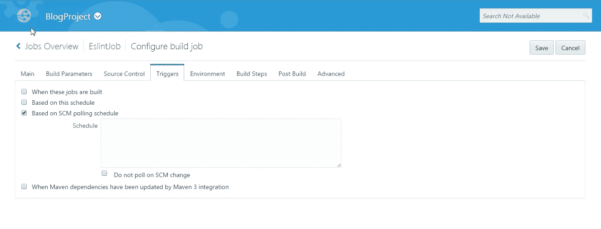
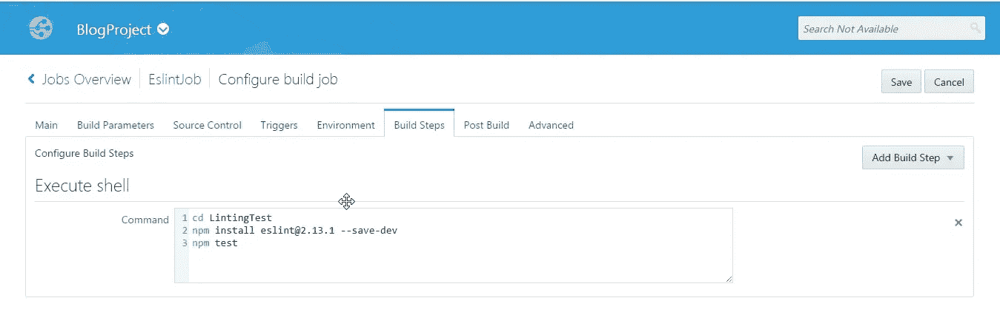
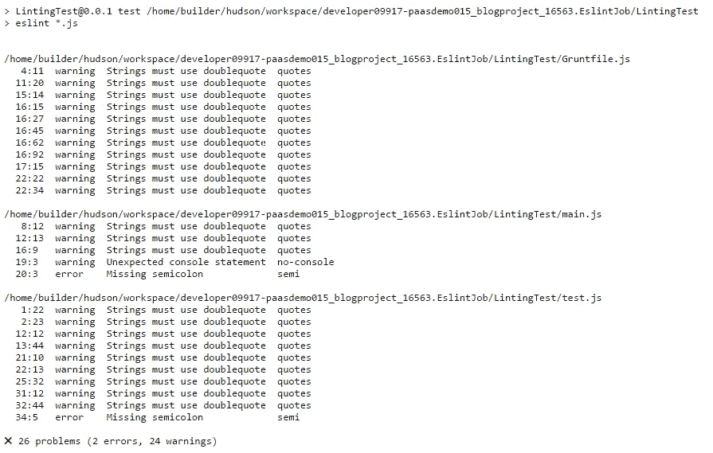

# 在 Oracle 开发者云服务上使用 ESLint 的 JavaScript 代码林挺

> 原文：<https://medium.com/oracledevs/javascript-code-linting-using-eslint-on-oracle-developer-cloud-service-9f2676f84cdd?source=collection_archive---------5----------------------->

这个博客将帮助你理解如何为林挺 JavaScript 代码执行 ESLint 工具。本博客将介绍 ESLint 工具以及 Oracle Developer Cloud Service 所需的配置，以便在推送到开发者云服务上的 Git 存储库的代码上执行已配置的规则。


什么是林挺代码？

林挺是检查源代码中程序错误和风格错误的过程。

**为什么使用 ESLint:**

以下是 ESLint 是 JavaScript 静态代码分析的一个好选择的原因:

1.  高度灵活的规则集
2.  良好的 ES6 支持
3.  功能上可以通过各种插件进行扩展。
4.  JSX 支持
5.  清除警告和错误消息

请参考此[链接](http://eslint.org/)了解更多关于 ESLint 的详情。

**项目结构**:典型的 Nodejs REST web 服务应用:

**Nodejs 项目包含:**

1.  **main.js** —服务的 Nodejs 源代码
2.  **test . js**—main . js 中服务的测试脚本
3.  **grunt file . js**—grunt 配置 JavaScript 文件。
4.  **package.json** —包含定义的依赖模块
5.  **manifest.json** —用于项目执行(ESLint 不需要工作)。

代码分析将只在 Javascript 文件上运行，即 main.js、test.js 和 Gruntfile.js

**ESLint 的配置文件:**

**.eslintrc.json** —这是一个 json 文件，包含 ESLint 引用的代码分析规则。

要执行 ESLint 工具，需要包含一些特定的配置。以下是突出显示的文件和配置:

**.eslintrc.json**

以下是我为了在博客中展示而设定的一些规则。如下所示，规则被设置为一个 json 对象。

可在. eslintsrc.json 中设置的完整规则列表可在以下链接中找到:

[https://gist . github . com/cletusw/e 01 a 85 e 399 ab 563 b 1236 # file-eslintrc-L54](https://gist.github.com/cletusw/e01a85e399ab563b1236#file-eslintrc-L54)

[https://gist . github . com/cletusw/e 01 a 85 e 399 ab 563 b 1236 # file-eslintrc-L54](https://gist.github.com/cletusw/e01a85e399ab563b1236#file-eslintrc-L54)

```
{
    "rules": {
        "semi": ["error", "always"],
        "quotes": ["warn", "double"],

        "no-cond-assign": 2,          // disallow assignment in conditional expressions
        "no-console": 1,              // disallow use of console (off by default in the node environment)

        //////////Node.js //////////

        "handle-callback-err": 2,   // enforces error handling in callbacks
        "no-mixed-requires": 2,     // disallow mixing regular variable and require declarations
        "no-new-require": 2,        // disallow use of new operator with the require function
        "no-path-concat": 2,        // disallow string concatenation with __dirname and __filename
        "no-process-exit": 2,       // disallow process.exit()
        "no-restricted-modules": 2, // restrict usage of specified node modules
        "no-sync": 2              // disallow use of synchronous methods
    }
}
```

**package.json**

ESLint 框架模块应作为开发依赖项包括在内，npm 测试将使用该模块来执行“eslint *”。js '命令在'脚本'中执行。*.js 用于确保执行命令的文件夹中的所有 JavaScript 文件都被工具分析。

```
{   
  "name": "LintingTest",   
  "version": "0.0.1",   
  "scripts": 
  {     
     "start": "node main.js",     
     "test": "eslint *.js"   
  },   
  "dependencies": 
  {     
     "body-parser": "^1.13.2",
     "express": "^4.13.1",
     "grunt": "^0.4.5",
     "grunt-contrib-compress": "^1.3.0",
     "grunt-hook": "^0.3.1",
     "load-grunt-tasks": "^3.5.2",
     "request": ""
  },
  "devDependencies": 
  {     
      "mocha": "^3.3.0",     
      "eslint": "^2.13.1"
  }
}
```

**推送到开发者云 Git 库的项目结构:**



**构建用于执行 ESLint 工具的作业配置，以分析项目文件夹中的所有 JavaScript 文件:**

为构建作业选择一个名称。对于这个博客，我把它命名为“EslintJob”。因为这是针对 Nodejs 应用程序的，所以可以将 JDK 保留为默认值。



选择已经上载了 Nodejs 应用程序代码的存储库。


这里我们将 SCM 轮询设置为触发器。这确保了每次我们将代码上传到 Git 存储库时，都会触发 EslintJob。



我们也将在这里使用执行 shell 构建步骤。我们将文件夹更改为“LintingTest”。我们将安装 ESLint 模块作为开发依赖项，并使用 npm 测试来触发' eslint *。js '命令在 package.json 中的执行，作为脚本的一部分提到。这将执行 eslint 工具，对 LintingTest 文件夹中的所有 JavaScript 文件进行代码分析。



下面是 EslintJob 控制台上生成的代码分析工具报告。



这就是我们如何在 Oracle Developer Cloud Service 的构建过程中轻松进行基于规则的静态代码分析。

编码快乐！

* *本文表达的观点是我个人的观点，不一定代表甲骨文的观点。

*原载于 2017 年 6 月 4 日*[*community.oracle.com*](https://community.oracle.com/community/oracle-cloud/platform/developer/blog/2017/06/04/javascript-code-linting-using-eslint-on-oracle-developer-cloud-service)*。*