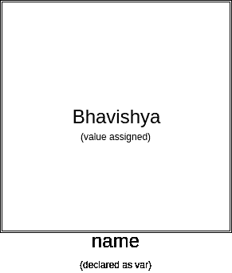
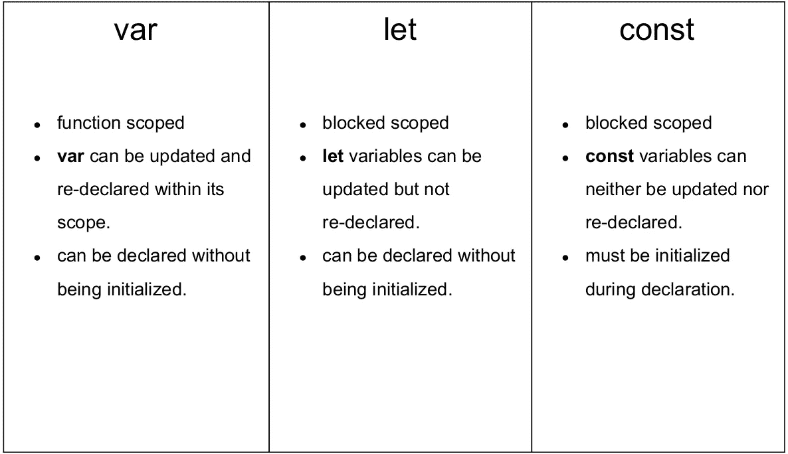

# JavaScript ES6: let & const 以及为什么应该使用它们而不是 var。

> 原文：<https://medium.com/quick-code/javascript-es6-let-const-and-why-you-should-be-using-them-instead-of-var-11da9914c9a4?source=collection_archive---------7----------------------->


Photo by [Joshua Aragon](https://unsplash.com/@goshua13?utm_source=medium&utm_medium=referral) on [Unsplash](https://unsplash.com?utm_source=medium&utm_medium=referral)

> S6 指的是 ECMA 脚本编程语言的版本 6。ECMA 脚本是 JavaScript 的标准化名称。

ECMAScript，简称 ES6，发布于 2015 年 6 月。它随后被重命名为 ECMAScript 2015。

ES6 给 JavaScript 带来的一些重大变化。

*   JavaScript `let`
*   JavaScript `const`
*   JavaScript 箭头函数
*   JavaScript 类
*   默认参数值
*   `Array.find()`
*   `Array.findIndex()`

现在我们知道了 ES6 代表什么，以及它给语言带来的变化，但是在本文中，我们将深入探讨关键字 var、let 和 const 的区别和用例。

## 现在让我们看看什么是变量，为什么我们需要一个变量？

> *JavaScript 变量是存储数据值的容器或盒子，这里的数据可以是任何数据类型。*

简而言之，每当一个变量被创建时，它就创建一个我们给它命名的盒子，并给这个盒子赋值。



*这里我用* `*var*` *关键字声明了一个变量，并给它分配了一个字符串值* `*"Bhavishya"*`

*这样就创建了一个名为* `*name*` *的盒子，并给它分配字符串。*

`*var name = "Bhavishya"*`

**现在让我们详细看看 var 关键字。**

> 我会解释每一个关键词，并写下一个摘要，这样每次你都不必通读整篇文章，你只需看一下摘要就能清楚你的概念。

# 定义变量

这是 javascript 中声明变量的传统方式。但是它有一些问题:

1-是*功能范围。*

> **函数作用域:**表示变量在定义它的函数内部可用，否则属于全局作用域(窗口对象)。

2-它可以在同一个程序中声明多次。

3-您可以随时重新分配变量值。

我们可以通过一个例子更清楚的了解`var`关键字，

```
var name = "Bhavishya"function greet() { var hello = `Hello ${name}`}console.log(name) // "Bhavishya"console.log(hello) // ReferenceError: hello is not defined
```

在上面的代码中，我在 greeting 函数中声明了一个变量`name`和另一个变量`hello`。
当我尝试`console`上述变量时，我们看到在访问`hello`变量时，它返回一个错误，说// hello 未定义。

出现这种情况是因为`hello`是函数作用域变量，其值不能在函数`greet`之外访问。

让我们再检查一个实例，

```
var name = "Bhavishya"function greet() {var name = "Honey"return `Hello ${name}`}greet() // Hello Honey
```

在这段代码中，我声明了一个同名的变量，它就是`name`，当我调用函数`greet()`的时候。
JavaScript 会寻找最近的内存来寻找变量`name`的值，如果在本地内存中找到了，就不需要检查全局内存了，如果在函数内部没有重新分配变量`name`，JavaScript 会检查全局内存，返回`name`值为`Bhavishya`。

# 让

它与 *var* 关键字很相似，不同的是它有 ***块范围*** *。*

> ***Block 作用域:*** *是花括号之间的任何东西{ }就像:函数、if 语句、循环或任何东西。块范围中声明的变量仅在此范围中可用。*

以下是使用`let`关键字的一些好处:

1-可以随时重新分配变量的值。

2-不能多次声明该变量。

我们可以通过一个例子更好地理解这一点，

```
let name = "Bhavishya"let name = "Honey"console.log(name) // 'name' has already been declared --------------------------------------------------------------------let name = "Bhavishya"name = "Honey"console.log(name) // Honey
```

# 常数

它也有 ***块范围*** *像让关键字。*

*`let`*关键字所拥有的一切好处只有一个除外:**

**1-不能再次重新分配变量的值。**

```
**const name = "Bhavishya"const name = "Honey"console.log(name) // 'name' has already been declared--------------------------------------------------------------------const name = "Bhavishya"name = "Honey"console.log(name) // TypeError:Assignment to constant variable.**
```

**我已经创建了一个表，将帮助你只是去看看之间的区别，关键字，如果你不想从事与我写的长文章。**

****

**var **vs** let **vs** const**

## **结论**

**按照我的做法，总是先使用`const`，如果要重新分配变量，需要切换到`let`。**

**应避免使用`var`。**

## **好了各位。！！**

**这只是对关键字 let、var 和 const 的简单解释。
我会写更多关于 ES6 以及它给 ES5 带来的不同特性的文章。**

****有什么建议尽管说。
拍手称快。****

# ****谢谢**😊**